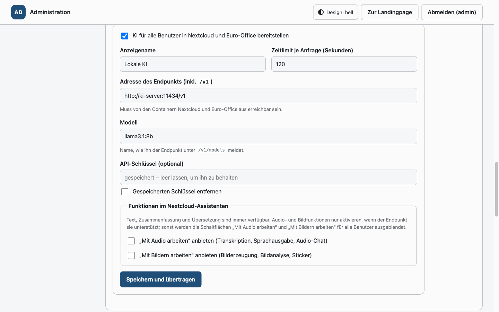
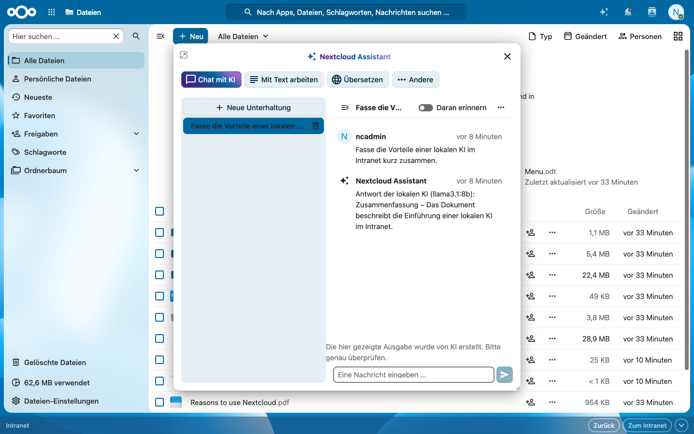
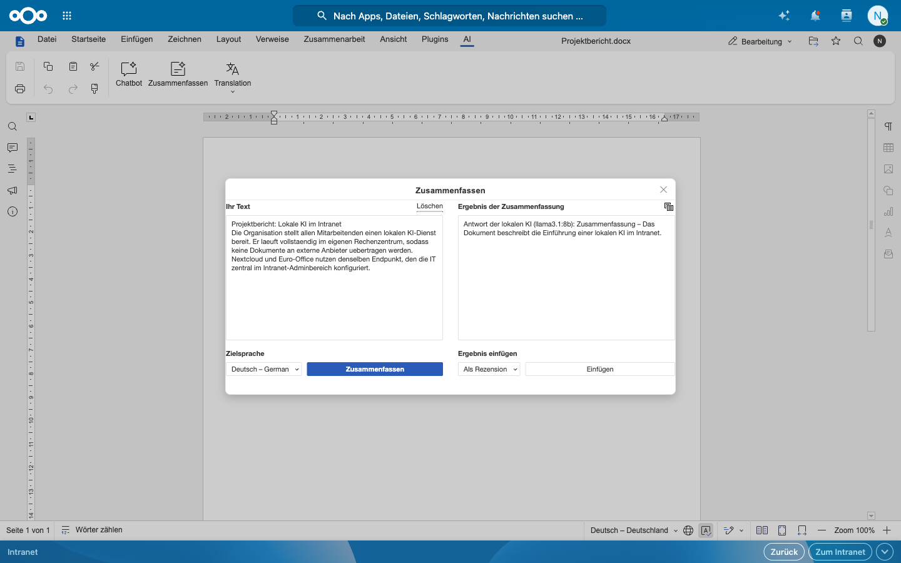
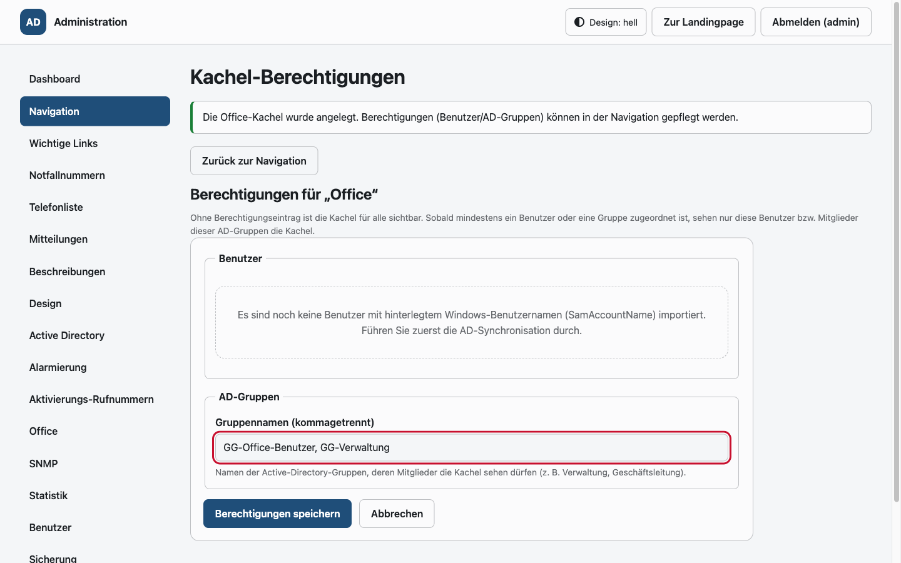

# Intranet-Landingpage

Zentrale Startseite für das Intranet: Kacheln für interne Anwendungen, eine aus dem
Active Directory gespeiste Telefonliste, Klickstatistiken und ein vollständiger
Administrationsbereich – ohne Frameworks, ohne CDNs, ohne externe Abhängigkeiten.

- **Backend:** PHP 8.2+ (getestet mit 8.3), PDO/MySQL, eigene Autoloader-/Router-/View-Schicht
- **Frontend:** Vanilla JavaScript und handgeschriebenes CSS (keine Frameworks, keine externen Fonts/Icons)
- **Datenbank:** MySQL 8 / MariaDB 11 (utf8mb4)
- **Betrieb:** Docker Compose (App + Datenbank + Synchronisationsdienst, optional phpMyAdmin)

---

## 1. Funktionsumfang

| Bereich | Beschreibung |
| --- | --- |
| Landingpage | Kacheln aller aktiven Navigationselemente, Kurz- und Langbeschreibung, Klickzählung; Unterseiten mit weiteren Kacheln im selben Stil sowie formatierte Textseiten (Rich-Text-Editor im Adminbereich); aufklappbarer Bereich „Wichtige Links“ (automatisch alphabetisch sortiert, mit automatisch ermitteltem Favicon) |
| Telefonliste | Suche über Name, Vorname, Nachname, Abteilung und Telefonnummer (Live-Suche, Paginierung); Einträge ohne E-Mail-Adresse sind nur für angemeldete Administratoren sichtbar; einzelne Einträge lassen sich im Adminbereich ein-/ausblenden (Standard: eingeblendet) |
| AD-Synchronisation | LDAP/LDAPS-Abgleich in die lokale Datenbank, konfigurierbares Intervall und Attribut-Mapping; optional AD-Gruppen aus konfigurierbaren Pfaden (inkl. verschachtelter Mitgliedschaften) für die Rechtevergabe |
| Office (optional) | Nextcloud mit Euro-Office DocumentServer hinter demselben Einstieg, Einrichtung per Einzeiler, Updates aus den offiziellen Quellen, Rechte über Benutzer/AD-Gruppen, Intranet-Fußzeile, gestaltbare Kachel mit Verfügbarkeitsstatus, Office-Apps (Euro-Office-Webapps, Dateien, Outlook Web App) mit Freigabe per AD-Gruppe/App-Paket, lokaler KI-Endpunkt für alle Benutzer (Nextcloud-Assistent, KI-Plugin der Editoren; Audio/Bilder optional), verschlüsselte Sicherung – siehe [docs/office.md](docs/office.md) |
| Notfallnummern | Eigene, farblich abgesetzte Kacheln für Notfallnummern (z. B. Werkschutz, Feuerwehr), im Adminbereich pflegbar |
| Mitteilungen | Aufklappbares Mitteilungs-Overlay auf der Startseite, im Adminbereich pflegbar |
| Alarmierungen | Alarm-Kacheln, die per Klick eine SMS über ein konfigurierbares SMS-Gateway auslösen – an eine Gruppe oder eine einzelne Rufnummer, mit Verlauf |
| Geschützter Zugriffsmodus | Interne Elemente, Unterseiten und Textseiten optional mit einem per SMS zugestellten, täglich wechselnden Zugangscode schützen |
| Administration | Navigation (CRUD, Sortierung, Aktivierung, Hierarchie aus Unterseiten/Textseiten), Beschreibungen, Design/Logo, AD-Konfiguration, Statistik |
| Statistik | Klicks je Element und Tag, Zeiträume 3/7/14/30/90/365 Tage, selbst gerendertes SVG-Liniendiagramm |
| Darstellung | Hell-/Dunkelmodus (System oder manuell), frei konfigurierbare Farben, eigenes Logo |
| Barrierefreiheit | Semantisches HTML, Tastaturbedienung, sichtbarer Fokus, ARIA-Beschriftungen, Kontrastwahl nach WCAG-Leuchtdichte |

---

## 2. Schnellstart mit Docker

### Assistierte Installation (empfohlen)

```bash
./scripts/install.sh
```

Der menügeführte Assistent prüft alle Voraussetzungen und installiert fehlende Pakete
(u. a. Docker und Compose) automatisch, kopiert `.env.example` nach `.env`, fragt alle
Einstellungen, Passwörter und Secrets ab (Datenbank, Administrator, AD/LDAP,
Windows-Anmeldung, SMS-Gateway, SNMP, Office, phpMyAdmin, Autostart), startet die
Container, prüft die Betriebsbereitschaft und speichert einen Abschlussbericht für die
Dokumentation unter `install-reports/`. Optionen (`--defaults`, `--text`, `--no-start`, …)
und Bedienung: [docs/installation.md](docs/installation.md).

### Manuell

Voraussetzung: Docker mit Compose-Plugin.

```bash
cp .env.example .env      # Werte anpassen (mindestens DB_PASSWORD und DB_ROOT_PASSWORD)
docker compose up -d
```

Danach ist die Seite unter `http://<host>:8080` erreichbar (Port über `APP_PORT` konfigurierbar).

Beim ersten Start führt der Container automatisch aus:

1. Warten auf die Datenbank
2. `scripts/migrate.php` – Schema anlegen
3. `scripts/seed.php` – Beispielnavigation und Standardeinstellungen (nur wenn die Navigation leer ist)
4. `scripts/create_admin.php` – erstes Administrationskonto, sofern noch keines existiert

Ist `ADMIN_PASSWORD` leer, wird ein Zufallspasswort erzeugt und **einmalig** im Containerlog ausgegeben:

```bash
docker compose logs app | grep "Generiertes Passwort"            # Linux
docker compose logs app | Select-String "Generiertes Passwort"   # PowerShell
```

Optionales Datenbankwerkzeug:

```bash
docker compose --profile tools up -d phpmyadmin   # http://<host>:8081
```

### Als Systemdienst beim Boot starten (Ubuntu ≥ 22.04)

Mitgeliefertes Skript legt einen systemd-Service an, der die Container beim
Systemstart hochfährt (`docker compose up -d`) und bei `systemctl stop` wieder
stoppt (`docker compose down`):

```bash
sudo ./scripts/install-systemd-service.sh
```

Danach übernimmt systemd den Autostart. Nützliche Befehle:

```bash
systemctl status intranet      # Status anzeigen
systemctl stop intranet        # Container stoppen
systemctl disable intranet     # Autostart deaktivieren
```

Das Skript lässt sich über Umgebungsvariablen anpassen, z. B.
`SERVICE_NAME=mein-dienst` (Service-Name, Standard `intranet`),
`COMPOSE_PROJECT_NAME` (Compose-Projektname) oder `INSTALL_ONLY=1` (nur
installieren, nicht starten).

### Enthaltene Dienste

| Dienst | Zweck | Healthcheck |
| --- | --- | --- |
| `app` | PHP 8.3 + Apache, DocumentRoot `public/` | `GET /health` |
| `db` | MySQL 8, benanntes Volume `db_data` | `mysqladmin ping` |
| `sync` | Dauerlauf der AD-Synchronisation (`scripts/sync_worker.php`) | – |
| `phpmyadmin` | optional, Profil `tools` | – |
| `snmp` | net-snmp-Agent, Status der Dienste/Workflows per SNMP (UDP 161) | – |
| `auth` | Apache als Einstieg/Reverse-Proxy, optional NTLM-Anmeldung; leitet `/office/` und `/eurooffice/` weiter | `GET /auth-health` |
| `nextcloud`, `nextcloud-cron`, `nextcloud-ai-worker`, `nextcloud-db`, `nextcloud-redis`, `eurooffice`, `office-backup` | optional, Profil `office` – Einrichtung mit `./scripts/office-setup.sh` ([docs/office.md](docs/office.md)) | ja |

---

## 3. Installation ohne Docker

1. PHP 8.2+ mit den Erweiterungen `pdo_mysql`, `ldap`, `mbstring`, `json`, `openssl`, `zip` bereitstellen.
2. Repository in das Zielverzeichnis kopieren, **DocumentRoot auf `public/`** setzen (`mod_rewrite` aktivieren).
3. `.env.example` nach `.env` kopieren und ausfüllen.
4. Datenbank und Benutzer anlegen (utf8mb4).
5. Einrichten:

```bash
php scripts/migrate.php
php scripts/seed.php
php scripts/create_admin.php admin
```

6. Schreibrechte für den Webserver auf `storage/logs` und `storage/uploads` vergeben.
7. Synchronisation per Cron einplanen, z. B. stündlich:

```
0 * * * * /usr/bin/php /var/www/intranet/scripts/sync_ad.php >> /var/log/intranet-sync.log 2>&1
```

---

## 4. Konfiguration

Es gilt: **Umgebungsvariablen liefern die Grundeinstellung, die Tabelle `settings` überschreibt sie.**
Alles außer dem LDAP-Bind-Passwort ist im Administrationsbereich pflegbar.

### Wichtige Umgebungsvariablen

| Variable | Bedeutung | Standard |
| --- | --- | --- |
| `APP_URL` | Öffentliche Adresse der Seite | `http://localhost:8080` |
| `APP_DEBUG` | Fehlerdetails anzeigen (nur Entwicklung) | `false` |
| `APP_FORCE_SECURE_COOKIES` | Session-Cookie nur über HTTPS | `false` |
| `APP_SESSION_IDLE_TIMEOUT` | Automatische Abmeldung nach Inaktivität (Sekunden) | `3600` |
| `APP_MAX_LOGO_BYTES` | Maximale Logogröße | `524288` |
| `APP_MAX_BACKGROUND_BYTES` | Maximale Größe des Hintergrundbilds (Wasserzeichen) | `2097152` |
| `DB_HOST`, `DB_PORT`, `DB_NAME`, `DB_USER`, `DB_PASSWORD` | Datenbankzugang | – |
| `LDAP_HOST`, `LDAP_PORT`, `LDAP_BASE_DN`, `LDAP_BIND_DN` | AD-Zugang | – |
| `LDAP_PASSWORD` / `LDAP_PASSWORD_FILE` | Bind-Passwort (nur ENV bzw. Docker-Secret) | – |
| `LDAP_USE_TLS`, `LDAP_VERIFY_CERT` | Transportverschlüsselung und Zertifikatsprüfung | `true` |
| `LDAP_SYNC_INTERVAL` | Intervall des Synchronisationsdienstes (Sekunden) | `3600` |
| `LDAP_ATTR_*` | Attributzuordnung (z. B. `LDAP_ATTR_PHONE=telephoneNumber`) | AD-Standardwerte |
| `LDAP_GROUP_BASE_DN` | Pfad(e) der AD-Gruppen für die Rechtevergabe (mehrere mit `;`), leer = keine Gruppen | – |
| `LDAP_GROUP_FILTER`, `LDAP_GROUP_NAME_ATTRIBUTE` | Filter und Namensattribut der Gruppen | `(objectClass=group)` / `cn` |
| `OFFICE_ENABLED`, `COMPOSE_PROFILES=office` | Office-Erweiterung aktivieren (setzt `scripts/office-setup.sh`) | `false` |
| `EUROOFFICE_IMAGE_TAG`, `NEXTCLOUD_IMAGE_TAG` | Versionen aus den offiziellen Quellen (`scripts/office-update.sh`) | siehe `.env.example` |
| `NEXTCLOUD_LDAP_*`, `NEXTCLOUD_OFFICE_GROUPS` | AD-Anbindung und Gruppenbeschränkung in Nextcloud | – |
| `NEXTCLOUD_AI_APPS`, `EUROOFFICE_AI_PLUGIN`, `OFFICE_AI_API_KEY` | Lokale KI: Nextcloud-Apps installieren, KI-Plugin der Editoren, optionaler API-Schlüssel (Einstellungen unter Admin → Office → Lokale KI) | `true` / `true` / – |
| `OFFICE_BACKUP_DIR`, `OFFICE_BACKUP_RETENTION`, `OFFICE_BACKUP_SCHEDULE_HOUR` | Office-Sicherung | `./backups` / `7` / – |
| `SEED_ON_START` | Beispielnavigation beim Containerstart anlegen | `true` |
| `CLICK_RETENTION_DAYS` | Aufbewahrung der Klickdaten für `purge_clicks.php` | `400` |
| `ALARM_HOST`, `ALARM_USERNAME` | SMS-Gateway für Alarmierungen (auch im Adminbereich pflegbar) | – |
| `ALARM_PASSWORD` / `ALARM_PASSWORD_FILE` | Gateway-Passwort (nur ENV bzw. Docker-Secret) | – |
| `SNMP_COMMUNITY`, `SNMP_SYS_LOCATION`, `SNMP_SYS_CONTACT` | SNMP-Agent (Community-String, Standort, Kontakt) | `public` / `Intranet` / `admin@example.internal` |
| `SNMP_PORT` | Am Host veröffentlichter UDP-Port des SNMP-Agenten (nur Docker-Port-Mapping) | `161` |

Jede Variable unterstützt zusätzlich die Datei-Variante `<NAME>_FILE` für Docker-Secrets.

### Vor dem Produktivbetrieb zwingend anzupassen

- `DB_PASSWORD`, `DB_ROOT_PASSWORD` – eigene, starke Passwörter
- `ADMIN_USERNAME` / `ADMIN_PASSWORD` bzw. das automatisch erzeugte Passwort sofort ändern
- `APP_URL` auf die reale Adresse setzen, `APP_FORCE_SECURE_COOKIES=true` bei HTTPS
- alle `LDAP_*`-Werte auf das produktive Active Directory setzen (`LDAP_PASSWORD` niemals im Repository)
- die Platzhalter-URLs `https://*.example.internal` der Kacheln im Adminbereich durch die echten Anwendungsadressen ersetzen
- `SEED_ON_START=false` setzen, sobald die Navigation gepflegt ist

---

## 5. Administration

Aufruf: `/admin` (Anmeldung mit dem angelegten Konto).

| Menüpunkt | Funktion |
| --- | --- |
| Übersicht | Kennzahlen zu Navigation, Telefonliste, Klicks und letztem AD-Lauf |
| Navigation | Anlegen, Bearbeiten, Aktivieren/Deaktivieren, Sortieren, Löschen |
| Wichtige Links | Anlegen, Bearbeiten, Aktivieren/Deaktivieren, Löschen; Favicon wird automatisch geladen, Reihenfolge stets alphabetisch (keine manuelle Sortierung) |
| Notfallnummern | Notfallnummern-Kacheln anlegen, bearbeiten, sortieren, ein-/ausblenden |
| Telefonliste | Alle Einträge auflisten und je Eintrag ein-/ausblenden (Standard für neu synchronisierte Einträge: eingeblendet); Filter nach „Hat E-Mail-Adresse“, „Ist aktiv“, „Hat Telefonnummer“ und „Nur eingeblendete“ |
| Mitteilungen | Mitteilungs-Overlay der Startseite anlegen, bearbeiten, ein-/ausblenden |
| Beschreibungen | Seitentitel, Untertitel (ein-/ausblendbar), Footer-Text, Beschreibungstexte, Anzeigemodus (`hover`, `expand`, `both`), Handbuch-Links ein-/ausblenden |
| Design | Farbschema (Hell/Dunkel), Logo hochladen oder entfernen |
| Active Directory | Server, Verschlüsselung, Base DN, Bind DN, Filter, Attributzuordnung, Gruppen-Pfade für die Rechtevergabe, Intervall, manueller Testlauf |
| Navigation → Berechtigungen | Kacheln auf Benutzer und AD-Gruppen beschränken; Gruppennamen werden beim Tippen aus dem synchronisierten Bestand vorgeschlagen (Inline-Ergänzung und Liste, keine Live-Abfrage des AD) |
| Office | Status und Diagnose von Nextcloud/Euro-Office, Fußzeile mit Live-Vorschau, Gestaltung der Office-Kachel inkl. Verfügbarkeitsstatus, Berechtigungen, Office-Apps/App-Pakete und OWA-Link, lokale KI (Endpunkt, Modell, Audio-/Bildfunktionen in Nextcloud), Sicherung ([docs/office.md](docs/office.md)) |
| Alarmierung | SMS-Gateway konfigurieren (Host, Benutzername; Passwort nur über Umgebung), Alarmgruppen/-rufnummern verwalten, Verlauf einsehen |
| Aktivierungs-Rufnummern | Für den geschützten Zugriffsmodus erlaubte Rufnummern pflegen |
| SNMP | Community-String, Standort (`sysLocation`) und Kontakt (`sysContact`) des SNMP-Agenten |
| Statistik | Klickverlauf als SVG-Diagramm, Zeitraumauswahl, Summen je Element |
| Benutzer | Benutzerverwaltung: Konten anlegen/bearbeiten/deaktivieren/löschen, Rollenvergabe (nur für Administratoren) |
| Sicherung | Vollständige Sicherung als ZIP exportieren und wieder einspielen |

Rollen: **Administrator** darf den gesamten Adminbereich verwalten, inkl. Benutzerverwaltung. Die Gruppe
**Redaktion** darf ausschließlich die „Wichtigen Links“ bearbeiten; alle anderen Admin-Bereiche sind für sie
nicht sichtbar und nicht aufrufbar (HTTP 403). Die Landingpage und Telefonliste bleiben weiterhin ohne
Anmeldung erreichbar.

Sicherheitsmerkmale: CSRF-Token bei jedem Formular, Anmeldesperre nach fünf Fehlversuchen (300 s),
Sitzungserneuerung nach der Anmeldung, automatische Abmeldung bei Inaktivität, Passwörter als `password_hash`.

---

## 6. Betrieb

### AD-Synchronisation

- Einmaliger Lauf: `php scripts/sync_ad.php` (oder Schaltfläche im Adminbereich)
- Dauerlauf: `php scripts/sync_worker.php` (Container `sync`)
- **Datensicherheit:** Ist das AD nicht erreichbar oder liefert es keine Datensätze, wird
  *nichts* geschrieben und *nichts* deaktiviert – der letzte gültige Stand bleibt aktiv.
  Jeder Lauf wird in `sync_log` protokolliert und im Adminbereich angezeigt.
- Personen, die im AD nicht mehr enthalten sind, werden auf `active = 0` gesetzt (kein Löschen).
- Ist ein Gruppen-Pfad hinterlegt, werden die Gruppen darunter samt (verschachtelter)
  Mitglieder übernommen; nicht mehr vorhandene Gruppen werden deaktiviert. Scheitert nur
  der Gruppenabruf, bleibt der bisherige Gruppenstand unverändert.
- Im AD deaktivierte Benutzerkonten (`userAccountControl`-Bit `ACCOUNTDISABLE`) werden beim
  Import übersprungen; bereits importierte, inzwischen deaktivierte Konten werden dadurch
  ebenfalls auf `active = 0` gesetzt.

### SNMP-Überwachung

Der Container `snmp` stellt den Zustand der Dienste und des AD-Synchronisations-
Workflows über SNMP (v2c) bereit. Der Agent lauscht intern auf UDP 161 und wird
über `${SNMP_PORT:-161}` auf den Host veröffentlicht. Er liest den Zustand der
Container über den (read-only gemounteten) Docker-Socket aus und den Status des
Synchronisations-Workflows direkt aus der Tabelle `sync_log`.

Vor dem Produktivbetrieb `SNMP_COMMUNITY` in der `.env` auf einen eigenen,
starken Community-String setzen.

Community-String, `sysLocation` und `sysContact` lassen sich auch im
Administrationsbereich unter **SNMP** pflegen (Tabelle `settings`, überschreibt
die Umgebungsvariablen `SNMP_COMMUNITY`, `SNMP_SYS_LOCATION` und
`SNMP_SYS_CONTACT`). Änderungen werden nach einem Neustart des `snmp`-Containers
wirksam. Der am Host veröffentlichte UDP-Port bleibt ausschließlich über
`SNMP_PORT` konfiguriert (Docker-Port-Mapping).

Die Werte liegen in der NET-SNMP-Tabelle `UCD-SNMP-MIB::extTable`
(Basis `.1.3.6.1.4.1.2021.8.1`). Jeder Dienst liefert:

| Prüfung | `extResult` (Exit-Code) | `extOutput` (Text) |
| --- | --- | --- |
| `app` (Web) | `.1.3.6.1.4.1.2021.8.1.100.1` | `.1.3.6.1.4.1.2021.8.1.101.1` |
| `db` (MySQL) | `.1.3.6.1.4.1.2021.8.1.100.2` | `.1.3.6.1.4.1.2021.8.1.101.2` |
| `sync` (AD-Dauerlauf) | `.1.3.6.1.4.1.2021.8.1.100.3` | `.1.3.6.1.4.1.2021.8.1.101.3` |
| `sync_workflow` (letzter AD-Lauf) | `.1.3.6.1.4.1.2021.8.1.100.4` | `.1.3.6.1.4.1.2021.8.1.101.4` |
| `phpmyadmin` (optional) | `.1.3.6.1.4.1.2021.8.1.100.5` | `.1.3.6.1.4.1.2021.8.1.101.5` |
| `nextcloud` (Office, optional) | `.1.3.6.1.4.1.2021.8.1.100.6` | `.1.3.6.1.4.1.2021.8.1.101.6` |
| `nextcloud_db` (PostgreSQL, optional) | `.1.3.6.1.4.1.2021.8.1.100.7` | `.1.3.6.1.4.1.2021.8.1.101.7` |
| `nextcloud_redis` (Redis, optional) | `.1.3.6.1.4.1.2021.8.1.100.8` | `.1.3.6.1.4.1.2021.8.1.101.8` |
| `eurooffice` (DocumentServer, optional) | `.1.3.6.1.4.1.2021.8.1.100.9` | `.1.3.6.1.4.1.2021.8.1.101.9` |
| `office_workflow` (Nextcloud + DocumentServer erreichbar) | `.1.3.6.1.4.1.2021.8.1.100.10` | `.1.3.6.1.4.1.2021.8.1.101.10` |

Exit-Codes: `0` OK, `1` WARNING (startend/laufend/veraltet), `2` CRITICAL
(gestoppt/fehlgeschlagen), `3` UNKNOWN (z. B. phpMyAdmin nicht bereitgestellt).
`sync_workflow` meldet `0`, wenn der letzte Lauf `success` und jünger als
`2 × LDAP_SYNC_INTERVAL` ist; `1` bei laufender oder veralteter, `2` bei
fehlgeschlagener Synchronisation.

Abfragen (Beispiel, Port ggf. über `SNMP_PORT` anpassen):

```bash
snmpwalk -v2c -c public localhost .1.3.6.1.4.1.2021.8.1.100   # alle Exit-Codes
snmpwalk -v2c -c public localhost .1.3.6.1.4.1.2021.8.1.101   # alle Status-Texte
snmpget -v2c -c public localhost \
  .1.3.6.1.4.1.2021.8.1.100.1 .1.3.6.1.4.1.2021.8.1.101.1    # App-Status
```

Der Agent startet automatisch mit dem Stack (`docker compose up -d` bzw. über
den systemd-Dienst) und kann in Monitoring-Systemen wie LibreNMS, PRTG oder
Nagios/Icinga als Standard-SNMP-Host eingebunden werden.

### Alarmierungen

Alarm-Kacheln (Navigationstyp „Alarm“) lösen beim Klick eine SMS über ein
SMS-Gateway aus. Ziel ist entweder eine Gruppe (`alarm_groups`, Typ `group`)
oder eine einzelne Rufnummer (Typ `number`). Der Versand erfolgt per GET an
`http://<Gateway>/api.php` mit den Parametern `text`, `to`, `username`,
`password` und `mode`. Ein optionaler Freitext wird an die Vorlage angehängt
(max. 255 Zeichen gesamt).

Gateway-Einstellungen (Host, Benutzername) werden im Adminbereich unter
**Alarmierung** gepflegt; das Passwort kommt ausschließlich aus der Umgebung
(`ALARM_PASSWORD` bzw. Docker-Secret `ALARM_PASSWORD_FILE`). Für den
Einzelnummern-Versand kann abweichend ein eigenes Gateway hinterlegt werden
(Opt-in). Jede Auslösung wird mit Status und Meldung in `alarm_log`
protokolliert und im Adminbereich angezeigt. Das Passwort wird niemals
zurückgegeben, gerendert oder geloggt.

### Geschützter Zugriffsmodus (SMS-Code)

Navigationselemente können als „geschützt“ markiert werden (`protected_access`).
Beim Aufruf erscheint dann die Zugangscode-Seite (`/zugriff`): Besucher geben
ihre Rufnummer ein, erhalten den täglich wechselnden sechsstelligen Code per SMS
und schalten das Element damit für die Sitzung frei. Die Rufnummer muss in den
**Aktivierungs-Rufnummern** hinterlegt und aktiv sein. Der Code ist standardmäßig
120 Sekunden gültig (konfigurierbar `sms_code_timeout`); nach fünf Fehlversuchen
wird ein neuer Code benötigt. Geschützt werden können interne Elemente
(z. B. die Telefonliste), Unterseiten, Textseiten und Alarm-Kacheln.

### Protokolle

- Anwendungsprotokoll: `storage/logs/app.log` (Passwörter/Token werden maskiert)
- Container: `docker compose logs -f app` bzw. `docker compose logs -f sync`

### Sicherung

```bash
docker compose exec db mysqldump -u root -p intranet > backup-$(date +%F).sql
docker run --rm -v lanpa_app_storage:/data -v "$PWD":/backup alpine tar czf /backup/storage.tgz /data
```

Wiederherstellung:

```bash
docker compose exec -T db mysql -u root -p intranet < backup-2026-01-01.sql
```

Zusätzlich lässt sich im Adminbereich unter **Sicherung** eine vollständige
Sicherung (ZIP) erstellen und wieder einspielen (Export/Import).

### Datenpflege

```bash
php scripts/purge_clicks.php 400   # Klickdaten älter als 400 Tage löschen
```

---

## 7. Entwicklung

```
app/            Anwendungscode (Core, Controllers, Services, Repositories, Security, Support)
config/         Konfiguration aus Umgebungsvariablen
database/       SQL-Migrationen
docker/         Dockerfile, Entrypoint, PHP-/MySQL-Konfiguration
public/         DocumentRoot: Front-Controller und Assets
scripts/        CLI-Werkzeuge (Migration, Seed, Adminkonto, Synchronisation, Bereinigung)
storage/        Protokolle und Uploads (nicht im DocumentRoot)
tests/          Abhängigkeitsfreier Testrunner und Unit-Tests
views/          PHP-Templates
```

Architektur: `public/index.php` (Routing, Sicherheitsheader, CSP-Nonce) → Controller → Service → Repository → PDO.

Tests ausführen:

```bash
php tests/run.php
```

Syntaxprüfung:

```bash
find . -name "*.php" -print0 | xargs -0 -n1 php -l
```

---

## 8. Sicherheit

- Alle Datenbankzugriffe über vorbereitete Anweisungen (`ATTR_EMULATE_PREPARES = false`)
- Ausgabe konsequent über `Html::e()` (htmlspecialchars mit UTF-8)
- CSRF-Schutz für alle schreibenden Anfragen (HTTP 419 bei ungültigem Token)
- Sicherheitsheader: `Content-Security-Policy` (`script-src 'self'`, Nonce für das Farbschema),
  `X-Content-Type-Options`, `X-Frame-Options`, `Referrer-Policy`, `Permissions-Policy`
- Session-Cookies: `HttpOnly`, `SameSite=Lax`, optional `Secure`
- Uploads landen außerhalb des DocumentRoots und werden über `/logo` mit geprüftem MIME-Typ ausgeliefert
- URL-Prüfung erlaubt ausschließlich `http`, `https` und interne Pfade (kein `javascript:`, `data:` oder `//host`)
- Zugangscode-Schutz: geschützte Elemente verlangen einen täglich wechselnden, per SMS zugestellten Code (Hash-Vergleich, fünf Fehlversuche)
- Keine externen Ressourcen, kein Tracking, keine Cookies für Besucher außerhalb der Sitzung

---

## 9. Handbücher und Screenshots

### Handbücher

- **[Anwenderhandbuch](docs/manuals/anwenderhandbuch.pdf)** – Bedienung der Landingpage für Beschäftigte (Startseite, Kacheln, Telefonliste, Mitteilungen, Hell/Dunkel).
- **[Administratorhandbuch](docs/manuals/administratorhandbuch.pdf)** – Betrieb, Konfiguration und Pflege des Administrationsbereichs (Docker, Navigation, Design, AD/LDAP, Statistik, Benutzer).
- **[IT-Projektdokumentation](docs/projektdokumentation/projektdokumentation.pdf)** – Ist-Analyse, Anforderungen, Alternativenbewertung, Architektur, Umsetzung, Tests und Einführung (Quelle: `docs/projektdokumentation/`, PDF-Erzeugung per Docker mit `./docs/projektdokumentation/build.sh`).

Die Quellen liegen als HTML unter `docs/manuals/` (mit `style.css` für den Druck). Die PDFs werden zusätzlich
aus der Anwendung heraus verlinkt (`public/manuals/`); die Anzeige lässt sich im Administrationsbereich unter
**Beschreibungen → Dokumentation** ein- und ausschalten.

### Screenshots

<details>
<summary>Öffentlicher Bereich</summary>

| Modul | Screenshot |
| --- | --- |
| Startseite mit Mitteilungs-Overlay |  |
| Startseite (hell) |  |
| Startseite (dunkel) |  |
| Telefonliste |  |
| Telefonliste mit Suche |  |
| Unterseite „Service“ |  |
| Textseite „IT-Sicherheit“ |  |
| Textseite „IT-Richtlinien“ |  |

</details>

<details>
<summary>Administrationsbereich</summary>

| Modul | Screenshot |
| --- | --- |
| Anmeldung |  |
| Übersicht (Dashboard) |  |
| Navigation (Liste) |  |
| Navigation (Baum) |  |
| Navigation (Formular) |  |
| Wichtige Links |  |
| Notfallnummern |  |
| Mitteilungen |  |
| Beschreibungen |  |
| Design |  |
| Active Directory |  |
| Statistik |  |
| Benutzer |  |
| AD-Gruppen-Pfad |  |
| Berechtigungen mit Gruppenvorschlägen |  |

</details>

<details>
<summary>Office (Nextcloud + Euro-Office)</summary>

| Modul | Screenshot |
| --- | --- |
| Editor mit Intranet-Fußzeile |  |
| Dateien mit Fußzeile |  |
| Fußzeile eingeklappt |  |
| Office-Kachel (Landingpage) |  |
| Office-Kachel, nur Farbpunkt |  |
| Office-Apps nach Klick auf die Kachel |  |
| Textdokument aus der Office-App |  |
| Admin: Lokale KI |  |
| Nextcloud-Assistent mit lokaler KI |  |
| KI-Plugin in Euro-Office |  |
| Admin: Office-Apps und Berechtigungen |  |
| Admin: App-Paket |  |
| Admin: Status |  |
| Admin: Diagnose |  |
| Admin: Fußzeile |  |
| Admin: Vorschau der Fußzeile |  |
| Admin: Sicherung |  |
| Admin: Kachel-Berechtigungen |  |
| Admin: Kachel gestalten |  |

</details>
