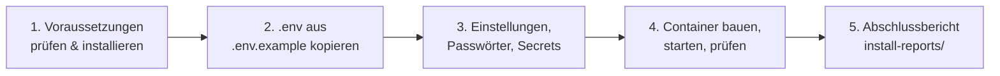

# Assistierte Installation (`scripts/install.sh`)

`scripts/install.sh` richtet die Intranet-Landingpage in einem Durchgang vollständig
ein – von der Paketprüfung bis zur betriebsbereiten Umgebung. Der Assistent ist
menügeführt (pseudo-grafisch über `whiptail` bzw. `dialog`), fragt alle Einstellungen,
Passwörter und Secrets ab, trägt sie in die `.env` ein, startet die Container und
erstellt am Ende einen **Abschlussbericht**, der direkt in die Betriebsdokumentation
übernommen werden kann.

```bash
./scripts/install.sh
```

Das Skript ist idempotent: Es kann jederzeit erneut ausgeführt werden, um die
Konfiguration zu ändern, Module nachzurüsten oder eine Installation zu reparieren.

---

## 1. Überblick



| Schritt | Was passiert |
| --- | --- |
| 1. Voraussetzungen | Prüft Basiswerkzeuge, `curl`, Dialog-Werkzeug, Docker Engine, Docker Compose, laufenden Docker-Dienst, Zugriffsrechte, Speicherplatz und Arbeitsspeicher. Fehlende Pakete werden nach Bestätigung automatisch installiert. |
| 2. Konfigurationsdatei | Kopiert `.env.example` automatisch nach `.env` (Rechte `0600`). Existiert bereits eine `.env`, kann sie weiterverwendet (neue Schlüssel aus `.env.example` werden ergänzt) oder gesichert und neu angelegt werden. |
| 3. Konfiguration | Gefragt werden Anwendung, Datenbank, Administrator, optionale Module (AD/LDAP, Windows-Anmeldung, SMS-Gateway, Office, phpMyAdmin, Autostart) und SNMP. Alle Werte landen in der `.env`. |
| 4. Installation | Richtet ggf. Office ein, prüft belegte Ports, validiert `docker-compose.yml`, baut und startet die Container mit Fortschrittsanzeige, wartet auf die Healthchecks, setzt das Administrationskonto, startet optional phpMyAdmin und den systemd-Dienst. |
| 5. Abschlussbericht | Zeigt eine vollständige Zusammenfassung (inkl. Zugangsdaten) an und speichert sie als Markdown unter `install-reports/installation-<Zeitstempel>.md`. |

---

## 2. Voraussetzungen

- Linux (Ubuntu/Debian, Fedora/RHEL/CentOS, openSUSE, Arch, Alpine) oder macOS mit
  [Homebrew](https://brew.sh)
- `sudo`-Berechtigung (bzw. Ausführung als root) für die Paketinstallation
- Internetzugang für Pakete und Container-Images
- Empfohlen: mindestens 5 GB freier Speicher und 2 GB RAM (mit Office: 15 GB / 4 GB)

Das Skript wird aus dem Repository-Verzeichnis heraus oder mit Pfad aufgerufen – es
wechselt selbst in das Projektverzeichnis.

### Automatisch nachinstallierte Pakete

| Komponente | apt (Ubuntu/Debian) | dnf/yum | zypper | pacman | apk | brew (macOS) |
| --- | --- | --- | --- | --- | --- | --- |
| Oberfläche | `whiptail` | `newt` | `newt` | `libnewt` | `newt` | `newt` |
| curl | `curl ca-certificates` | `curl` | `curl` | `curl` | `curl` | `curl` |
| Docker Engine | Ubuntu: `docker.io`, sonst offizielles Skript `get.docker.com` | `get.docker.com` | `docker` | `docker` | `docker` | Cask `docker` (Docker Desktop) |
| Docker Compose | `docker-compose-v2` / `docker-compose-plugin` | `docker-compose-plugin` | `docker-compose` | `docker-compose` | `docker-cli-compose` | `docker-compose` |

Anschließend wird der Docker-Dienst gestartet (`systemctl enable --now docker`,
`rc-service` bzw. `service`; unter macOS wird Docker Desktop geöffnet). Ist der
aktuelle Benutzer nicht in der Gruppe `docker`, arbeitet das Skript mit `sudo docker`
und bietet an, den Benutzer der Gruppe hinzuzufügen (wirksam nach erneuter Anmeldung).

> **macOS:** Docker Desktop muss nach der Installation einmalig gestartet und die
> Lizenzbedingungen bestätigt werden. Danach das Skript erneut ausführen.

---

## 3. Aufruf und Optionen

```bash
./scripts/install.sh [Optionen]
```

| Option | Wirkung |
| --- | --- |
| *(ohne)* | Interaktiver Assistent mit grafischer Oberfläche (`whiptail`/`dialog`, wird bei Bedarf installiert) |
| `--defaults`, `-y` | Keine Rückfragen: Standard- bzw. bestehende Werte übernehmen, fehlende Passwörter und Secrets zufällig erzeugen. Geeignet für automatisierte Installationen und Testumgebungen. |
| `--text` | Textmodus erzwingen (Zeilen-Eingabe statt Dialogfenster, z. B. für einfache Terminals oder serielle Konsolen) |
| `--no-deps` | Nur prüfen, keine Pakete installieren (bricht ab, wenn etwas fehlt) |
| `--no-start` | Nur konfigurieren (`.env`, ggf. Office-Secrets), keine Container starten |
| `--with-secrets` | Zugangsdaten im Klartext in das gespeicherte Protokoll aufnehmen (ohne Rückfrage) |
| `-h`, `--help` | Hilfe anzeigen |

Beispiele:

```bash
./scripts/install.sh                         # interaktive Komplettinstallation
./scripts/install.sh --defaults              # unbeaufsichtigt mit Zufallspasswörtern
./scripts/install.sh --no-start              # nur .env und Secrets vorbereiten
./scripts/install.sh --text --no-deps        # Textmodus, ohne Paketinstallation
```

Der Exit-Code ist `0` bei Erfolg, `1` bei Abbruch/Fehler (auch wenn der Healthcheck
nach dem Start fehlschlägt) und `2` bei unbekannten Optionen.

---

## 4. Bedienung

| Taste | Funktion |
| --- | --- |
| Pfeiltasten | Eintrag in Menüs/Listen wählen, im Text scrollen |
| Tab | Zwischen Eingabefeld und Schaltflächen (OK/Abbrechen, Ja/Nein) wechseln |
| Leertaste | In der Modulauswahl ein Modul an-/abwählen |
| Enter | Bestätigen |
| Esc bzw. „Abbrechen“ | Rückfrage „Installation wirklich abbrechen?“ – bei „Nein“ wird die aktuelle Frage erneut gestellt |

Im Textmodus gilt: Der Wert in eckigen Klammern ist die Vorgabe und wird mit Enter
übernommen; bei Ja/Nein-Fragen ist die Vorgabe groß geschrieben (`[J/n]`), in Menüs
mit `*` markiert und per Nummer wählbar. Passworteingaben sind verdeckt.

### Passwörter und Secrets

Für jedes Passwort bzw. Secret bietet der Assistent ein Auswahlmenü:

| Auswahl | Bedeutung |
| --- | --- |
| Bestehenden Wert beibehalten | Nur sichtbar, wenn bereits ein echter Wert vorhanden ist (auch aus der gesicherten `.env`) |
| Zufällig erzeugen (empfohlen) | 32 Zeichen `[A-Za-z0-9]` aus `/dev/urandom` |
| Selbst eingeben | Verdeckte Eingabe mit Bestätigung und Mindestlänge |
| Leer lassen | Nur bei externen Zugangsdaten (AD-Dienstkonto, Domänenbeitritt, SMS-Gateway) |

Werte mit Leerzeichen oder Sonderzeichen (`# $ " \ \``) werden automatisch in einfache
Anführungszeichen gesetzt, damit Docker Compose und die Anwendung sie wörtlich
übernehmen. Einfache Anführungszeichen (`'`) selbst sind in Eingaben nicht erlaubt.

---

## 5. Abgefragte Einstellungen

### Grundkonfiguration (immer)

| Frage | Variable(n) | Vorgabe |
| --- | --- | --- |
| Name der Anwendung | `APP_NAME` | `Intranet` |
| Betriebsart | `APP_ENV`, `APP_DEBUG` | `production` / `false` |
| Port | `APP_PORT` | `8080` |
| Öffentliche Adresse | `APP_URL` | `http://<hostname>:<port>` |
| Nur HTTPS-Cookies (bei `https://`) | `APP_FORCE_SECURE_COOKIES` | `true` bei HTTPS |
| Zeitzone | `APP_TIMEZONE` | `Europe/Berlin` |
| Beispieldaten beim Start | `SEED_ON_START` | ja (nein, wenn schon eine Datenbank existiert) |
| Datenbankname und -benutzer | `DB_NAME`, `DB_USER` | `intranet` |
| Datenbank-Passwörter | `DB_PASSWORD`, `DB_ROOT_PASSWORD` | zufällig (mind. 12 Zeichen) |
| Administrator | `ADMIN_USERNAME`, `ADMIN_PASSWORD` | `admin` / zufällig (mind. 12 Zeichen) |
| SNMP-Community, Standort, Kontakt, Port | `SNMP_COMMUNITY`, `SNMP_SYS_LOCATION`, `SNMP_SYS_CONTACT`, `SNMP_PORT` | zufällig statt `public`, UDP `161` |

### Optionale Module (Auswahlliste)

| Modul | Abgefragte Werte |
| --- | --- |
| **Active Directory / LDAP** | `LDAP_HOST`, TLS (`LDAP_USE_TLS`, `LDAP_VERIFY_CERT`), `LDAP_PORT` (636/389), `LDAP_BASE_DN`, `LDAP_BIND_DN`, `LDAP_PASSWORD`, `LDAP_GROUP_BASE_DN`, `LDAP_SYNC_INTERVAL` |
| **Windows-Anmeldung (NTLM)** | `SSO_ENABLED=true`, `SSO_DOMAIN`, `SSO_REALM`, `SSO_DC`, `SSO_DC_IP`, `SSO_JOIN_USER`, `SSO_JOIN_PASSWORD` – aktiviert automatisch auch LDAP |
| **SMS-Gateway** | `ALARM_HOST`, `ALARM_USERNAME`, `ALARM_PASSWORD` |
| **Office** | `NEXTCLOUD_ADMIN_USER`, `NEXTCLOUD_EXTRA_TRUSTED_DOMAINS`, `OFFICE_BACKUP_DIR`, Verschlüsselung der Sicherungen. Danach wird `scripts/office-setup.sh --no-start` (ggf. mit `--with-ad`/`--with-sso`/`--no-encryption`) ausgeführt, das die Secrets unter `./secrets/` erzeugt – siehe [office.md](office.md). |
| **phpMyAdmin** | `PMA_PORT`; wird nach dem Start mit `--profile tools` gestartet |
| **Autostart (systemd)** | Nur unter Linux mit systemd: richtet `intranet.service` über `scripts/install-systemd-service.sh` ein |

Vor der Installation zeigt der Assistent eine Übersicht aller Einstellungen und
fragt, ob die Installation durchgeführt werden soll.

---

## 6. Installation und Start

1. **Office** (falls gewählt): `office-setup.sh --no-start` erzeugt die Secrets und
   aktiviert `COMPOSE_PROFILES=office`. Wird Office abgewählt, deaktiviert das Skript
   es in der `.env` wieder.
2. **Portprüfung:** Sind `APP_PORT` (TCP) oder `SNMP_PORT` (UDP) belegt und läuft der
   Stack noch nicht, wird ein freier Port abgefragt (`APP_URL` wird angepasst).
3. **Validierung:** `docker compose config -q`.
4. **Build und Start:** `docker compose up -d --build --remove-orphans` mit
   Fortschrittsbalken (die letzte Ausgabezeile wird live angezeigt).
5. **Healthchecks:** Wartet (max. 10 Minuten) bis `db`, `app` und `auth` *healthy*
   sind, und prüft `http://127.0.0.1:<APP_PORT>/health`. Bei Office zusätzlich
   `nextcloud` und `eurooffice` (max. 15 Minuten).
6. **Administrationskonto:** `scripts/create_admin.php` wird im Container ausgeführt –
   das Konto wird angelegt bzw. dessen Passwort auf den eingegebenen Wert gesetzt. Das
   Passwort wird dabei über die Standardeingabe übergeben (nicht in der Prozessliste
   sichtbar).
7. **Nacharbeiten:** phpMyAdmin und systemd-Dienst (falls gewählt). Im interaktiven
   Modus wird angeboten, `ADMIN_PASSWORD` wieder aus der `.env` zu entfernen
   (empfohlen – das Konto existiert dann bereits in der Datenbank).

> **Bestehende Datenbank:** Die Datenbank-Passwörter werden von MySQL nur beim ersten
> Start eines leeren Volumes übernommen. Existiert das Volume `<projekt>_db_data`
> bereits, weist der Assistent darauf hin und schlägt die vorhandenen Werte vor.
> Ändern Sie sie nur, wenn das Volume vorher gelöscht wurde
> (`docker compose down -v` – **löscht alle Daten**).

---

## 7. Abschlussbericht für die Dokumentation

Am Ende zeigt der Assistent eine vollständige Zusammenfassung an – auf dem Bildschirm
immer **mit** Zugangsdaten, damit diese notiert bzw. in einen Passwort-Tresor
übernommen werden können. Zusätzlich wird der Bericht als Markdown-Datei gespeichert:

```
install-reports/installation-<JJJJMMTT-hhmmss>.md    (Rechte 0600, Verzeichnis 0700)
```

Vorher wird gefragt, ob die Zugangsdaten im Klartext in die Datei aufgenommen werden
sollen. Standard ist **Nein**: Passwörter erscheinen dann als
`******** (siehe .env: DB_PASSWORD)`, sodass die Datei gefahrlos in eine allgemeine
Dokumentation (Wiki, Betriebshandbuch) übernommen werden kann. Mit `--with-secrets`
bzw. „Ja“ entsteht eine vertrauliche Fassung, die nur geschützt abgelegt werden darf.

Inhalt des Berichts:

| Abschnitt | Inhalt |
| --- | --- |
| Kopf | Datum, Benutzer, Host/IP, Betriebssystem, Installationsverzeichnis, Git-Stand, Compose-Projekt, Skriptversion, Ergebnis |
| 1. Systemumgebung | Docker- und Compose-Version, Aufrufart (`docker`/`sudo docker`), nachinstallierte Pakete |
| 2. Zugriff | Landingpage, Administration (`/admin/login`), Healthcheck, Office, phpMyAdmin, SNMP |
| 3. Zugangsdaten und Secrets | Administrator, Datenbank, AD-Dienstkonto, Domänenbeitritt, SMS-Gateway, SNMP-Community, Nextcloud-Admin, Office-Backup-Passphrase |
| 4. Konfiguration | Alle nicht geheimen Einstellungen der aktiven Module |
| 5. Module | Status aller optionalen Module inkl. Autostart |
| 6. Container-Status | Ausgabe von `docker compose ps` |
| 7. Dateien | `.env`, Sicherung der alten `.env`, `secrets/`, Installationslog, Bericht |
| 8. Nützliche Befehle | Status, Logs, Neustart, Update, Admin-Passwort zurücksetzen, AD-Sync, Sicherung |
| 9. Nächste Schritte | Anmeldung, `SEED_ON_START=false`, HTTPS, AD-Test, Office-Kachel, Datensicherung |

`install-reports/` ist in `.gitignore` eingetragen und wird nie versioniert.

---

## 8. Erzeugte und geänderte Dateien

| Datei | Beschreibung |
| --- | --- |
| `.env` | Konfiguration inkl. Passwörter (Rechte `0600`, nicht versioniert) |
| `.env.bak-<Zeitstempel>` | Sicherung, wenn eine bestehende `.env` neu angelegt wurde |
| `secrets/` | Office-Secrets (nur mit Modul Office, siehe [office.md](office.md)) |
| `storage/logs/install-<Zeitstempel>.log` | Ausführliches Protokoll aller Befehle (Paketinstallation, Build, Start) |
| `install-reports/installation-<Zeitstempel>.md` | Abschlussbericht |
| `/etc/systemd/system/intranet.service` | Nur mit Modul Autostart |

---

## 9. Fehlerbehebung

| Problem | Lösung |
| --- | --- |
| Oberfläche erscheint nicht / Darstellung fehlerhaft | Terminal mindestens 64×20 Zeichen groß machen oder `--text` verwenden |
| Paketinstallation schlägt fehl | Details in `storage/logs/install-*.log`; Pakete manuell installieren und mit `--no-deps` erneut starten |
| „Docker-Dienst nicht erreichbar“ | `sudo systemctl status docker`; unter macOS Docker Desktop starten |
| Healthcheck schlägt fehl | `docker compose ps` und `docker compose logs app auth db` prüfen, danach Skript erneut ausführen |
| Datenbank nach Passwortänderung nicht erreichbar | Alte Werte aus `.env.bak-*` wiederherstellen oder (Datenverlust!) `docker compose down -v` |
| Admin-Passwort vergessen | `docker compose exec app php scripts/create_admin.php <name>` erzeugt ein neues Passwort – oder das Skript erneut ausführen |
| Port belegt | Das Skript fragt einen anderen Port ab; alternativ `APP_PORT`/`SNMP_PORT` in der `.env` ändern |
