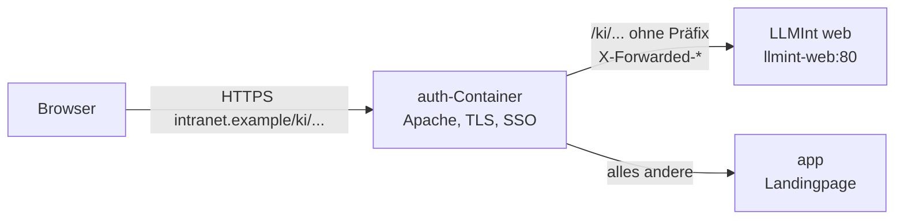

# LLMInt unter `/ki/` (optional)

[LLMInt](https://github.com/dareinelt/LLMInt) – die KI-Oberfläche mit eigenem
Compose-Stack (PHP/Apache-Container `web`) – kann hinter dem `auth`-Container
der Landingpage unter dem Unterpfad **`/ki/`** laufen. Vorteile:

- **Ein Zertifikat, ein Hostname:** LLMInt nutzt das HTTPS-Zertifikat aus
  Adminbereich → Zertifikate (HTTPS); kein eigener DNS-Name, kein eigenes
  Zertifikat.
- **Windows-Anmeldung (SSO):** Der `auth`-Container übernimmt Kerberos/NTLM
  am SSO-Einstiegspunkt von LLMInt (`/ki/sso.php`) genauso wie für das
  Intranet (`/sso/anmelden`).

Standardmäßig ist die Funktion **aus** (`LLMINT_ENABLED=false`); ohne
Aktivierung ändert sich nichts.



## 1. Variablen (lanpa, `.env`)

| Variable | Bedeutung | Standard |
| --- | --- | --- |
| `LLMINT_ENABLED` | Proxy für LLMInt aktivieren | `false` |
| `LLMINT_UPSTREAM` | Ziel ohne Pfad: `http://llmint-web` (gemeinsames Docker-Netz, Variante A) oder `http://<IP>:<Port>` (anderer Host, Variante B). `https://…` ist möglich, das Zertifikat wird dann gegen die System-CAs geprüft. | – |
| `LLMINT_PATH` | Öffentlicher Pfad ohne abschließenden `/` (nur `a-z`, `0-9`, `_`, `-`; belegte Pfade wie `/office`, `/sso`, `/admin` werden abgelehnt) | `/ki` |
| `LLMINT_PROXY_NETWORK` | Name des externen Docker-Netzes (nur Variante A, `docker-compose.llmint.yml`) | `llmint-proxy` |

Ungültige Werte schalten nur den LLMInt-Proxy ab (Warnung im Protokoll des
`auth`-Containers), nie den Einstieg ins Intranet. Erfolgreich aktiviert
meldet das Protokoll `[auth] LLMInt-Proxy aktiv (/ki/ -> http://llmint-web/).`

## 2. Variante A: LLMInt auf demselben Host (empfohlen)

Beide Stacks teilen ein externes Docker-Netz. LLMInt veröffentlicht dann
keinen eigenen Port mehr; erreichbar ist es nur über den `auth`-Container.

1. **Netz anlegen** (einmalig, als Administrator auf dem Docker-Host):

   ```bash
   docker network create --subnet 172.30.251.0/24 llmint-proxy
   ```

2. **LLMInt** (eigener Stack, siehe dessen Dokumentation): den Container
   `web` mit dem Alias `llmint-web` an das Netz `llmint-proxy` hängen und
   in dessen `.env` setzen:

   ```ini
   TRUSTED_PROXIES=172.30.251.0/24
   PROXY_SSO_HEADER=X-Remote-User
   ```

   LLMInt bringt dafür die Override-Datei `docker-compose.lanpa.yml` mit
   (Netz, Alias und beide Werte, siehe README von LLMInt). Danach den
   LLMInt-Stack neu starten.

3. **lanpa**: in der `.env`

   ```ini
   COMPOSE_FILE=docker-compose.yml:docker-compose.llmint.yml
   LLMINT_ENABLED=true
   LLMINT_UPSTREAM=http://llmint-web
   ```

   (Mit weiteren Domänen: `COMPOSE_FILE=docker-compose.yml:docker-compose.sso.yml:docker-compose.llmint.yml`
   und anschließend `./scripts/sso-domains.sh` erneut ausführen, damit auch
   die Instanzen `auth-<kennung>` an das Netz angebunden werden.)

   ```bash
   docker compose up -d
   docker compose logs auth | grep LLMInt
   ```

4. **Prüfen:** `https://<intranet>/ki/` zeigt LLMInt.

`docker-compose.llmint.yml` hängt nur den `auth`-Container zusätzlich an das
Netz. LLMInt vertraut den Proxy-Headern ausschließlich aus diesem Netz
(`TRUSTED_PROXIES=172.30.251.0/24`); kein anderer Container von lanpa
hängt daran.

## 3. Variante B: LLMInt auf einem anderen Host

1. **LLMInt** veröffentlicht seinen `web`-Container auf einem Port (z. B.
   `8080`) und setzt in seiner `.env`:

   ```ini
   TRUSTED_PROXIES=<IP-Adresse des lanpa-Hosts>
   PROXY_SSO_HEADER=X-Remote-User
   ```

   Den Port per Firewall nur für den lanpa-Host freigeben – sonst ist LLMInt
   am Proxy vorbei erreichbar.

2. **lanpa** (`.env`, ohne `docker-compose.llmint.yml`):

   ```ini
   LLMINT_ENABLED=true
   LLMINT_UPSTREAM=http://10.0.0.5:8080
   ```

   `docker compose up -d`.

Zwischen den Hosts läuft der Verkehr unverschlüsselt, wenn `http://`
verwendet wird (inkl. Sitzungs-Cookies von LLMInt und dem SSO-Header). Im
Zweifel ein vertrauenswürdiges Netz oder `https://` mit einem Zertifikat
einer vertrauenswürdigen CA verwenden.

## 4. Windows-Anmeldung (SSO) einrichten

Voraussetzung: Windows-Anmeldung der Landingpage ist aktiv
(`SSO_ENABLED=true`, siehe README „Windows-Anmeldung ohne Anmeldepflicht“).
Es sind keine weiteren SPNs nötig – LLMInt läuft unter demselben Hostnamen.

1. In **LLMInt → Admin** die LDAP-Anbindung an das Active Directory
   einrichten und **„Windows-SSO“** aktivieren.
2. LLMInt-`.env`: `PROXY_SSO_HEADER=X-Remote-User` und `TRUSTED_PROXIES`
   wie oben.

Ablauf:

1. LLMInt leitet nicht angemeldete Benutzer auf `/ki/sso.php` (das Ziel
   merkt sich LLMInt in seiner Sitzung).
2. Nur für diesen Pfad verlangt der `auth`-Container die Windows-Anmeldung
   (Kerberos bzw. NTLM, wie `/sso/anmelden`) und reicht den Benutzer als
   `X-Remote-User` (`DOMAIN\SamAccountName` bzw. `user@REALM`) weiter.
3. Ohne Domänenanmeldung (401) bzw. bei gestörter Domänenanbindung (500)
   liefert der Proxy stattdessen `/ki/sso_fallback.php` von LLMInt aus; die
   Seite führt per Meta-Refresh zurück, LLMInt zeigt dann das
   Anmeldeformular.

   **Wichtig für LLMInt:** `sso_fallback.php` muss mit dem Status **401**
   antworten. Der Proxy übernimmt Status und Inhalt der Fallback-Seite; nur
   mit 401 versucht der Browser die Anmeldung per `WWW-Authenticate:
   Negotiate` (wie `/sso/nicht-erkannt` der Landingpage).

Alle anderen Pfade unter `/ki/` sind ohne Windows-Anmeldung erreichbar; dort
wird `X-Remote-User` (und `X-Remote-Source`) immer entfernt.

**Weitere Domänen ohne Vertrauensstellung** (`auth-<kennung>`, siehe README
„Windows-Anmeldung für mehrere Domänen“): In diesen Instanzen wird
`/ki/sso.php` ohne Anmeldung und ohne `X-Remote-User` durchgereicht – Konten
anderer Domänen würden sonst gleichnamige Konten der Hauptdomäne treffen.
Benutzer aus diesen Netzen melden sich per Formular an.

## 5. Kachel auf der Landingpage

Adminbereich → Navigation → neues Element mit der URL **`/ki/`** (interner
Pfad) anlegen, z. B. „KI-Assistent“. Optional per AD-Gruppe einschränken
(die Rechteprüfung von LLMInt selbst bleibt davon unberührt).

## 6. Verhalten des Proxys (Referenz)

Konfiguration: `docker/auth/llmint.conf` (eingebunden aus
`docker/auth/common.conf` mit `-D LLMINT`, gesetzt von
`docker/auth/entrypoint.sh`).

| Thema | Verhalten |
| --- | --- |
| Pfade | `/ki` → `301` auf `/ki/`; `/ki/<rest>` → `${LLMINT_UPSTREAM}/<rest>` (Präfix entfernt) |
| Streaming | `ProxyPass … timeout=3600 flushpackets=on retry=5`, `mod_deflate` für `/ki/` aus (`no-gzip`) – Server-Sent Events werden nicht gepuffert. LLMInt selbst darf SSE ebenfalls nicht komprimieren. |
| Uploads | bis 100 MB (Grenze von LLMInt; Apache-Standardgrenze 1 GiB) |
| Weiterleitungen | `ProxyPassReverse`: `Location: http://llmint-web/x` → `/ki/x` |
| Cookies | `ProxyPassReverseCookiePath / /ki/`: LLMInt setzt Cookies für `/`, der Browser erhält `Path=/ki/`. LLMInt darf das Präfix daher **nicht** selbst in den Cookie-Pfad schreiben (sonst `/ki/ki/`). |
| Header an LLMInt | `Host` (Original, `ProxyPreserveHost On`), `X-Forwarded-Proto` (mit eigenem TLS je Verbindung, hinter dem HAProxy-Verteiler von dort, sonst Schema aus `APP_URL`), `X-Forwarded-Host`/`X-Forwarded-For`/`X-Forwarded-Server` (Werte des Clients verworfen, von `mod_proxy` neu gesetzt), `X-Forwarded-Prefix: /ki`, `X-Remote-User` nur an `/ki/sso.php` |
| Nicht erreichbar | 500/502/503 des Proxys → Hinweisseite `/ki-nicht-verfuegbar` der Landingpage (Status 503). Fehlerseiten von LLMInt selbst werden unverändert durchgereicht. |
| Neue Container-Adresse | Ist der Upstream ein Hostname (z. B. `llmint-web`), prüft `backend-watch.sh` alle 10 s dessen Adresse und lädt Apache nach einer Änderung neu (z. B. nach `docker compose up -d` im LLMInt-Stack). |

## 7. Sicherheit: gleicher Origin

LLMInt läuft im **selben Origin** wie die Landingpage (gleiches Schema, gleicher
Host, gleicher Port). Für den Browser sind beide eine Anwendung:

- JavaScript aus LLMInt kann Anfragen an die Landingpage mit deren
  Sitzungs-Cookie stellen und Seiten (inkl. CSRF-Token) lesen, ebenso
  umgekehrt; auch `localStorage` ist gemeinsam. Eine XSS-Lücke in LLMInt
  wirkt damit wie eine in der Landingpage (und umgekehrt). LLMInt nur
  einsetzen, wenn es so vertrauenswürdig ist wie die Landingpage selbst, und
  aktuell halten.
- Geprüft: Die Landingpage setzt nur ein Cookie, die Sitzung
  (`INTRANETSESSID`, `HttpOnly`, `SameSite=Lax`, `Secure` bei HTTPS bzw.
  `APP_FORCE_SECURE_COOKIES`). JavaScript (auch aus LLMInt) kann es nicht
  lesen. Der Browser sendet es allerdings auch an `/ki/` mit – LLMInt
  erhält es also im `Cookie`-Header und darf es weder protokollieren noch
  auswerten. LLMInt sollte einen **anderen Sitzungsnamen** als
  `INTRANETSESSID` verwenden; seine Cookies gelten nur für `/ki/`.
- Nextcloud-Cookies (Office) gelten nur für `/office/` und werden nicht an
  LLMInt gesendet.
- `X-Remote-User` darf LLMInt ausschließlich von `TRUSTED_PROXIES`
  annehmen; der `auth`-Container entfernt den Header von Clients immer.
- Die Content-Security-Policy der Landingpage erlaubt Skripte aus `'self'`
  – dazu zählt auch `/ki/`. LLMInt darf hochgeladene Dateien deshalb nicht
  mit ausführbarem Inhaltstyp (HTML/JavaScript) unter `/ki/` ausliefern.

## 8. Fehlersuche

| Symptom | Ursache / Lösung |
| --- | --- |
| `/ki/` liefert die Startseite bzw. „Seite nicht gefunden“ der Landingpage | `LLMINT_ENABLED` nicht `true` oder ungültiger Wert – `docker compose logs auth \| grep LLMInt` |
| Hinweisseite „KI nicht verfügbar“ | LLMInt läuft nicht oder ist nicht erreichbar: `docker compose exec auth getent hosts llmint-web`, `docker compose exec auth curl -sI http://llmint-web/`; Variante A: hängen beide Container am Netz `llmint-proxy` (`docker network inspect llmint-proxy`)? |
| `docker compose up` meldet „network llmint-proxy declared as external, but could not be found“ | Netz anlegen (Abschnitt 2, Schritt 1) |
| Antworten erscheinen erst am Ende statt fortlaufend | Komprimierung bzw. Pufferung in LLMInt (`output_buffering`, `zlib.output_compression`) oder in einem weiteren Proxy vor lanpa |
| LLMInt erzeugt Links ohne `/ki/` oder mit `http://` | `TRUSTED_PROXIES` in LLMInt passt nicht zur Adresse des `auth`-Containers (Variante A: `172.30.251.0/24`, Variante B: IP des lanpa-Hosts) |
| Windows-Anmeldung an LLMInt erfolgt nicht | `SSO_ENABLED=true`? Client in der Hauptdomäne (nicht `auth-<kennung>`)? In LLMInt „Windows-SSO“ aktiv und `PROXY_SSO_HEADER=X-Remote-User`? Antwortet `sso_fallback.php` mit 401? |
