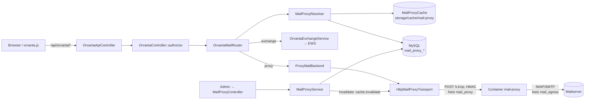
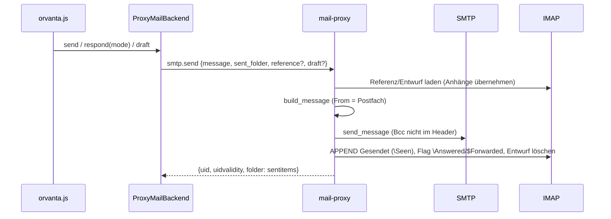

# SMTP-/IMAP-Proxy – technische Referenz (für Entwickler und Coding-Agenten)

Ergänzt [docs/mail-proxy.md](mail-proxy.md) (Einrichtung, Bedienung, Betrieb).
Dieses Dokument beschreibt, **wie** das Modul aufgebaut ist: Dateien,
Prozesse, Datenmodell, Kennungsformate, Abläufe, Protokoll, Fehlercodes,
Invarianten, Tests und typische Änderungsaufgaben. Konstanten sind mit ihrer
Fundstelle (Klasse/Funktion) angegeben – **bei Abweichungen gilt der Code**.
Die Berührungspunkte mit Orvanta stehen zusätzlich in
[orvanta-referenz.md](orvanta-referenz.md).

**Kurzfassung (TL;DR)**

- Orvanta spricht standardmäßig Exchange (EWS). Für AD-Benutzer **mit gültiger
  Zuordnung** zu einem Proxy-Postfach wird stattdessen `ProxyMailBackend`
  verwendet – gleiche Orvanta-Oberfläche, nur E-Mail (kein Kalender, Kontakte,
  Aufgaben, Notizen, Erinnerungen, Archiv).
- PHP hält Konfiguration, Postfächer (Passwort `SecretBox`-verschlüsselt) und
  Zuordnungen in MySQL. Der Container `mail-proxy` (Python-Standardbibliothek,
  **ohne DB**) spricht IMAP/SMTP; er bekommt die Zugangsdaten **pro Anfrage**
  in einem HMAC-signierten HTTP-Aufruf und speichert sie nie.
- Entscheidung je Benutzer: **exchange** (keine/ungültige Zuordnung → bisheriges
  Verhalten), **proxy** oder **blocked** (Postfach deaktiviert → 403, **kein**
  Rückfall auf Exchange).
- Jede Admin-Änderung ruft `MailProxyService::invalidate()`: Generation +1,
  Dateicache leeren, Pool im Proxy schließen (`cache.invalidate`).
- Tests: `php tests/run.php` (`tests/Unit/MailProxyTest.php`, SQLite +
  `FakeMailProxyTransport`, kein Netzwerk).

---

## Inhalt

1. [Begriffe und Code-Bezeichner](#1-begriffe-und-code-bezeichner)
2. [Code-Landkarte](#2-code-landkarte)
3. [Laufzeitarchitektur](#3-laufzeitarchitektur)
4. [Datenmodell](#4-datenmodell)
5. [Wertobjekte, Cache und Kennungsformate](#5-wertobjekte-cache-und-kennungsformate)
6. [Abläufe im Detail](#6-abläufe-im-detail)
7. [Proxy-Protokoll und Operationen](#7-proxy-protokoll-und-operationen)
8. [Fehlercodes und Statuswerte](#8-fehlercodes-und-statuswerte)
9. [Sicherheit](#9-sicherheit)
10. [Konfiguration](#10-konfiguration)
11. [Invarianten (nicht brechen!)](#11-invarianten-nicht-brechen)
12. [Routen und Oberfläche](#12-routen-und-oberfläche)
13. [Tests](#13-tests)
14. [Änderungsrezepte](#14-änderungsrezepte)
15. [Fehlersuche](#15-fehlersuche)
16. [Bekannte Eigenheiten](#16-bekannte-eigenheiten)

---

## 1. Begriffe und Code-Bezeichner

| Begriff | Bedeutung | Im Code |
| --- | --- | --- |
| Identitätsquelle | AD-Domäne, aus der Benutzer synchronisiert werden; `0` = Hauptquelle (aus `.env`/Einstellungen, ohne Zeile in `identity_sources`) | `identity_source_id`, `source_id`, `MailProxyService::sources()` |
| Proxy-Konfiguration / Mailserver | SMTP- und IMAP-Server einer Identitätsquelle (genau einer je Quelle) | `mail_proxy_servers`, `server_id` |
| Postfach | Anmeldedaten eines Kontos auf diesem Mailserver | `mail_proxy_mailboxes`, `mailbox_id` |
| Zuordnung | AD-Benutzer (Telefonbuchzeile) → Postfach, 1:1 | `mail_proxy_mappings`, `phonebook_id` |
| Route | Ergebnis der Entscheidung: `exchange`, `proxy`, `blocked` | `MailProxyRoute` |
| Account | Frisch gelesene Zugangsdaten für genau eine Anfrage (nicht serialisierbar) | `MailProxyAccount` |
| Generation | Zähler in `mail_proxy_state`; jede Änderung erhöht ihn, Caches und Pool-Verbindungen der alten Generation sind ungültig | `MailProxyRepository::generation()/bumpGeneration()` |
| Backend | Implementierung von `OrvantaMailBackendInterface`: `OrvantaExchangeService` oder `ProxyMailBackend` | `backendName()` = `exchange`/`proxy` |
| Capability | Vom Backend unterstützte Funktion (`mail`, `calendar`, `contacts`, `tasks`, `notes`, `reminders`, `archive`) | `OrvantaMailBackendInterface::CAPABILITY_*` |
| Spec | Ordnerangabe im Protokoll: Systemordner-Art (`inbox`, `drafts`, `sentitems`, `deleteditems`, `junkemail`) oder `name:<IMAP-Rohname>` | `ProxyMailBackend::KINDS`, `ImapSession.resolve()` |
| Operation | Ein Endpunkt des Proxy-Dienstes, z. B. `imap.messages` | `OPERATIONS` (Python), `$operation` (PHP) |

---

## 2. Code-Landkarte

### PHP

| Datei | Aufgabe |
| --- | --- |
| `database/migrations/039_mail_proxy.sql` | Tabellen `mail_proxy_servers`, `mail_proxy_mailboxes`, `mail_proxy_mappings`, `mail_proxy_state` |
| `database/migrations/040_mail_proxy_mailbox_quota.sql` | Spalte `mail_proxy_mailboxes.quota_mb` |
| `app/Repositories/MailProxyRepository.php` | Sämtliches SQL (auch SQLite-tauglich für Tests). Chiffrat nur über `mailboxSecret()`/`connectionRow()`; Listen (`mailboxes()`, `mappings()`, Vorschläge) enthalten nie `password_encrypted` |
| `app/Services/MailProxy/MailProxyService.php` | Admin-Logik: Quellen, Validierung inkl. SSRF-Prüfung, CRUD, Vorschläge, Verbindungstest, Diagnose, `invalidate()`, `updateUserPassword()` |
| `app/Services/MailProxy/MailProxyResolver.php` | `resolve()` (mit Cache), `decide()` (rein), `account()`/`accountForTest()` (frische Zugangsdaten) |
| `app/Services/MailProxy/MailProxyRoute.php` | Wertobjekt der Entscheidung (ohne Geheimnisse, cachebar) |
| `app/Services/MailProxy/MailProxyAccount.php` | Wertobjekt mit Passwort (`#[SensitiveParameter]`, maskiert, `__serialize` wirft) und `payload()` für den Proxy |
| `app/Services/MailProxy/MailProxyCache.php` | Dateicache mit TTL und Generation |
| `app/Services/MailProxy/OrvantaMailRouter.php` | Backend-Auswahl je Anfrage (`backendFor()`, `backendForRoute()`) und für Anhang-Tokens (`backendForUid()`) |
| `app/Services/MailProxy/ProxyMailBackend.php` | `OrvantaMailBackendInterface` über den Proxy: Kennungen, Postfach-Bindung, Abbildung auf Orvanta-Formate, Fehler-/Erfolgsprotokoll |
| `app/Services/MailProxy/HttpMailProxyTransport.php` | HTTP (cURL) + HMAC zum Container, Fehlercode → deutsche Meldung/HTTP-Status, `health()` |
| `app/Contracts/OrvantaMailBackendInterface.php` | Gemeinsames Interface beider Backends, Capability-Konstanten |
| `app/Contracts/MailProxyTransportInterface.php` | `request(operation, payload)`, `health()` – in Tests `FakeMailProxyTransport` |
| `app/Core/Container.php` | Verdrahtung (`mailProxy*()`), `MAIL_PROXY_URL`, `MAIL_PROXY_CACHE_TTL`, `mailProxyActive()`, AD-Sync-Hook (`onDeactivated` → `invalidate()`) |
| `app/Controllers/Admin/MailProxyController.php` | Adminseite `/admin/office/mail-proxy` (`activeNav` `office_mail_proxy`); `render()` = Übersicht + optionales Overlay, `serverDialog()`/`mailboxDialog()` bauen die Overlay-Daten |
| `views/admin/mail-proxy.php` | Nur Listen in drei Karten: 1. Konfiguration je Quelle, 2. Postfächer, 3. Zuordnung (Inline-Formular nur für Zuordnungen); bindet bei `$dialog !== null` das Partial `mail-proxy/<type>.php` ein |
| `views/admin/mail-proxy/server.php`, `views/admin/mail-proxy/mailbox.php` | Overlay-Partials (`<dialog>`) zum Anlegen/Bearbeiten von Konfiguration bzw. Postfach |
| `public/assets/js/admin-mail-proxy.js` | ARIA-Combobox-Vorschläge für Zuordnung (schreibt nur die ID ins versteckte Feld); öffnet die Overlays modal, Escape → `data-cancel-url` (Übersicht der angezeigten Quelle) |
| `public/assets/css/admin.css` (`.mail-proxy-overlay`) | Overlay-Gestaltung, gemeinsame Regeln mit `.ad-source` (Identitätsquellen) |
| `app/Controllers/OrvantaController.php` | `authorize()`: ermittelt Route, sperrt `blocked`, erlaubt Proxy auch bei deaktiviertem Exchange-Orvanta |
| `app/Controllers/OrvantaApiController.php` | `status` liefert `backend` + `capabilities`; `exchange()`-Guard für Exchange-only-Endpunkte (409); `mailPassword()` |
| `app/Services/Orvanta/OrvantaAttachmentService.php` | Prüft, dass `mpx.`-IDs nur über das Proxy-Backend und nur fürs eigene Postfach laufen |
| `app/Controllers/Admin/LdapController.php`, AD-Sync | Rufen `invalidate()` bei Änderungen an Identitätsquellen bzw. deaktivierten Benutzern |
| `views/admin/office.php`, `views/layouts/admin.php` | Diagnosekarte auf der Office-Seite, Navigationseintrag |
| `public/assets/js/orvanta.js` | `hasCapability()`, `isProxyBackend()`, Overlay „Kennwort geändert?“ bei `code: mail_auth` |

### Container `mail-proxy`

| Datei | Aufgabe |
| --- | --- |
| `docker/mail-proxy/mail_proxy.py` | Gesamter Dienst (eine Datei, nur Standardbibliothek): HTTP-Server, Authentifizierung, SSRF-Prüfung, IMAP-Sitzungen + Pool, Nachrichten lesen/bauen, SMTP-Versand, Verbindungstest |
| `docker/mail-proxy/Dockerfile` | `python:3.13-slim`, `USER 33:33`, Port 8025, `HEALTHCHECK --healthcheck` |
| `docker-compose.yml` (Dienst `mail-proxy`, Netze `mail_proxy`, `mail_egress`) | Schlüssel read-only aus Volume `app_storage` (subpath `keys`) nach `/run/mail-proxy/keys`; `read_only`, `cap_drop: ALL`, `no-new-privileges` |

Wichtige Bereiche in `mail_proxy.py` (in Dateireihenfolge): Konfiguration/Konstanten →
`log()` → `KeyStore`, `NonceCache`, `signature()` → `ip_allowed()`/`resolve_target()` +
`Pinned*`-Klassen, `tls_context()` → `Account` → `ProxyError`/`classify()` →
mUTF-7, LIST-/FETCH-Parser → `ImapSession` → `Pool`/`with_imap()` → Lesen
(`summary()`, `op_message`, Anhänge) → `op_folders` … `op_quota` →
`build_message()`, `_prepare()`, `op_save_draft`, `smtp_send()`, `op_send`,
`op_test` → `OPERATIONS` → `Handler` (`do_GET`, `do_POST`, `_authenticate`) →
`_janitor`, `healthcheck()`, `main()`.

---

## 3. Laufzeitarchitektur



- **Netze:** `mail_proxy` ist `internal: true` (nur `app` ↔ `mail-proxy`,
  keine Portfreigabe). `mail_egress` ist der einzige Weg nach außen zu den
  Mailservern. Der Proxy hat keinen Zugang zur DB.
- **Zustand im Proxy:** nur flüchtig – IMAP-Pool (eine Sitzung je Postfach),
  Nonce-Cache, Zähler. Neustart verliert nichts.
- **Nebenläufigkeit im Proxy:** `ThreadingHTTPServer`, globale Grenze
  `SLOTS = BoundedSemaphore(MAX_CONNECTIONS)` (sonst sofort 503 `busy`), je
  Postfach ein Lock (`Pool.mailbox_lock`, Wartezeit `timeout*2`, sonst 503
  `busy`). Ein Postfach wird also seriell bedient.
- **Janitor-Thread:** alle 15 s `POOL.sweep()` (Sitzungen älter als
  `POOL_IDLE_SECONDS` schließen).
- **Zeitlimits PHP-seitig:** cURL-Gesamtzeit `clamp(timeout*3+5, 10, 180)` s
  bei Postfach-Operationen (sonst 5 s), Verbindungsaufbau 3 s.

---

## 4. Datenmodell

Migrationen 039/040; Test-Schema in `mailProxyPdo()` (Test) spiegelt sie **manuell**.

| Tabelle | Spalten (Auszug) | Regeln |
| --- | --- | --- |
| `mail_proxy_servers` | `identity_source_id` (UNIQUE, 0 = Hauptquelle, **kein FK**), `name`, `smtp_host`, `smtp_port`, `smtp_security` (`starttls`/`tls`/`none`), `smtp_auth`, `imap_host`, `imap_port`, `imap_security` (`tls`/`starttls`), `verify_tls`, `timeout_seconds` (Default 20), `active` | Quelle nach Anlage nicht änderbar; Löschen nur ohne Postfächer |
| `mail_proxy_mailboxes` | `server_id` (FK, RESTRICT), `username`, `email_address` (UNIQUE je Server, klein), `display_name`, `quota_mb` (040; 0 = ohne feste Grenze), `password_encrypted` (`enc:v1:…`, `SecretBox`), `active` | Passwort beim Bearbeiten leer = unverändert |
| `mail_proxy_mappings` | `identity_source_id`, `phonebook_id` (UNIQUE, FK → `phonebook` CASCADE), `mailbox_id` (UNIQUE, FK CASCADE) | 1 Benutzer ↔ 1 Postfach, gleiche Quelle |
| `mail_proxy_state` | genau eine Zeile `id = 1`: `generation`, `last_success_at`, `last_error_at`, `last_error` (≤ 500 Zeichen) | Diagnose und Cache-Generation |

Lesepfade mit Geheimnis: `MailProxyRepository::connectionRow(mailboxId)`
(Server + Postfach + Chiffrat für `account()`) und `mailboxSecret()`.
`resolutionRow(sourceId, phonebookId)` liefert alles für `decide()` **ohne**
Chiffrat.

---

## 5. Wertobjekte, Cache und Kennungsformate

### `MailProxyRoute`

`state` ∈ `exchange` | `proxy` | `blocked`, dazu `mailboxId`, `serverId`,
`sourceId`, `email`, `reason`. `toArray()`/`fromArray()` für den Cache
(keine Geheimnisse). `isProxy()`, `isBlocked()`.

### `MailProxyAccount::payload()` (an den Proxy, Feld `account`)

```json
{
  "mailbox_id": 7, "generation": 12, "email": "a@b.de", "display_name": "…",
  "verify_tls": true, "timeout": 20,
  "imap": {"host": "…", "port": 993, "security": "tls", "username": "…", "password": "…"},
  "smtp": {"host": "…", "port": 587, "security": "starttls", "auth": true, "username": "…", "password": "…"}
}
```

`smtp.password` nur bei `auth = true`. `withPassword()` erzeugt eine Kopie mit
anderem Passwort (Kennwortübernahme). `__debugInfo()`/`jsonSerialize()`
maskieren, `__serialize()` wirft. `quotaBytes()` = `quota_mb * 1024²`.

Im Proxy prüft `Account(...)` alle Felder erneut und bildet den
**Fingerabdruck** `sha256(mailbox_id, generation, verify_tls, imap host/port/security/user/password)`.
Eine Pool-Sitzung wird nur wiederverwendet, wenn der Fingerabdruck gleich ist.

### `MailProxyCache`

- Verzeichnis `storage/cache/mail-proxy`, Datei `sha1(key).json` mit
  `{generation, expires, value}`; atomar (tmp + `rename`, Modus 0660), dazu
  Speicher-Cache je Request.
- Gültig nur bei gleicher Generation und nicht abgelaufen. TTL aus
  `MAIL_PROXY_CACHE_TTL` (Container klemmt 0…3600, Default 300); `ttl <= 0`
  schaltet den Cache ab. `clear()` löscht alle Dateien.
- Einziger Schlüssel heute: `route:<source_id>:<phonebook_id>`. Es werden
  **nur Routen** gecacht, nie Zugangsdaten.

### Kennungen (`ProxyMailBackend`)

| Art | Format | Beispiel |
| --- | --- | --- |
| Nachricht | `mpx.<mailbox_id>.<b64url(spec)>.<uidvalidity>.<uid>` | `mpx.7.aW5ib3g.1700000000.42` |
| Anhang | Nachrichten-ID + `+.<index>` | `mpx.7.aW5ib3g.1700000000.42+.0` |
| Ordner | `mpx.f.<b64url("name:" + raw)>` bzw. Systemordner-Art direkt | `mpx.f.bmFtZTpBcmNoaXY` |

- Die `mailbox_id` in der ID wird bei **jeder** Verwendung gegen die Route
  geprüft (`assertMailbox()`, `ownsId()`); fremde IDs → 404/403.
- `uidvalidity` macht IDs nach einem Neuaufbau des Ordners ungültig (Proxy:
  404 „Der Ordner wurde zwischenzeitlich neu aufgebaut“).
- Mehrfachaktionen: max. `MAX_IDS = 500` IDs; `groups()` bündelt nach
  Ordner + `uidvalidity`, je Gruppe ein Proxy-Aufruf.
- `isProxyId()` (statisch) erkennt das Präfix `mpx.` – wird von
  `OrvantaAttachmentService` genutzt, um Backend-Verwechslungen abzulehnen.

---

## 6. Abläufe im Detail

### 6.1 Orvanta-Anfrage → Backend

1. `OrvantaController::authorize()` lädt den SSO-Benutzer und ruft
   `OrvantaMailRouter::route()` (je Request gemerkt; `PDOException` → exchange).
2. `MailProxyResolver::resolve()`: `id <= 0` oder `source_id < 0` → exchange;
   `generation()` wirft (Tabellen fehlen) → exchange; Cache-Treffer → Route;
   sonst `decide(resolutionRow())`, cachen, ggf. Log „mail-proxy mapping resolved“.
3. `blocked` → `OrvantaException` 403. `exchange` + Orvanta (Exchange)
   deaktiviert → 404. `proxy` funktioniert auch, wenn Exchange-Orvanta aus ist.
4. `backendForRoute()`: `proxy` → `new ProxyMailBackend(route, fn() => resolver->account(route), transport, repository, logger)`.
   Die Zugangsdaten werden **erst beim ersten Proxy-Aufruf** gelesen.

### 6.2 Entscheidungsregeln `decide()` (in dieser Reihenfolge)

| Bedingung | Ergebnis |
| --- | --- |
| keine Zeile (keine Zuordnung) | exchange „Keine Zuordnung.“ |
| Quelle von Benutzer/Zuordnung/Server weicht ab | exchange |
| Benutzer inaktiv | exchange |
| `sourceId > 0` und Identitätsquelle fehlt/inaktiv | exchange |
| Server (Konfiguration) inaktiv | exchange |
| Postfach inaktiv | **blocked** |
| sonst | proxy (`mailboxId`, `serverId`, `sourceId`, `email`) |

### 6.3 Frische Zugangsdaten `account(route, allowInactive)`

Liest `connectionRow()` neu (unabhängig vom Cache) und verlangt: gleicher
`server_id`, gleiche Quelle, gleiche E-Mail wie in der Route – sonst 409
„Zuordnung wurde geändert“. Inaktiv → 403 (außer `allowInactive`, nur für den
Admin-Test via `accountForTest()`). Entschlüsselung fehlgeschlagen → 503.

### 6.4 Proxy-Aufruf `ProxyMailBackend::call()`

1. Orvanta übergibt `$user` (impersonate-Adresse) – muss der Route-E-Mail
   entsprechen, sonst 403.
2. `transport->request(op, ['account' => account->payload()] + payload)`.
3. Fehler mit Status ≥ 500, Anmeldefehler, 403 oder 413 → Log
   „mail-proxy operation failed“; ≥ 500 oder Anmeldefehler →
   `repository->recordError()`. Erster Erfolg im Request → `recordSuccess()`.

### 6.5 Lesen

- Ordner: `imap.folders` (Systemordner per SPECIAL-USE, sonst Namensliste
  `KIND_NAMES`; INBOX heißt „Posteingang“). `noselect`-Ordner ohne Zähler.
- Liste: `imap.messages` (`limit` 1…200, Suche ≤ 200 Zeichen, IMAP `TEXT`,
  neueste UID zuerst) liefert `uidvalidity`, `total`, `items`.
- Nachricht: `imap.message` lädt die Rohnachricht (vorher Größenprüfung
  `MAX_MESSAGE`); PHP säubert HTML mit `MailHtmlSanitizer::clean()`.
- Anhang: `imap.attachment` (Base64), PHP dekodiert und liefert
  `name`/`content_type`/`content`/`size`.

### 6.6 Senden, Antworten, Weiterleiten, Entwurf



- PHP: mindestens ein Empfänger (sonst 422); `outgoing()` entfernt
  KI-Markierungen (`OrvantaAiService`). `respond()` = `send()` mit
  `reference {folder, uidvalidity, uid, mode}`, `mode` ∈ `reply`/`replyall`/`forward`.
- Proxy: `From` ist **immer** `display_name <email>` des Postfachs;
  `In-Reply-To`/`References` bei Antworten; Weiterleitung übernimmt Anhänge
  (ohne Inline), Entwurf übernimmt alle bisherigen Anhänge.
- **Nach erfolgreichem SMTP-Versand wirft `op_send` nie mehr** – Fehler beim
  Ablegen in „Gesendet“, Setzen des Flags oder Löschen des Entwurfs werden nur
  protokolliert (sonst würde Orvanta erneut senden).
- Fehlende Systemordner (`Sent`, `Trash`, `Drafts`) werden bei Bedarf angelegt
  (`resolve(create=True)`, Rückfall `INBOX<delim>Name`).
- Entwurf: `imap.save_draft` → APPEND mit `\Draft \Seen`, alter Entwurf wird
  gelöscht. UID über `APPENDUID` (UIDPLUS) oder Suche nach `Message-ID`.

### 6.7 Aktionen

`imap.flags` (nur `ALLOWED_FLAGS`, z. B. `\Seen`, `\Flagged`), `imap.move`
(UID MOVE oder COPY + Löschen), `imap.delete` (`permanent` oder in den
Papierkorb; im Papierkorb selbst endgültig), `imap.mark_folder_read`,
`imap.create_folder` (Trennzeichen im Namen verboten, mUTF-7),
`imap.folder_status` (Zähler/Größe inkl. Unterordner; Größe nur bis 5000
Nachrichten je Ordner).

### 6.8 Postfachbelegung

`imap.quota` (IMAP `GETQUOTAROOT INBOX`, sonst 0/0). Grenze = feste
`quota_mb`, sonst IMAP-Grenze, sonst keine; `source` = `setting`/`imap`/`''`.
Exchange/AD werden für Proxy-Postfächer nie befragt.

### 6.9 Anhang-Links (Token) – `backendForUid()`

Für token-basierte Anhang-Links ohne Sitzung: `uid` = `sam` oder
`sam@sourcekey` → `activeSourceIdByKey()`, `findActiveUserId()` → Route.
Proxy-Route mit abweichender E-Mail → 403.

### 6.10 Kennwort geändert (Benutzer)

1. Proxy meldet `auth_failed` → PHP 409 mit `reason()` = `mail_auth` →
   JSON `{error, code: "mail_auth"}` → `orvanta.js` zeigt das Kennwort-Overlay.
2. `POST /api/orvanta/mail/kennwort` (CSRF, nur Proxy-Route) →
   `MailProxyService::updateUserPassword()`: `mailbox.test` mit dem **neuen**
   Passwort; Prüfschritt mit `auth_failed` → 422; ohne erfolgreichen Schritt
   „IMAP-Anmeldung“ → 502; erst dann verschlüsseln und speichern
   (`updateMailboxPassword()`), Log „mail-proxy password updated by user“.
3. Fehlversuche je Sitzung: `PASSWORD_ATTEMPTS = 5`, danach Sperre
   `PASSWORD_LOCK_SECONDS = 300` (429).

### 6.11 Adminseite: Übersicht und Overlays

Die Seite zeigt nur Listen; Anlegen/Bearbeiten von **Konfiguration** und
**Postfach** läuft über serverseitig gerenderte Overlays (Muster der
AD-Identitätsquellen):

1. Link „anlegen“/„Bearbeiten“ → GET `…/server/neu?quelle=`,
   `…/server/bearbeiten?id=`, `…/postfach/neu?quelle=` oder
   `…/postfach/bearbeiten?id=`.
2. Controller rendert die Übersicht über `render($dialog, $sourceId, $status)`
   mit `dialog = {type: server|mailbox, title, action, error, editing, values, cancel, …}`;
   `cancel` setzt `render()` aus `$sourceId` (`?quelle=…`, Postfach mit
   `#postfaecher`), damit Schließen/Abbrechen/Escape zur angezeigten Quelle
   zurückführen;
   die View bindet `views/admin/mail-proxy/<type>.php` ein.
   `admin-mail-proxy.js` öffnet jeden `[data-mail-proxy-server-dialog]`/
   `[data-mail-proxy-mailbox-dialog]` per `showModal()` und fokussiert das erste
   aktive Eingabefeld; das `cancel`-Ereignis (Escape) navigiert zu
   `data-cancel-url`.
   Ohne `<dialog>`-Unterstützung bleibt das Overlay als normaler Block sichtbar.
3. POST `…/server` bzw. `…/postfach`: Erfolg → Flash + Redirect zur Übersicht
   (`?quelle=…`, Postfach mit `#postfaecher`). `InvalidArgumentException` →
   **kein Redirect**, sondern `render()` mit demselben Overlay, vorbelegt mit
   den Eingaben (`array_merge(Defaults, gespeicherte Zeile, Eingaben)`) und der
   Meldung, HTTP **422**. Das Postfach-Passwort wird dabei nie zurückgegeben.
4. Neue Konfiguration: `?quelle=` wird nur übernommen, wenn die Quelle noch
   frei ist, sonst die erste freie Quelle (`freeSources`). Ist keine Quelle mehr
   frei → Flash-Fehler + Redirect. Beim Bearbeiten ist die Quelle fest.
5. Nicht gefundene IDs bzw. Postfach-Anlage ohne Mailserver der Quelle →
   Flash-Fehler + Redirect zur Übersicht. Fehlen die Tabellen (`PDOException`),
   rendern die Overlay-Routen über `overlay()` die Übersicht mit
   Migrationshinweis statt eines Fehlers 500.
6. Alte Links `?bearbeiten=<id>` bzw. `?postfach=<id>` leitet `index()` auf
   `…/server/bearbeiten?id=` bzw. `…/postfach/bearbeiten?id=` um.

Zuordnungen, Status-/Lösch-Aktionen und der Verbindungstest bleiben
Inline-Formulare mit Flash-Redirect.

### 6.12 Admin-Änderung und Invalidierung

Alle schreibenden Admin-Aktionen, `LdapController` (Quelle geändert/gelöscht,
Hauptquelle) und der AD-Sync (deaktivierte Benutzer, Callback in `Container`)
rufen `MailProxyService::invalidate(reason)`:

1. `bumpGeneration()` (macht alle Cache-Einträge und Pool-Fingerabdrücke ungültig),
2. `cache->clear()`,
3. falls Server existieren: `cache.invalidate` an den Proxy (schließt den Pool;
   Fehler werden nur protokolliert),
4. Log „mail-proxy configuration changed“.

### 6.13 Verbindungstest (Admin) und Diagnose

`…/postfach/test` → `testConnection()` → `accountForTest()` (auch inaktive
Postfächer) → `mailbox.test`. Ergebnis ist eine Liste von Prüfschritten
`{name, ok, message, code?}`: `SMTP-Verbindung`, `SMTP-TLS`,
`SMTP-Anmeldung`, `IMAP-Verbindung/TLS`, `IMAP-Anmeldung`, `IMAP-Posteingang`
(bei Fehlern heißt der Schritt nach der erreichten Stufe, z. B.
`SMTP-STARTTLS`, oder `IMAP`). **Es wird keine Mail versendet.**
`diagnostics()` (Office-Seite) kombiniert `transport->health()`,
`mail_proxy_state` und Zähler; `PDOException` → `available: false`.

---

## 7. Proxy-Protokoll und Operationen

### Transport

- `POST {MAIL_PROXY_URL}/v1/<operation>`; `operation` muss
  `^[a-z]+\.[a-z_]+$` erfüllen (PHP und Python).
- Body: JSON, `{"account": {...}, ...weitere Felder}`. Leeres PHP-Array
  (`[]`) akzeptiert der Proxy als `{}`.
- Header: `X-Mail-Proxy-Timestamp` (Unix-Sekunden, max. ±60 s Abweichung),
  `X-Mail-Proxy-Nonce` (32 Hex, einmalig; Cache 20 000 Einträge),
  `X-Mail-Proxy-Signature`.
- **Signatur:** `hex(hmac_sha256(key, "v1\n" + ts + "\n" + nonce + "\n" + op + "\n" + hex(sha256(body))))`
  mit `key = SecretBox::deriveKey('mail-proxy')`; Python leitet denselben
  Schlüssel aus `secrets.key` ab (`hmac(rawKey, 'mail-proxy')`). Der Schlüssel
  wird bei geänderter Dateizeit neu gelesen (`KeyStore`).
- cURL: keine Weiterleitungen, kein Proxy, Antwort max. 64 MB.
- Antwort: `{"ok": true, "data": {...}}` bzw.
  `{"ok": false, "error": {"code", "message"}}`, immer `Cache-Control: no-store`.
- Grenzen: Anfrage `MAIL_PROXY_MAX_BODY_MB` (48), Nachricht
  `MAIL_PROXY_MAX_MESSAGE_MB` (35), max. 100 Anhänge, 500 UIDs je Aufruf.
- `GET /health` ohne Signatur: `status` (`ok`/`degraded` ohne Schlüssel),
  `version`, `uptime`, `connections`, `max_connections`, `pooled`, `requests`,
  `errors`, `key`.

### Operationen

| Operation | Payload (zusätzlich zu `account`) | Antwort `data` | Aufrufer (PHP) |
| --- | --- | --- | --- |
| `imap.folders` | – | `folders[] {raw, name, parent_raw, kind, total, unread, noselect}` | `folders()` |
| `imap.create_folder` | `parent` (Spec oder leer), `name` | `{raw}` | `createFolder()` |
| `imap.mark_folder_read` | `folder` | `{updated}` | `markFolderRead()` |
| `imap.folder_status` | `folder` | `{raw, name, total, unread, subfolders, size, total_with_subfolders, size_with_subfolders}` | `folderProperties()` |
| `imap.messages` | `folder`, `offset`, `limit`, `search` | `{uidvalidity, total, items[]}` | `messages()` |
| `imap.message` | `folder`, `uidvalidity`, `uid` | Kopf, Text/HTML, Anhänge | `message()` |
| `imap.headers` | `folder`, `uidvalidity`, `uid` | Rohkopfzeilen | `messageHeaders()` |
| `imap.attachment` | `folder`, `uidvalidity`, `uid`, `index` | `{name, content_type, content (Base64)}` | `attachment()` |
| `imap.flags` | `folder`, `uidvalidity`, `uids[]`, `add[]`, `remove[]` | `{updated}` | `markRead()`, `flag()` |
| `imap.move` | `folder`, `uidvalidity`, `uids[]`, `target` | `{moved}` | `move()` |
| `imap.delete` | `folder`, `uidvalidity`, `uids[]`, `permanent` | `{deleted}` | `delete()` |
| `imap.quota` | – | `{used, limit}` (Bytes) | `mailboxUsage()` |
| `imap.save_draft` | `message`, `reference?`, `draft?` | `{uid, uidvalidity, folder: "drafts"}` | `saveDraft()` |
| `smtp.send` | `message`, `sent_folder`, `reference?`, `draft?` | `{uid, uidvalidity, folder: "sentitems"}` | `send()`, `respond()` |
| `mailbox.test` | – | `{checks[]}` | `testConnection()`, `updateUserPassword()` |
| `cache.invalidate` | – (kein `account`) | `{closed}` | `invalidate()` |

`message` = `{to[], cc[], bcc[], subject, body, html, importance (Normal/High/Low), attachments[] {name, content_type, content}}`.
`reference`/`draft` = `{folder, uidvalidity, uid}` (+ `mode` bei `reference`).

---

## 8. Fehlercodes und Statuswerte

| Proxy-Code | Proxy-HTTP | PHP-Status (`HttpMailProxyTransport::ERRORS`) | Bedeutung |
| --- | --- | --- | --- |
| `unreachable` | 502 | 502 | Mailserver nicht erreichbar |
| `tls` | 502 | 502 | TLS-/Zertifikatsfehler |
| `auth_failed` | 502 | **409**, `reason` = `mail_auth` | Anmeldung abgelehnt (→ Kennwort-Overlay) |
| `timeout` | 504 | 504 | Zeitüberschreitung |
| `not_found` | 404 | 404 | Ordner/Nachricht fehlt, `uidvalidity` geändert |
| `invalid` | 422 (411 ohne Länge) | 422 | Ungültige Eingabe |
| `busy` | 503 | 503 | Slots/Postfach-Lock belegt |
| `forbidden_target` | 502 | 502 | Ziel-IP durch SSRF-Regeln gesperrt |
| `unauthorized` | 401 | 502 | Signatur/Zeit/Nonce/Schlüssel ungültig (Konfigurationsfehler) |
| `smtp_rejected` | 502 | 502 | SMTP hat Empfänger/Nachricht abgelehnt |
| `too_large` | 413 | 413 | Nachricht/Anfrage zu groß |
| `internal` | 500 | 502 (unbekannter Code, Meldung ≤ 300 Zeichen) | Unerwarteter Fehler im Proxy |
| – (cURL-Fehler) | – | 503 „nicht erreichbar“ | Container down / Netz |

`classify(exc, stage)` im Proxy ordnet Python-Ausnahmen (Socket, SSL,
`imaplib`, `smtplib`) diesen Codes zu; die Meldung nennt die Stufe, nie
Zugangsdaten. `mail_proxy_state.last_error` speichert nur diese Meldungen.

---

## 9. Sicherheit

- **Verschlüsselung:** Postfach-Passwörter nur als `enc:v1:` (`SecretBox`).
  Der Container erhält `secrets.key` read-only, entschlüsselt aber nichts aus
  der DB (hat keine) – er nutzt den Schlüssel nur zur HMAC-Ableitung.
- **Eingabe Passwort:** max. `PASSWORD_MAX = 4096` Zeichen, ohne `\r`, `\n`,
  `\0`; wird roh aus `$request->post` gelesen (nicht getrimmt).
- **SSRF:** PHP `MailProxyService::isAllowedHost()` – IP-Literale: keine
  Loopback-, 0.0.0.0/8-, Link-Local-, Multicast- oder reservierten Adressen
  (private Netze erlaubt); Hostnamen brauchen einen Punkt, nicht `localhost`/
  `*.localhost`. Ports nur `SMTP_PORTS` (25, 465, 587, 2525) bzw. `IMAP_PORTS`
  (143, 993). Python prüft erneut zur Laufzeit: **alle** aufgelösten Adressen
  müssen erlaubt sein (`ip_allowed`, zusätzlich `MAIL_PROXY_DENY_CIDRS`),
  verbunden wird mit der geprüften IP (`Pinned*`-Klassen, SNI/Zertifikat auf
  den Hostnamen) – kein DNS-Rebinding.
- **TLS:** mindestens TLS 1.2; `verify_tls` standardmäßig an. SMTP-Anmeldung
  ohne TLS (`smtp_security = none` + `smtp_auth`) ist verboten.
- **Bindung:** Absender immer das Postfach; IDs enthalten die `mailbox_id` und
  werden geprüft; `$user` muss zur Route passen.
- **Protokolle:** PHP loggt nur IDs/Zustände; Python `log()` maskiert Schlüssel
  mit `pass|secret|token|authorization|signature|credential`.
- **Container-Härtung:** `read_only`, `tmpfs /tmp`, `cap_drop: ALL`,
  `no-new-privileges`, Benutzer 33:33, kein Port nach außen.

---

## 10. Konfiguration

| Variable | Default | Wirkung | Gelesen in |
| --- | --- | --- | --- |
| `MAIL_PROXY_URL` | `http://mail-proxy:8025` | Basis-URL (geprüft mit `isValidBaseUrl()`) | `Container` |
| `MAIL_PROXY_CACHE_TTL` | 300 | Routen-Cache in s (0…3600, 0 = aus) | `Container` |
| `MAIL_PROXY_MAX_CONNECTIONS` | 32 | Parallele Anfragen (1…512) | Python |
| `MAIL_PROXY_POOL_SIZE` | 32 | Gepoolte IMAP-Sitzungen (0 = kein Pool) | Python |
| `MAIL_PROXY_POOL_IDLE_SECONDS` | 90 | Leerlauf bis zum Schließen | Python |
| `MAIL_PROXY_MAX_MESSAGE_MB` | 35 | Max. Nachrichtengröße | Python |
| `MAIL_PROXY_MAX_BODY_MB` | 48 | Max. Anfragegröße | Python |
| `MAIL_PROXY_DENY_CIDRS` | leer | Zusätzlich gesperrte Netze (kommagetrennt) | Python |
| `MAIL_PROXY_LISTEN_HOST`/`_PORT`/`_KEY_FILE` | `0.0.0.0`/8025/`/run/mail-proxy/keys/secrets.key` | Dienst | Python/Compose |

Serverwerte (Admin): `timeout_seconds` 5…60, `quota_mb` 0…`QUOTA_MAX_MB`
(10 485 760). Neue Variablen auch in `.env.example`, `docker-compose.yml` und
[mail-proxy.md](mail-proxy.md) Abschnitt 7 eintragen.

---

## 11. Invarianten (nicht brechen!)

1. Benutzer ohne gültige Zuordnung verhalten sich exakt wie vorher (Exchange);
   fehlende Tabellen/DB-Fehler → exchange.
2. `blocked` (Postfach deaktiviert) führt **nie** zu Exchange oder einem
   anderen Postfach.
3. Kein Passwort/Chiffrat in Views, JSON, Cache-Dateien, Logs oder Routen.
   `MailProxyAccount` bleibt nicht serialisierbar.
4. Zugangsdaten werden pro Request frisch gelesen und gegen die Route geprüft
   (`account()`), nie aus dem Cache.
5. Jede schreibende Änderung an Servern/Postfächern/Zuordnungen/Quellen/
   Benutzerstatus ruft `invalidate()`.
6. Der Proxy bleibt zustandslos bzgl. Zugangsdaten, ohne DB, nur
   Standardbibliothek (Zero-Dependency).
7. Signaturformat PHP (`HttpMailProxyTransport::signature()`) und Python
   (`signature()`) identisch – der Test prüft einen festen Referenzwert.
8. Liste der Fehlercodes in Python (`ProxyError`/`classify`) und PHP (`ERRORS`)
   synchron halten.
9. Nach erfolgreichem SMTP-Versand keine Ausnahme mehr (kein Doppelversand).
10. `From` wird ausschließlich vom Proxy aus dem Account gesetzt.
11. SSRF-Prüfung doppelt: beim Speichern (PHP) und beim Verbinden (Python).

---

## 12. Routen und Oberfläche

Admin (`$requireAdmin`, POST mit CSRF, `public/index.php` Gruppe Office):

| Methode | Pfad | Controller-Methode / Zweck |
| --- | --- | --- |
| GET | `/admin/office/mail-proxy` | `index` – Übersicht (Listen); Query `quelle` |
| GET | `…/server/neu?quelle=`, `…/server/bearbeiten?id=` | `createServer`, `editServer` – Übersicht mit Overlay „Konfiguration“ |
| GET | `…/postfach/neu?quelle=`, `…/postfach/bearbeiten?id=` | `createMailbox`, `editMailbox` – Übersicht mit Overlay „Postfach“ |
| POST | `…/server`, `…/server/status`, `…/server/loeschen` | `saveServer` (Fehler → Overlay, 422), `toggleServer`, `deleteServer` |
| POST | `…/postfach`, `…/postfach/loeschen`, `…/postfach/test` | `saveMailbox` (Fehler → Overlay, 422), `deleteMailbox`, `testMailbox` |
| POST | `…/zuordnung`, `…/zuordnung/loeschen` | Zuordnung speichern, löschen |
| GET | `…/users?quelle=&q=`, `…/mailboxes?quelle=&q=&zuordnung=` | JSON `{items}` (max. 20, `no-store`) |

Benutzer: alle `/api/orvanta/mail/*` laufen je nach Route über Exchange oder
Proxy; Exchange-only-Endpunkte (Kalender, Kontakte, Aufgaben, Notizen,
Erinnerungen, Archiv) antworten bei Proxy-Benutzern 409 („steht … nicht zur
Verfügung“). Zusätzlich `POST /api/orvanta/mail/kennwort` (nur Proxy).
`GET /api/orvanta/status` liefert `backend` und `capabilities`; `orvanta.js`
blendet danach Module aus.

Office: Die Office-Kachel/Apps gelten als aktiv, wenn Orvanta aktiv ist
**oder** `Container::mailProxyActive()` (mindestens ein aktiver Server).
Diagnosekarte in `views/admin/office.php`.

---

## 13. Tests

```bash
php tests/run.php                                         # gesamte Suite, enthält MailProxyTest
python3 -m py_compile docker/mail-proxy/mail_proxy.py     # Syntaxprüfung des Proxy-Dienstes
```

`tests/Unit/MailProxyTest.php`: SQLite-Schema (`mailProxyPdo()`, manuell an
039/040 angeglichen), `FakeMailProxyTransport` (zeichnet `requests` auf,
`responses[op]` = Array oder `OrvantaException`), Helfer `mailProxyEnv()`,
`mailProxySeed()`, `mailProxyBackend()`. Abgedeckt: Hostprüfung,
Servervalidierung, Quelle je Server, verschlüsselte Passwörter, feste
Postfachgröße/Belegung, Zuordnungsregeln, Vorschläge, Entscheidungstabelle,
Cache/Invalidierung/TTL/Generation, frische Zugangsdaten, Router ohne
Rückfall, Postfach-Bindung der IDs, umkehrbare Ordner-IDs, Signatur-Referenzwert
und Basis-URL, Verbindungstest/Diagnose, Kennwortübernahme, `mail_auth`.

Nicht automatisiert: der Python-Dienst gegen echte Server. Manuell z. B. mit
GreenMail/Dovecot im Netz `mail_egress` und `docker compose up mail-proxy`.

---

## 14. Änderungsrezepte

**Neue Proxy-Operation**
1. Python: `op_<name>(account, payload)` mit `with_imap()` schreiben,
   Eingaben validieren (`ProxyError("invalid", …, 422)`), in `OPERATIONS`
   eintragen. Name muss `OP_RE` erfüllen.
2. PHP: Methode in `ProxyMailBackend` über `$this->call('<op>', $user, $payload)`;
   IDs mit `messageRef()`/`assertMailbox()` auflösen.
3. Falls Teil von `OrvantaMailBackendInterface`: auch `OrvantaExchangeService`
   implementieren; Test mit `FakeMailProxyTransport` ergänzen.
4. Tabelle in Abschnitt 7 und [mail-proxy.md](mail-proxy.md) §4/§10 pflegen.

**Neue Capability / Funktion für Proxy freischalten**
`ProxyMailBackend::capabilities()` anpassen, Exchange-only-Guard in
`OrvantaApiController` prüfen, `orvanta.js` (`hasCapability`) und Doku §4.

**Neues Feld am Mailserver/Postfach**
Neue Migration (siehe `database/migrations/AGENTS.md`), Test-Schema in
`mailProxyPdo()`, Repository (Listen ohne Geheimnisse!), `validateServer()`/
`saveMailbox()`, Controller (`$input` in `saveServer()`/`saveMailbox()` und
Default in `serverDialog()`/`mailboxDialog()`, damit das Overlay nach Fehlern
vorbelegt bleibt), Overlay-Partial `views/admin/mail-proxy/server.php` bzw.
`mailbox.php`, ggf. Spalte in der Liste `views/admin/mail-proxy.php`, ggf. `connectionRow()` + `MailProxyAccount::payload()` +
Python `Account` (und Fingerabdruck, falls verbindungsrelevant),
`agentsindex.md` Schema-Tabelle.

**Neuer Fehlercode**
Python `ProxyError`/`classify()` und PHP `HttpMailProxyTransport::ERRORS`
gemeinsam ändern; Abschnitt 8 aktualisieren.

**Signatur/Protokollversion ändern**
Nur gleichzeitig in PHP und Python (Präfix `v1` → `v2`), Referenzwert im Test
neu berechnen, App und Container gemeinsam ausrollen.

**Neue Stelle, die Zuordnungen beeinflusst** (z. B. Benutzer-Löschung)
`MailProxyService::invalidate('<grund>')` aufrufen (über den Container, nicht
direkt Cache/Generation manipulieren).

---

## 15. Fehlersuche

| Symptom | Ursache / Prüfung |
| --- | --- |
| Benutzer landet bei Exchange statt Proxy | Entscheidungstabelle (6.2): Quelle, Benutzer aktiv, Server aktiv? Log „mail-proxy mapping resolved“ mit `reason`; Cache-TTL abwarten bzw. Änderung speichern (invalidiert) |
| 403 „gesperrt“ in Orvanta | Postfach deaktiviert (gewollt, kein Rückfall) |
| 409 „Zuordnung wurde geändert“ | Route aus Cache passt nicht mehr zur DB – Seite neu laden |
| 503 „nicht erreichbar“ | Container `mail-proxy` down/Netz `mail_proxy`; `docker compose ps mail-proxy`, `GET /health` aus `app` |
| Alle Aufrufe 502 „unauthorized“ | Schlüssel fehlt/abweichend (`health.key = false`, Status `degraded`) oder Uhrzeit > 60 s auseinander |
| 502 `forbidden_target` | Ziel löst auf gesperrte IP auf (auch `MAIL_PROXY_DENY_CIDRS`) |
| Kennwort-Overlay erscheint | `auth_failed` vom Mailserver → Benutzer gibt neues Kennwort ein oder Admin pflegt es |
| 404 „neu aufgebaut“ | `uidvalidity` geändert → Liste neu laden |
| 503 `busy` | `MAX_CONNECTIONS` erschöpft oder lange Operation auf demselben Postfach |

Logs: `docker compose logs mail-proxy` (JSON-Zeilen `request`, `request failed`,
`cache invalidated`, `sent copy failed` …), PHP-Log (`mail-proxy …`).
Diagnose-Karte unter Admin → Office.

---

## 16. Bekannte Eigenheiten

- Hauptquelle hat `identity_source_id = 0` ohne Zeile in `identity_sources`
  – daher kein FK; Bezeichnung aus der Primärquelle (Default „Zentrale“).
- Ordnerliste wird in einer Pool-Sitzung 60 s zwischengespeichert;
  `imap.folders`/`create_folder`/`folder_status` lesen frisch.
- Suche: zuerst `CHARSET UTF-8`, bei Ablehnung und ASCII-Text ohne Charset.
- Ohne UIDPLUS wird die neue UID über die `Message-ID` gesucht; kann 0 sein
  (dann liefert `saveDraft()` einen Fehler, `send()` eine leere ID).
- `with_imap()` wiederholt einen abgebrochenen Pool-Aufruf genau einmal (nicht
  bei Timeout/SSL). SMTP-Versand selbst wird nie wiederholt.
- Archiv (EWS-Worker) registriert Proxy-Postfächer nicht; bereits archivierte
  Daten bleiben lesbar.
- `change_key` existiert nur für Exchange; das Proxy-Backend liefert `''`.
- Validierung der Overlays ist meldungsbasiert (eine `InvalidArgumentException`-
  Meldung im Overlay), nicht feldbezogen wie bei den LDAP-Identitätsquellen.
