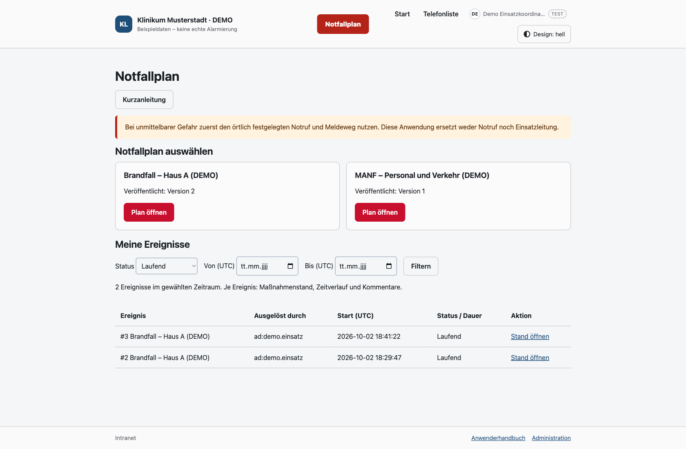
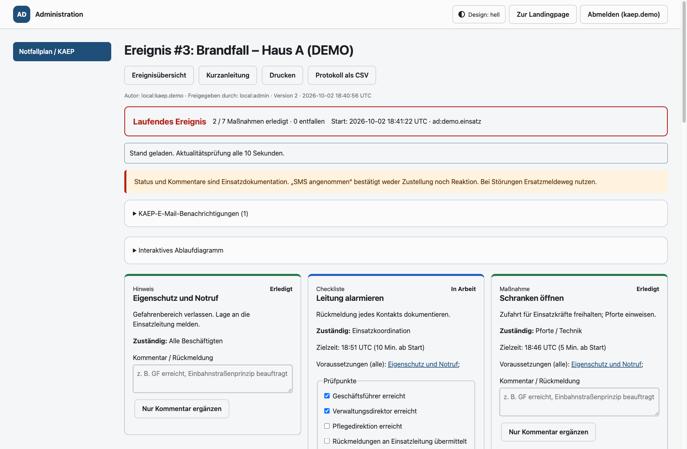
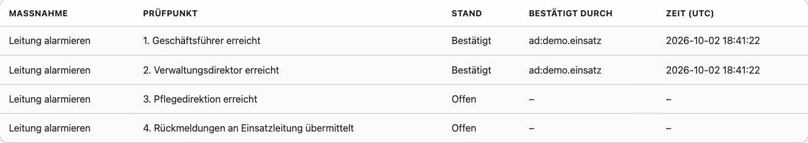
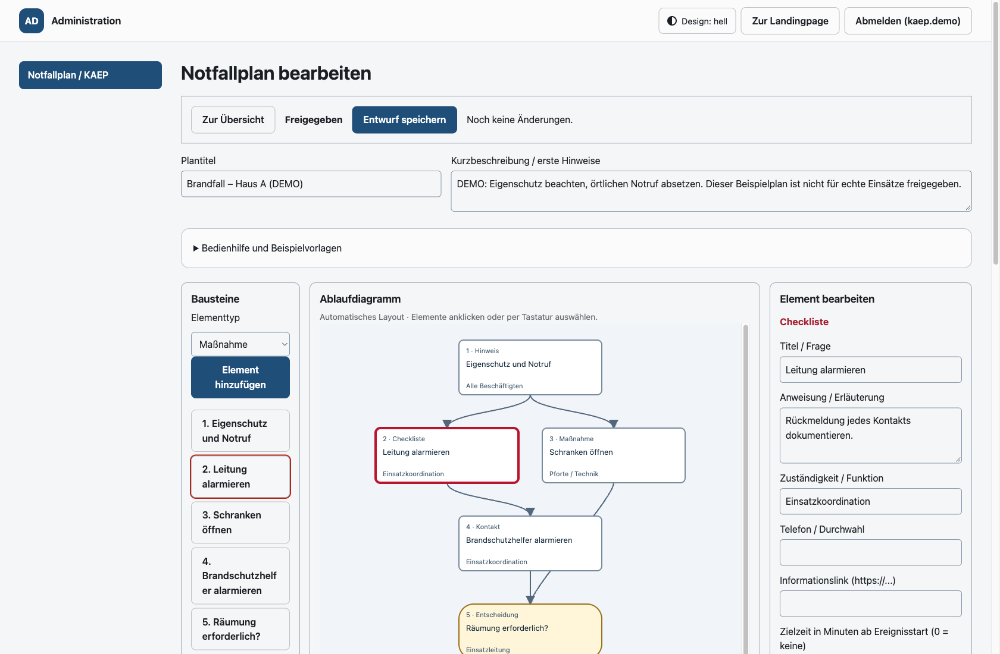
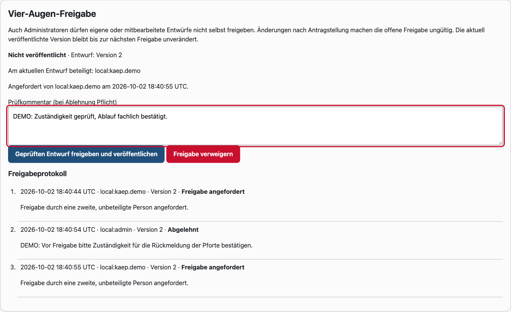
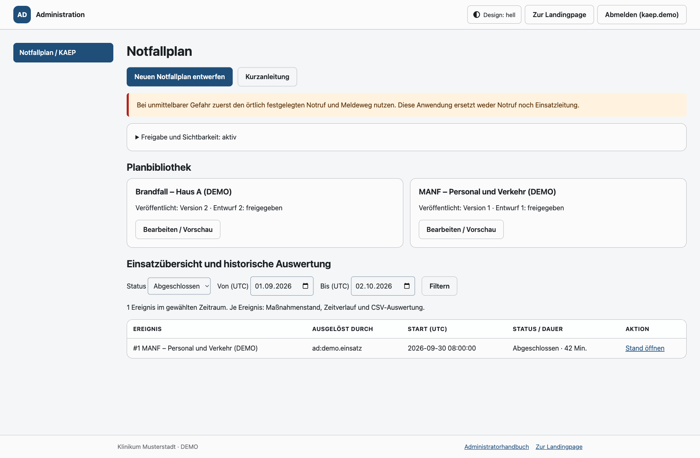

# Notfallplan: Anleitung für auslösende Benutzer und KAEP-Team

> **Im Ernstfall zuerst Menschen schützen und den örtlich festgelegten Notruf
> bzw. Meldeweg nutzen.** Die Anwendung unterstützt den Ablauf, ersetzt aber
> weder Notruf noch Einsatzleitung.
>
> **Alle Abbildungen sind Beispielgrafiken mit Demo-Daten.** Die dargestellten
> Abläufe, Kontakte, Namen und Zeiten sind keine verbindlichen Einsatzvorgaben.

## Schnellablauf für auslösende Benutzer

1. Mit dem eigenen Windows-Konto anmelden und den roten **Notfallplan**-Button
   in der Mitte der Kopfleiste öffnen.
2. Richtigen Plan wählen, Hinweise lesen und angezeigtes Konto prüfen.
3. Über HTTPS das **eigene AD-Kennwort** eingeben und **Jetzt Notfallereignis
   auslösen** wählen. Das lokale Adminpasswort funktioniert hier nicht.
4. Auf die Bestätigung mit Ereignisnummer warten. Fehlt sie, zuerst **Meine
   Ereignisse** prüfen – nicht vorschnell erneut auslösen.
5. Maßnahmen durchführen, Rückmeldungen speichern, erledigte Aufgaben abhaken.
6. SMS jeweils einzeln bestätigen. E-Mails an das KAEP-Team werden automatisch
   eingeplant; Fehler/fehlende Empfänger im Ereignis prüfen.
7. Nach Freigabe durch die Einsatzleitung das Ereignis begründet abschließen.

*Beispielgrafik mit Demo-Daten: Einstieg und veröffentlichte Pläne.*

## Maßnahmen sicher bearbeiten

Das Diagramm führt zur passenden Maßnahmenkarte. Dort stehen Anweisung,
Zuständigkeit, Telefon, Informationslink und ggf. eine Zielzeit.

| Anzeige / Aktion | Bedeutung |
| --- | --- |
| Offen | Noch nicht begonnen |
| In Arbeit | Bearbeitung läuft; Status speichern |
| Blockiert | Hindernis vorhanden; Ursache kommentieren und Einsatzleitung informieren |
| Erledigt | Durchführung bestätigt; anschließend nur noch Kommentare möglich |
| Wartet auf Vorgänger | Vorherige Maßnahme/Entscheidung muss zuerst erledigt werden |
| Entfällt | Nicht gewählter Entscheidungszweig |

Kommentare konkret formulieren: **„GF um 14:05 erreicht“**, **„Einbahnstraßenprinzip
beauftragt; Bestätigung der Pforte steht aus“**. „Nur Kommentar ergänzen“ verändert
keinen Status. „Status und Kommentar speichern“ übernimmt beides.
Jeder bestätigte Checklistenpunkt speichert die bestätigende Person und den
Zeitpunkt. In der **Checklisten-Auswertung** sind offene und bestätigte Punkte
einzeln sichtbar. Solange die Checkliste nicht erledigt ist, können Häkchen
zurückgenommen werden; auch diese Rücknahme bleibt im Protokoll und CSV erhalten.
Checklisten vor „Erledigt“ vollständig abhaken. Ja/Nein-Entscheidungen prüfen:
Nach dem Erledigen können sie nicht umgestellt werden.

*Beispielgrafik mit Demo-Daten: Bearbeitungsstand und Rückmeldungen.*

*Beispielgrafik mit Demo-Daten: Prüfpunkt, Status, bestätigende Person und Zeitpunkt.*

**Zeitangaben:** Protokolle und Zielzeiten der klassischen Ereignisansicht werden
in UTC angezeigt. Deutschland: Winterzeit = UTC +1 Stunde, Sommerzeit = UTC +2
Stunden. Das KAEP-Dashboard zeigt und erfasst Zeiten dagegen in der Ortszeit des
Geräts. Zielzeiten beginnen mit dem Ereignisstart; eine Überschreitung alarmiert
nicht automatisch.

## SMS und E-Mail nicht verwechseln

**SMS:** Empfänger und Nachricht lesen → „SMS jetzt separat bestätigen und senden“
→ Bestätigung geben → Ergebnis prüfen. Erst dann mit der nächsten Maßnahme
fortfahren. Eine Gateway-Annahme beweist weder Zustellung noch Reaktion.

Bei Fehler/unklarem Ergebnis **nicht wiederholt senden**. Pro SMS-Maßnahme und
Ereignis lässt die Anwendung nur einen Versandversuch zu. Gateway-Verantwortliche
kontaktieren, Ersatzmeldeweg nutzen und im Kommentar dokumentieren. Ein solcher
Kommentar ist nötig, um ohne erfolgreiche Gateway-Annahme „Erledigt“ zu setzen.

**E-Mail:** Automatische Information an das KAEP-Team beim Start. Im Abschnitt
„KAEP-E-Mail-Benachrichtigungen“ prüfen, ob Empfänger vorhanden sind und der
SMTP-Server die Nachrichten angenommen hat. E-Mail ist kein Notruf; bei Problemen
das Team über den festgelegten Meldeweg verständigen.

## Aktualität und Abschluss

Der Stand wird alle zehn Sekunden geprüft. Bei ungespeicherten Eingaben erfolgt
kein automatisches Neuladen. Vor „Aktuellen Stand laden“ Kommentare sichern.
Ein Änderungskonflikt überschreibt nichts: aktuellen Stand prüfen und Änderung
erneut eintragen. Bei technischem Fehler und unklarem Ergebnis erst das Protokoll
prüfen, bevor erneut gespeichert wird.

Eine Verbindungswarnung bedeutet: **Angezeigter Stand kann veraltet sein.**
Papierplan/Telefon/Ersatzprotokoll verwenden. Nach Wiederherstellung klar
gekennzeichnet nachdokumentieren.

„Ereignis abschließen“ ist unwiderruflich. Bei offenen Maßnahmen oder ungeklärtem
SMS-Versand ist eine Begründung Pflicht. Danach bleiben Plan, Maßnahmen und
Protokoll lesbar, aber nicht mehr bearbeitbar.

## KAEP-Team: Vorbereitung ohne Programmierung

1. **Administration → Notfallplan / KAEP** öffnen. Nur dieser Adminbereich ist
   für KAEP-Konten freigegeben.
2. **Neuen Notfallplan entwerfen (neuer Tab)** wählen. Der Editor öffnet sich
   in einem eigenen Browser-Tab im Stil einer Office-Anwendung: oben das
   Menüband mit den Reitern **Start**, **Ablauf & Verbindungen**,
   **Prüfen & Freigabe** und **Ansicht**, darunter links die Schritte, in der
   Mitte das Ablaufdiagramm, rechts die Eigenschaften des gewählten Schritts.
   Beim Öffnen erscheint zuerst ein Overlay für **Plantitel** und
   **Kurzbeschreibung / erste Hinweise**; erst danach ist die Bearbeitung
   möglich (später änderbar über **Plan-Angaben**, *Abbrechen* schließt den
   Editor).
   Optional im Reiter **Start** Beispiel Brandfall/MANV übernehmen; örtliche
   Vorgaben vollständig einarbeiten.
3. Schritte hinzufügen: Maßnahme, Kontakt, Entscheidung, Checkliste, Hinweis,
   SMS – per Klick auf den Baustein oder indem der Baustein auf das Diagramm
   gezogen wird. Kurze eindeutige Titel, Zuständigkeiten und verständliche
   Anweisungen eintragen. **Rückgängig/Wiederholen** (Strg+Z / Strg+Y) macht
   Bearbeitungsschritte ungeschehen.
4. Im Diagramm oder in der Liste einen Schritt auswählen. Rechts die
   Voraussetzungen (vorherige Schritte) und Bedingungen anhaken; die
   Klartext-Zusammenfassung zeigt, wann der Schritt startet. Die Anordnung
   entsteht automatisch; Schritte können dupliziert oder mit Nach oben/unten
   verschoben werden, sofern Verbindungen gültig bleiben. Zoom, Suche und
   Bereiche finden sich in den Reitern **Ansicht** bzw. **Ablauf & Verbindungen**.
5. **Alle Vorgänger (UND)**: alle ausgewählten Aufgaben müssen erfüllt sein.
   **Mindestens einer (ODER)**: mindestens ein zutreffender Vorgänger genügt.
   Für alternative Entscheidungen Ja-/Nein-Verbindungen nutzen und danach ggf.
   mit ODER zusammenführen. Ohne Vorgänger ist ein Element sofort verfügbar.
6. SMS-Empfänger festlegen: **Alarmvorlage (Gruppe)** auswählen und Empfänger/Text
   kontrollieren – fehlende Vorlagen durch Administratoren anlegen lassen; das Team
   hat keinen Gateway-Zugriff. Oder **Einzelne Rufnummern** wählen, bis zu 20
   Rufnummern (eine pro Zeile) und einen SMS-Text eintragen (Zähler `x/255`).
   Schaltflächen setzen Textbausteine wie Name des Notfallplans, Datum/Uhrzeit der
   Auslösung oder Schritttitel ein; sie werden beim Auslösen ersetzt.
7. **Plan prüfen** (Reiter **Prüfen & Freigabe**) zeigt unvollständige Felder
   und fehlende Verbindungen direkt an. Dann **Entwurf speichern** (Strg+S),
   den gespeicherten Entwurf neu laden und über **Freigabe & Protokoll** die
   **Freigabe anfordern**. Das Speichern allein veröffentlicht niemals.
8. Eine zweite, unbeteiligte Person prüft den Entwurf und wählt **Geprüften
   Entwurf freigeben und veröffentlichen**. Auch Administratoren dürfen
   selbst bearbeitete Pläne nicht selbst freigeben.
9. Bei Mängeln **Freigabe verweigern** und einen konkreten Prüfkommentar angeben.
   Der Autor liest den Kommentar im Freigabeprotokoll, korrigiert den Entwurf,
   speichert und reicht ihn erneut ein.

**Optional vor dem Speichern:** **Live-Vorschau** (Titelleiste oder Alt+Umschalt+V) öffnen und den Tab
auf den zweiten Monitor ziehen. Auch ungespeicherte Änderungen erscheinen dort
live, ohne Neuladen oder Speichern des Editors. **Ablauf jetzt simulieren** erlaubt
das Durchspielen der Maßnahmen einschließlich Entscheidungen, Checklisten,
Kommentaren und SMS-Bestätigung – ohne echtes Ereignis, AD-Kennwort, SMS oder
E-Mail. Der Hinweis **LIVE-VORSCHAU / SANDBOX** bleibt sichtbar.
Textänderungen erhalten den Testfortschritt; Änderungen an Ablaufstruktur,
Prüfpunkten oder SMS-Vorlagen setzen nur die Simulation zurück.
**Simulation zurücksetzen** beginnt erneut bei der Planansicht.
Bei einer Verbindungswarnung Editor offen lassen bzw. Vorschau dort erneut öffnen.
Die Vorschau ersetzt kein Speichern des Entwurfs.

*Beispielgrafik mit Demo-Daten: Menüband, Schritte, automatisches Diagramm, Eigenschaften und Statusleiste.*

*Beispielgrafik mit Demo-Daten: Freigabeanforderung, Ablehnung mit Kommentar und zweite Freigabe.*

**Wichtig:** Alle Mitautoren und die einreichende Person sind von der Freigabe
ausgeschlossen. Bei Änderungen nach Antragstellung ist ein neuer Antrag nötig.
Die zuvor veröffentlichte Planversion bleibt während Entwurf und Prüfung live.
Bestehende Ereignisse behalten ihre Planversion und die dort genannten
Autoren/Freigeber. Diese Angaben stehen dezent unter dem Plantitel.
Zum sofortigen Sperren **Veröffentlichung zurückziehen** wählen. Eine erneute
Veröffentlichung braucht wiederum eine zweite Freigabe.
Die Freigabegruppe und der Aktivierungsschalter steuern den
Benutzerzugriff getrennt von der Planveröffentlichung.

## KAEP-Team: laufende Lage und historische Auswertung

In der Einsatzübersicht **Laufend** filtern und ein Ereignis öffnen. KAEP und
Administratoren sehen alle Ereignisse, Maßnahmenstände und Kommentare und können
mitarbeiten. Auslösende Benutzer sehen nur ihre eigenen Ereignisse.
Mitglieder der optionalen Auslösegruppe sehen und bearbeiten gemeinsam die laufenden
Ereignisse ihrer Gruppe;
abgeschlossene Ereignisse und das KAEP-Dashboard bleiben ihnen verborgen.

Für längere Einsätze das **KAEP-Dashboard** (Fußzeile oder Ereignis) auf Tablets
und einem TV öffnen: gemeinsames Live-Lagebild, Zuständigkeit/Priorität/Zielzeit
je Maßnahme, Lageübersicht mit nächster Besprechung, Einsatz- und Bereichsleitungen
mit geplanter Ablösung, Journal mit Schichtübergaben sowie **Zeitplan und
Wiedervorlagen** für Rückrufe und Prüfpunkte der nächsten Stunden und Tage. Bei
jeder Schichtübergabe: Lageübersicht aktualisieren, Leitung mit Ablösezeit
eintragen, Übergabenotiz ins Journal schreiben und offene Wiedervorlagen durchgehen.
Alle Zeiten dort in Ortszeit des Geräts; keine automatische Erinnerung bei Fälligkeit.

Für die Nachbereitung **Abgeschlossen**, Von-/Bis-Datum (UTC) wählen. Im Ereignis
Dauer, offene/erledigte/entfallene Maßnahmen, Zeitverlauf, Entscheidungen und
Versandergebnisse prüfen. **Protokoll als CSV** exportiert den Verlauf,
**Drucken** liefert eine Einsatzdokumentation.

*Beispielgrafik mit Demo-Daten: historische Ereignisse mit Zeitraumfilter.*

## Störungen: sofort richtig handeln

| Störung | Handlung |
| --- | --- |
| Kein roter Button | Windows-Anmeldung prüfen. KAEP/Admin prüft Aktivierung, AD-Gruppe und AD-Synchronisation. Notfall nicht verzögern. |
| Kennwort abgelehnt / AD ausgefallen | Kein Ereignis gestartet. Eigenes AD-Kennwort prüfen, ggf. Ersatzmeldeweg nutzen. Nach fünf Versuchen in fünf Minuten warten. |
| SMS unklar / fehlgeschlagen | Kein weiterer Klick; Gateway prüfen, alternativ alarmieren, dokumentieren. |
| E-Mail fehlt | KAEP-Team anderweitig informieren. Admin prüft SMTP, Mail-Dienst und E-Mail-Adressen. |
| Verbindung fehlt / Stand veraltet | Papierplan und Ersatzdokumentation nutzen; nicht auf veraltete Statusanzeigen verlassen. |

## Vor dem Ernstfall

Anleitung und fachlich freigegebene Pläne ausdrucken. Örtliche Notrufnummern,
Ersatzmeldewege und verantwortliche Funktionen ergänzen und griffbereit halten.
Zugriffsrechte, Kennwortbestätigung, E-Mail und SMS mit eindeutig bezeichneten
Übungen testen. Keine echten Empfänger versehentlich alarmieren.

Technische Einrichtung und Betrieb: [Notfallplan-Dokumentation](notfallplan.md).
