# Office im Intranet (Nextcloud + Euro-Office)

Die optionale Office-Erweiterung stellt Dokumentbearbeitung im Browser bereit:
**Nextcloud** als Dateiablage und Oberfläche, **Euro-Office DocumentServer**
als Editor (Text, Tabellen, Präsentationen) und der offizielle
Nextcloud-Connector `eurooffice`. Alles läuft als Container neben dem Intranet
und ist über dieselbe Adresse erreichbar – ohne zusätzlichen Reverse-Proxy.

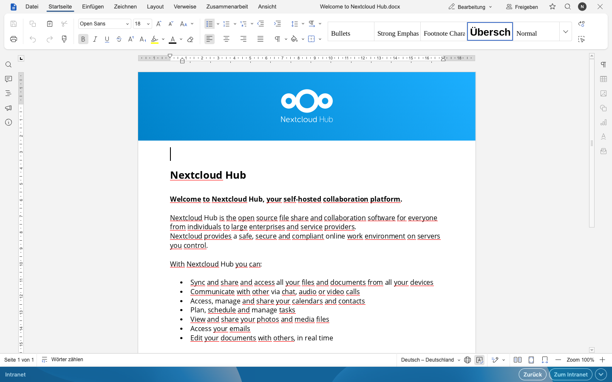

---

## 1. Einrichtung per Einzeiler

```bash
./scripts/office-setup.sh                 # Office einrichten und starten
./scripts/office-setup.sh --with-ad       # zusätzlich Nextcloud an das AD anbinden
./scripts/office-setup.sh --with-ad --with-sso   # plus automatische Windows-Anmeldung (NTLM)
```

Das Skript kann beliebig oft ausgeführt werden. Es

1. legt `.env` aus `.env.example` an, falls sie fehlt (mit Zufallspasswörtern),
2. erzeugt fehlende Secrets unter `./secrets/` (Verzeichnis `0700`, nie versioniert),
3. setzt `OFFICE_ENABLED=true`, `COMPOSE_PROFILES=office`, die Image-Versionen
   und den Sicherungspfad in der `.env`,
4. baut bzw. startet alle Container und wartet, bis Nextcloud bereit ist.

Weitere Optionen: `--no-start` (nur konfigurieren), `--no-encryption`
(Sicherungen unverschlüsselt). Anschließend im Adminbereich unter **Office**
die Kachel anlegen und Rechte vergeben (siehe Abschnitt 4).

---

## 2. Architektur

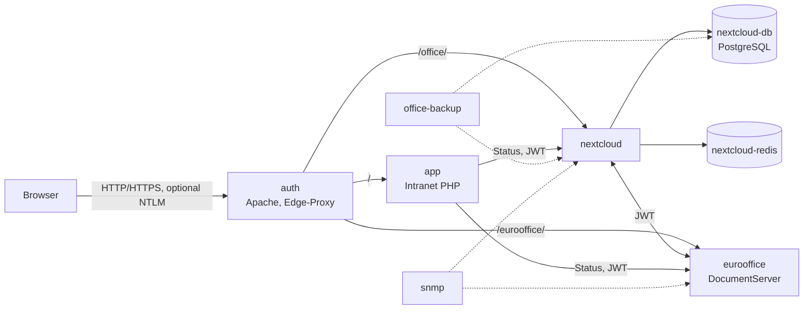
```mermaid
flowchart LR
    B[Browser] -->|HTTP/HTTPS, optional NTLM| A[auth<br/>Apache, Edge-Proxy]
    A -->|/| APP[app<br/>Intranet PHP]
    A -->|/office/| NC[nextcloud]
    A -->|/eurooffice/| DS[eurooffice<br/>DocumentServer]
    NC --> PG[(nextcloud-db<br/>PostgreSQL)]
    NC --> R[(nextcloud-redis)]
    NC <-->|JWT| DS
    APP -->|Status, JWT| NC
    APP -->|Status, JWT| DS
    BK[office-backup] -.-> NC
    BK -.-> PG
    SNMP[snmp] -.-> NC
    SNMP -.-> DS
```

| Dienst | Aufgabe |
| --- | --- |
| `auth` | Einziger Einstiegspunkt (Port `APP_PORT`). Leitet `/office/` an Nextcloud und `/eurooffice/` an den DocumentServer weiter, übernimmt optional die NTLM-Anmeldung und entfernt gefälschte `X-Remote-User`-Header. Ist Office nicht erreichbar, erscheint die Seite `/office-nicht-verfuegbar`. |
| `nextcloud`, `nextcloud-cron` | Offizielles Image `nextcloud` (Apache). Ein Hook richtet bei jedem Start Pfade, vertrauenswürdige Domains, den Connector, AD und SSO ein (idempotent). |
| `eurooffice` | Offizielles Image `ghcr.io/euro-office/documentserver`, abgesichert per JWT. |
| `nextcloud-db`, `nextcloud-redis` | PostgreSQL und Redis (Passwort aus Secret), nur im internen Netz. |
| `office-backup` | Sicherung/Wiederherstellung, vom Adminbereich aus steuerbar. |

**Warum kein zusätzlicher `reverse`-/`entry`-Container?** Die NTLM-Anmeldung ist
an die TCP-Verbindung gebunden. Ein weiterer Proxy davor würde sie brechen. Der
vorhandene `auth`-Container ist deshalb der Reverse-Proxy für alle Apps; die
Konfiguration bleibt beim Einzeiler oben.

### Einstieg und Fußzeile

- Die Kachel ruft `/office-starten` auf. Das Intranet prüft die Berechtigung
  und zeigt die **Office-Apps** an, die der angemeldete Benutzer erhält
  (siehe Abschnitt 5a). Ein Klick auf eine App (`/office-app?app=…`) prüft die
  Freigabe erneut und leitet weiter.
- Nextcloud und Euro-Office zeigen eine dezente **Intranet-Fußzeile** mit
  „Zum Intranet“ und „Zurück“. Sie ist im Ruhezustand transparent, wird bei
  Mauszeiger, Tastaturfokus oder Antippen deckend und lässt sich einklappen.
  Im Editor wird der Platz reserviert, sodass die Statusleiste sichtbar bleibt.
- Direkter Aufruf von `/office/` ohne Intranet: wahlweise erlaubt (mit
  Fußzeile) oder einmalig über den Intranet-Einstieg geleitet.

| Dateien mit Fußzeile | Eingeklappte Fußzeile |
| --- | --- |
| 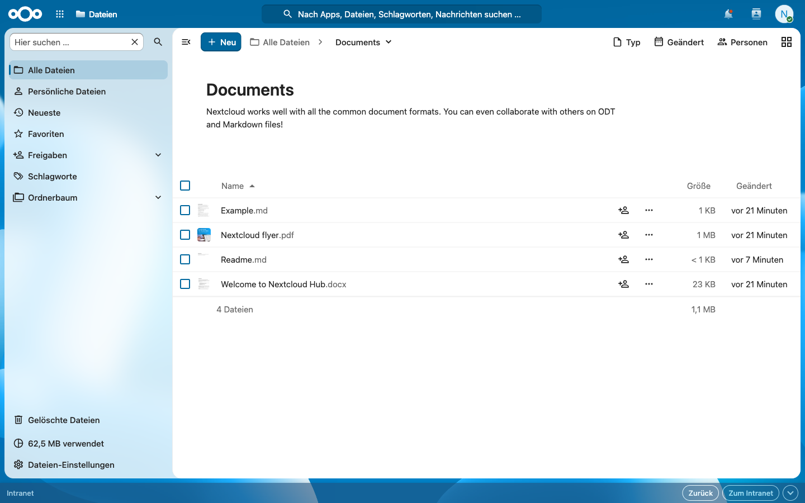 | 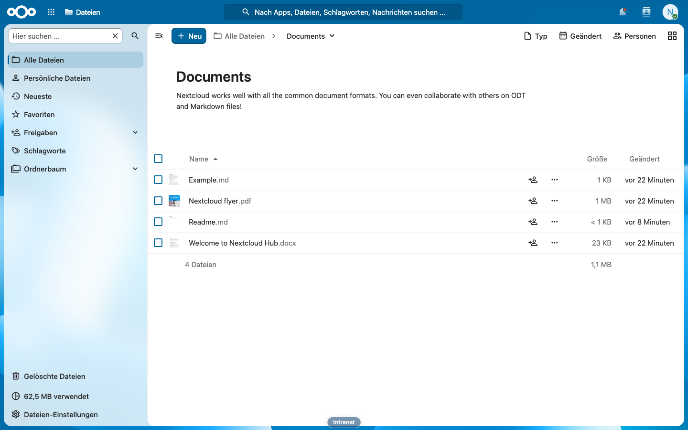 |

---

## 3. Aktualisierung aus den offiziellen Quellen

```bash
./scripts/office-update.sh --check                  # verfügbare Versionen anzeigen
./scripts/office-update.sh                          # Connector-App + Images der festgelegten Versionen
./scripts/office-update.sh --eurooffice v9.3.5 --nextcloud 34.0.5-apache   # neue Versionen festlegen
```

| Komponente | Quelle |
| --- | --- |
| DocumentServer | `ghcr.io/euro-office/documentserver` ([Releases](https://github.com/Euro-Office/DocumentServer/releases)) |
| Nextcloud | offizielles Docker-Hub-Image `nextcloud` |
| Connector | Nextcloud-App-Store, App `eurooffice` |

Vor jedem Update wird automatisch gesichert (`--no-backup` überspringt das).
Die Versionen stehen in `.env` (`EUROOFFICE_IMAGE_TAG`, `NEXTCLOUD_IMAGE_TAG`)
und sind damit reproduzierbar. Nextcloud nur **eine Hauptversion nach der
anderen** aktualisieren; `occ upgrade` führt das offizielle Image selbst aus.

---

## 4. Rechte über AD-Gruppen und Anmeldung

### Gruppen-Pfad in der AD-Konfiguration

Unter **Administration → Active Directory → Gruppen für die Rechtevergabe**
werden ein oder mehrere Pfade (Base DN, ein Pfad je Zeile) angegeben, unter
denen die relevanten Gruppen liegen. Die AD-Synchronisation übernimmt diese
Gruppen samt ihrer – auch verschachtelten – Mitglieder
(`LDAP_MATCHING_RULE_IN_CHAIN`) in die lokale Datenbank. Ohne Pfad werden keine
Gruppen übernommen. Schlägt nur der Gruppenabruf fehl, bleibt der bisherige
Gruppenstand erhalten.

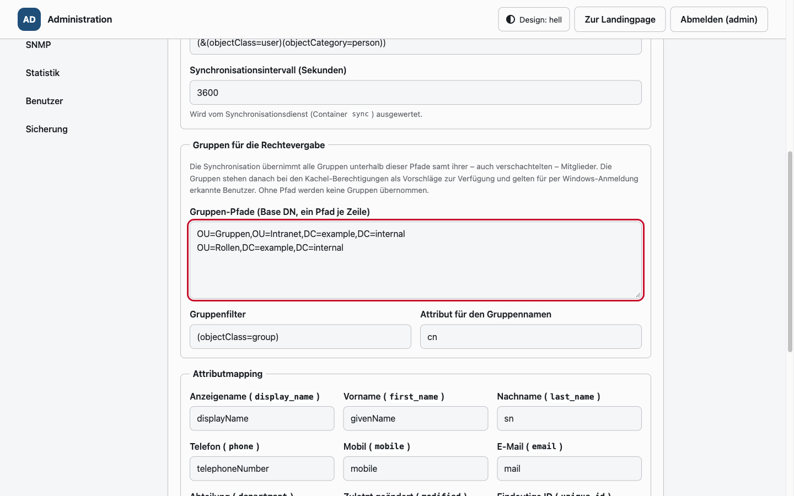

Gleichwertig per Umgebung: `LDAP_GROUP_BASE_DN` (mehrere Pfade mit `;`),
`LDAP_GROUP_FILTER` (Standard `(objectClass=group)`),
`LDAP_GROUP_NAME_ATTRIBUTE` (Standard `cn`). Nextcloud verwendet denselben Pfad
als Gruppen-Basis (abweichend: `NEXTCLOUD_LDAP_GROUPS_BASE_DN`).

### Kachel-Berechtigungen mit Vorschlägen

Unter **Office → Berechtigungen** (bzw. Navigation → Berechtigungen) werden
Benutzer und AD-Gruppen zugeordnet. Beim Tippen eines Gruppennamens wird der
Rest direkt im Feld ergänzt (übernehmen mit <kbd>Tab</kbd>) und eine Liste
passender Gruppen erscheint unterhalb des Felds (<kbd>↑</kbd>/<kbd>↓</kbd>,
<kbd>Enter</kbd>, <kbd>Esc</kbd>). Die Vorschläge stammen **ausschließlich aus
dem synchronisierten Datenbestand** sowie bereits vergebenen Gruppennamen – es
erfolgt keine Live-Abfrage des AD.

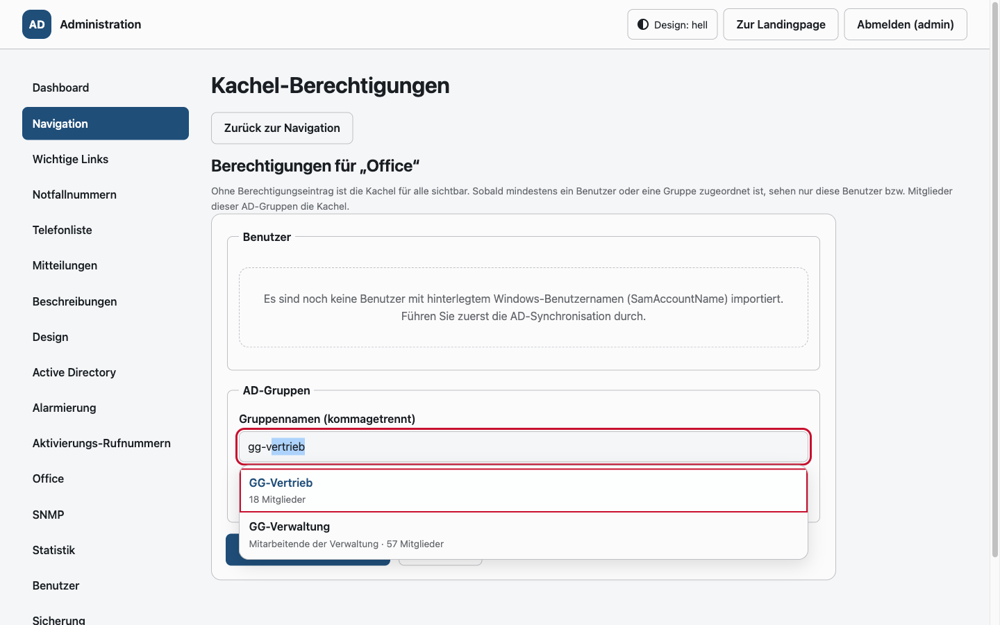

Ohne Eintrag ist die Kachel für alle sichtbar; sobald ein Benutzer oder eine
Gruppe eingetragen ist, sehen nur diese die Kachel und dürfen `/office-starten`
aufrufen.

### Anmeldung

- **Intranet:** Bei aktivem SSO (`SSO_ENABLED=true`) liefert `auth` den
  Windows-Anmeldenamen. Das Intranet ordnet ihn über den synchronisierten
  `sAMAccountName` dem Telefonbucheintrag zu und ergänzt die Gruppen aus dem
  synchronisierten Bestand.
- **Nextcloud:** Mit `--with-ad` nutzt Nextcloud `user_ldap` (gleiche
  `LDAP_*`-Werte). Mit `--with-sso` meldet `user_saml` (Umgebungsvariablen-Modus)
  den per NTLM erkannten Benutzer automatisch an; `…/login?direct=1` bleibt als
  Rückfall für Nicht-Domänen-Clients.
- Optional in Nextcloud: `NEXTCLOUD_LDAP_ALLOWED_GROUPS` (Anmeldung nur für
  Mitglieder), `NEXTCLOUD_LDAP_ADMIN_GROUP` (Nextcloud-Admins),
  `NEXTCLOUD_OFFICE_GROUPS` (Bearbeitung mit Euro-Office nur für diese Gruppen).

---

## 5. Office-Kachel gestalten

Unter **Office → Kachel im Intranet** lassen sich Titel, Kurz- und
Detailbeschreibung, Icon, Hintergrundfarbe und Deckkraft anpassen. Die
Vorschau rechts nutzt das Stylesheet der Landingpage und aktualisiert sich
beim Tippen; der Beispielzustand (verfügbar, eingeschränkt, nicht verfügbar)
ist umschaltbar. Weitere Optionen (Sortierung, Zugangscode) bietet die
Navigation.

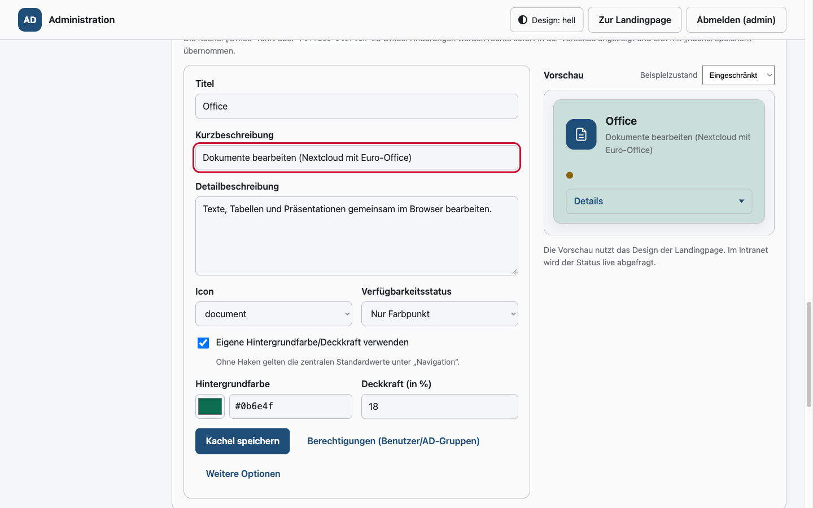

**Verfügbarkeitsstatus** auf der Kachel:

| Einstellung | Wirkung |
| --- | --- |
| Punkt und Text | Farbpunkt und „Office: Verfügbar“ usw. |
| Nur Farbpunkt | Nur der Punkt; der Text bleibt als Tooltip und für Screenreader erhalten |
| Nur bei Störungen | Nichts bei voller Verfügbarkeit, sonst Punkt und Text |
| Ausblenden | Kein Status, keine Statusabfrage |

| Standard | Nur Farbpunkt |
| --- | --- |
| 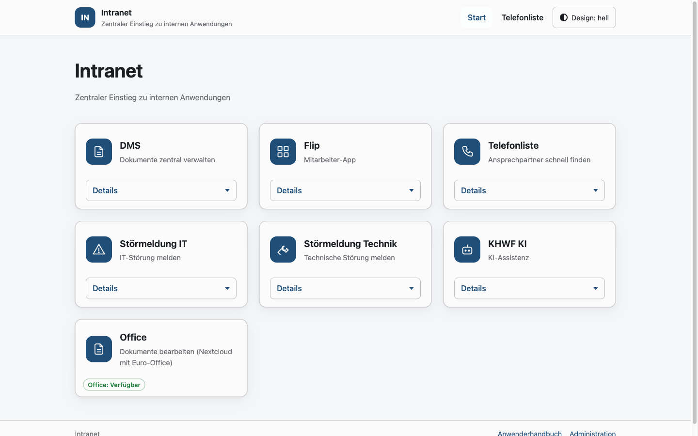 | 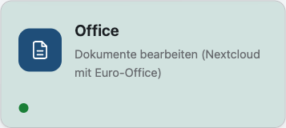 |

---

## 5a. Office-Apps und App-Pakete

Nach Klick auf die Office-Kachel erscheint eine Übersicht der einzelnen Apps:

| Office-Kachel (angemeldet) | Office-Apps des Benutzers |
| --- | --- |
|  | 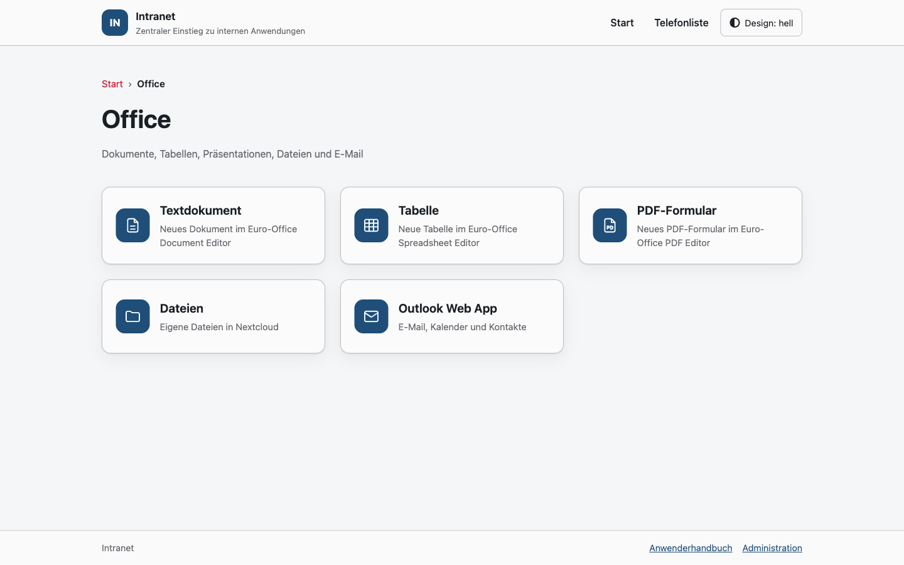 |

| App | Ziel |
| --- | --- |
| Textdokument | Euro-Office-Webapp `documenteditor` |
| Tabelle | Euro-Office-Webapp `spreadsheeteditor` |
| Präsentation | Euro-Office-Webapp `presentationeditor` |
| PDF-Formular | Euro-Office-Webapp `pdfeditor` |
| Dateien | eigene Dateien in Nextcloud (`/office/index.php/apps/files/`) |
| Outlook Web App | im Adminbereich hinterlegter Link (öffnet in neuem Tab) |

Die Editoren stammen aus [Euro-Office/web-apps](https://github.com/Euro-Office/web-apps)
und werden vom DocumentServer (`/eurooffice/web-apps/…`) ausgeliefert. Gestartet
wird über den Nextcloud-Connector `eurooffice`
(`/office/index.php/apps/eurooffice/new?name=…&dir=/`): Er legt ein leeres
Dokument in den eigenen Dateien an und öffnet es direkt in der passenden
Webapp. So sind Speicherort, Berechtigungen und JWT-Absicherung dieselben wie
beim Öffnen aus Nextcloud. Die Diagnose prüft zusätzlich, ob die Webapps
ausgeliefert werden (Komponente „Euro-Office-Webapps“, nicht kritisch).

| Textdokument | Tabelle | Dateien |
| --- | --- | --- |
| 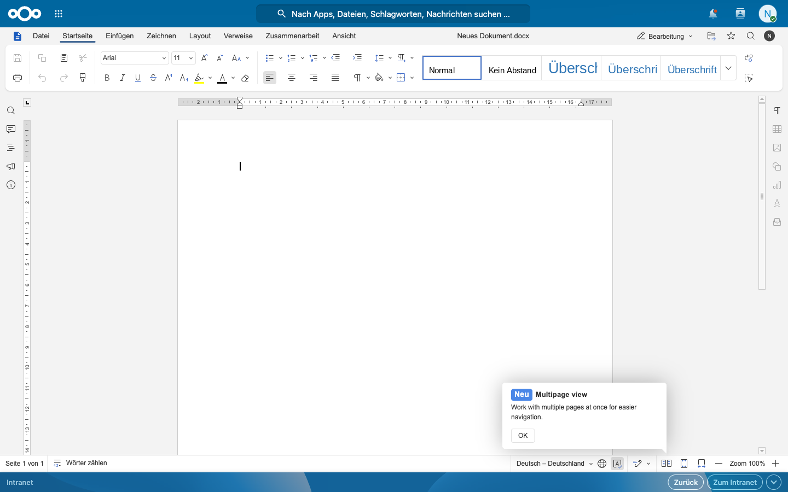 | 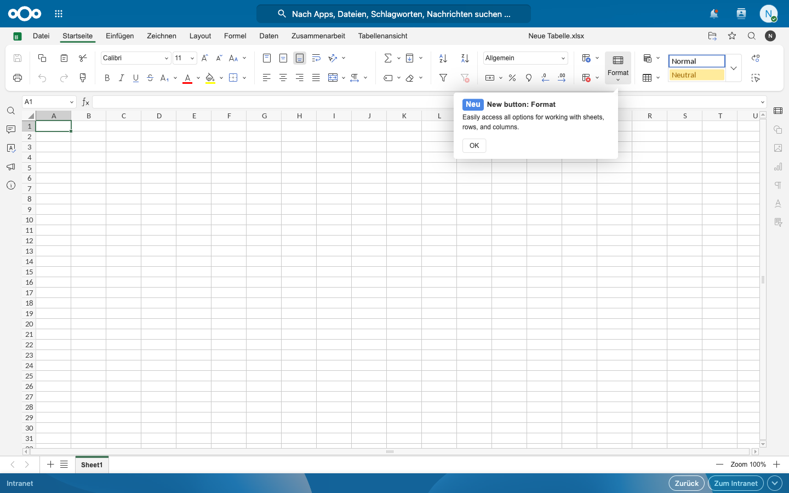 | 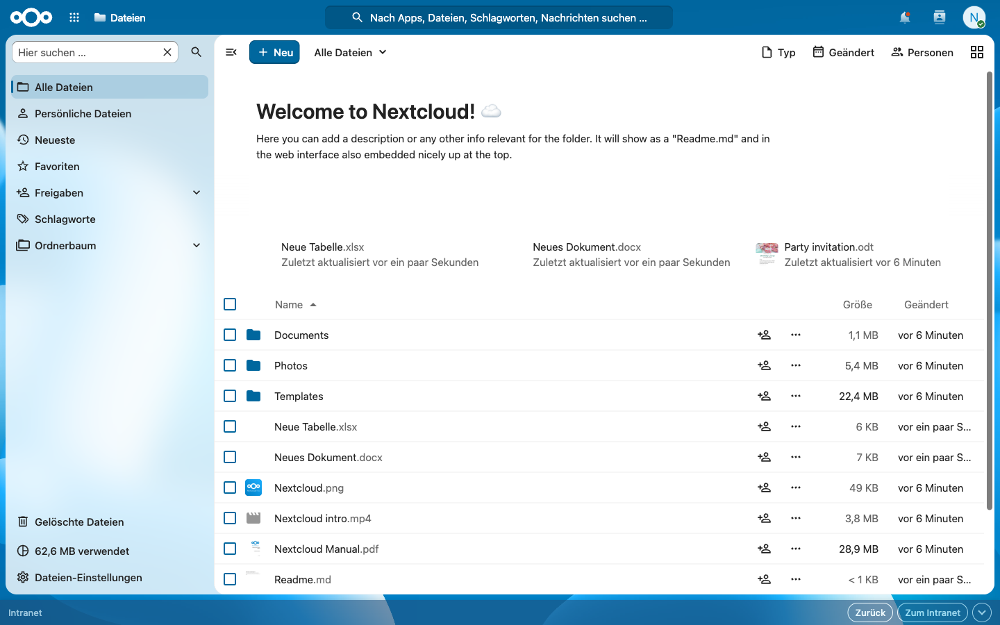 |

**Berechtigungen (Office → Office-Apps und Berechtigungen, `/admin/office/apps`):**

- Je App lassen sich AD-Gruppen direkt freigeben (mit Vorschlägen aus dem
  synchronisierten Bestand).
- **App-Pakete** fassen mehrere Apps zusammen (z. B. „Office Basis“ =
  Textdokument, Tabelle, Dateien) und werden ebenfalls AD-Gruppen zugeordnet.
- Ein Benutzer sieht alle Apps, die einer seiner Gruppen direkt oder über ein
  Paket freigegeben sind. Die Spalte „Wirksam für“ zeigt die Summe.
- **Ohne Zuordnung ist eine App für niemanden sichtbar.**
- **Nicht angemeldete Nutzer** (kein SSO-Benutzer) erhalten keine Apps; die
  Office-Kachel wird für sie – wie für alle ohne freigegebene App – ausgeblendet.
- „Outlook Web App“ erscheint nur, wenn ein gültiger http(s)-Link hinterlegt ist.
- Die Kachel-Berechtigungen der Navigation gelten zusätzlich.

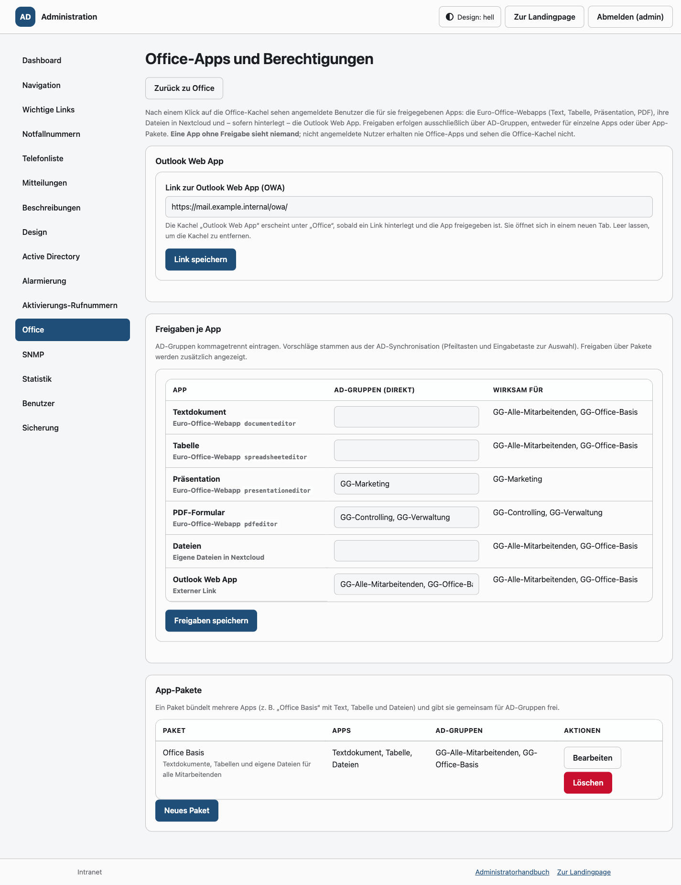

| App-Paket bearbeiten | Nicht angemeldet: keine Office-Kachel |
| --- | --- |
| 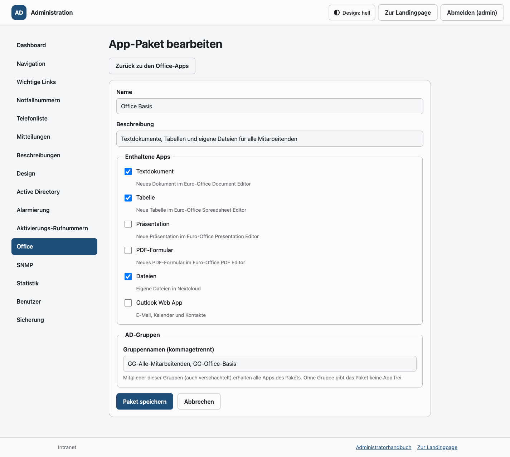 | 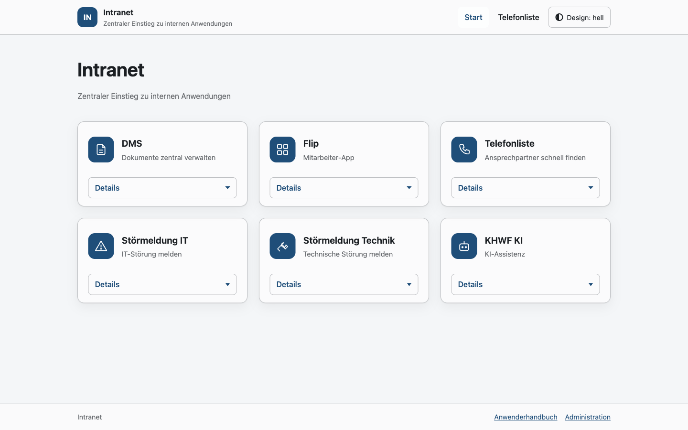 |

Im Beispiel gehört der Benutzer zu `GG-Office-Basis` und `GG-Controlling`: Er
erhält Textdokument, Tabelle und Dateien über das Paket „Office Basis“, das
PDF-Formular direkt über `GG-Controlling` und die Outlook Web App; die
Präsentation (nur `GG-Marketing`) fehlt.

Hinweis: Die App-Freigaben steuern, was im Intranet angeboten wird. Wer auf
Nextcloud zugreifen darf, regeln weiterhin `NEXTCLOUD_LDAP_ALLOWED_GROUPS` und
`NEXTCLOUD_OFFICE_GROUPS` (Abschnitt 4).

---

## 6. Adminbereich „Office“

| Bereich | Inhalt |
| --- | --- |
| Status | Gesamtzustand, letzte Prüfung, „Jetzt prüfen“ |
| Diagnose | Nextcloud, DocumentServer (inkl. JWT-Prüfung), Euro-Office-Webapps, PostgreSQL, Redis, Connector |
| Fußzeile und Einstieg | Text, Transparenz, Logo, „Zurück“, Ziel „Zum Intranet“, direkter Aufruf |
| Vorschau der Fußzeile | Live-Vorschau mit demselben Stylesheet/Skript wie in Nextcloud |
| Kachel im Intranet | Gestaltung, Status-Darstellung, Berechtigungen |
| Office-Apps | Link zur Outlook Web App, Freigaben je App (AD-Gruppen), App-Pakete ([Abschnitt 5a](#5a-office-apps-und-app-pakete)) |
| Sicherung | Sicherung anstoßen, vorhandene Sicherungen, Aufbewahrung |

| Status | Diagnose |
| --- | --- |
| 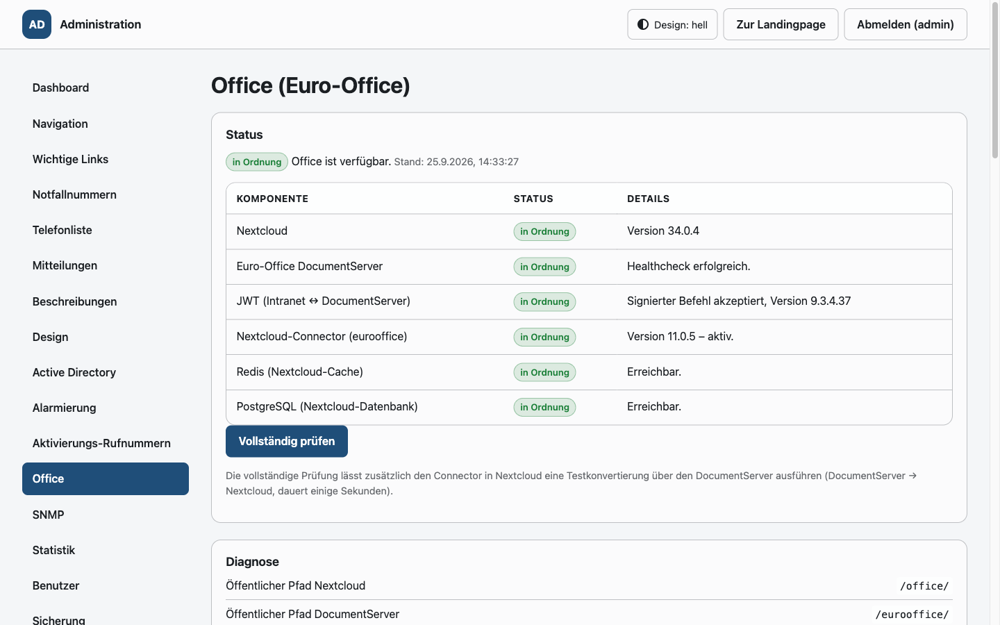 | 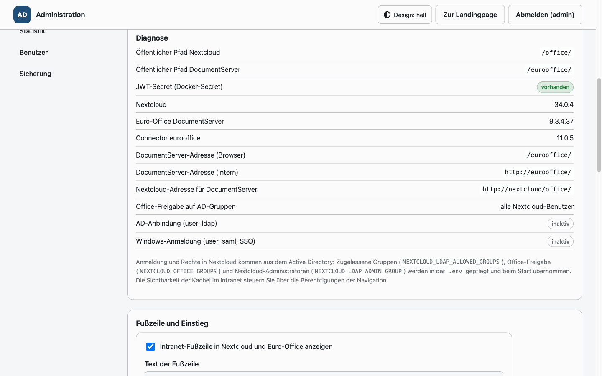 |
| 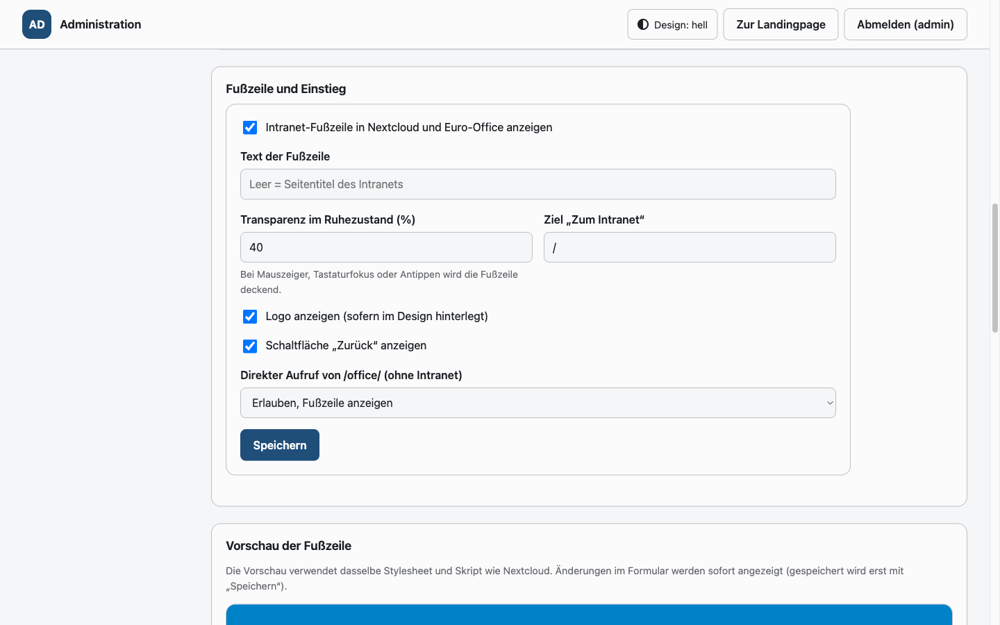 | 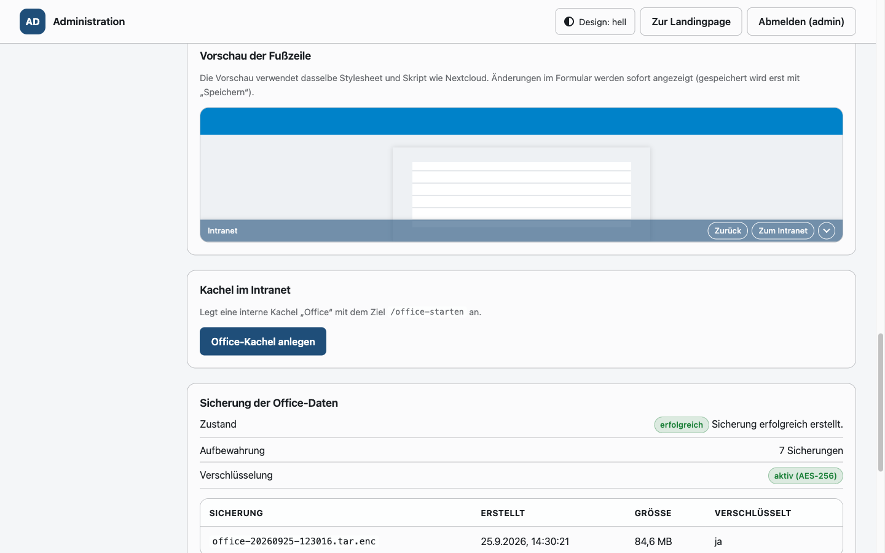 |

---

## 7. Sicherung und Wiederherstellung

```bash
./scripts/office-backup.sh                                   # sofort sichern
./scripts/office-restore.sh                                  # vorhandene Sicherungen anzeigen
./scripts/office-restore.sh office-20260101-020000.tar.enc   # wiederherstellen
./scripts/office-restore.sh office-….tar.enc --with-intranet # inkl. Intranet-Datenbank/-Dateien
```

- Gesichert werden Nextcloud (Konfiguration, Apps, Daten), PostgreSQL-Dump,
  DocumentServer-Daten sowie Datenbank und Dateien des Intranets. Letztere
  werden nur mit `--with-intranet` zurückgespielt.
- Während der Sicherung ist Nextcloud kurz im Wartungsmodus.
- Archive werden mit AES-256 verschlüsselt (Passphrase im Secret
  `office_backup_passphrase` – **getrennt aufbewahren**, ohne sie ist keine
  Wiederherstellung möglich).
- Ziel `OFFICE_BACKUP_DIR` (Standard `./backups`), Aufbewahrung
  `OFFICE_BACKUP_RETENTION` (Anzahl), tägliche Sicherung zur Stunde
  `OFFICE_BACKUP_SCHEDULE_HOUR` (leer = nur manuell).

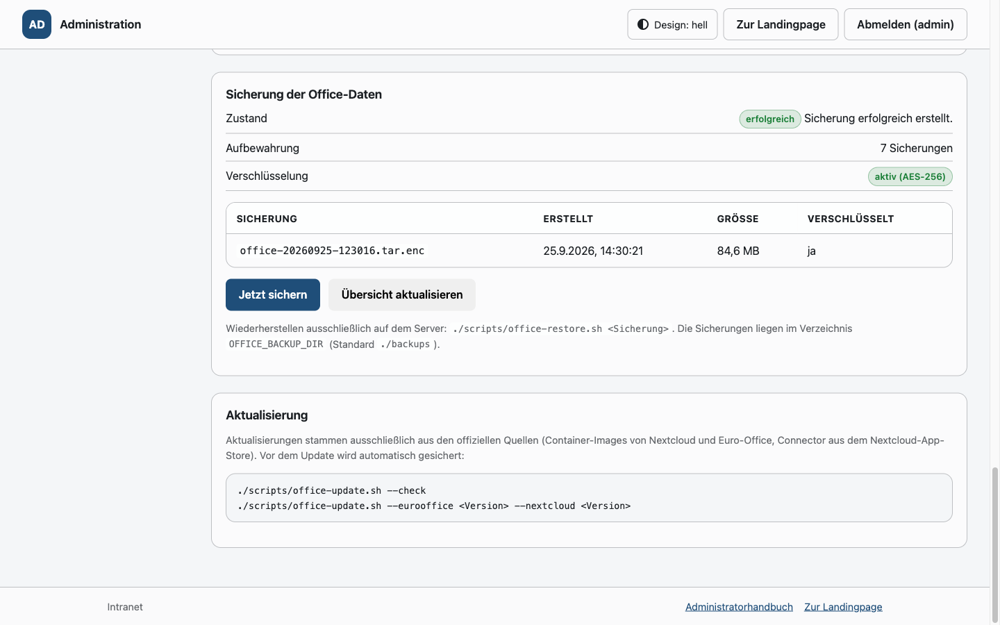

---

## 8. Überwachung (SNMP)

Der Container `snmp` meldet zusätzlich `nextcloud`, `nextcloud_db`,
`nextcloud_redis`, `eurooffice` und `office_workflow` (Nextcloud und
DocumentServer erreichbar). Ist Office nicht bereitgestellt, liefern die
Einträge `UNKNOWN` (3). OIDs: siehe README, Abschnitt SNMP-Überwachung.

---

## 9. Sicherheit

- Alle Secrets liegen als Dateien unter `./secrets/` (Docker-Secrets), nie in
  der `.env` oder im Repository.
- Nextcloud ↔ DocumentServer und Intranet ↔ Office sind per JWT abgesichert.
- Datenbank und Redis sind nur im internen Netz erreichbar.
- `auth` entfernt von außen gesendete `X-Remote-User`-/`X-Remote-Groups`-Header.
  Das Intranet wertet sie nur von `SSO_TRUSTED_PROXY` aus.
- Vorschau- und Vorschlags-Endpunkte sind nur für angemeldete Administratoren
  erreichbar und werden nicht zwischengespeichert.

---

## 10. Grenzen und Hinweise

- AD-Gruppen, NTLM-SSO und die Nextcloud-AD-Anbindung benötigen eine reale
  Domäne. Sie sind mit Unit-Tests und Testdoppeln abgedeckt, konnten ohne
  Domäne aber nicht Ende-zu-Ende geprüft werden.
- Die Mitglieder-Auflösung stellt je Gruppe eine LDAP-Abfrage. Der Gruppen-Pfad
  sollte daher auf die relevanten OUs begrenzt sein.
- Gruppennamen werden ohne Beachtung der Groß-/Kleinschreibung verglichen
  (Attribut `cn` bzw. `LDAP_GROUP_NAME_ATTRIBUTE`).
- Nextcloud schreibt beim Start zusammengeführte Werte in `config.php` zurück;
  maßgeblich bleiben die vom Hook verwalteten Einstellungen.
