# Office im Intranet (Nextcloud + Euro-Office)

Die optionale Office-Erweiterung stellt Dokumentbearbeitung im Browser bereit:
**Nextcloud** als Dateiablage und Oberfläche, **Euro-Office DocumentServer**
als Editor (Text, Tabellen, Präsentationen) und der offizielle
Nextcloud-Connector `eurooffice`. Alles läuft als Container neben dem Intranet
und ist über dieselbe Adresse erreichbar – ohne zusätzlichen Reverse-Proxy.

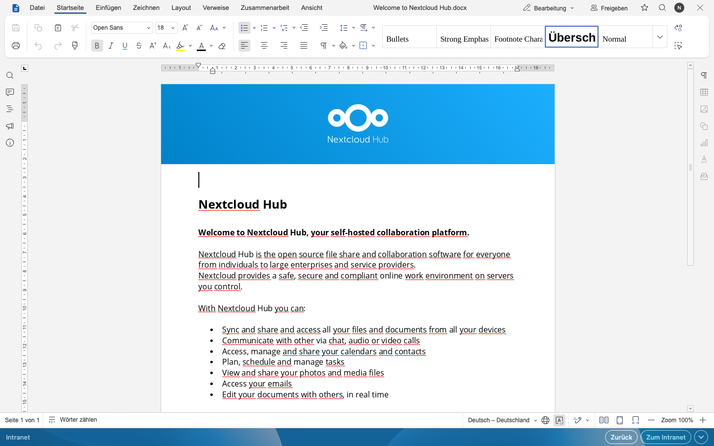

---

## 1. Einrichtung per Einzeiler

```bash
./scripts/office-setup.sh                 # Office einrichten und starten
./scripts/office-setup.sh --with-ad       # zusätzlich Nextcloud an das AD anbinden
./scripts/office-setup.sh --with-ad --with-sso   # plus automatische Windows-Anmeldung (NTLM)
```

Das Skript kann beliebig oft ausgeführt werden. Es

1. legt `.env` aus `.env.example` an, falls sie fehlt (mit Zufallspasswörtern),
2. erzeugt fehlende Secrets unter `./secrets/` (Verzeichnis `0700`, nie versioniert),
3. setzt `OFFICE_ENABLED=true`, `COMPOSE_PROFILES=office`, die Image-Versionen
   und den Sicherungspfad in der `.env`,
4. baut bzw. startet alle Container und wartet, bis Nextcloud bereit ist.

Weitere Optionen: `--no-start` (nur konfigurieren), `--no-encryption`
(Sicherungen unverschlüsselt). Ist das Intranet der Domäne beigetreten
(`SSO_ENABLED=true`), setzt das Skript `NEXTCLOUD_LDAP_ENABLED=true` automatisch;
`--with-ad` ist dann nicht nötig. Anschließend im Adminbereich unter **Office**
die Kachel anlegen und Rechte vergeben (siehe Abschnitt 4).

---

## 2. Architektur

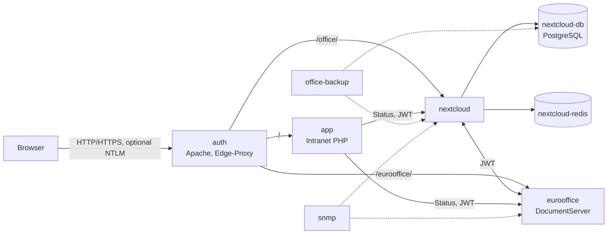
```mermaid
flowchart LR
    B[Browser] -->|HTTP/HTTPS, optional NTLM| A[auth<br/>Apache, Edge-Proxy]
    A -->|/| APP[app<br/>Intranet PHP]
    A -->|/office/| NC[nextcloud]
    A -->|/eurooffice/| DS[eurooffice<br/>DocumentServer]
    NC --> PG[(nextcloud-db<br/>PostgreSQL)]
    NC --> R[(nextcloud-redis)]
    NC <-->|JWT| DS
    APP -->|Status, JWT| NC
    APP -->|Status, JWT| DS
    BK[office-backup] -.-> NC
    BK -.-> PG
    SNMP[snmp] -.-> NC
    SNMP -.-> DS
```

| Dienst | Aufgabe |
| --- | --- |
| `auth` | Einziger Einstiegspunkt (Port `APP_PORT`). Leitet `/office/` an Nextcloud und `/eurooffice/` an den DocumentServer weiter, übernimmt optional die NTLM-Anmeldung und entfernt gefälschte `X-Remote-User`-Header. Ist Office nicht erreichbar, erscheint die Seite `/office-nicht-verfuegbar`. Wird ein Backend-Container (`app`, `nextcloud`, `eurooffice`) mit neuer IP-Adresse neu erstellt, lädt `auth` Apache innerhalb von etwa 10 Sekunden neu (`backend-watch.sh`). Sonst würden Anfragen an die alte Adresse gehen, z. B. `/office/` an das Intranet („Seite nicht gefunden“). |
| `nextcloud`, `nextcloud-cron` | Offizielles Image `nextcloud` (Apache). Ein Hook richtet bei jedem Start Pfade, vertrauenswürdige Domains, den Connector, AD und SSO ein (idempotent). |
| `eurooffice` | Offizielles Image `ghcr.io/euro-office/documentserver`, abgesichert per JWT. |
| `nextcloud-db`, `nextcloud-redis` | PostgreSQL und Redis (Passwort aus Secret), nur im internen Netz. |
| `nextcloud-ai-worker` | Führt KI-Aufgaben von Nextcloud (Assistant) sofort aus statt nur alle 5 Minuten per Cron ([Abschnitt 6a](#6a-lokale-ki)). |
| `office-backup` | Sicherung/Wiederherstellung, vom Adminbereich aus steuerbar. |
| `storage-sync` | Speicher-Tiering und HA-Synchronisation: Daten von Nextcloud und Euro-Office zusätzlich auf SMB-Freigaben (Cold-Tier), lokales Volume als Cache (Hot-Tier) – siehe [docs/storage.md](storage.md). |
| `storage-sync-catalog`, `storage-sync-redis` | Katalog-Datenbank (MySQL) und Redis-Helfer von `storage-sync`, nur im internen Netz `storage_catalog` – siehe [docs/storage-stack.md](storage-stack.md). |

**Warum kein zusätzlicher `reverse`-/`entry`-Container?** Die NTLM-Anmeldung ist
an die TCP-Verbindung gebunden. Ein weiterer Proxy davor würde sie brechen. Der
vorhandene `auth`-Container ist deshalb der Reverse-Proxy für alle Apps; die
Konfiguration bleibt beim Einzeiler oben.

### Einstieg und Fußzeile

- Die Kachel ruft `/office-starten` auf. Das Intranet prüft die Berechtigung
  und zeigt die **Office-Apps** an, die der angemeldete Benutzer erhält
  (siehe Abschnitt 5a). Ein Klick auf eine App (`/office-app?app=…`) prüft die
  Freigabe erneut und leitet weiter.
- Nextcloud und Euro-Office zeigen eine dezente **Intranet-Fußzeile** mit
  „Zum Intranet“ und „Zurück“. Sie ist im Ruhezustand transparent, wird bei
  Mauszeiger, Tastaturfokus oder Antippen deckend und lässt sich einklappen.
  Im Editor wird der Platz reserviert, sodass die Statusleiste sichtbar bleibt.
- Ist ein Dokument geöffnet, fragen „Zurück“ und „Zum Intranet“ zuerst, ob die
  Datei gespeichert wurde: **Ja** führt die Aktion aus, **Nein** (oder Escape)
  kehrt zum Dokument zurück.
- Direkter Aufruf von `/office/` ohne Intranet: wahlweise erlaubt (mit
  Fußzeile) oder einmalig über den Intranet-Einstieg geleitet.

| Dateien mit Fußzeile | Eingeklappte Fußzeile |
| --- | --- |
| 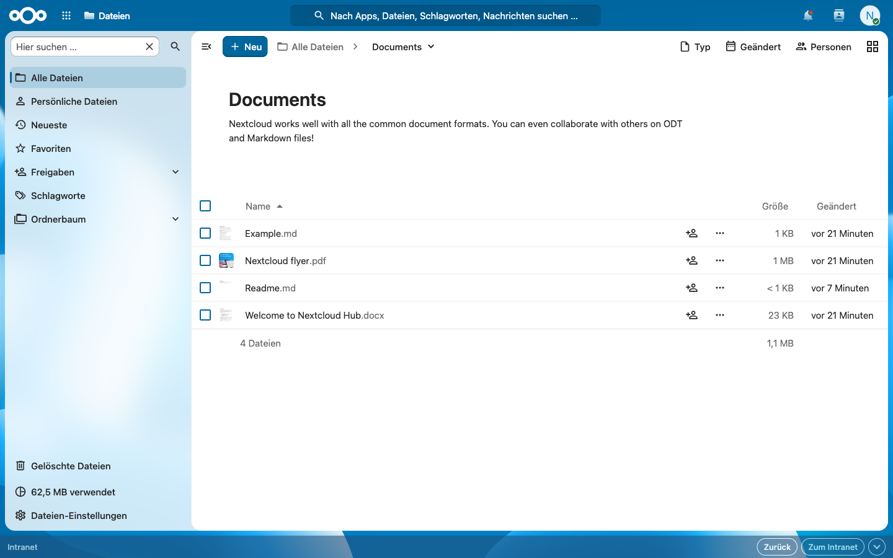 | 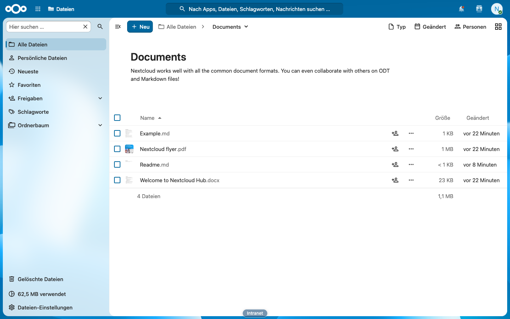 |

---

## 3. Aktualisierung aus den offiziellen Quellen

```bash
./scripts/office-update.sh --check                  # verfügbare Versionen anzeigen
./scripts/office-update.sh                          # Connector-App + Images der festgelegten Versionen
./scripts/office-update.sh --eurooffice v9.3.5 --nextcloud 34.0.5-apache   # neue Versionen festlegen
```

| Komponente | Quelle |
| --- | --- |
| DocumentServer | `ghcr.io/euro-office/documentserver` ([Releases](https://github.com/Euro-Office/DocumentServer/releases)) |
| Nextcloud | offizielles Docker-Hub-Image `nextcloud` |
| Connector | Nextcloud-App-Store, App `eurooffice` |

Vor jedem Update wird automatisch gesichert (`--no-backup` überspringt das).
Die Versionen stehen in `.env` (`EUROOFFICE_IMAGE_TAG`, `NEXTCLOUD_IMAGE_TAG`)
und sind damit reproduzierbar. Nextcloud nur **eine Hauptversion nach der
anderen** aktualisieren; `occ upgrade` führt das offizielle Image selbst aus.
Ist der App-Store ausgeblendet ([Abschnitt 6b](#6b-nextcloud-app-store-ausblenden)),
gibt das Skript ihn für die App-Updates kurzzeitig frei und sperrt ihn danach
wieder.

---

## 4. Rechte über AD-Gruppen und Anmeldung

### Gruppen-Pfad in der AD-Konfiguration

Unter **Administration → Active Directory → Gruppen für die Rechtevergabe**
werden ein oder mehrere Pfade (Base DN, ein Pfad je Zeile) angegeben, unter
denen die relevanten Gruppen liegen. Die AD-Synchronisation übernimmt diese
Gruppen samt ihrer – auch verschachtelten – Mitglieder
(`LDAP_MATCHING_RULE_IN_CHAIN`) in die lokale Datenbank. Ohne Pfad werden keine
Gruppen übernommen. Schlägt nur der Gruppenabruf fehl, bleibt der bisherige
Gruppenstand erhalten.

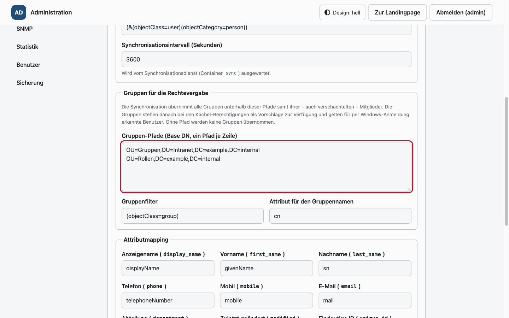

Gleichwertig per Umgebung: `LDAP_GROUP_BASE_DN` (mehrere Pfade mit `;`),
`LDAP_GROUP_FILTER` (Standard `(objectClass=group)`),
`LDAP_GROUP_NAME_ATTRIBUTE` (Standard `cn`). Nextcloud verwendet denselben Pfad
als Gruppen-Basis (abweichend: `NEXTCLOUD_LDAP_GROUPS_BASE_DN`).

### Kachel-Berechtigungen mit Vorschlägen

Unter **Office → Berechtigungen** (bzw. Navigation → Berechtigungen) werden
Benutzer und AD-Gruppen zugeordnet. Beim Tippen eines Gruppennamens wird der
Rest direkt im Feld ergänzt (übernehmen mit <kbd>Tab</kbd>) und eine Liste
passender Gruppen erscheint unterhalb des Felds (<kbd>↑</kbd>/<kbd>↓</kbd>,
<kbd>Enter</kbd>, <kbd>Esc</kbd>). Die Vorschläge stammen **ausschließlich aus
dem synchronisierten Datenbestand** sowie bereits vergebenen Gruppennamen – es
erfolgt keine Live-Abfrage des AD.

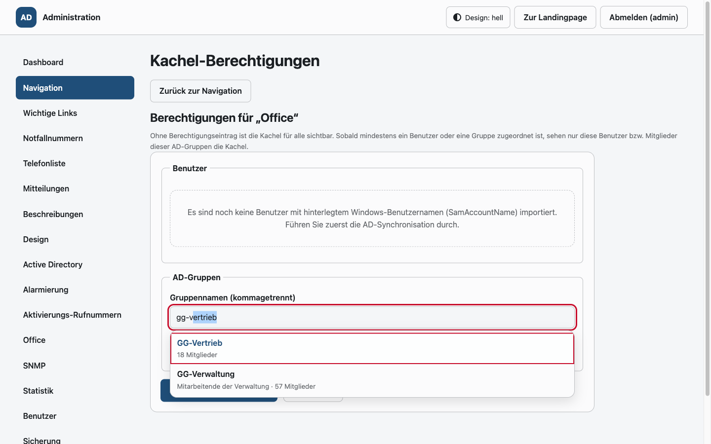

Ohne Eintrag ist die Kachel für alle sichtbar; sobald ein Benutzer oder eine
Gruppe eingetragen ist, sehen nur diese die Kachel und dürfen `/office-starten`
aufrufen.

### Anmeldung

- **Intranet:** Bei aktivem SSO (`SSO_ENABLED=true`) liefert `auth` am
  Anmeldepunkt `/sso/anmelden` den Windows-Anmeldenamen (keine Anmeldepflicht,
  siehe README „Windows-Anmeldung ohne Anmeldepflicht“); die Anwendung merkt
  ihn sich in der Sitzung. Das Intranet ordnet ihn über den synchronisierten
  `sAMAccountName` dem Telefonbucheintrag zu und ergänzt die Gruppen aus dem
  synchronisierten Bestand.
- **Nextcloud:** Mit `--with-ad` nutzt Nextcloud `user_ldap` (gleiche
  `LDAP_*`-Werte). Nach dem Domänenbeitritt (`SSO_ENABLED=true`) geschieht das
  automatisch – `office-setup.sh` setzt `NEXTCLOUD_LDAP_ENABLED=true`, und der
  Nextcloud-Hook aktiviert `user_ldap` beim Containerstart auch dann, wenn
  Office bereits vor dem Beitritt eingerichtet wurde (`docker compose up -d`
  genügt). Mit `--with-sso` meldet `user_saml` (Umgebungsvariablen-Modus)
  den per NTLM erkannten Benutzer automatisch an; `…/login?direct=1` bleibt als
  Rückfall für Nicht-Domänen-Clients.
- **Wechsel ins Office ohne erneute Kennworteingabe:** Der auf der Startseite
  erkannte Benutzer wird beim Wechsel nach Nextcloud bzw. in eine Office-App
  **immer** weitergereicht (siehe unten). Er erscheint dezent im Kopf der
  Startseite (Initialen und Name, Tooltip mit Anmeldenamen).
- **Mehrere Identitätsquellen:** Nextcloud (`user_ldap`) ist nur an die
  Hauptquelle angebunden; Bind-Passwort und Verbindungsdaten (Server, Bind-DN,
  Basis-DN) erhält es über die Secrets `secrets/nextcloud_ldap_password` und
  `secrets/nextcloud_ldap_config`, die `office-setup.sh` aus der in der
  Verwaltung gepflegten (verschlüsselt gespeicherten) Konfiguration schreibt.
  Die `LDAP_*`-Werte der `.env` gelten nur als Startwerte. Nach Änderungen
  unter *Verwaltung → Active Directory* daher `./scripts/office-setup.sh`
  erneut ausführen. Benutzer
  weiterer Quellen (Zweigstellen, Tochtergesellschaften) werden im Token als
  `name@kennung` übergeben und kollidieren so nicht mit gleichnamigen Konten der
  Zentrale.
  Die direkte NTLM-Anmeldung über `user_saml` ist in deren auth-Instanzen
  gesperrt; die Anmeldung erfolgt über die Office-Kachel des Intranets.

### Hostnamen nach dem Domänenbeitritt (trusted_domains)

Nextcloud beantwortet Anfragen nur unter Hostnamen aus `trusted_domains`;
sonst erscheint „Zugriff über eine nicht vertrauenswürdige Domain“. Damit
Nextcloud und Euro-Office nach dem Domänenbeitritt unter jedem Namen
funktionieren, unter dem das Intranet erreichbar ist, pflegt das Intranet die
Liste selbst und überträgt sie signiert an die App `intranet_integration`
(`/apps/intranet_integration/api/hosts`, JWT mit eigener Audience, an den
Inhalt gebunden). Enthalten sind:

- Hostname aus `APP_URL`, `NEXTCLOUD_EXTRA_TRUSTED_DOMAINS` und `SSO_SPN_HOSTS`
- je Domäne mit Windows-Anmeldung der DNS-Name des Computerkontos
  (`<SSO_NETBIOS_NAME>.<DNS-Domäne aus dem Base DN>`, z. B. `lanpa-sso.firma.local`)
  sowie die in der Verwaltung hinterlegten Hostnamen weiterer Quellen
- Common Name und alternative Namen des aktiven HTTPS-Zertifikats
- der interne Containername `nextcloud` (Healthcheck)

Die Diagnose vergleicht den Stand in Nextcloud bei jeder Prüfung (Komponente
„Vertrauenswürdige Hostnamen“) und überträgt bei Abweichung erneut – ohne
Neustart, spätestens 30 Sekunden nach einem Domänenbeitritt, einem neuen
Zertifikat oder einer weiteren Domäne. Der Port spielt keine Rolle (Nextcloud
vergleicht ohne Port); die Rechte in Nextcloud und Euro-Office richten sich
weiterhin nach `NEXTCLOUD_LDAP_ALLOWED_GROUPS` bzw. `NEXTCLOUD_OFFICE_GROUPS`.
Beim Containerstart ergänzt `hooks/intranet-setup.sh` nur fehlende
Grundeinträge und entfernt keine vorhandenen Hostnamen.

### Speicherplatz-Kontingente (Quota)

Unter **Admin → Speicherplatz (Quota)** (`/admin/speicherplatz`) legen
Administratoren fest, wie viel Speicher jeder Benutzer in Nextcloud belegen
darf. Das wirksame Kontingent ergibt sich in dieser Reihenfolge:

1. **Individuelles Kontingent** – je Benutzer, nur mit Begründung (mindestens
   5 Zeichen); auch das Entfernen verlangt eine Begründung. Es hat immer
   Vorrang, auch wenn es kleiner als das Gruppenkontingent ist.
2. **AD-Gruppe** – Regeln je AD-Gruppe (Mitgliedschaften aus der
   AD-Synchronisation, verschachtelt aufgelöst). Ist ein Benutzer in mehreren
   Gruppen mit Regel, gilt das größte Kontingent.
3. **Standard** – Vorgabe 500 MB (Einstellung `office_quota_default_mb`).

Die Seite zeigt alle Benutzer mit mehr als dem Standard (inkl. Begründung,
wer das Kontingent vergeben hat und wann) sowie einen vollständigen Verlauf
aller Änderungen (`/admin/speicherplatz/verlauf`: wer wem wann wie viel
gegeben oder entzogen hat, mit Begründung). Individuelle Kontingente
ausgeschiedener Benutzer bleiben sichtbar, bis sie entfernt werden.

Benutzer werden über ihre Nextcloud-Kennung geführt (SamAccountName bzw.
`name@kennung` bei weiteren Identitätsquellen). Jede Änderung wird sofort
signiert an `intranet_integration` übertragen
(`/apps/intranet_integration/api/quota`, JWT mit eigener Audience, an den
Inhalt gebunden): Nextcloud erhält den Standard als `files/default_quota` und
alle abweichenden Benutzer als individuelle Quota. Benutzer, die sich noch nie
in Nextcloud angemeldet haben, erhalten ihr Kontingent bei der ersten
Anmeldung. Die Diagnose vergleicht den Stand per Fingerabdruck (Komponente
„Speicherplatz-Kontingente“, nur informativ) und überträgt bei Abweichung
erneut – so werden auch geänderte AD-Gruppenmitgliedschaften nach der
AD-Synchronisation automatisch nachgezogen. Fällt ein Benutzer aus allen
Regeln heraus, setzt Nextcloud ihn wieder auf den Standard zurück – aber nur,
wenn sein Kontingent nicht zwischenzeitlich direkt in Nextcloud geändert wurde.
Netzlaufwerke (nächster Abschnitt) sind externe Speicher und zählen **nicht**
zum Kontingent.

### Netzlaufwerke der Windows-Clients

Die auf dem Windows-Client gemappten Netzlaufwerke (z. B. `H:` →
`\\fs01\home\amueller`) können in Nextcloud unter „Dateien“ als Ordner
„Laufwerk H (amueller)“ erscheinen. Ablauf:

1. **Meldung:** Ein Anmeldeskript (`scripts/network-drives-report.ps1`) läuft
   bei jeder Windows-Anmeldung im Benutzerkontext, wartet kurz auf die per
   Gruppenrichtlinie verbundenen Laufwerke und meldet alle Netzlaufwerke
   (Buchstabe → UNC-Pfad, Domäne, Computername) per Windows-Anmeldung
   (Kerberos/NTLM, kein Kennwort) an `POST /sso/laufwerke`. Jede Meldung
   ersetzt den bisherigen Stand des Benutzers. Protokoll auf dem Client:
   `%LOCALAPPDATA%\Intranet\netzlaufwerke.log`.
2. **Ausschlussliste:** Adminbereich **Netzlaufwerke** pflegt die Laufwerke,
   die **nie** weitergereicht werden (Standard `B:/, G:/`; leeres Feld = keine
   Ausnahme). Ausgeschlossene Laufwerke werden zur Information angezeigt,
   verlassen das Intranet aber nie (die Nextcloud-App verwirft sie zusätzlich).
   Dort lässt sich die Weitergabe auch ganz ausschalten.
3. **Übergabe:** Das Intranet überträgt die Laufwerke signiert an
   `intranet_integration` (`/apps/intranet_integration/api/drives`, JWT mit
   eigener Audience, an den Inhalt gebunden) – bei jeder Änderung, über
   „Jetzt an Nextcloud übertragen“ und bei Abweichung durch die Diagnose
   (Komponente „Netzlaufwerke (Nextcloud)“, nur informativ).
4. **Opt-in je Benutzer:** In Nextcloud unter **Dateien → Einstellungen**
   (Zahnrad unten links) aktiviert jeder Benutzer selbst
   **„Netzlaufwerke anzeigen“**. Erst dann bindet Nextcloud seine Laufwerke
   als externe Speicher (`files_external`, Backend SMB) ein – je Laufwerk ein
   Speicher, der nur für die Benutzer gilt, die genau dieses Laufwerk gemeldet
   und die Anzeige aktiviert haben.
5. **Kennwort einmalig:** Der Zugriff auf die Dateiserver erfolgt mit dem
   Windows-Konto des Benutzers. Das Windows-Kennwort wird einmal in derselben
   Einstellung hinterlegt (oder beim ersten Öffnen eines Laufwerks abgefragt)
   und gilt für alle seine Laufwerke („Globale Anmeldedaten, vom Benutzer
   eingegeben“, verschlüsselt in Nextcloud). Nach einer Kennwortänderung in
   Windows dort erneut speichern. Die NTFS-Berechtigungen des Dateiservers
   gelten unverändert.

**Einrichtung:**

- Adminbereich **Netzlaufwerke** → „Anmeldeskript herunterladen“ (die Meldeadresse
  aus `APP_URL` ist bereits eingetragen) und per Gruppenrichtlinie verteilen:
  *Benutzerkonfiguration → Richtlinien → Windows-Einstellungen → Skripts →
  Anmelden → PowerShell-Skripts*. Alternativ als geplante Aufgabe bei der
  Anmeldung: `powershell.exe -NoProfile -ExecutionPolicy Bypass -File
  netzlaufwerke-melden.ps1`.
- Voraussetzung ist die Windows-Anmeldung am Intranet (`SSO_NTLM_ENABLED`,
  Container `auth`); `/sso/laufwerke` verlangt sie zwingend.
- Nextcloud benötigt `smbclient`: Das Compose-File baut dafür ein eigenes
  Image (`docker/nextcloud/Dockerfile`, offizielles Image plus `smbclient`),
  der Hook aktiviert die App `files_external`. Nach dem Update einmal
  `docker compose up -d --build` ausführen (`scripts/office-update.sh` baut das
  Image bei jedem Update neu).
- Nextcloud muss die Dateiserver per SMB (TCP 445) erreichen; das Netz
  `office` ist dafür nicht intern.

Netzlaufwerke zählen nicht zum Speicherplatz-Kontingent. Freigaben aus
Netzlaufwerken heraus sind abgeschaltet (`enable_sharing`), damit Dateien des
Dateiservers nicht an Dritte weitergegeben werden.

### Nextcloud-Administratoren aus AD-Gruppen

Unter **Admin → Benutzer → Nextcloud-Administratoren** (`/admin/benutzer`)
tragen Administratoren AD-Gruppen ein, deren Mitglieder (verschachtelt
aufgelöst, Stand der AD-Synchronisation) in Nextcloud Mitglied der Gruppe
`admin` werden. Die Liste der Kennungen (SamAccountName bzw. `name@kennung`)
wird nach jeder Änderung signiert an `intranet_integration` übertragen
(`/apps/intranet_integration/api/admins`, JWT mit eigener Audience, an den
Inhalt gebunden). Benutzer, die sich noch nie in Nextcloud angemeldet haben,
erhalten die Rechte bei der ersten Anmeldung. Wer aus allen eingetragenen
Gruppen fällt, wird wieder aus `admin` entfernt – aber nur, wenn ihn das
Intranet aufgenommen hat: der lokale Nextcloud-Admin, per
`NEXTCLOUD_LDAP_ADMIN_GROUP` beförderte und manuell ernannte Administratoren
bleiben unangetastet. Die Diagnose vergleicht den Stand per Fingerabdruck
(Komponente „Administratoren aus AD-Gruppen“, nur informativ) und überträgt
bei Abweichung erneut, z. B. nach der AD-Synchronisation; auf der Seite
„Benutzer“ kann auch von Hand übertragen werden.

Gleiche Seite, Karte **Intranet-Administratoren**: Mitglieder dieser
AD-Gruppen dürfen per Windows-Anmeldung den Adminbereich des Intranets
verwalten (siehe README, Abschnitt Adminbereich).

### Dateiablage aus dem Intranet (Notfallplan-Exporte)

Das Intranet legt Dateien direkt in den Nextcloud-Dateien der angemeldeten Person
ab (derzeit Notfallplan-Exporte, siehe [notfallplan.md](notfallplan.md#export-und-import-von-notfallplänen)).
`NextcloudFilesService` sendet je Datei den Inhalt als Anfragekörper an
`intranet_integration` (`POST /apps/intranet_integration/api/files`, intern über
`NEXTCLOUD_INTERNAL_URL`) mit einem kurzlebigen JWT (Audience
`intranet_integration_files`, gemeinsames Euro-Office-Secret), das Benutzer
(`sub` = Office-Kennung), Zielordner, Dateiname und SHA-256 des Inhalts bindet.
Die App legt nur in vorhandenen, aktiven Konten ab (LDAP-Konten werden wie beim SSO
gesucht), erstellt fehlende Ordner (höchstens 4 Ebenen, keine `..`/Steuerzeichen),
ersetzt eine gleichnamige Datei und meldet fehlenden Speicherplatz (HTTP 507).
Höchstens 16 MiB je Datei; lokale Intranet-Konten ohne Windows-Anmeldung haben kein
Nextcloud-Konto und erhalten nur den Download.

### Automatische Anmeldung in Nextcloud (Intranet-SSO)

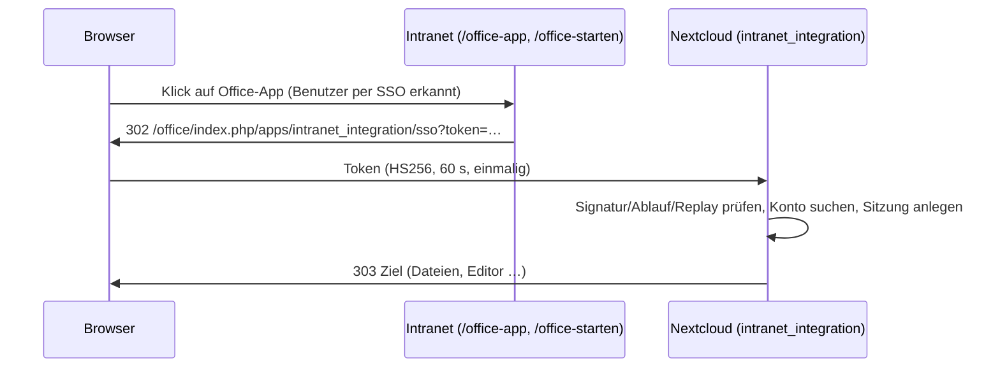
```mermaid
sequenceDiagram
    participant B as Browser
    participant I as Intranet (/office-app, /office-starten)
    participant N as Nextcloud (intranet_integration)
    B->>I: Klick auf Office-App (Benutzer per SSO erkannt)
    I->>B: 302 /office/index.php/apps/intranet_integration/sso?token=…
    B->>N: Token (HS256, 60 s, einmalig)
    N->>N: Signatur/Ablauf/Replay prüfen, Konto suchen, Sitzung anlegen
    N->>B: 303 Ziel (Dateien, Editor …)
```

- Das Token enthält den SamAccountName (`sub`), Anzeigename, E-Mail und das
  Ziel. Es ist mit einem vom Euro-Office-Secret **abgeleiteten** Schlüssel
  signiert (`HMAC(secret, "intranet_integration_sso")`), 60 Sekunden gültig
  und nur einmal verwendbar (Replay-Schutz über Redis).
- Nextcloud löst das Konto wie beim Anmeldeformular über den Login-Filter von
  `user_ldap` auf (SamAccountName, UPN oder E-Mail) – auch wenn das AD-Konto
  dort noch nie aufgelistet wurde; danach lokale Suche (Groß-/Kleinschreibung
  egal, notfalls per E-Mail). Ist bereits ein anderes Konto angemeldet, wird es
  abgemeldet – maßgeblich ist die Identität des Intranets. Die Sitzung benötigt
  keine Kennwortbestätigung für sensible Aktionen.
- Ruft jemand Nextcloud direkt auf, leitet die Anmeldeseite zum
  Intranet-Einstieg (`/office-starten?ziel=…`), der den Benutzer ebenso
  weiterreicht. Wird er dort nicht erkannt oder ist das Token ungültig,
  erscheint das normale Anmeldeformular (`…/login?direct=1`, keine Schleife).
- Erscheint das Anmeldeformular trotz erkanntem Benutzer, wurde das Konto in
  Nextcloud nicht gefunden: `NEXTCLOUD_LDAP_ENABLED=true` prüfen, ob der
  Benutzer den Benutzerfilter erfüllt (`NEXTCLOUD_LDAP_ALLOWED_GROUPS`) und
  `docker compose exec -u www-data nextcloud php occ ldap:check-user <SamAccountName>`
  ausführen; Details stehen im Nextcloud-Protokoll (`Intranet-SSO: …`).
  Meldet das Protokoll `Bind failed: 49: Invalid credentials` bzw.
  `LDAP Operations error`, passen Bind-DN und Bind-Passwort von `user_ldap`
  nicht zusammen (z. B. Bind-DN in der Verwaltung geändert, `.env` veraltet):
  `./scripts/office-setup.sh` erneut ausführen, damit Nextcloud die aktuelle
  Konfiguration erhält (das Skript liest sie nach dem Neubau der Container
  erneut aus und übernimmt Änderungen im laufenden Nextcloud; manuell:
  `docker compose restart nextcloud`), und mit
  `occ ldap:test-config s01` prüfen. Ist `secrets/nextcloud_ldap_config` leer,
  lief beim Export noch ein altes app-Image – Skript einfach erneut ausführen.
- `NEXTCLOUD_SSO_LOGIN_REDIRECT=false` schaltet die Umleitung der
  Anmeldeseite ab; `NEXTCLOUD_SSO_AUTOPROVISION=true` legt unbekannte Konten
  lokal an (nur ohne AD bzw. zum Testen sinnvoll).

### Testmodus: simulierte SSO-Anmeldung

Ohne Domäne lässt sich eine bestehende Windows-Anmeldung auf der Startseite
simulieren (nur wenn `APP_ENV` nicht `production` ist):

```dotenv
APP_ENV=development
SSO_FAKE_USER=erika.muster              # SamAccountName
SSO_FAKE_DISPLAY_NAME=Erika Muster      # falls kein Telefonbucheintrag existiert
SSO_FAKE_EMAIL=erika.muster@example.internal
SSO_FAKE_GROUPS=GG-Office-Basis         # AD-Gruppen für Office-Apps/Kacheln
NEXTCLOUD_SSO_AUTOPROVISION=true        # Konto in Nextcloud ohne AD anlegen
```

Existiert der Benutzer im Telefonbuch, werden dessen Daten und
synchronisierte Gruppen verwendet. Im Kopf erscheint zusätzlich die Marke
„Test“. Kein NTLM, kein auth-Header nötig – der Testmodus ersetzt
ausschließlich die Erkennung des Benutzers.
- Optional in Nextcloud: `NEXTCLOUD_LDAP_ALLOWED_GROUPS` (Anmeldung nur für
  Mitglieder), `NEXTCLOUD_LDAP_ADMIN_GROUP` (Nextcloud-Admins über die
  LDAP-Anbindung; alternativ/ergänzend im Adminbereich unter Benutzer →
  Nextcloud-Administratoren, siehe oben),
  `NEXTCLOUD_OFFICE_GROUPS` (Bearbeitung mit Euro-Office nur für diese Gruppen).

---

## 5. Office-Kachel gestalten

Unter **Office → Kachel im Intranet** lassen sich Titel, Kurz- und
Detailbeschreibung, Icon, Hintergrundfarbe und Deckkraft anpassen. Die
Vorschau rechts nutzt das Stylesheet der Landingpage und aktualisiert sich
beim Tippen; der Beispielzustand (verfügbar, eingeschränkt, nicht verfügbar)
ist umschaltbar. Weitere Optionen (Sortierung, Zugangscode) bietet die
Navigation.

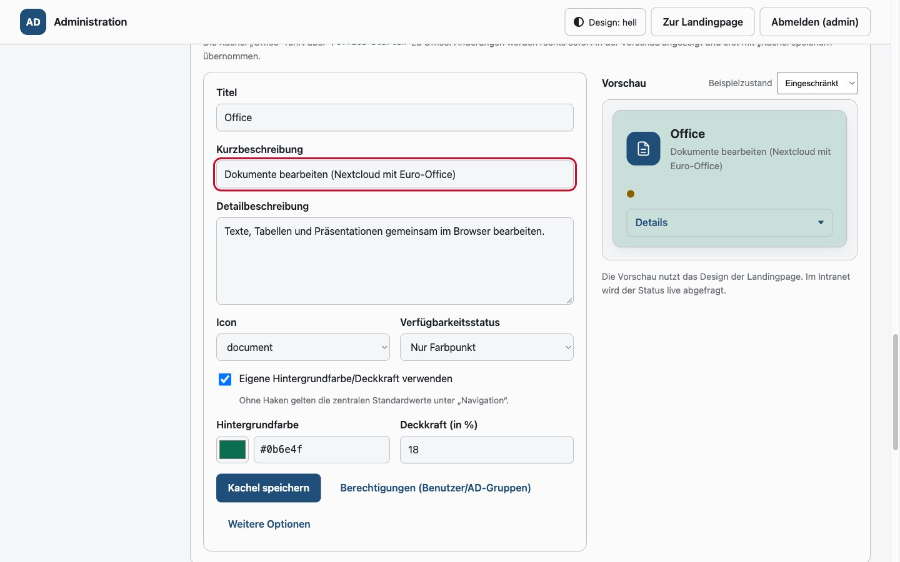

**Verfügbarkeitsstatus** auf der Kachel:

| Einstellung | Wirkung |
| --- | --- |
| Punkt und Text | Farbpunkt und „Office: Verfügbar“ usw. |
| Nur Farbpunkt | Nur der Punkt; der Text bleibt als Tooltip und für Screenreader erhalten |
| Nur bei Störungen | Nichts bei voller Verfügbarkeit, sonst Punkt und Text |
| Ausblenden | Kein Status, keine Statusabfrage |

| Standard | Nur Farbpunkt |
| --- | --- |
| 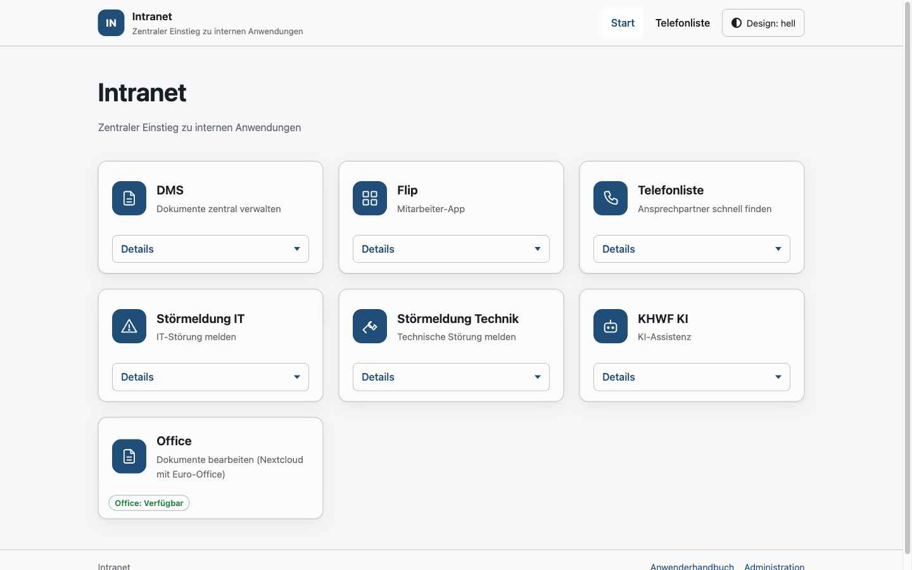 | 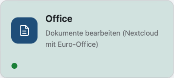 |

---

## 5a. Office-Apps und App-Pakete

Nach Klick auf die Office-Kachel erscheint eine Übersicht der einzelnen Apps:

| Office-Kachel (angemeldet) | Office-Apps des Benutzers |
| --- | --- |
|  | 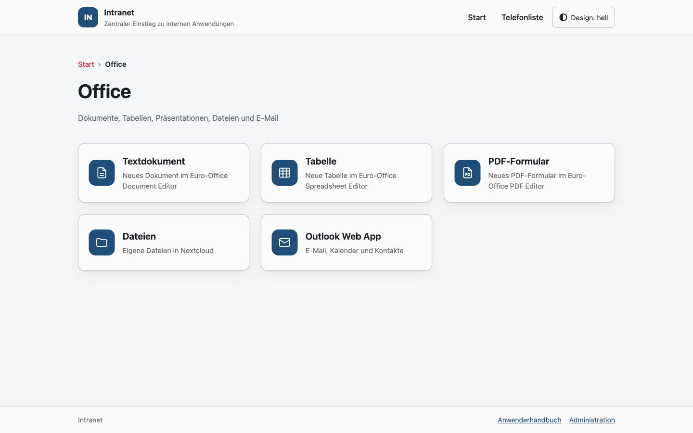 |

| App | Ziel |
| --- | --- |
| Textdokument | Euro-Office-Webapp `documenteditor` |
| Tabelle | Euro-Office-Webapp `spreadsheeteditor` |
| Präsentation | Euro-Office-Webapp `presentationeditor` |
| PDF-Formular | Euro-Office-Webapp `pdfeditor` |
| Dateien | eigene Dateien in Nextcloud (`/office/index.php/apps/files/`) |
| Outlook Web App | im Adminbereich hinterlegter Link (öffnet in neuem Tab) |
| Orvanta | Mail, Kalender, Kontakte, Aufgaben und Notizen aus Exchange On-Premise im Intranet (`/office/orvanta`, nur wenn im Adminbereich aktiviert) – siehe [docs/orvanta.md](orvanta.md) |

Die Editoren stammen aus [Euro-Office/web-apps](https://github.com/Euro-Office/web-apps)
und werden vom DocumentServer (`/eurooffice/web-apps/…`) ausgeliefert. Gestartet
wird über den Nextcloud-Connector `eurooffice`
(`/office/index.php/apps/eurooffice/new?name=…&dir=/`): Er legt ein leeres
Dokument in den eigenen Dateien an und öffnet es direkt in der passenden
Webapp. So sind Speicherort, Berechtigungen und JWT-Absicherung dieselben wie
beim Öffnen aus Nextcloud. Die Diagnose prüft zusätzlich, ob die Webapps
ausgeliefert werden (Komponente „Euro-Office-Webapps“, nicht kritisch).

| Textdokument | Tabelle | Dateien |
| --- | --- | --- |
| 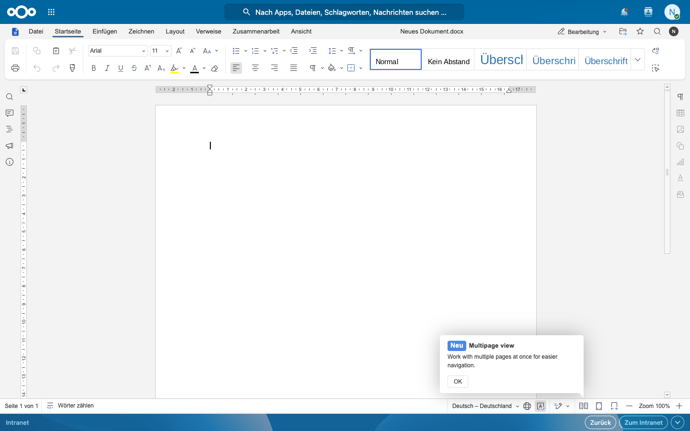 | 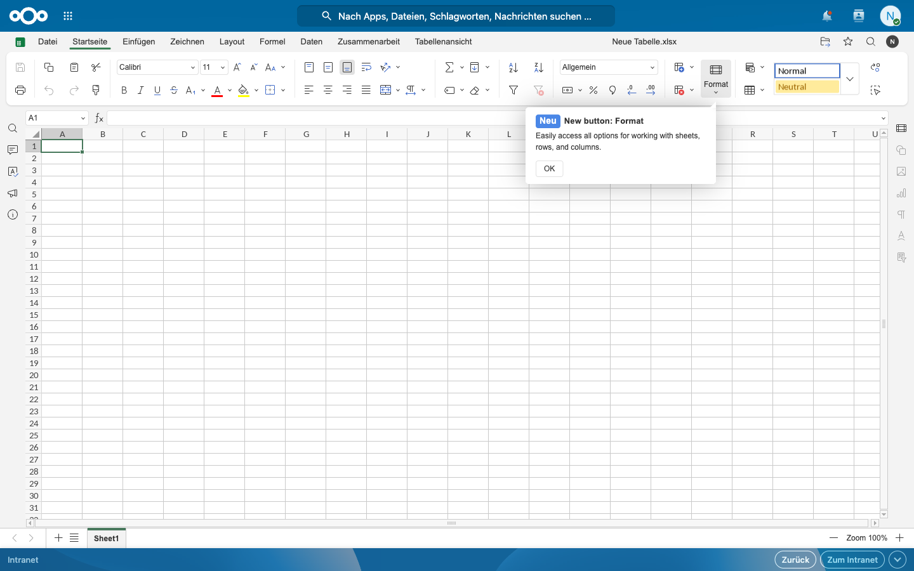 | 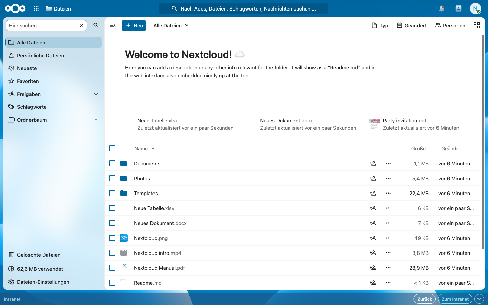 |

**Berechtigungen (Office → Office-Apps und Berechtigungen, `/admin/office/apps`):**

- Je App lassen sich AD-Gruppen direkt freigeben (mit Vorschlägen aus dem
  synchronisierten Bestand).
- **App-Pakete** fassen mehrere Apps zusammen (z. B. „Office Basis“ =
  Textdokument, Tabelle, Dateien) und werden ebenfalls AD-Gruppen zugeordnet.
- Ein Benutzer sieht alle Apps, die einer seiner Gruppen direkt oder über ein
  Paket freigegeben sind. Die Spalte „Wirksam für“ zeigt die Summe.
- **Ohne Zuordnung ist eine App für niemanden sichtbar.**
- **Nicht angemeldete Nutzer** (kein SSO-Benutzer bzw. simulierter Testbenutzer) erhalten keine Apps; die
  Office-Kachel wird für sie – wie für alle ohne freigegebene App – ausgeblendet.
- „Outlook Web App“ erscheint nur, wenn ein gültiger http(s)-Link hinterlegt ist.
- Die Kachel-Berechtigungen der Navigation gelten zusätzlich.

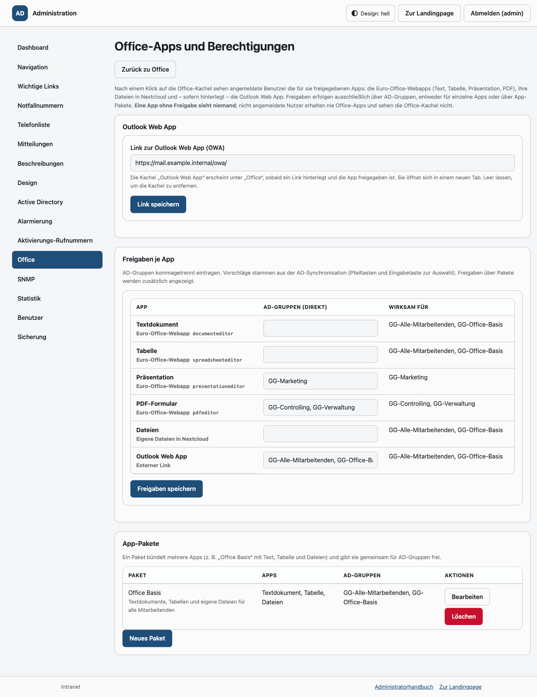

| App-Paket bearbeiten | Nicht angemeldet: keine Office-Kachel |
| --- | --- |
| 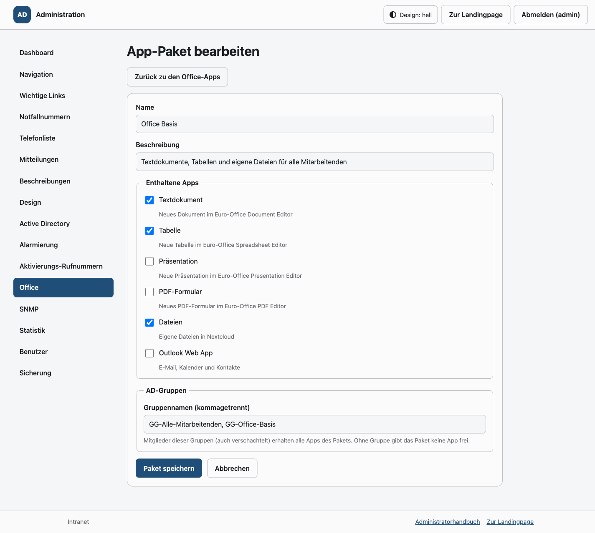 | 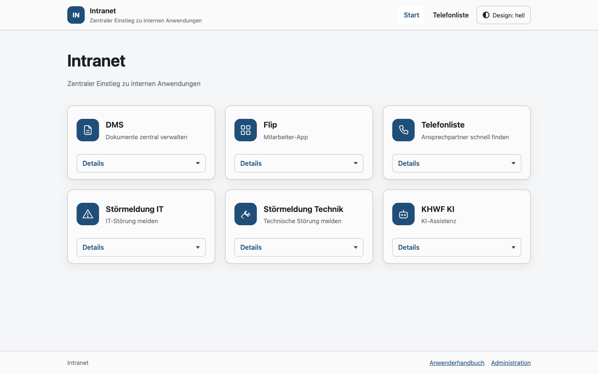 |

Im Beispiel gehört der Benutzer zu `GG-Office-Basis` und `GG-Controlling`: Er
erhält Textdokument, Tabelle und Dateien über das Paket „Office Basis“, das
PDF-Formular direkt über `GG-Controlling` und die Outlook Web App; die
Präsentation (nur `GG-Marketing`) fehlt.

Hinweis: Die App-Freigaben steuern, was im Intranet angeboten wird. Wer auf
Nextcloud zugreifen darf, regeln weiterhin `NEXTCLOUD_LDAP_ALLOWED_GROUPS` und
`NEXTCLOUD_OFFICE_GROUPS` (Abschnitt 4).

---

## 6. Adminbereich „Office“

| Bereich | Inhalt |
| --- | --- |
| Status | Gesamtzustand, letzte Prüfung, „Jetzt prüfen“ |
| Diagnose | Nextcloud, DocumentServer (inkl. JWT-Prüfung), Euro-Office-Webapps, PostgreSQL, Redis, Connector, vertrauenswürdige Hostnamen (Abgleich von `trusted_domains`), Speicherplatz-Kontingente (Abgleich mit `files/default_quota` und Benutzer-Quota), Administratoren aus AD-Gruppen (Abgleich der Gruppe `admin`), Netzlaufwerke (Abgleich der externen SMB-Speicher, Anzahl der Benutzer mit „Netzlaufwerke anzeigen“), App-Store (Abgleich von `appstoreenabled`) |
| Fußzeile und Einstieg | Text, Transparenz, Logo, „Zurück“, Ziel „Zum Intranet“, direkter Aufruf |
| Lokale KI | KI-Endpunkt für alle Benutzer in Nextcloud und Euro-Office ([Abschnitt 6a](#6a-lokale-ki)) |
| Nextcloud-App-Store | App-Store in Nextcloud anzeigen oder ausblenden ([Abschnitt 6b](#6b-nextcloud-app-store-ausblenden)) |
| Vorschau der Fußzeile | Live-Vorschau mit demselben Stylesheet/Skript wie in Nextcloud |
| Kachel im Intranet | Gestaltung, Status-Darstellung, Berechtigungen |
| Office-Apps | Link zur Outlook Web App, Freigaben je App (AD-Gruppen), App-Pakete ([Abschnitt 5a](#5a-office-apps-und-app-pakete)) |
| Orvanta | Exchange-Server (Host/EWS-Endpunkt, Version, TLS), Anmeldung (Negotiate/NTLM/Basic, Dienstkonto mit `ApplicationImpersonation`, Postfach-Zuordnung), Zwischenspeicher in Nextcloud mit Quota je Benutzer, Erinnerungen, Verbindungstest ([docs/orvanta.md](orvanta.md)) |
| Sicherung | Sicherung anstoßen, vorhandene Sicherungen, Aufbewahrung |

| Status | Diagnose |
| --- | --- |
| 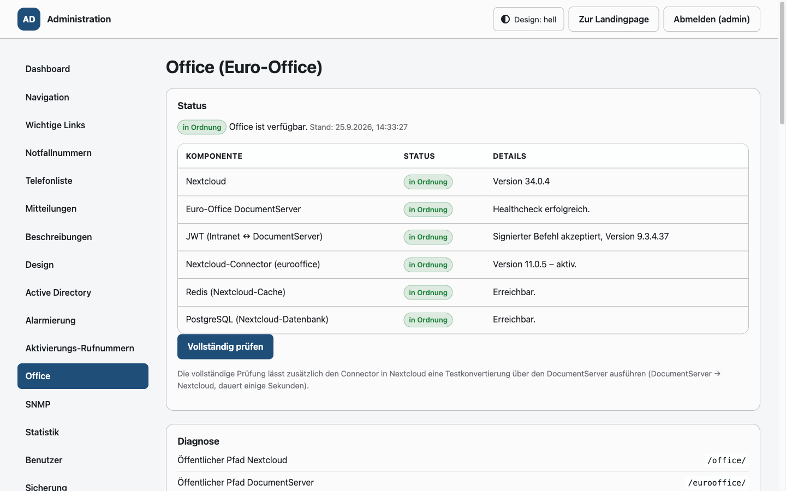 | 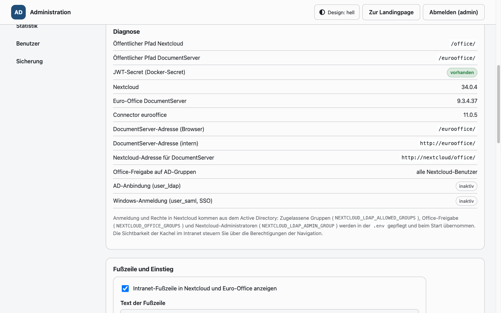 |
| 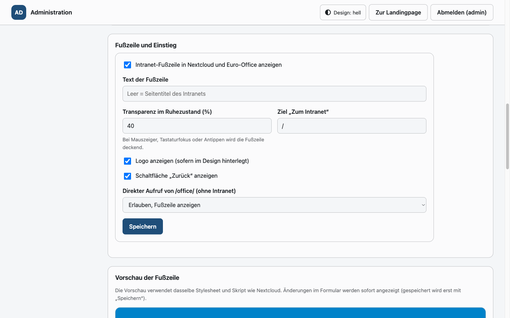 | 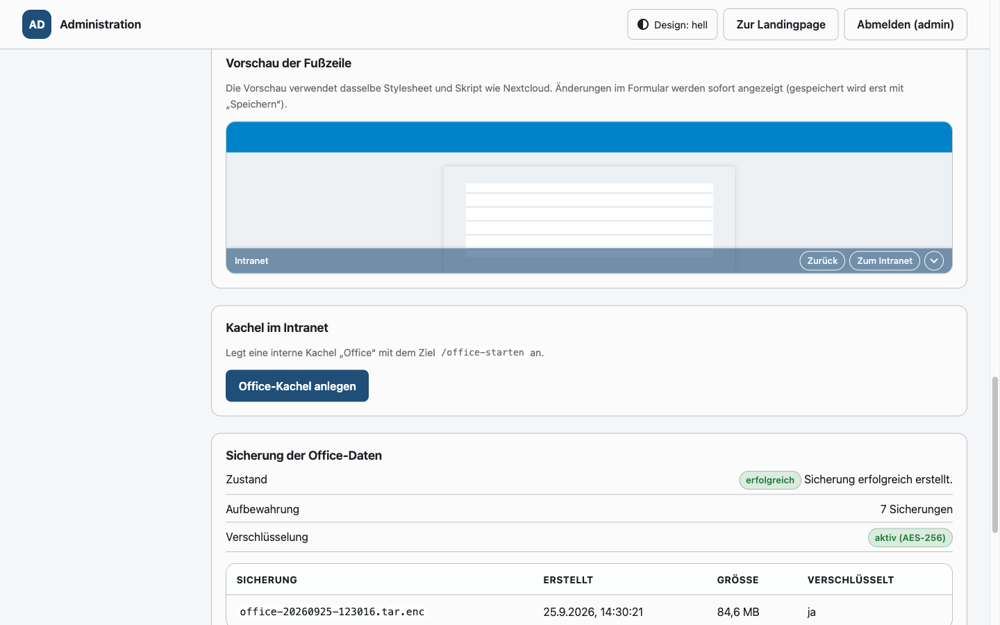 |

---

## 6a. Lokale KI

Unter **Admin → Office → Lokale KI** (`/admin/office#ki`) wird ein lokaler,
OpenAI-kompatibler KI-Endpunkt hinterlegt (z. B. Ollama, vLLM, LocalAI,
LM Studio). Er steht danach **allen Benutzern** in Nextcloud und Euro-Office
zur Verfügung; die Option „KI für alle Benutzer bereitstellen“ ist
standardmäßig aktiviert.

| Feld | Bedeutung |
| --- | --- |
| Anzeigename | Name des Anbieters in Nextcloud und im KI-Plugin der Editoren |
| Adresse | Basisadresse **inklusive** `/v1`, z. B. `http://ki-server:11434/v1` (muss aus den Containern `nextcloud` und `eurooffice` erreichbar sein) |
| Modell | Modell-ID, wie sie `GET /v1/models` meldet (z. B. `llama3.1:8b`) |
| Zeitlimit | Maximale Dauer je Anfrage (10–900 s) |
| API-Schlüssel | Optional; wird nie angezeigt. Das Secret `OFFICE_AI_API_KEY` (bzw. `OFFICE_AI_API_KEY_FILE`) hat Vorrang. |
| „Mit Audio arbeiten“ anbieten | Transkription, Sprachausgabe und Audio-Chat im Nextcloud-Assistenten (Standard: aus) |
| „Mit Bildern arbeiten“ anbieten | Bilderzeugung, Bildanalyse, Texterkennung und Sticker im Nextcloud-Assistenten (Standard: aus) |

| Admin: Lokale KI | Diagnose |
| --- | --- |
| 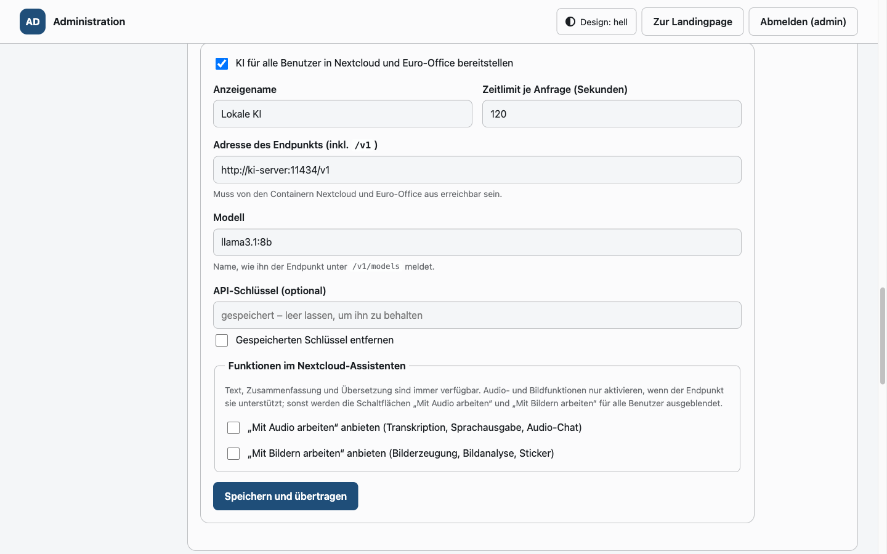 | 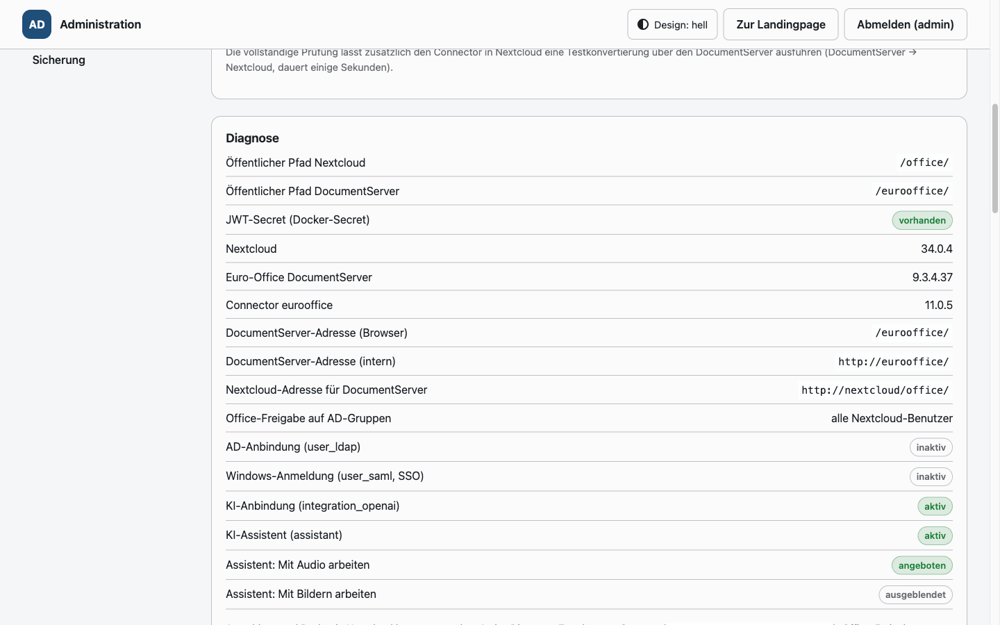 |

Beim Speichern werden die Einstellungen sofort weitergereicht und der Endpunkt
geprüft (`GET /models`, Modell vorhanden?):

- **Euro-Office:** Das Intranet schreibt `runtime.json` (`aiSettings`) in das
  gemeinsame Volume `office_ai`; der DocumentServer liest die Datei über
  `docker/eurooffice/local-production-linux.json` (`runtimeConfig.filePath`) und
  übernimmt Änderungen ohne Neustart. Das KI-Plugin der Editoren läuft damit im
  Servermodus: Anfragen gehen über den DocumentServer (`/ai-proxy`, JWT-geprüft),
  der API-Schlüssel erreicht den Browser nicht, Benutzer müssen nichts einrichten.
  Belegt werden die Aktionen Chat, Zusammenfassung, Übersetzung und Textanalyse.
  Das Plugin liegt im Image nur im AdminPanel; `docker/eurooffice/entrypoint.sh`
  kopiert es beim Start samt Plugin-SDK nach `sdkjs-plugins`, und
  `local-production-linux.json` startet es automatisch (Reiter „AI“ in allen
  Editoren). Ist es das einzige Plugin, legen die Editoren die Schaltfläche für
  Hintergrund-Plugins nicht an und die Registrierung bricht ab; das Startskript
  korrigiert dies in den `app.js` der Editoren. `EUROOFFICE_AI_PLUGIN=false`
  entfernt das Plugin.
  Hinweis: Die KI-Einstellungen im AdminPanel des DocumentServers sind damit
  ohne Wirkung.
- **Nextcloud:** Signierter Aufruf (`/apps/intranet_integration/api/ai`, JWT mit
  eigener Audience, an den Inhalt gebunden). `intranet_integration` aktiviert
  und konfiguriert `integration_openai` (Text, Zusammenfassung, Übersetzung)
  und `assistant` für alle Benutzer; erreichbar über das Stern-Symbol in der
  Kopfzeile. Die Aufgaben verarbeitet der Dienst `nextcloud-ai-worker`
  (startet jede Minute neu, damit er neu aktivierte Apps kennt). Der Hook installiert
  beide Apps beim Start (deaktiviert, `NEXTCLOUD_AI_APPS=true`); aktiviert
  bzw. deaktiviert werden sie ausschließlich über das Intranet.
  Ab `integration_openai` 6 wird ein eigener Dienst angelegt; weitere dort
  eingerichtete Dienste bleiben unberührt.
- **Audio und Bilder:** Ohne Freigabe schaltet `intranet_integration` die
  Audio- und Bildanbieter von `integration_openai` ab und blendet die
  zugehörigen Aufgabentypen für alle Benutzer aus (Nextcloud-Einstellung
  `ai.taskprocessing_type_preferences`, auch Typen anderer Apps wie die Sticker
  des Assistenten). Damit fehlen die Schaltflächen „Mit Audio arbeiten“ und
  „Mit Bildern arbeiten“ im Assistenten. Mit Freigabe werden die Anbieter
  eingeschaltet (der Endpunkt muss dann z. B. `/v1/audio/*` bzw.
  `/v1/images/*` beherrschen) und nur die vom Intranet ausgeblendeten Typen
  wieder freigegeben; eigene Einstellungen der Nextcloud-Admins bleiben
  erhalten. Euro-Office ist davon nicht betroffen.
- **Abgleich:** Die Office-Statusprüfung vergleicht einen Fingerabdruck
  (HMAC) des Stands mit Nextcloud und schreibt `runtime.json` bei Bedarf neu;
  Abweichungen (z. B. nach einer Neuinstallation) werden automatisch
  übertragen. „Jetzt prüfen“ fragt zusätzlich den Endpunkt ab. Die Zeile
  „KI (lokaler Endpunkt)“ beeinflusst den Office-Gesamtstatus nicht.

Wird die KI deaktiviert, schaltet Nextcloud `integration_openai` und
`assistant` ab und Euro-Office erhält keine KI-Vorgabe mehr.

| Nextcloud-Assistent (nur Text, Audio/Bilder ausgeblendet) | Euro-Office-Editor mit KI-Plugin |
| --- | --- |
| 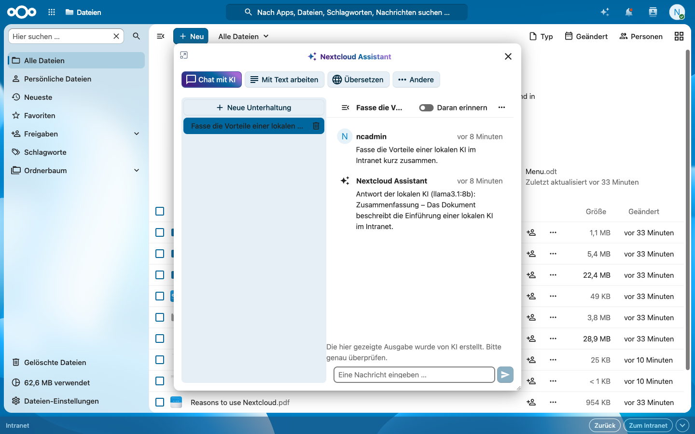 | 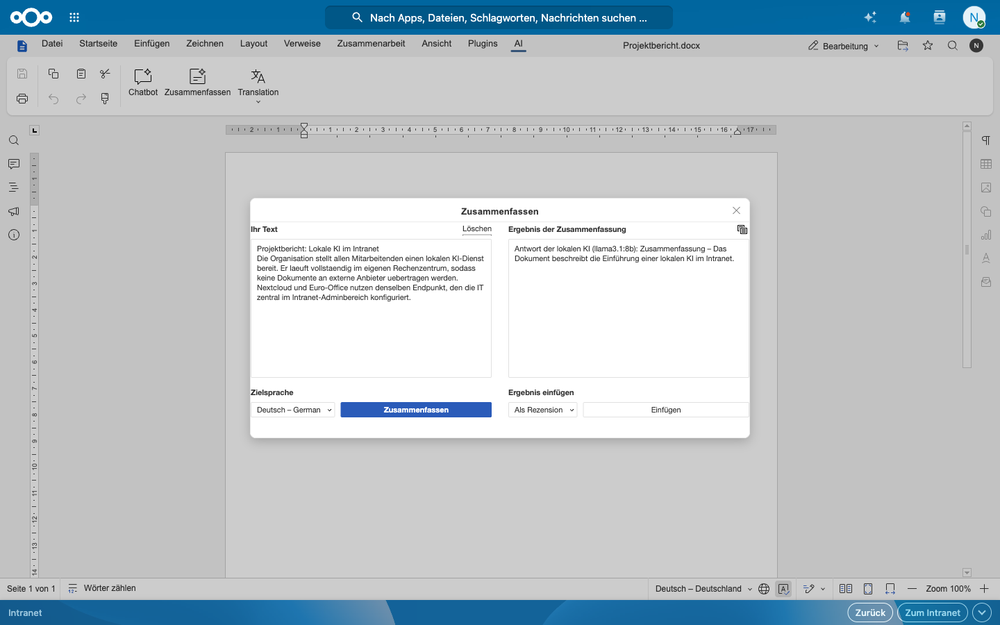 |

---

## 6b. Nextcloud-App-Store ausblenden

Unter **Admin → Office → Nextcloud-App-Store** (`/admin/office#app-store`)
lässt sich der App-Store von Nextcloud deaktivieren (Schalter „App-Store in
Nextcloud anzeigen“, Standard: an). Die Einstellung (`office_appstore_enabled`)
wird sofort signiert an `intranet_integration` übertragen
(`/apps/intranet_integration/api/appstore`, JWT mit eigener Audience, an den
Inhalt gebunden), die in Nextcloud `appstoreenabled` setzt:

| Stand | Wirkung in Nextcloud |
| --- | --- |
| angezeigt | `appstoreenabled` entfernt (Nextcloud-Standard), App-Store wie gewohnt |
| ausgeblendet | `appstoreenabled = false`: unter „Apps“ nur noch die installierten Apps (aktivieren/deaktivieren weiterhin möglich); Entdecken, Kategorien, App-Pakete sowie Installation und Aktualisierung über die Oberfläche entfallen |

Die Diagnose (Komponente „App-Store (Nextcloud)“, nur informativ) vergleicht
den Stand bei jeder Prüfung und überträgt bei Abweichung erneut – auch wenn
`appstoreenabled` von Hand geändert wurde. Die Einrichtung beim Containerstart
(`hooks/intranet-setup.sh`) und `./scripts/office-update.sh` geben den
App-Store nur für das Installieren bzw. Aktualisieren der benötigten Apps
kurzzeitig frei und blenden ihn danach wieder aus.

---

## 7. Sicherung und Wiederherstellung

```bash
./scripts/office-backup.sh                                   # sofort sichern
./scripts/office-restore.sh                                  # vorhandene Sicherungen anzeigen
./scripts/office-restore.sh office-20260101-020000.tar.enc   # wiederherstellen
./scripts/office-restore.sh office-….tar.enc --with-intranet # inkl. Intranet-Datenbank/-Dateien
```

- Gesichert werden Nextcloud (Konfiguration, Apps, Daten), PostgreSQL-Dump,
  DocumentServer-Daten sowie Datenbank und Dateien des Intranets. Letztere
  werden nur mit `--with-intranet` zurückgespielt.
- Während der Sicherung ist Nextcloud kurz im Wartungsmodus.
- Archive werden mit AES-256 verschlüsselt (Passphrase im Secret
  `office_backup_passphrase` – **getrennt aufbewahren**, ohne sie ist keine
  Wiederherstellung möglich).
- Ziel `OFFICE_BACKUP_DIR` (Standard `./backups`), Aufbewahrung
  `OFFICE_BACKUP_RETENTION` (Anzahl), tägliche Sicherung zur Stunde
  `OFFICE_BACKUP_SCHEDULE_HOUR` (leer = nur manuell).
- Mit Speicher-Tiering werden ausgelagerte Dateien als Platzhalter („Sparse“)
  gesichert und belegen im Archiv keinen Platz; die vollständigen Daten liegen
  im Cold-Tier (SMB-/S3-Tier). Wiederherstellung aus einem Speicherziel:
  `./scripts/storage-restore.sh` ([docs/storage.md](storage.md#7-sicherung-und-wiederherstellung)).

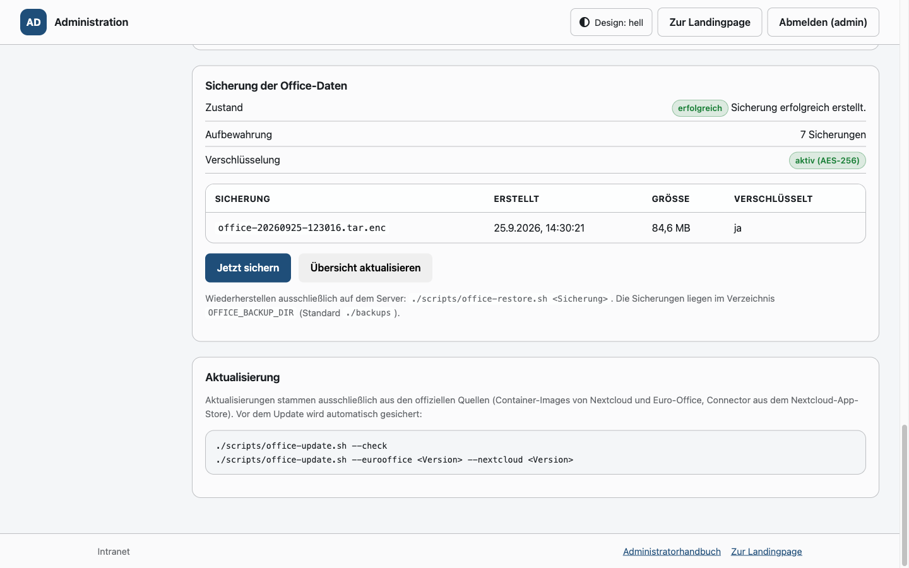

---

## 8. Überwachung (SNMP)

Der Container `snmp` meldet zusätzlich `nextcloud`, `nextcloud_db`,
`nextcloud_redis`, `eurooffice` und `office_workflow` (Nextcloud und
DocumentServer erreichbar). Ist Office nicht bereitgestellt, liefern die
Einträge `UNKNOWN` (3). OIDs: siehe README, Abschnitt SNMP-Überwachung.
Das Speicher-Tiering meldet `storage_ha`, `storage_sync`, `storage_hot_fill`
und `storage_cold_fill` (Index 13–16) sowie `storage_metrics` und
`storage_targets` ([docs/storage.md](storage.md#6-überwachung-per-snmp)).

---

## 9. Sicherheit

- Alle Secrets liegen als Dateien unter `./secrets/` (Docker-Secrets), nie in
  der `.env` oder im Repository.
- Nextcloud ↔ DocumentServer und Intranet ↔ Office sind per JWT abgesichert.
- Anmelde-Tokens für Nextcloud nutzen einen abgeleiteten Schlüssel, sind
  60 Sekunden gültig und nur einmal verwendbar; der Testmodus
  (`SSO_FAKE_USER`) ist in `APP_ENV=production` wirkungslos.
- Datenbank und Redis sind nur im internen Netz erreichbar.
- `auth` entfernt von außen gesendete `X-Remote-User`-/`X-Remote-Groups`-Header.
  Das Intranet wertet sie nur von `SSO_TRUSTED_PROXY` aus.
- Vorschau- und Vorschlags-Endpunkte sind nur für angemeldete Administratoren
  erreichbar und werden nicht zwischengespeichert.
- Netzlaufwerke: Die Meldung (`/sso/laufwerke`) gilt nur für den per
  Windows-Anmeldung erkannten Benutzer und nur mit dem Header
  `X-Intranet-Client: netzlaufwerke` ohne `Origin` – fremde Webseiten können
  sie also nicht per Formular auslösen. Server-, Freigabe- und Pfadnamen werden
  im Intranet und in Nextcloud streng geprüft. Ausgeschlossene Laufwerke
  verlassen das Intranet nie. Windows-Kennwörter liegen nur verschlüsselt in
  Nextcloud (Credentials-Manager), nie im Intranet.

---

## 10. Grenzen und Hinweise

- AD-Gruppen, NTLM-SSO und die Nextcloud-AD-Anbindung benötigen eine reale
  Domäne. Sie sind mit Unit-Tests und Testdoppeln abgedeckt, konnten ohne
  Domäne aber nicht Ende-zu-Ende geprüft werden.
- Die Mitglieder-Auflösung stellt je Gruppe eine LDAP-Abfrage. Der Gruppen-Pfad
  sollte daher auf die relevanten OUs begrenzt sein.
- Gruppennamen werden ohne Beachtung der Groß-/Kleinschreibung verglichen
  (Attribut `cn` bzw. `LDAP_GROUP_NAME_ATTRIBUTE`).
- Nextcloud schreibt beim Start zusammengeführte Werte in `config.php` zurück;
  maßgeblich bleiben die vom Hook verwalteten Einstellungen.
- Netzlaufwerke werden bei der Windows-Anmeldung gemeldet; nachträglich
  verbundene Laufwerke erscheinen erst nach der nächsten Anmeldung (oder einem
  erneuten Skriptlauf). Bei mehreren Geräten gilt die letzte Meldung.
  Kerberos-Delegation an die Dateiserver wird nicht genutzt – daher die
  einmalige Kennworteingabe.
