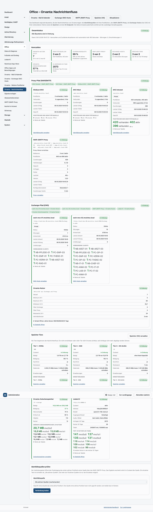
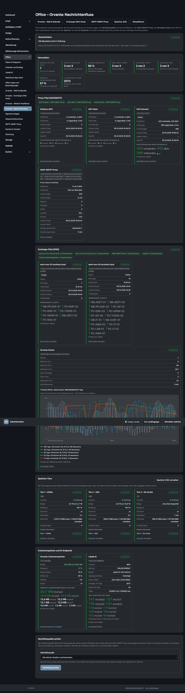
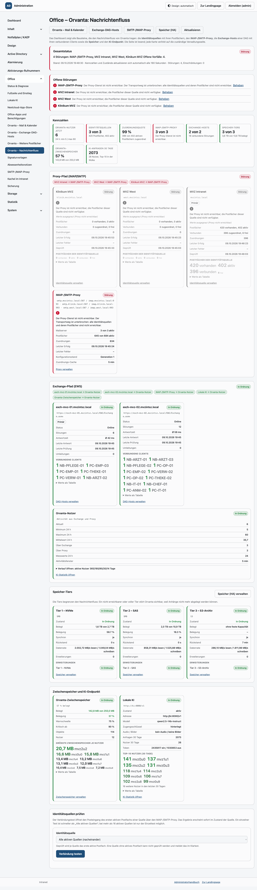
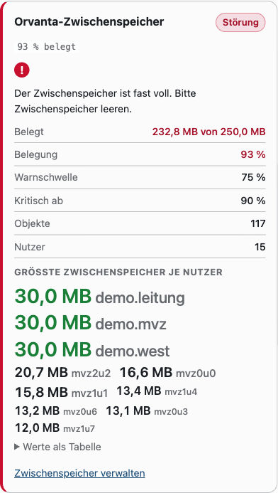
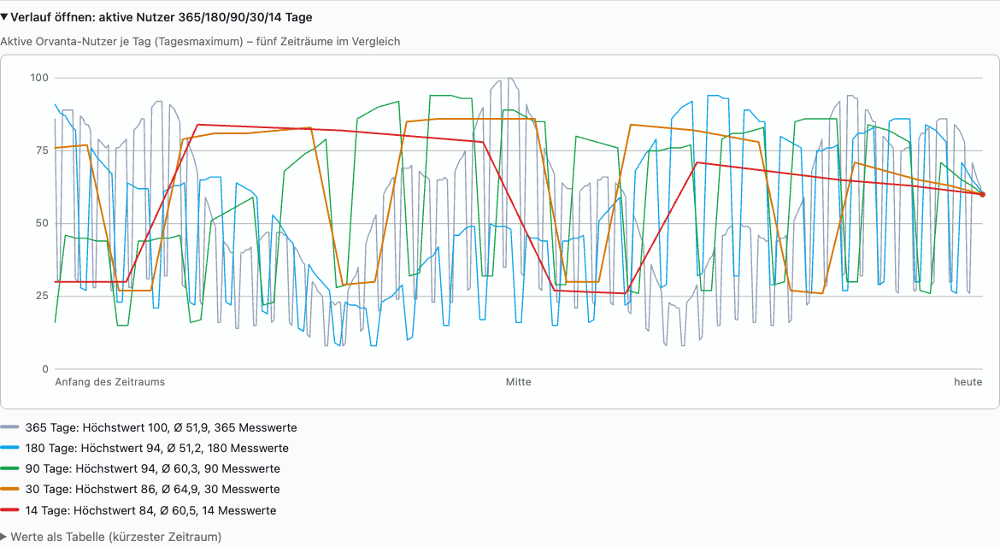

# Orvanta – Nachrichtenfluss-Dashboard (Konzept und Referenz)

Diese Datei ist **Konzept, Umsetzungsplan und Referenz** des Admin-Dashboards
„Orvanta – Nachrichtenfluss“. Sie beschreibt zuerst, *was* dargestellt wird und
*woher* die Werte kommen, danach die Zustands- und Fehlersemantik, die
Darstellungsformen und schließlich die Umsetzung in Schritten.

- Seite: `GET /admin/office/orvanta/nachrichtenfluss` (Adminbereich, Rolle `admin`)
- Navigation: Office → Orvanta → „Orvanta – Nachrichtenfluss“ (`office_orvanta_flow`)
- Live-Daten: `GET /admin/office/orvanta/nachrichtenfluss/daten` (JSON, `Cache-Control: no-store`)
- Aktion: `POST /admin/office/orvanta/nachrichtenfluss/quellen/pruefen` (CSRF, Verbindungstest je Identitätsquelle)

Verwandte Dokumente: [`orvanta-referenz.md`](orvanta-referenz.md) (Orvanta intern),
[`mail-proxy-referenz.md`](mail-proxy-referenz.md) (IMAP-/SMTP-Proxy),
[`storage-referenz.md`](storage-referenz.md) (Speicher-Tiering),
[`orvanta.md`](orvanta.md) (Anwenderbetrieb).

## 1. Zweck

Das Dashboard beantwortet in einer Ansicht die Frage: **„Welche Bausteine
tragen den Nachrichtenfluss von Orvanta gerade, und welcher davon stört ihn?“**

Es verbindet die drei Transportwege, die Orvanta bedient:

1. **Exchange-Pfad** – Orvanta spricht per EWS direkt mit einem Exchange-Host
   (bzw. den Hosts einer Database Availability Group, DAG).
2. **Proxy-Pfad** – Orvanta spricht mit dem IMAP-/SMTP-Proxy, der die Postfächer
   von Identitätsquellen (Active-Directory-Domänen) bedient. Für diese Benutzer
   wird Exchange nicht abgefragt.
3. **KI-Pfad** – Textunterstützung über den konfigurierten KI-Endpunkt.

Dazu kommen die **Speicher** (Storagetiers und Orvanta-Zwischenspeicher), weil
sie den Nachrichtenfluss zwar nicht transportieren, aber begrenzen: ein voller
Zwischenspeicher oder ein nicht synchronisiertes Tier stört Orvanta sichtbar.

Das Dashboard ist **lesend**. Es verändert keine Konfiguration; jede Karte
verlinkt auf die zuständige Verwaltungsseite.

## 2. Aufbau der Seite

Die Seite besteht aus vier Blöcken:

| Block | Inhalt |
| --- | --- |
| **Kopfleiste** | Gesamtstatus-Ampel, Anzahl Störungen, Stand, Auto-Aktualisierung |
| **Kennzahlen** | Acht Kennzahlen (KPI) mit Sprungmarken zu den Karten |
| **Flussgrafik** | Zwei Spuren (Proxy-Pfad, Exchange-Pfad) mit den Knoten und Kanten |
| **Speicher- und KI-Block** | Storagetiers, Orvanta-Zwischenspeicher, KI-Endpunkt |

Abbildungen der fertigen Seite: Abschnitt [13. Abbildungen](#13-abbildungen).

Die Flussgrafik ist **kein Canvas und kein fremdes Diagramm**, sondern
serverseitig gerendertes HTML/CSS: Knoten sind `<article>`, Kanten sind
CSS-gezeichnete Verbindungen. Damit bleibt die Seite ohne JavaScript
vollständig lesbar, druckbar und per Tastatur bedienbar.

```
Proxy-Pfad:     [Identitätsquellen mit Mailserver] --→ [IMAP-/SMTP-Proxy] --→ [Postfächer]
                                              │
Exchange-Pfad:  [Identitätsquellen ohne Mailserver] --→ [Exchange-Host / DAG-Hosts] --→ [verbundene Clients]
                                              │
                              beide  ────→  [Orvanta-Nutzer (Verlauf)]
                                              │
                              [KI-Endpunkt] ──┘   [Storagetiers]  [Zwischenspeicher]
```

Welcher Spur eine Identitätsquelle angehört, entscheidet allein ihre
Proxy-Konfiguration (`mail_proxy_servers`): Mit hinterlegtem Mailserver steht
sie vor dem Proxy, ohne steht sie vor dem bzw. den Exchange-Hosts. Quellen im
Exchange-Pfad hängen nicht hinter dem Proxy und werden deshalb **nicht
geprüft** – sie zählen nie als „Einschränkung“ (ungeprüft), sondern folgen dem
Zustand der Exchange-Hosts.

## 3. Elemente im Detail

### 3.1 Identitätsquellen (Wolkendarstellung)

Je Identitätsquelle **mit Proxy-Konfiguration** eine Karte mit einer **Wolke**
aus den Postfachzahlen. Quellen **ohne** Proxy-Konfiguration erscheinen im
Exchange-Pfad ohne Wolke mit den Fakten Transportweg „Exchange (EWS)“,
Exchange-Hosts online/gesamt, „Proxy: nicht konfiguriert“ und „Prüfung: über die
Exchange-Hosts“ (Feld `transport` = `exchange`).

| Anzeige | Bedeutung | Datenquelle |
| --- | --- | --- |
| Bezeichnung, Domain | Name und Domäne der Quelle | `MailProxyService::sources()`, `MailProxyService::domainFromDn()` |
| Primärquelle | Quelle aus den Orvanta-Einstellungen (id 0) | `IdentitySourceRepository`, Einstellungen |
| **Vorhanden** | Postfächer der Quelle insgesamt | neu: `MailProxyRepository::sourceCounts()` |
| **Aktiv** | davon aktiv (`mail_proxy_mailboxes.active = 1`) | dito |
| **Verbunden** | davon mit gültiger Zuordnung zu einem AD-Benutzer | dito (`mail_proxy_mappings`) |
| **Frei** | aktiv, aber noch keinem Benutzer zugeordnet | dito |
| Zustand | `ok` / `warn` / `error` / `off` | neu: `mail_proxy_source_state` + Proxy-Zustand |

Wolkengröße: Die Wörter „vorhanden N“, „aktiv N“, „verbunden N“, „frei N“ und
der Quellenname werden nach ihrem Zahlenwert in fünf Größenstufen
(`cloud__word--l1` … `--l5`) gesetzt und gestaffelt angeordnet.

### 3.2 IMAP-/SMTP-Proxy (Containerstatus)

| Anzeige | Datenquelle |
| --- | --- |
| Erreichbarkeit, Meldung | `HttpMailProxyTransport::health()` → `{ok, message, details}` |
| Version, Laufzeit, Verbindungen/max, gepoolt, Anfragen, Fehler | `health()['details']` |
| Letzter erfolgreicher Vorgang, letzter Fehler | `mail_proxy_state` (`last_success_at`, `last_error_at`, `last_error`) |
| Konfigurationsstand | `mail_proxy_state.generation` (Cache-Generation) |
| Mailserver aktiv/gesamt, Endpunkte (SMTP/IMAP, TLS) | `mail_proxy_servers` |
| Cache-Lebensdauer | `MailProxyService::diagnostics()['cache_ttl']` |

**Wichtig:** Die Anwendung erhält bewusst **keinen Zugriff auf `docker.sock`**
(siehe `OfficeBackupService`). Der „Containerstatus“ ist deshalb der
selbstgemeldete Zustand des Proxy-Dienstes aus dessen `/health`-Endpunkt –
also die betrieblich relevante Sicht (erreichbar und arbeitsfähig), nicht der
Docker-Status. Ist der Container gestoppt, ist `/health` nicht erreichbar und
`ok` wird `false`.

### 3.3 Exchange-Host bzw. DAG-Hosts mit verbundenen Clients

| Anzeige | Datenquelle |
| --- | --- |
| Host, EWS-Adresse, primär | `OrvantaExchangePool::overview()['hosts']` |
| Status (Online/Gestört/Wartung/Ungeprüft) | dito (`OrvantaExchangeHostRepository::hosts()`) |
| Latenz Ø, letzte Antwort, letzte Prüfung | dito |
| Verbundene Sitzungen | `sessionCounts()` |
| Summe der Umleitungen (Failover) | `orvanta_exchange_sessions.failovers` |
| Letzter Fehlertext | `orvanta_exchange_hosts.last_error` |
| **Verbundene Clients (Wolke)** | `activeSessions(SESSION_TTL)` → `client_host`, sonst `client_ip` |

Die Client-Wolke zeigt je Host die aktiven Clients (`client_host`, sonst
`client_ip`), Größe nach Anzahl der Sitzungen, und darunter „N Benutzer“. Ohne
Exchange-Konfiguration (reiner Proxy-Betrieb) entfällt die Wolke; die Karte
zeigt dann nur den konfigurierten Host mit dem Hinweis „Proxy-Betrieb“.

### 3.4 Orvanta-Nutzer (aktuell / min / max) mit Verlaufsgrafik

| Anzeige | Bedeutung | Datenquelle |
| --- | --- | --- |
| **Aktuell** | Nutzer mit Orvanta-Aktivität im Zeitfenster (300 s) | neu: `orvanta_activity` |
| **Min / Max 24 h** | kleinster/größter gemessener Wert der letzten 24 h | neu: `orvanta_user_samples` |
| **Ø 24 h** | Mittelwert der Proben der letzten 24 h | dito |
| Aufteilung | Exchange / Proxy / KI | `orvanta_activity.backend`, `orvanta_user_samples` |
| **Verlauf** | Tagesmaximum je Tag, 365/180/90/30/14 Tage als Overlay | `orvanta_user_samples` |

Ein Klick auf die Kachel öffnet die Verlaufsgrafik als Overlay (siehe § 6).

**Definition „aktiver Nutzer“:** ein Benutzer, dessen letzte Orvanta-Aktivität
höchstens 300 Sekunden zurückliegt. Die Aktivität wird an der einzigen
Eintrittstelle der Orvanta-Schnittstelle (`OrvantaApiController::handle()`)
erfasst, unabhängig davon, ob der Zugriff über Exchange oder den Proxy läuft.
Damit ist auch der reine Proxy-Betrieb messbar, in dem keine
Exchange-Sitzungstabelle gefüllt wird.

**Proben:** `OrvantaPresenceService` schreibt bei Bedarf (höchstens alle 300 s)
eine Probe des aktuellen Werts nach `orvanta_user_samples`. Zusätzlich schreibt
der Archivierungs-Worker (`scripts/orvanta_archive_worker.php`, läuft im
Container `mail-archive`) eine Probe und räumt alte Zeilen auf. So entsteht
während der Nutzung ein 5-Minuten-Raster und in Ruhezeiten mindestens ein Wert
pro Worker-Lauf.

### 3.5 KI-Endpunkt

| Anzeige | Datenquelle |
| --- | --- |
| Name, Adresse, Modell, Audio/Bilder | `OfficeAiService` (`enabled()`, `name()`, `url()`, `model()`, `audioEnabled()`, `imagesEnabled()`) |
| Zustand (aktiv/konfiguriert/aus) | `OfficeAiService::isActive()`, `isConfigured()`, `hasApiKey()` |
| **Top-10-Nutzer (Wolke)** | `OrvantaRepository::aiUsageTopUsers()` (30 Tage), Größe nach Anfragen |
| **X weitere Nutzer** | `OrvantaRepository::aiTokenTotals()['users']` minus 10 |
| **Gesamtzahl Anfragen 30 Tage** | `aiTokenTotals()['requests']` |
| Token (Ein-/Ausgabe) | `aiTokenTotals()` |

Die Namen der Nutzer werden **nur** angezeigt, wenn die Einstellung
`flow_ai_user_names` gesetzt ist; sonst bleiben die Werte pseudonym
(„Benutzer 1 …“, Rangfolge nach Anfragen). Die pseudonyme Variante
`OrvantaRepository::aiUsagePerUser()` der KI-Statistik ordnet dagegen nach
erster Nutzung im Zeitraum.

Der LLMInt-Stack unter `/ki/` (siehe [`llmint.md`](llmint.md)) ist ein eigenes
Compose-Projekt ohne Nutzungszähler in dieser Datenbank und daher **nicht**
Teil dieses Dashboards.

### 3.6 Storagetiers

| Anzeige | Datenquelle |
| --- | --- |
| Tier-Bezeichnung, Art (SMB/S3) | `StorageService::overview()['targets']` (`tierViews()`) |
| Zustand (online/offline/invalid/disabled/unknown) | dito |
| **Belegt / von in GB** | `used` aus `total_bytes − free_bytes`, `total_bytes` |
| Belegung % + Einfärbung | `fill` (`ok`/`degraded`/`critical`, Schwellen 85 %/95 %) |
| Erweiterungen (Extensions) des Tiers | `members` |
| Synchronität, Rückstand (Lag), Datenrate | `in_sync`, `lag_seconds`, `read_bps`/`write_bps` |
| Lokaler Puffer, Modus, Prognose | `overview()['local']`, `['mode']`, `['forecast_text']` |

S3-Ziele ohne angegebene Kapazität haben keinen Füllstand; sie werden als
„ohne feste Kapazität“ gekennzeichnet (Feld `unbounded`).

### 3.7 Orvanta-Zwischenspeicher (Cache-Storage)

| Anzeige | Datenquelle |
| --- | --- |
| **Belegt / von** | `OrvantaRepository::cacheUsage()` (Summe), `OrvantaConfigService::cacheQuotaBytes()` |
| Belegung % + Einfärbung | `OrvantaAttachmentService::usage()` (`percent`) |
| Objekte | `orvanta_cache_items` |
| Top-Nutzer des Zwischenspeichers | `OrvantaRepository::cacheUsagePerUser()` |

Einfärbung nach prozentualer Belegung (Konstanten im Dienst, dokumentiert):

| Belegung | Zustand | Darstellung |
| --- | --- | --- |
| < 75 % | `ok` | grün |
| 75 – 89 % | `warn` | gelb |
| ≥ 90 % | `critical` | rot |

## 4. Zustands- und Fehlersemantik

### 4.1 Vier Knotenzustände

| Zustand | Bedeutung | Darstellung |
| --- | --- | --- |
| `ok` | in Ordnung | grüner Punkt, kein Symbol |
| `warn` | eingeschränkt (Wartung, ungeprüft, Warnschwelle, Lag) | gelber Punkt |
| `error` | ausgefallen, gestört oder nicht erreichbar | **rotes Ausrufezeichen** |
| `off` | deaktiviert / nicht konfiguriert | grau, gedämpft, kein Ausrufezeichen |

Farbe wird **nie allein** verwendet: jeder Zustand hat zusätzlich Symbol und
Text (`<span class="badge badge--warn">Gestört</span>` plus
`<span class="flow-alert" aria-hidden="true">!</span>` mit einem
`visually-hidden`-Text „Störung“).

### 4.2 Ausgrauen (Dämpfen von Kindknoten)

| Ursache | Folge |
| --- | --- |
| Proxy `error` (nicht erreichbar) | **alle Identitätsquellen des Proxy-Pfads und deren Postfächer** gedämpft, Hinweis am Proxy „Transportweg unterbrochen“ |
| Identitätsquelle `error` (Netz/Auth) | **deren Postfächer** gedämpft |
| Exchange-Host `error` | **dessen verbundene Clients** gedämpft |
| **Alle** Exchange-Hosts `error` | **Identitätsquellen des Exchange-Pfads** gedämpft („Exchange nicht erreichbar“) |
| Storagetier `offline`/`disabled` | Tier gedämpft, Warnhinweis statt Füllstand |
| Zwischenspeicher `critical` | Karte rot, Hinweis auf Zwischenspeicher leeren (Link) |

Gedämpfte Knoten behalten ihre Zahlen, werden aber mit der Klasse
`flow-node--muted` (Graustufen, reduzierte Deckkraft) und dem Zusatz
„(nicht erreichbar)“ dargestellt. Die Kanten (`flow-edge`) zum gedämpften
Nachbarn werden gestrichelt und rot.

### 4.3 Gesamtstatus

Die Kopfleiste fasst zusammen: `error`, sobald ein Knoten `error` ist; sonst
`warn`, sobald ein Knoten `warn` ist; sonst `ok`. Die Anzahl der Störungen und
die betroffenen Bereiche werden als Text genannt („2 Störungen: Exchange-Host
ex2019b, Identitätsquelle dom2“).

## 5. Wolkendarstellung

Die Wolken sind **HTML-Text, kein Bild**. Das ist bewusst so gewählt:

- **Lesbarkeit und Skalierung:** Text ist auf Retina-Displays und beim Zoomen
  scharf, ohne zweite Bildauflösung.
- **Barrierefreiheit:** Die Werte sind echter Text (vorlesbar, durchsuchbar).
- **CSP:** Die Seite verbietet Inline-Stile (`style-src 'self' 'nonce-…'`).
  Größen und Staffelung laufen deshalb ausschließlich über CSS-Klassen.
- **Keine Messung nötig:** Der Browser bricht die Zeilen selbst um. Eine
  SVG-Wolke bräuchte Schriftmetriken, die ohne neue Abhängigkeit nicht
  verfügbar sind.

Umsetzung: `<ul class="cloud">` mit `<li class="cloud__word cloud__word--l3">`.
Die Stufe ergibt sich aus dem Wert (`l1` klein … `l5` groß), zusätzlich werden
`cloud__word--up` / `--down` für die gestaffelte Anordnung vergeben. Unter der
Wolke steht dieselbe Zahl immer auch in einer Werteliste
(`<details><summary>Werte als Tabelle</summary>…`), damit die Wolke nie die
einzige Quelle eines Werts ist.

Die Stufen sind feste Bänder des Wertanteils am größten Wert der Liste
(`OrvantaFlowCloud::level()`):

| Stufe | Wertanteil am Höchstwert |
| ----- | ------------------------ |
| `l5`  | ≥ 90 %                   |
| `l4`  | ≥ 70 %                   |
| `l3`  | ≥ 50 %                   |
| `l2`  | ≥ 30 %                   |
| `l1`  | darunter (auch 0)        |

Ohne Werte (Höchstwert 0) bleibt es bei `l1`. Die Staffelung wechselt mit der
Position (`--up` an geraden, `--down` an ungeraden Positionen), die Reihenfolge
der Einträge gibt also der Aufrufer vor: absteigend nach Wert.

Für Werte, die nicht als reine Zahl gelesen werden sollen (Belegung im
Zwischenspeicher), nimmt die Wolke zusätzlich den Schlüssel `display` entgegen:
Er ersetzt die angezeigte Zahl in Wolke und Wertetabelle, während die
Größenstufe weiter aus dem Zahlenwert `value` folgt. Die Wertetabelle erlaubt
dafür eigene Spaltenköpfe (`OrvantaFlowCloud::table($entries, $summary,
$headLeft, $headRight)`).

## 6. Verlaufsgrafik (Overlay, retinafreundlich)

Die Grafik liegt in einem `<details>`-Overlay und wird per Klick auf die
Kachel „Orvanta-Nutzer“ geöffnet — ohne JavaScript, tastaturbedienbar
(`<summary>` ist fokussierbar). Ohne JavaScript bleibt die Grafik zusätzlich
offen sichtbar, weil sie serverseitig gerendert wird.

Eigenschaften:

- **Vektorgrafik:** serverseitiges SVG mit `viewBox` und CSS
  `width: 100%; height: auto` → auf jeder Bildschirmdichte scharf („retina“).
- **Keine Inline-Stile:** nur SVG-Präsentationsattribute (Geometrie, `font-size`)
  und CSS-Klassen für Farben — CSP-konform wie `OrvantaAiCharts`.
- **Fünf Reihen als Overlay:** 365, 180, 90, 30 und 14 Tage. Jeder Zeitraum
  spannt die volle Breite (x = Tagindex des Zeitraums), der rechte Rand ist
  „heute“. So sind Form und Niveau der Zeiträume direkt vergleichbar.
- **y-Achse gemeinsam:** 0 bis zum Höchstwert des längsten Zeitraums
  (Tagesmaximum aktiver Nutzer), vier Hilfslinien mit Wert.
- **Legende** je Zeitraum mit Farbe, Höchstwert und Mittelwert.
- **Wertetabelle** in einem `<details>` (alle Tage des kürzesten Zeitraums)
  als Textalternative.
- **`role="img"`** mit `aria-label`, zusätzlich `<title>` und `<desc>` im SVG.

## 7. Zusätzliche Elemente (über die Anforderung hinaus)

| Element | Begründung |
| --- | --- |
| Gesamtstatus-Ampel mit Störungszahl | Beantwortet „ist gerade alles in Ordnung?“ ohne Lesen aller Karten |
| Kennzahlenleiste (8 KPI) | Vergleichswerte und Sprungmarken; identisch zu den Detailseiten definiert |
| **Störungsband** mit offenen Vorfällen (`Container::incidents()->openCount()`), Speicher-Alarm (`StorageService::dashboardAlert()`), Proxy-, Quellen- und Host-Fehlern | Bündelt alle Störungen an einer Stelle und verlinkt zur Behebung |
| Failover-Kennzahl (Summe der Umleitungen) | Zeigt, ob die DAG-Verteilung tatsächlich greift |
| Proxy-Leistung (Anfragen, Fehler, Verbindungen, gepoolt, Generation) | Erkennt Überlast und veraltete Zuordnungscaches |
| Speicher-Prognose und Modus/Grund | Ordnet die Belegung zeitlich ein |
| Zuordnungsquote (verbundene ÷ aktive Postfächer) | Deckt Konfigurationslücken im Proxy auf |
| Direktlinks zu allen Detailseiten | Ein Klick zur Behebung statt Suche im Menü |
| Verweis auf die KI-Verlaufsgrafik (7/30/90 Tage) | Nutzt die vorhandene `OrvantaAiCharts`-Grafik statt sie zu duplizieren |
| Ohne-JavaScript-Vollständigkeit, Druckansicht, `prefers-reduced-motion` | Die Seite bleibt ein Nachschlagewerk, kein JavaScript-Programm |

## 8. Einstellungen

| Einstellung | Standard | Bedeutung |
| --- | --- | --- |
| `flow_ai_user_names` | `'0'` | KI-Nutzernamen im Dashboard anzeigen (sonst pseudonym) |

Die Einstellung liegt in `orvanta_settings` und wird über
`OrvantaConfigService` (Feld `DEFAULTS`, Formular Office → Orvanta) gepflegt.

Zeitfenster und Probenraster sind **Konstanten** im Dienst (bewusst keine
Einstellungen, um das Konfigurationsformular nicht zu überladen):

| Konstante | Wert | Bedeutung |
| --- | --- | --- |
| `OrvantaPresenceService::ACTIVE_WINDOW` | `300` s | Zeitfenster für „aktiver Nutzer“ |
| `OrvantaPresenceService::SAMPLE_INTERVAL` | `300` s | Mindestabstand zweier Proben |
| `OrvantaPresenceService::HISTORY_DAYS` | `400` | Aufbewahrung der Proben (Tage) |
| `OrvantaPresenceService::ACTIVITY_TTL` | `86400` s | Aufbewahrung der Aktivitätszeilen |
| `OrvantaFlowService::CACHE_WARN_PERCENT` | `75` | Zwischenspeicher: gelb ab |
| `OrvantaFlowService::CACHE_CRIT_PERCENT` | `90` | Zwischenspeicher: rot ab |

## 9. Datenmodell-Erweiterungen (Migration 048)

```sql
orvanta_activity        -- letzte Aktivität je Orvanta-Benutzer
  user_uid VARCHAR(190) PK, backend VARCHAR(16), first_seen_at, last_seen_at,
  requests INT UNSIGNED, KEY idx_orvanta_activity_seen (last_seen_at)

orvanta_user_samples   -- Proben der aktiven Nutzer
  id, sampled_at DATETIME UNIQUE, active_users, exchange_users, proxy_users,
  ai_users SMALLINT UNSIGNED, KEY idx_orvanta_user_samples_at (sampled_at)

mail_proxy_source_state -- Zustand je Identitätsquelle
  identity_source_id INT UNSIGNED PK, last_success_at, last_error_at,
  last_error VARCHAR(500), failures INT UNSIGNED, checked_at, updated_at
```

Datenschutz: `orvanta_activity` enthält nur Benutzerkennung, Backend und
Zeitstempel (keine Inhalte, keine Betreffzeilen, keine Empfänger) und wird nach
24 Stunden geräumt. `orvanta_user_samples` enthält ausschließlich Zähler.

## 10. Umsetzungsplan (Schritte)

| # | Schritt | Inhalt | Prüfung | Stand |
| --- | --- | --- | --- | --- |
| 1 | Konzept | Diese Datei | — | erledigt (`5d88753`) |
| 2 | Migration 048 | drei Tabellen, `database/migrations/AGENTS.md` nachziehen | `php -l`, `php scripts/migrate.php` (Docker) | erledigt (`c74d228`) |
| 3 | Repository (Proxy) | `MailProxyRepository::sourceCounts()`, `sourceStates()`, `recordSourceSuccess()`, `recordSourceError()` | neue Unit-Tests | erledigt (`f559858`) |
| 4 | Repository (Fluss) | `OrvantaFlowRepository`: Aktivität, Proben, Statistik, Verlauf, Räumen | neue Unit-Tests | erledigt (`8e83303`) |
| 5 | Dienst Präsenz | `OrvantaPresenceService` (`touch()`, `sample()`, `stats()`, `history()`), `Container::orvantaPresence()` | neue Unit-Tests | erledigt (`51a36bd`) |
| 6 | Erfassung | `OrvantaApiController::handle()` ruft `touch()`; Archivierungs-Worker ruft `sample()` + `purge()` | `php -l`, bestehende Tests | erledigt (`51a36bd`) |
| 7 | Quellenzustand | Erfolg/Fehler im Mailpfad je Identitätsquelle erfassen, Admin-Prüfung | neue Unit-Tests | erledigt (`97af08b`) |
| 8 | Grafik | `OrvantaFlowCharts`: Overlay-SVG 365/180/90/30/14 Tage | neue Unit-Tests | erledigt (`d1038c2`) |
| 9 | Wolke | `OrvantaFlowCloud`: Werteliste, Größenstufen, Staffelung, Escaping | neue Unit-Tests | erledigt (`540c317`) |
| 10 | Aggregation | `OrvantaFlowService`: Knoten, Kanten, Zustände, Dämpfung, Gesamtstatus, Kennzahlen | neue Unit-Tests | erledigt (`4906daa`) |
| 11 | Einstellung | `flow_ai_user_names` in `OrvantaConfigService` + Formular | `php -l`, bestehende Tests | erledigt (`f8e77d6`) |
| 12 | Controller, Routen, Navigation | `Admin\OrvantaFlowController`, drei Routen, Nav-Eintrag | `php -l` | erledigt (`52323b2`) |
| 13 | View | `views/admin/orvanta-flow.php` | — | erledigt (`ae6941a`) |
| 14 | CSS | `public/assets/css/admin.css`: Knoten, Kanten, Wolke, Overlay, Verlauf | — | erledigt (`579364f`) |
| 15 | JavaScript | `public/assets/js/admin-orvanta-flow.js`: Auto-Aktualisierung der Kachelwerte | — | erledigt (`409cb4e`, `685f961`) |
| 16 | Tests | `tests/Unit/OrvantaFlowTest.php` | `php tests/run.php` | erledigt (`0cd6b66`) |
| 17 | Doku | `agentsindex.md` (Routen/Tabellen/Nav), `orvanta-referenz.md`, `orvanta.md`, diese Datei, Screenshots | `php tests/run.php`, Sichtprüfung | erledigt |

Jeder Schritt ist ein eigener Commit mit deutscher Betreffzeile
(`AGENTS.md` → Git).

## 11. Tests

| Test | Prüft |
| --- | --- |
| Aktivität | `touch()` legt an und aktualisiert, `requests` zählt hoch, Backend wird nachgeführt |
| Aktive Nutzer | Zeitfenster wird eingehalten, Exchange/Proxy/KI getrennt gezählt |
| Proben | `sample()` schreibt genau eine Zeile je Zeitraster, drosselt, überschreibt nicht |
| Statistik 24 h | `aktuell`, `min`, `max`, `Ø` aus Proben und Aktivität |
| Verlauf | Tagesmaximum je Tag, Zeiträume 14/30/90/180/365, fehlende Tage erzeugen keine Fehler |
| Räumen | Aktivität älter als 24 h und Proben älter als 400 Tage werden entfernt |
| Proxy-Zählung | `sourceCounts()` trennt Quellen, zählt aktiv/verbunden/frei korrekt |
| Quellenzustand | Erfolg löscht den Fehler, Fehler setzt Zeitpunkt, Text wird auf 500 Zeichen begrenzt |
| Grafik | fünf Reihen, `viewBox`, keine Inline-Stile, Escaping, leere Daten ohne Fehler |
| Wolke | Größenstufen monoton, Werteliste vollständig, Escaping, Obergrenze der Wörter |
| Aggregation | Proxy-Ausfall dämpft Quellen und Postfächer, Quellenfehler dämpft nur dessen Postfächer, Host-Fehler dämpft nur dessen Clients, Gesamtstatus `error` > `warn` > `ok` |
| Cache | Einfärbung an den Schwellen 75 % und 90 %, ohne Quote kein Prozentwert |
| KI | Namen nur mit `flow_ai_user_names`, „X weitere Nutzer“ nie negativ, Summen korrekt |

## 12. Betrieb und Grenzen

- **Kein Docker-Zugriff:** Der Proxy-Status stammt aus `/health`, nicht aus
  Docker. Ist der Container gestoppt, meldet `/health` einen Fehler — das ist
  die betrieblich richtige Aussage.
- **Proxy-Nutzer ohne Exchange:** Sie werden über die Aktivitätserfassung an
  der Orvanta-Schnittstelle gezählt. Nutzt jemand ausschließlich das
  Nextcloud-Plugin ohne die Orvanta-Oberfläche, erscheint er nicht in der
  Nutzerzahl; die KI- und Zwischenspeicher-Aktivität wird zusätzlich
  herangezogen, wo sie vorliegt.
- **Ruhezeiten:** Ohne Nutzung entstehen Proben nur beim Lauf des
  Archivierungs-Workers; die Verlaufsgrafik zeigt dann ein gröberes Raster
  (Tagesmaximum bleibt korrekt).
- **Aufbewahrung:** 400 Tage Proben (rund 115 000 Zeilen im 5-Minuten-Raster)
  und 24 Stunden Aktivität; das Räumen läuft im Archivierungs-Worker.
- **Keine neuen Abhängigkeiten:** Wolken und Grafik sind HTML/CSS/SVG aus
  eigenen Mitteln, ohne Composer, npm oder CDN.

## 13. Abbildungen

Alle Aufnahmen stammen aus dem Docker-Demobetrieb (`docker compose up` mit
`app`, `db` und `mail-proxy`) und wurden im hellen Design, im dunklen Design
sowie in zwei Störungslagen erstellt.

### 13.1 Regelbetrieb (helles Design)



Oben die Gesamtstatus-Ampel mit acht Kennzahlen, darunter beide Spuren der
Flussgrafik (Identitätsquellen → Proxy → Postfächer, Exchange-Hosts →
verbundene Clients), anschließend Storagetiers, Orvanta-Zwischenspeicher und
KI-Endpunkt. Alle zwölf Knoten stehen auf „In Ordnung“.

### 13.2 Dunkles Design



Die Seite nutzt ausschließlich die Designvariablen des Themas; Knoten, Kanten,
Wolkenstufen und die Verlaufsgrafik passen sich ohne eigene Regeln an.

### 13.3 Proxy-Störung mit ausgegrauten Quellen



Der Container `mail-proxy` wurde gestoppt. Der Proxy trägt ein rotes
Ausrufezeichen, ebenso jede Identitätsquelle; deren Postfachwolken sind
ausgegraut und tragen den Hinweis „Werte ausgegraut (Proxy nicht erreichbar)“.
Die Exchange-Spur bleibt unverändert, weil sie nicht über den Proxy läuft.

### 13.4 Zwischenspeicher über der kritischen Schwelle



Bei 93 % Belegung (kritische Schwelle 90 %, Warnschwelle 75 %) färbt sich der
Knoten rot und fordert zum Leeren des Zwischenspeichers auf.

### 13.5 Verlaufsgrafik der Nutzerzahlen



Ein Klick auf „Verlauf öffnen“ in der Nutzerkennzahl klappt die
retinafreundliche SVG-Grafik auf: fünf Zeiträume als überlagerte Linienzüge,
darunter die Legende mit Höchstwert und Durchschnitt sowie die Wertetabelle des
kürzesten Zeitraums.

## 14. Topologie-Ansicht (eigener Tab)

Zusätzlich zum Kartendashboard öffnet die Schaltfläche „Topologie-Ansicht
(neuer Tab)“ die Seite `/admin/office/orvanta/nachrichtenfluss/topologie`
(`OrvantaFlowController::topology()`, Layout `layouts.editor` ohne
Seitenmenü). Sie zeigt **dieselben Knoten, Kanten und Störungen** als
zusammenhängendes Netz im dunklen NOC-Stil – gedacht für einen zweiten
Bildschirm oder die Leitwarte.

### 14.1 Aufbau

- **Kopfzeile:** Gesamtstatus mit pulsierendem Ring, Zähler für Störungen,
  Warnungen und Knoten, Zeitpunkt der Erhebung, „Jetzt aktualisieren“ und
  Vollbild.
- **Bühne (`<canvas>`):** räumliches Netz (Perspektivprojektion, Sternhimmel
  mit Parallaxe). Die Nutzer stehen im Zentrum, der Proxy links, die
  Identitätsquellen mit Proxy-Konfiguration als Ring dahinter, die
  Exchange-Hosts als Ring rechts und die Identitätsquellen ohne
  Proxy-Konfiguration (Transportweg Exchange) als Ring dahinter, die
  KI oben, der Zwischenspeicher unten, die Speicher-Tiers als Ring darunter.
  Kanten sind gebogene Leuchtbahnen; zwischen Tiers und Zwischenspeicher
  werden gestrichelte Hilfskanten ergänzt. Eine 2D-Spaltenansicht (Taste `2`)
  ordnet dieselben Knoten nach Art; der Wechsel ist animiert.
- **Werkzeugleiste:** 3D/2D, Auto-Drehung, Partikel, Beschriftungen,
  „Nur Probleme“ (dämpft alles ohne Störung), Zoom, Einpassen, Zurücksetzen.
- **Legende** mit Filter je Knotenart (Quelle, Proxy, Host, Nutzer, KI,
  Zwischenspeicher, Tier).
- **Detailtafel:** Art, Titel, Zustand, Meldung, Ausgraugrund, Fakten,
  Wolkenwerte als Balken, Mitglieder, benachbarte Knoten (anklickbar) und der
  Link zur Behebung.
- **Ereignisprotokoll** (einklappbar, höchstens 60 Einträge) mit allen
  Zustandswechseln seit dem Öffnen der Seite.
- **Störungsband** am unteren Rand, nur bei Störungen geöffnet; jeder Eintrag
  springt zum betroffenen Knoten.
- **Noscript:** ohne JavaScript listet die Seite alle Knoten und Kanten mit
  Zustand als Text.

### 14.2 Animationen

- Partikel wandern entlang der Kanten; ihre Dichte folgt der Aktivität
  (Postfachsummen, aktive Nutzer, KI-Anfragen). Auf gestörten Kanten
  zerplatzen sie in der Mitte mit roter Bruchmarke.
- Knoten pulsieren je Zustand (rot schnell, gelb langsam, grün ruhig, aus
  ohne Puls); ein Zustandswechsel löst eine Welle vom Knoten aus und bringt
  den Zähler in der Kopfzeile kurz zum Hüpfen.
- Nach 4 Sekunden ohne Eingabe dreht sich das Netz langsam weiter
  (abschaltbar, Taste `R`).
- `prefers-reduced-motion` schaltet Partikel, Auto-Drehung und Wellen ab;
  Zustände bleiben über Farbe, Ring und Ausrufezeichen erkennbar.

### 14.3 Bedienung

| Eingabe | Wirkung |
|---|---|
| Ziehen | 3D drehen; mit Umschalt-, mittlerer oder rechter Maustaste verschieben (2D: immer verschieben) |
| Mausrad / Pinch | Zoom um den Zeiger |
| Klick / Doppelklick | Knoten wählen bzw. zentrieren; Doppelklick ins Leere passt ein |
| `←↑→↓`, `+`/`-`, `0` | drehen bzw. verschieben, zoomen, einpassen |
| `2`/`3`, `R`, `P`, `L`, `!`, `F` | 2D/3D, Drehung, Partikel, Beschriftung, nur Probleme, Vollbild |
| `N`, `Leertaste`, `Enter`, `Esc` | nächste Störung, Aktualisieren, Link des Knotens öffnen, Auswahl aufheben |

### 14.4 Daten

Die Seite bettet den Erstzustand als `<script type="application/json"
data-flow-initial>` ein (ohne Verlauf und Verlaufsgrafiken) und zieht danach
im eingestellten Intervall dieselbe JSON-Antwort wie das Kartendashboard
(`…/nachrichtenfluss/daten`). Knoten behalten ihre Position über
Aktualisierungen; neue oder entfernte Knoten lösen eine Neuanordnung aus.
Zeichnen und Abfrage pausieren, solange der Tab verborgen ist. Der Aufbau
der Oberfläche erfolgt ohne `innerHTML` und ohne Inline-Stile (CSP).
Dateien: `views/admin/orvanta-flow-topology.php`,
`public/assets/js/admin-orvanta-flow-topology.js`,
`public/assets/css/orvanta-flow-topology.css`; Tests in
`tests/Unit/OrvantaFlowTest.php` (Abschnitt „Topologie-Ansicht“).
