# Orvanta – Mail & Kalender im Intranet (Exchange On-Premise)

Orvanta ist die Mail-, Kalender-, Kontakte-, Aufgaben- und Notizen-App der
Office-Kachel – ein Outlook-Ersatz im Browser. Sie läuft vollständig im
Intranet (PHP, Vanilla JS, handgeschriebenes CSS, keine externen Abhängigkeiten)
und spricht über **Exchange Web Services (EWS)** mit einem Exchange-Server
On-Premise ab Version 2016/2019 (inkl. Subscription Edition). Der Zugriff
erfolgt im Namen des per Windows-Anmeldung (SSO) erkannten Benutzers.

Technische Details für Entwickler und Coding-Agenten (Code-Landkarte,
API-Verträge, EWS-Aufrufe, Invarianten, Änderungsrezepte):
[docs/orvanta-referenz.md](orvanta-referenz.md).

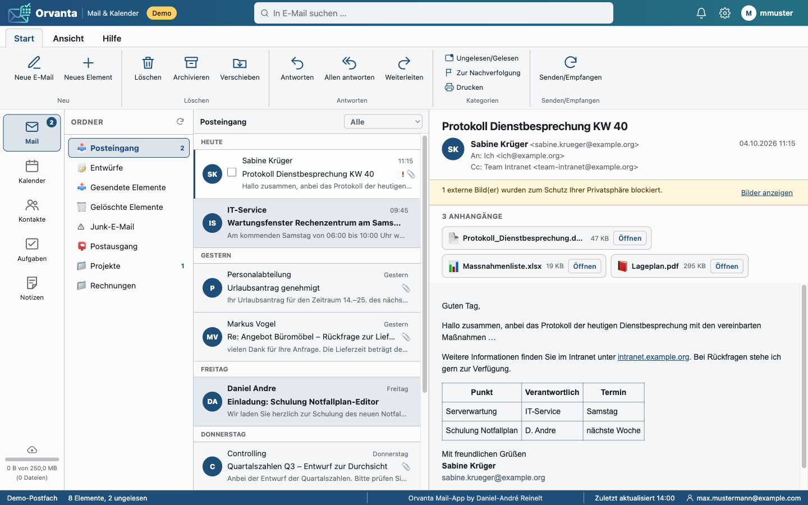

---

## 1. Funktionsumfang

| Modul | Funktionen |
|---|---|
| **Mail** ✉ | Ordnerbaum (Posteingang, Entwürfe, Gesendet, Gelöscht, eigene Ordner), Nachrichtenliste mit Suche, Lesen (HTML bereinigt durch `MailHtmlSanitizer`), Verfassen/Antworten/Allen antworten/Weiterleiten, Entwürfe, Kennzeichnen, Gelesen/Ungelesen, Verschieben, Löschen, Anhänge öffnen/speichern |
| **Kalender** 📅 | Monats-, Wochen- und Tagesansicht, Termine anlegen/bearbeiten/löschen (ganztägig, Ort, Teilnehmer, Erinnerung), Besprechungsanfragen annehmen/unter Vorbehalt/ablehnen |
| **Kontakte** 👥 | Alphabetische Liste mit Buchstabengruppen, Details, Anlegen/Bearbeiten/Löschen, E-Mail direkt aus dem Kontakt |
| **Aufgaben** ✓ | Liste mit Fälligkeit/Priorität, Erledigt-Schalter, Anlegen/Bearbeiten/Löschen |
| **Notizen** 📝 | Kachelansicht, Anlegen/Bearbeiten/Löschen |
| **Erinnerungen** | Terminerinnerungen als Dialog in der App, als Browser-Benachrichtigung (HTML5 Notifications API) und in den **Mitteilungen** der Intranet-Kopfzeile |
| **KI-Unterstützung** 🤖 | Markierten Text per Rechtsklick vom lokalen KI-Modell (Office → Lokale KI) umformulieren lassen – in E-Mails, Terminen und Erinnerungen; Vorschläge hellblau markiert, verfeinerbar, zurücksetzbar; Marker werden vor dem Senden entfernt (Abschnitt 7) |

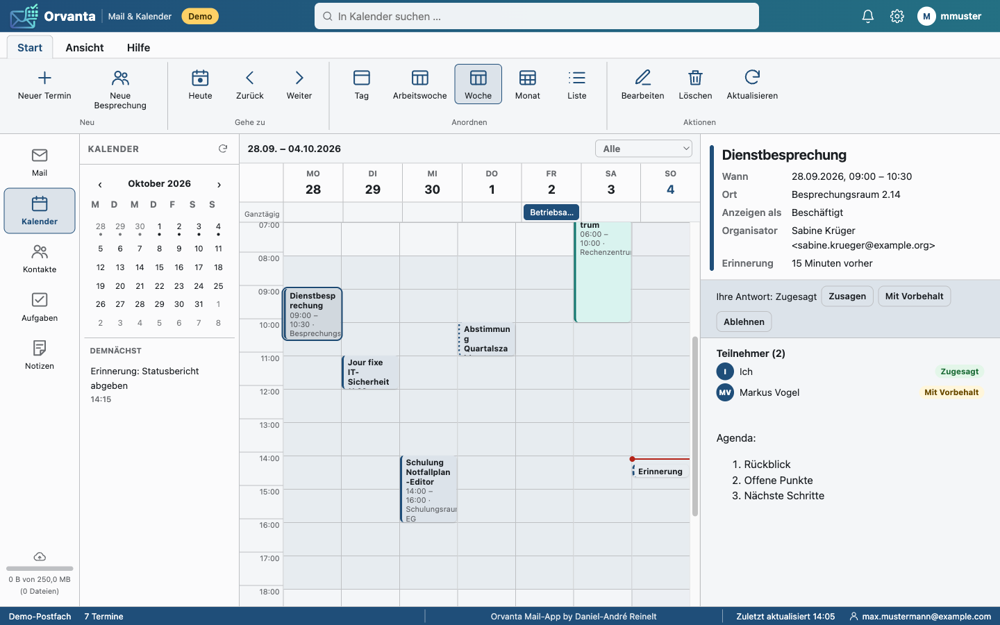

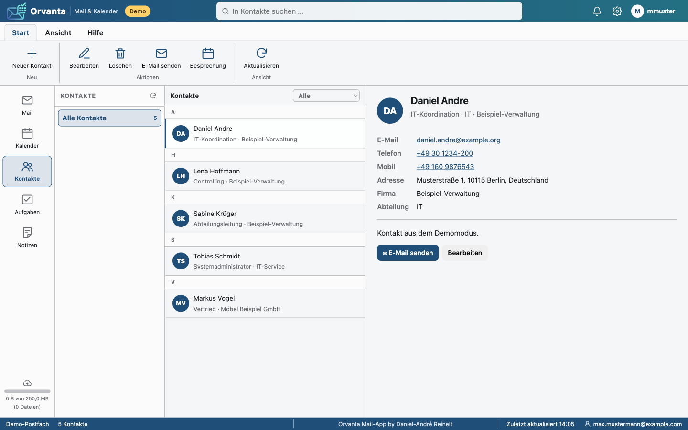

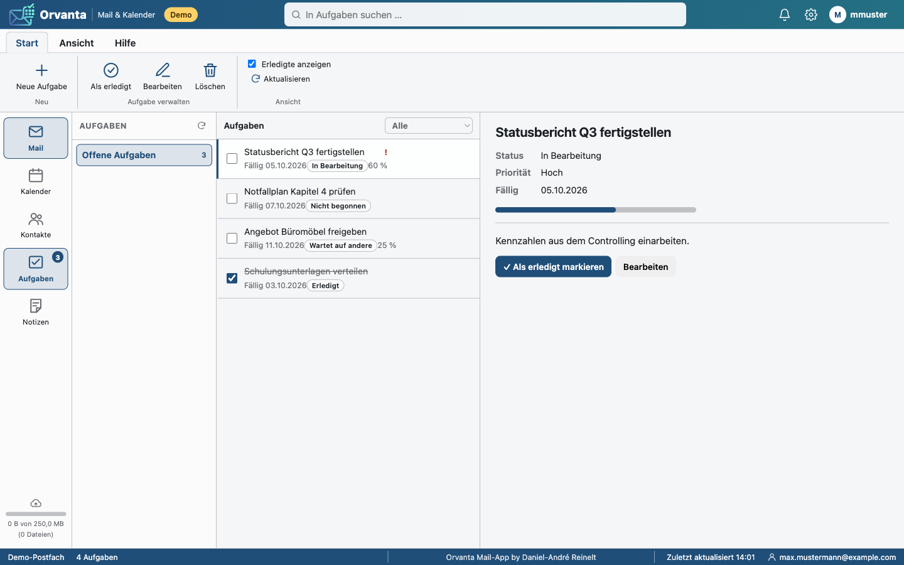

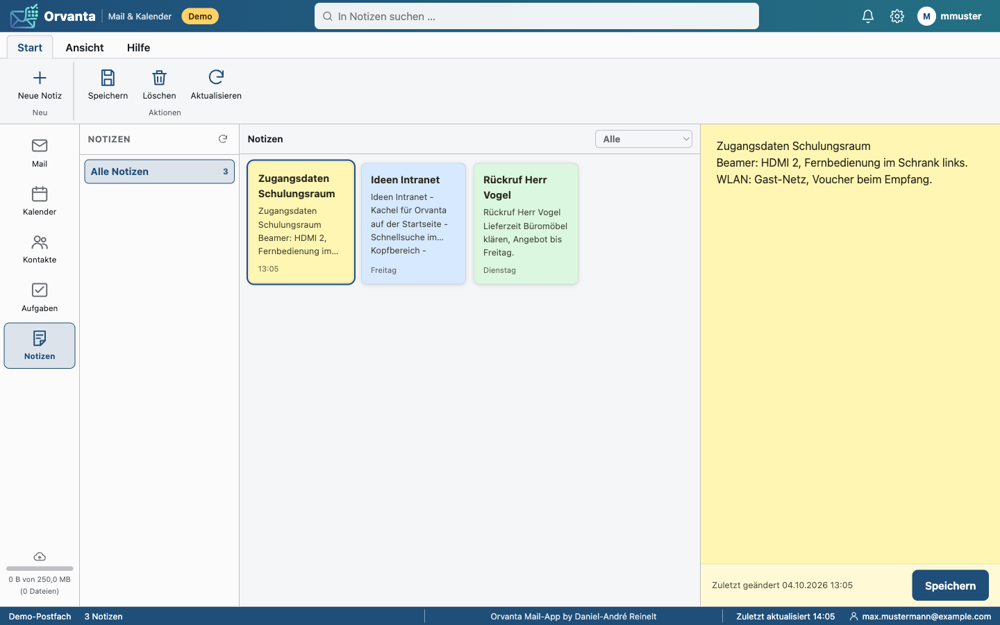

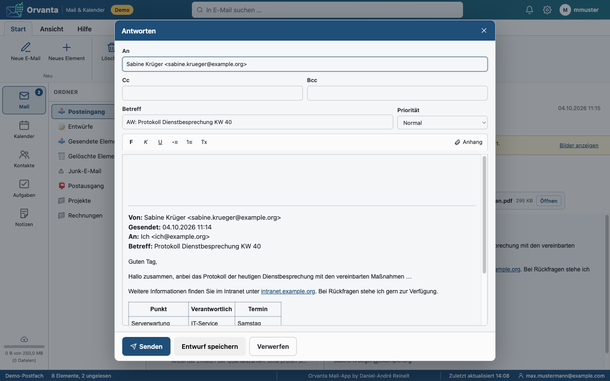

Der Verfassen-Dialog lässt sich über die Schaltfläche „In neuem Tab öffnen“
(Kopfzeile des Dialogs) aus dem Overlay in einen eigenen Browser-Tab
verschieben. Empfänger, Betreff, Priorität, bereits getippter Text und
hochgeladene Anhänge werden vollständig übernommen; der ursprüngliche Tab
bleibt frei für die weitere Arbeit in Orvanta, ohne die Nachricht im neuen
Tab zu beeinflussen. Senden oder Verwerfen schließt den eigenen Tab wieder.

Die Felder „An“, „Cc“ und „Bcc“ (sowie die Teilnehmerfelder von Terminen)
schlagen beim Tippen Empfänger vor – nach demselben Combobox-Mechanismus wie
die AD-Gruppen-Vorschläge im Adminbereich (Inline-Ergänzung, Liste, Pfeiltasten,
Enter/Tab übernehmen, Esc schließt). Quellen sind die **Telefonliste** (lokal
synchronisierter AD-Bestand, nur Einträge mit E-Mail-Adresse) und der
**eigene Verlauf**: Adressen, an die der Benutzer bereits gesendet hat, auch
wenn sie weder in der Telefonliste noch in den Exchange-Kontakten stehen.
Der Verlauf liegt je Benutzer als versteckte Datei `.empfaenger.json` im
Orvanta-Ordner seiner Nextcloud (`<cache_folder>/`) und wird nach jedem
Versand aktualisiert; Verlaufstreffer stehen in der Liste oben
(„Zuletzt verwendet“). Ohne Nextcloud gibt es nur die Telefonliste.

---

## 2. Oberfläche

Das Layout folgt dem Notfallplan-Editor (Farbpalette, Ribbon-Schaltflächen,
Typografie, Statusleiste):

- **Kopfzeile:** Name „Orvanta“, Suchfeld, Einstellungen (⚙), Profil (👤).
- **Linke Navigationsleiste:** Umschaltung der Module Mail, Kalender, Kontakte,
  Aufgaben, Notizen (Icon + Text, `aria-pressed`).
- **Mittlere Spalte:** Ordnerbaum (Mail) bzw. Listen; im Kalender und bei
  Notizen wird die Spalte zur Hauptfläche (Raster/Kacheln).
- **Rechte Spalte:** Detailansicht (Nachricht mit Kopf und Anhängen, Termin,
  Kontakt …); wird nur geöffnet, wenn ein Element gewählt ist
  (Root-Klasse `ov--detail-open`).
- **Statusleiste:** Verbindungsstatus, Belegung des Zwischenspeichers (Quota),
  Autoren-Hinweis „Orvanta Mail-App by Daniel-André Reinelt“ und – sobald die
  KI-Unterstützung verfügbar ist – ein kleines Roboter-Symbol (Klick öffnet die
  Kurzanleitung, siehe Abschnitt 7).

Alle Styles liegen in `public/assets/css/orvanta.css`. Da die Content Security
Policy inline-`style`-Attribute verbietet, setzt das Frontend Styles
ausschließlich über das CSSOM (`node.style.cssText`); HTML-Mails werden dafür
vorab mit `inlineStylesToCssom()` umgeschrieben.

---

## 3. Architektur

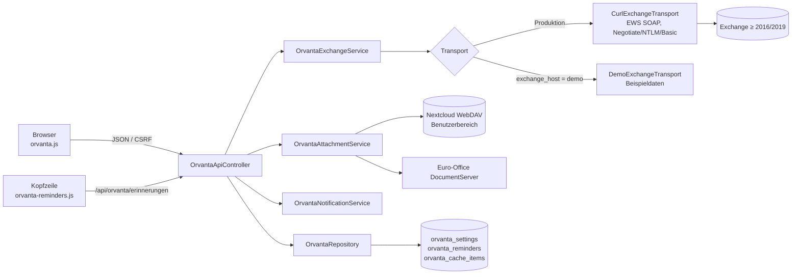

| Baustein | Datei | Aufgabe |
|---|---|---|
| `OrvantaController` | `app/Controllers/OrvantaController.php` | Hauptansicht `/office/orvanta`, Rechteprüfung (`authorize()`), Anhang-Links (`openAttachment`, `attachmentFile`) |
| `OrvantaApiController` | `app/Controllers/OrvantaApiController.php` | JSON-API für Mail, Kalender, Kontakte, Aufgaben, Notizen, Anhänge, Zwischenspeicher, Erinnerungen |
| `Admin\OfficeController` | `app/Controllers/Admin/OfficeController.php` | `updateOrvanta()` (Einstellungen), `testOrvanta()` (Verbindungstest) |
| `OrvantaConfigService` | `app/Services/Orvanta/` | Einstellungen (`DEFAULTS`), Validierung, Dienstkonto-Kennwort verschlüsselt, Demo-Erkennung |
| `OrvantaExchangeService` | `app/Services/Orvanta/` | Fachlogik zu Exchange: Ordner, Nachrichten, Termine, Kontakte, Aufgaben, Notizen, Erinnerungen; Impersonation des Benutzers |
| `CurlExchangeTransport` / `DemoExchangeTransport` | `app/Services/Orvanta/` | EWS-SOAP per cURL (`ExchangeTransportInterface`) bzw. Beispieldaten ohne Server |
| `EwsXml` | `app/Services/Orvanta/` | Aufbau/Auswertung der SOAP-Nachrichten (`DOMDocument`) |
| `MailHtmlSanitizer` | `app/Services/Orvanta/` | HTML-Mails bereinigen (Skripte, externe Inhalte, Event-Handler entfernen) |
| `OrvantaAttachmentService` | `app/Services/Orvanta/` | Anhänge: signierte Kurzzeit-Links, Öffnungsmodus (`office`/`browser`/`download`), Zwischenspeicher und Ablage in Nextcloud (WebDAV), Quota |
| `OrvantaRecipientService` | `app/Services/Orvanta/` | Empfänger-Vorschläge für An/Cc/Bcc: Telefonliste + Verlauf gesendeter Adressen (versteckte Datei `.empfaenger.json` in der Nextcloud des Benutzers, kurz in der Sitzung gehalten) |
| `OrvantaNotificationService` | `app/Services/Orvanta/` | Fällige Erinnerungen ermitteln, zustellen, verschieben, schließen; Einträge für die Kopfzeile |
| `OrvantaSignatureService` | `app/Services/Orvanta/` | Signaturvorlagen (Abschnitt 4a): Validierung, Zuordnung per AD-Gruppe, E-Mail-taugliches HTML aus Vorlage + Telefonliste + Design, `append()`/`strip()` beim Senden |
| `Admin\OrvantaSignatureController` | `app/Controllers/Admin/OrvantaSignatureController.php` | Pflege der Signaturvorlagen unter `/admin/office/signaturen` (Liste, Formular, Vorschau-iframe) |
| `OrvantaRepository` | `app/Repositories/OrvantaRepository.php` | Zugriff auf die drei Orvanta-Tabellen |
| `OrvantaSignatureRepository` | `app/Repositories/OrvantaSignatureRepository.php` | Tabelle `orvanta_signatures` |
| Frontend | `public/assets/js/orvanta.js`, `orvanta-reminders.js`, `orvanta-viewer.js`, `public/assets/css/orvanta.css` | App, Erinnerungen in der Kopfzeile, Anhang-Viewer |
| Ansichten | `views/orvanta/index.php`, `views/orvanta/viewer.php`, `views/admin/office.php` (Karte `#orvanta`), `views/admin/orvanta-signatures.php`, `views/admin/orvanta-signature.php` | |
| Migrationen | `database/migrations/033_create_orvanta_tables.sql`, `034_create_orvanta_ai_usage.sql`, `035_orvanta_signatures.sql` | |
| Tests | `tests/Unit/OrvantaServiceTest.php`, `tests/Unit/OrvantaSignatureTest.php` | Fakes für den Exchange-Transport; Signaturen gegen SQLite |

### Datenbank

| Tabelle | Zweck | Wichtige Spalten |
|---|---|---|
| `orvanta_settings` | Einstellungen (Schlüssel/Wert) | `setting_key` (unique), `setting_value` |
| `orvanta_reminders` | Lokal zwischengespeicherte Terminerinnerungen je Benutzer | `user_uid`, `item_hash` (unique je Benutzer), `subject`, `location`, `starts_at`, `remind_at`, `state` (pending/delivered/dismissed/snoozed) |
| `orvanta_cache_items` | Bestand des Zwischenspeichers im Nextcloud-Bereich des Benutzers | `user_uid`, `kind` (attachment/message), `item_hash`, `name`, `path`, `content_type`, `size_bytes` |
| `orvanta_ai_usage` | Zähler der KI-Unterstützung (Migration 034) – nur Metadaten, nie Texte | `user_uid`, `kind` (mail_compose/mail_reply/mail_forward/event/reminder), `model`, `input_tokens`, `output_tokens`, `created_at` |
| `orvanta_signatures` | Signaturvorlagen (Migration 035) | `name`, `greeting`, `street`, `postal_city`, `phone_mode` (prefix/full), `phone_prefix`, `ad_groups` (JSON-Liste), `sort_order`, `active` |

### Routen

- Ansicht: `GET /office/orvanta` (SSO-Benutzer mit App-Freigabe `orvanta`).
- Anhänge: `GET /office/orvanta/anhang/oeffnen?token=…`,
  `GET /office/orvanta/anhang/datei?token=…` (Zugriff des DocumentServers).
- API (`/api/orvanta/…`, JSON, CSRF-Token im Header `X-CSRF-Token`):
  `status`, `mail/ordner`, `mail`, `mail/nachricht`, `mail/senden`,
  `empfaenger` (Vorschläge für An/Cc/Bcc), `mail/entwurf`, `mail/antworten`, `mail/aktion`, `anhang/link`,
  `anhang/nextcloud`, `zwischenspeicher`, `zwischenspeicher/leeren`,
  `kalender`, `kalender/termin` (GET/POST), `kalender/termin/loeschen`,
  `kalender/antwort`, `kontakte`, `kontakte/kontakt` (GET/POST),
  `kontakte/loeschen`, `aufgaben`, `aufgaben/aufgabe` (GET/POST),
  `aufgaben/loeschen`, `notizen`, `notizen/notiz` (GET/POST),
  `notizen/loeschen`, `erinnerungen`, `erinnerungen/erledigt`,
  `erinnerungen/spaeter`, `ki/verbessern` (POST, KI-Unterstützung).
- Admin (`$requireAdmin`): `POST /admin/office/orvanta`,
  `POST /admin/office/orvanta/pruefen`; Signaturvorlagen
  `GET /admin/office/signaturen`, `GET|POST /admin/office/signaturen/vorlage`,
  `POST /admin/office/signaturen/loeschen`,
  `GET /admin/office/signaturen/vorschau` (iframe mit eigener CSP).

---

## 4. Anbindung an Exchange

### Voraussetzungen

1. Exchange 2016/2019/SE On-Premise mit erreichbarem EWS-Endpunkt
   (`https://<host>/EWS/Exchange.asmx`).
2. Ein **Dienstkonto** mit der Rolle `ApplicationImpersonation`:

   ```powershell
   New-ManagementRoleAssignment -Name "Orvanta Impersonation" `
       -Role ApplicationImpersonation -User svc-orvanta
   ```

   Optional mit `-RecipientRestrictionFilter` auf die berechtigten Benutzer
   einschränken.
3. Windows-Anmeldung (SSO) im Intranet, damit der Benutzer bekannt ist
   (`docs/office.md`, Abschnitt „Anmeldung“). Ohne SSO zeigt die Office-Kachel
   keine Apps.

### Anmeldeverfahren

| Verfahren | Beschreibung |
|---|---|
| **Negotiate** (Standard) | Kerberos mit der Identität des `auth`-Containers (Keytab des Domänenbeitritts). Dienstkonto/Kennwort optional; ohne Angabe muss das Computerkonto die Impersonation-Rolle besitzen. |
| **NTLM** | Dienstkonto + Kennwort (`FIRMA\svc-orvanta` oder UPN). |
| **Basic** | Dienstkonto + Kennwort, nur über HTTPS mit TLS-Prüfung. |

Das Kennwort wird verschlüsselt in `orvanta_settings` abgelegt
(`Crypto`, `APP_KEY`). Die Postfach-Zuordnung erfolgt per E-Mail-Adresse aus dem
AD (Standard) oder per UPN (`benutzer@<UPN-Domäne>`); sie wird als
`ExchangeImpersonation`-Kopf an EWS übergeben.

### Admin-Einstellungen (`/admin/office#orvanta`)

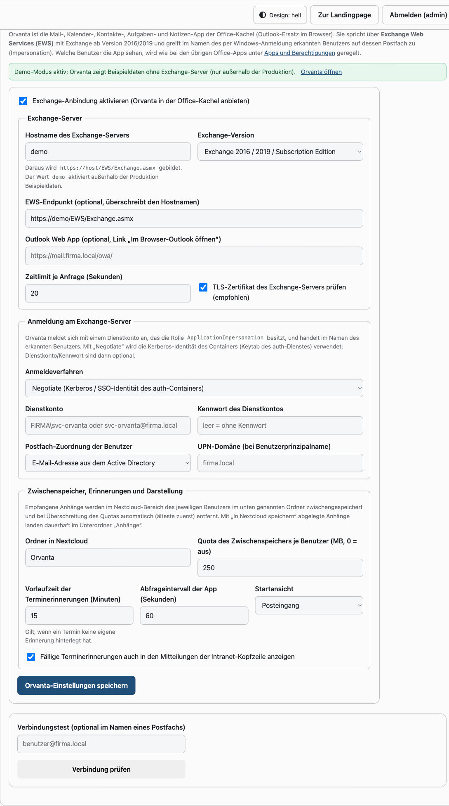

| Schlüssel | Bedeutung | Standard |
|---|---|---|
| `exchange_enabled` | App in der Office-Kachel anbieten | aus |
| `exchange_host` | Hostname; `demo` aktiviert außerhalb der Produktion Beispieldaten | – |
| `exchange_ews_url` | EWS-Endpunkt (überschreibt den Hostnamen) | aus Host gebildet |
| `exchange_version` | `Exchange2016` (auch 2019/SE) oder `Exchange2013_SP1` | `Exchange2016` |
| `exchange_auth` | `negotiate`, `ntlm`, `basic` | `negotiate` |
| `exchange_service_user`, `exchange_service_password` | Dienstkonto | – |
| `exchange_identity`, `exchange_upn_domain` | Postfach-Zuordnung (`smtp`/`upn`) | `smtp` |
| `exchange_verify_tls` | TLS-Zertifikat prüfen | an |
| `exchange_timeout` | Zeitlimit je Anfrage (3–120 s) | 20 |
| `exchange_owa_url` | Link „Im Browser-Outlook öffnen“ | – |
| `cache_folder` | Ordner im Nextcloud-Bereich des Benutzers | `Orvanta` |
| `cache_quota_mb` | Quota des Zwischenspeichers je Benutzer (0 = aus) | 250 |
| `reminder_lead_minutes` | Vorlaufzeit, wenn ein Termin keine eigene Erinnerung hat | 15 |
| `reminder_header` | Fällige Erinnerungen auch in den Mitteilungen der Kopfzeile | an |
| `default_folder` | Startansicht (`inbox`, `calendar`, …) | `inbox` |
| `poll_interval` | Abfrageintervall der App in Sekunden | 60 |

Der **Verbindungstest** ruft `GetFolder` auf dem Posteingang auf – optional im
Namen eines angegebenen Postfachs – und meldet Version, Dauer und Fehlertext.

### Freigabe der App

Wie alle Office-Apps wird Orvanta unter **Admin → Office → Apps und
Berechtigungen** pro AD-Gruppe oder App-Paket freigegeben
(`office_app_permissions`, `app_key = orvanta`). Ohne Freigabe antwortet
`/office/orvanta` mit 403.

---

## 4a. Signaturvorlagen

Unter **Admin → Office → Signaturvorlagen verwalten**
(`/admin/office/signaturen`) werden beliebig viele E-Mail-Signaturen
gepflegt. Die Zuordnung zum Benutzer erfolgt über **AD-Gruppen**; passen
mehrere Vorlagen, gilt die mit der kleinsten Reihenfolge. Ohne passende
Vorlage wird keine Signatur angefügt.

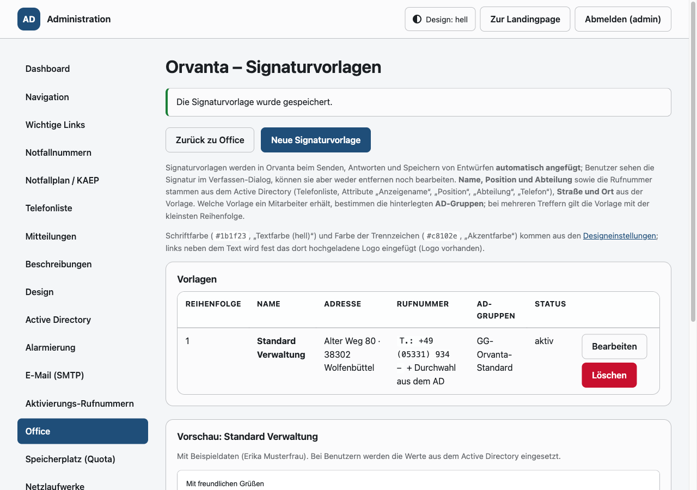

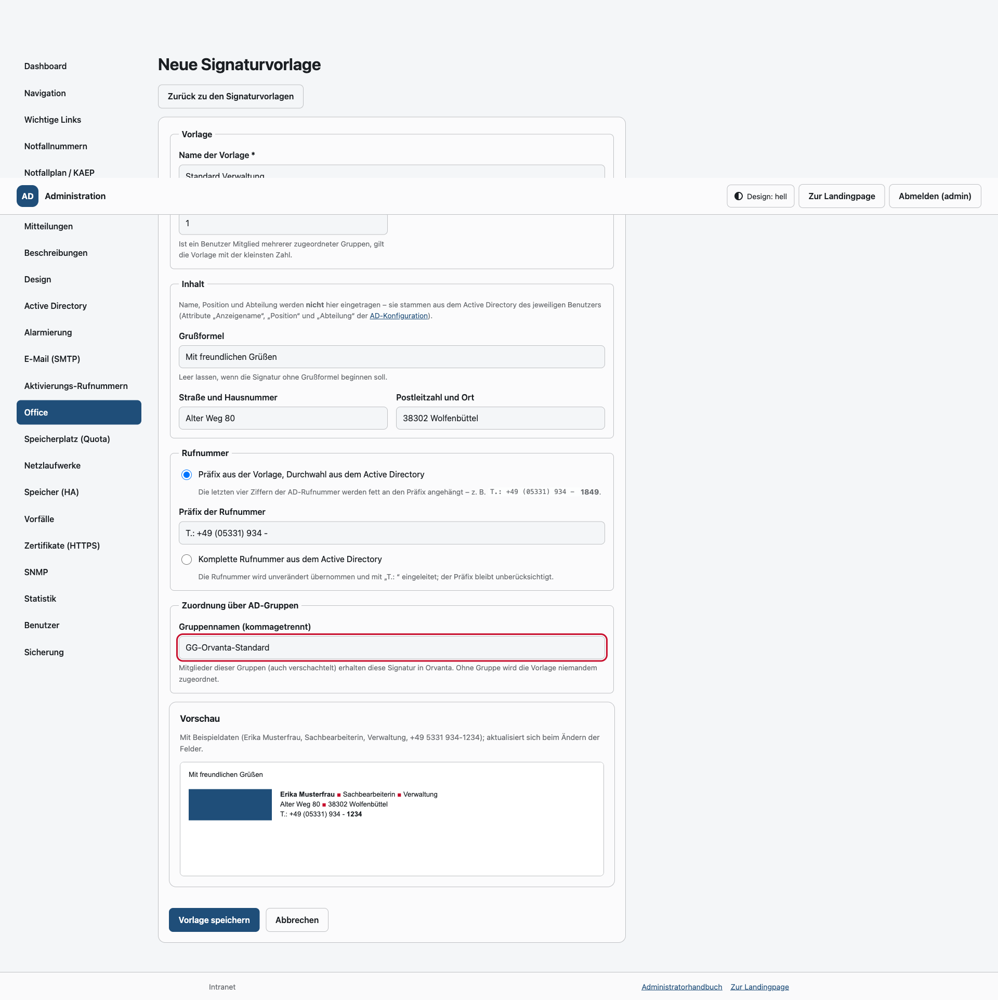

Aufbau der Signatur (Beispiel):

```
Mit freundlichen Grüßen

[Logo]  **Daniel-André Reinelt** ■ Administrator ■ Informationstechnologie (IT / EDV)
        Alter Weg 80 ■ 38302 Wolfenbüttel
        T.: +49 (05331) 934 - **1849**
```

| Bestandteil | Quelle |
|---|---|
| Grußformel, Straße + Hausnummer, PLZ + Ort | Vorlage |
| Name, Position, Abteilung | Active Directory (Telefonliste: `display_name`, `title`, `department`; LDAP-Attribut `LDAP_ATTR_TITLE`, Standard `title`) |
| Rufnummer | wählbar: **Präfix aus der Vorlage + vierstellige Durchwahl** (letzte vier Ziffern der AD-Rufnummer, fett) oder **komplette Rufnummer aus dem AD** (`T.: …`); ohne AD-Rufnummer entfällt die Zeile |
| Schriftfarbe / Farbe der Trennzeichen (■) | Designeinstellungen: „Textfarbe (hell)“ (`color_text`) / „Akzentfarbe“ (`color_accent`) |
| Logo links neben dem Text | das im Adminbereich hochgeladene Logo (fest, als `data:`-URI eingebettet, Breite 160 px) |

Verhalten in Orvanta:

- Die Signatur erscheint beim Verfassen, Antworten und Weiterleiten direkt im
  Textfeld – unterhalb des eigenen Textes bzw. oberhalb des Zitats – als
  **schreibgeschützter Block** (`contenteditable="false"`). Eingaben, die den
  Block berühren, werden auf den übrigen Text beschränkt; wird er dennoch
  entfernt oder verändert (etwa über „Alles auswählen“ + Formatierung), fügt
  der Editor ihn sofort wieder ein.
- Maßgeblich ist die **serverseitig** beim Senden, Antworten und Speichern von
  Entwürfen angefügte Fassung (`OrvantaSignatureService::append()`): Bereits
  enthaltene Blöcke (z. B. aus einem Entwurf) werden ersetzt, es gibt also nie
  zwei Signaturen und keine manipulierte Fassung.
- Benutzer können die Signatur weder abwählen noch bearbeiten.

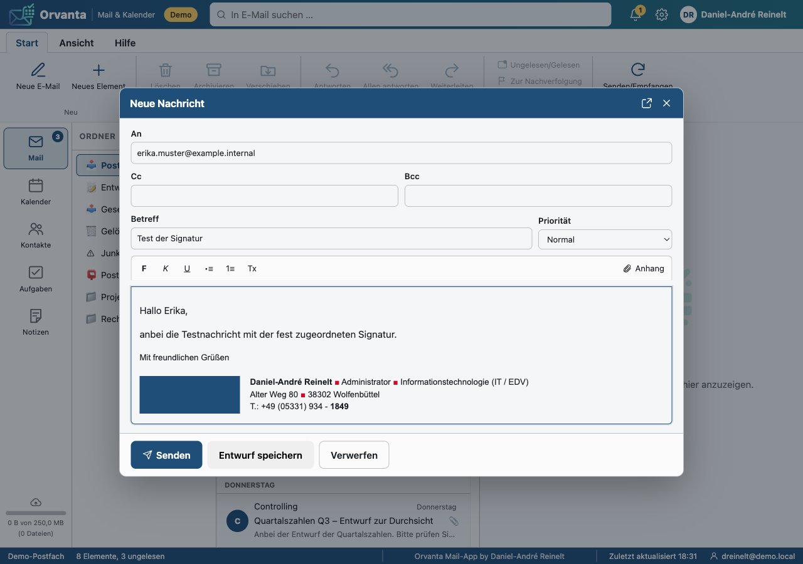

Die Vorschau im Adminbereich zeigt die Vorlage mit Beispieldaten
(„Erika Musterfrau“) und aktualisiert sich beim Ändern der Felder.

---

## 5. Anhänge, Zwischenspeicher und Nextcloud

- **Öffnen:** Klick auf einen Anhang → `POST /api/orvanta/anhang/link` liefert
  eine kurzlebige, signierte URL (`OrvantaAttachmentService::token()`/`verify()`, HMAC
  mit `APP_KEY`, Ablauf wenige Minuten). Der Browser öffnet sie in einem neuen
  Tab:
  - `docx`/`xlsx`/`pptx`/`odt`/… → Euro-Office-Viewer (`views/orvanta/viewer.php`),
    der DocumentServer holt die Datei über `anhang/datei?token=…`;
  - `pdf`, Text, Bilder → direkt im Browser (`browserCapable()`);
  - alles andere oder ohne DocumentServer → Download.
- **Zwischenspeicher:** Empfangene Anhänge werden beim Öffnen im
  Nextcloud-Bereich des Benutzers im Ordner `<cache_folder>/` (Dateiname mit
  Hash-Präfix) abgelegt und in `orvanta_cache_items` registriert. Überschreitet der Benutzer
  `cache_quota_mb`, werden die ältesten Einträge automatisch entfernt
  (FIFO). Die Belegung erscheint in der Statusleiste der App
  (`GET /api/orvanta/zwischenspeicher`), kann vom Benutzer geleert werden und
  wird im Adminbereich je Benutzer aufgelistet.
- **„In Nextcloud speichern“:** Legt den Anhang dauerhaft unter
  `<cache_folder>/Anhänge/` ab (zählt nicht zum Orvanta-Quota, sondern zum
  Nextcloud-Kontingent des Benutzers). Die Schaltfläche erscheint nur, wenn
  Nextcloud erreichbar ist. Die Übertragung läuft per WebDAV mit der
  Intranet-SSO-Identität (`intranet_integration`).
- **Empfänger-Verlauf:** `<cache_folder>/.empfaenger.json` (versteckt, max.
  500 Adressen mit Name, Zähler und letzter Verwendung) speist die Vorschläge
  in An/Cc/Bcc. Die Datei zählt nicht zum Orvanta-Quota und wird nicht in
  `orvanta_cache_items` geführt; Lesefehler führen nur zu fehlenden
  Verlaufsvorschlägen. Versteckte Dateinamen (führender Punkt) sind in der
  Dateischnittstelle nur für Dateien, nicht für Ordner zulässig
  (`isSafeFileName()` auf beiden Seiten).

---

## 6. Terminerinnerungen

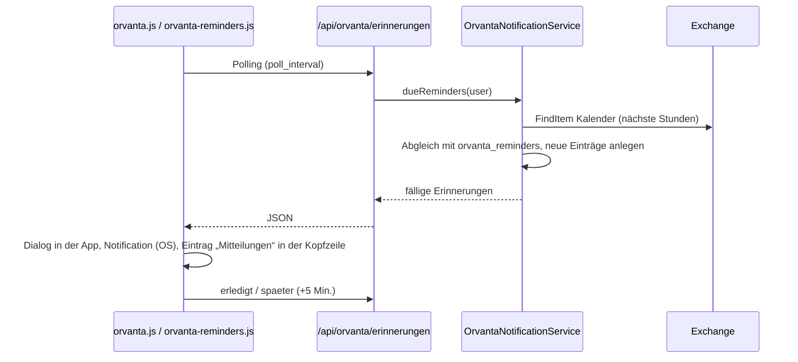

- Die App fragt beim Benutzer einmalig die Berechtigung für
  Desktop-Benachrichtigungen an (`Notification.requestPermission`).
- `public/assets/js/orvanta-reminders.js` wird auf allen Intranet-Seiten
  geladen, wenn `reminder_header` aktiv ist und der Benutzer die App nutzen
  darf. Fällige Erinnerungen erscheinen unter **Mitteilungen** in der Kopfzeile
  mit „5 Min. später“ und „Schließen“.

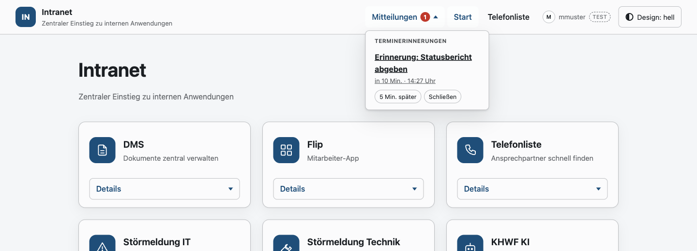

---

## 7. KI-Unterstützung beim Schreiben

Orvanta kann markierte Textabschnitte in E-Mails, Terminen und Erinnerungen
durch das **unter Office → Lokale KI hinterlegte Modell** umformulieren lassen.
Es gibt keine eigene KI-Konfiguration in Orvanta: Adresse, Modell und
API-Schlüssel stammen ausschließlich aus den globalen Einstellungen
(`OfficeAiService`). Ist dort kein Modell aktiv oder der Endpunkt nicht
erreichbar, bleibt Orvanta unverändert – weder Roboter-Symbol noch
Kontextmenü erscheinen.

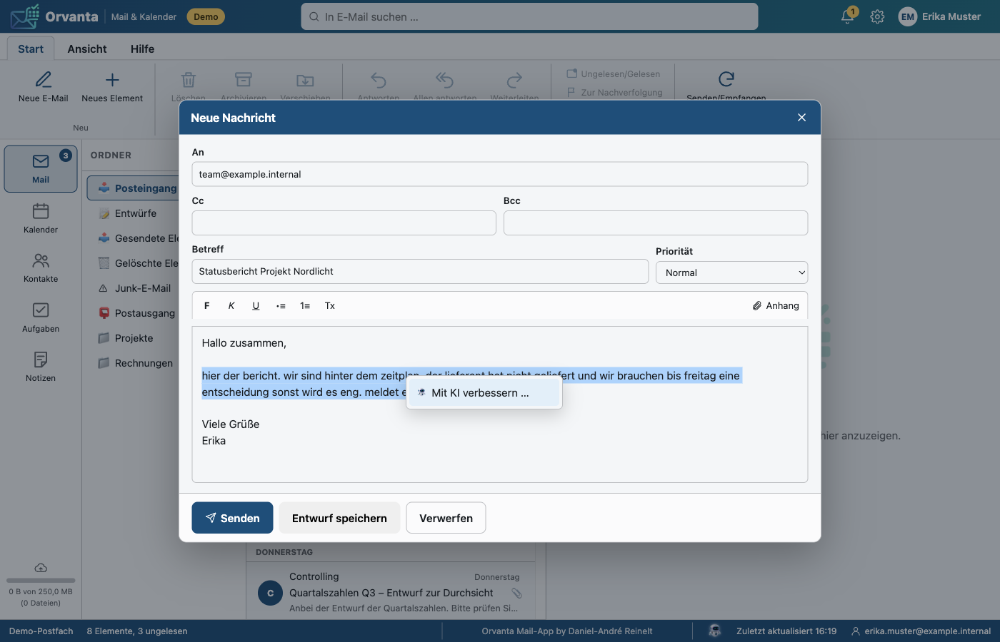

### Bedienung

1. Text im Editor markieren (neue Nachricht, Antwort, Weiterleitung,
   Terminbeschreibung) und mit der **rechten Maustaste** das Menü
   „Mit KI verbessern …“ öffnen. Ohne Markierung bleibt das normale
   Browser-Menü (z. B. Rechtschreibung) erhalten.
2. Im Dialog die Anweisung eingeben („höflicher“, „kürzer“, „als Aufzählung“,
   „ins Englische“); die Vorschlagschips füllen das Feld. Angezeigt wird ein
   Auszug des markierten Textes und der Hinweis, was übertragen wird.
3. Der erzeugte Text ersetzt die Markierung und ist **hellblau umrandet**
   (`span.ov-ai-block`). Rechtsklick auf den Block bietet:
   *Weiter verfeinern …* (neue Anweisung, die KI kennt Original und bisherige
   Fassung), *Auf Original zurücksetzen* (nur solange der Dialog offen ist;
   der Originaltext liegt ausschließlich im Browser-Speicher) und
   *Markierung entfernen*.
4. Beim Senden, Entwurf speichern und Termin speichern werden alle Marker
   **serverseitig** entfernt (`OrvantaAiService::stripMarkers()` vor dem
   Sanitizer). Empfänger sehen nur den Text, ohne Klassen, Attribute oder
   Rahmen.

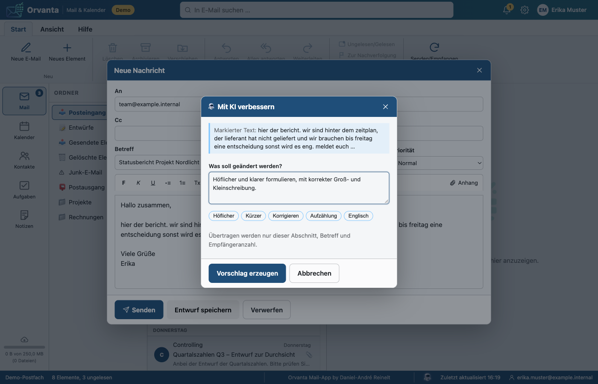

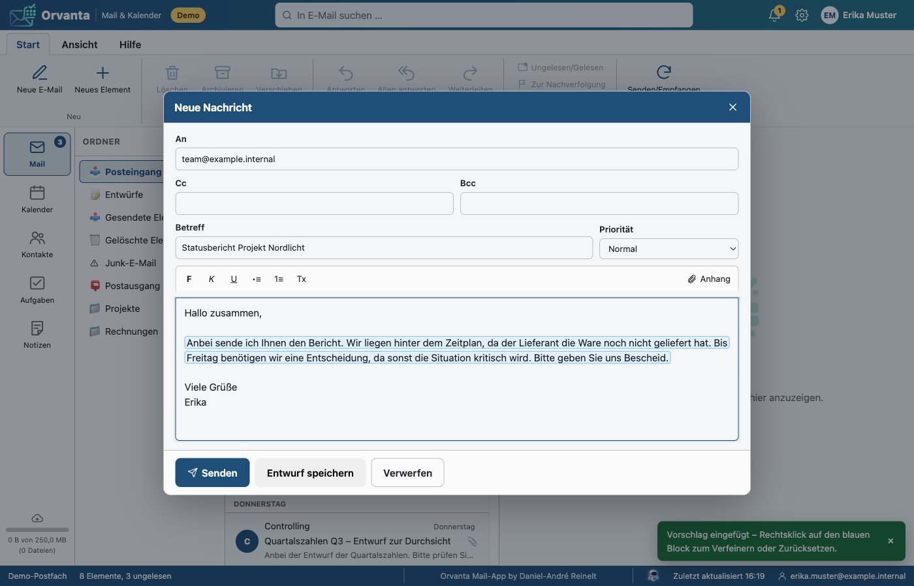

### Was übertragen wird

- Nur der markierte Abschnitt (max. 8 000 Zeichen), die Anweisung
  (max. 1 000 Zeichen), bei Verfeinerung die bisherige Fassung sowie als
  Kontext der Betreff (gekürzt) und die **Anzahl** der Empfänger – nie
  Adressen, nie die restliche Nachricht oder das Postfach.
- Der Aufruf geht vom Server an `POST {office_ai_url}/chat/completions`
  (OpenAI-kompatibel, Bearer-Schlüssel falls hinterlegt). Der Browser spricht
  nie direkt mit dem KI-Endpunkt. In `APP_ENV=production` akzeptiert der
  Transport nur HTTPS.
- Protokolliert werden ausschließlich Zähler (`orvanta_ai_usage`): Benutzer,
  Einsatzort, Modell, Eingabe-/Ausgabe-Token, Zeitpunkt. Texte und Anweisungen
  werden weder gespeichert noch geloggt.

### Nutzungsbericht im Adminbereich

Unter `/admin/office#orvanta-ki` zeigt die Orvanta-Karte den anonymisierten
Bericht: Anfragen je Benutzer (Pseudonyme „Benutzer 1…n“, Zuordnung wird nicht
gespeichert und wechselt je Zeitraum), Anfragen je Tag und Token je Tag, jeweils
als serverseitig erzeugtes SVG ohne JavaScript und ohne `style`-Attribute
(CSP). Zeitraum: 7, 30 oder 90 Tage (`?ki_zeitraum=`).

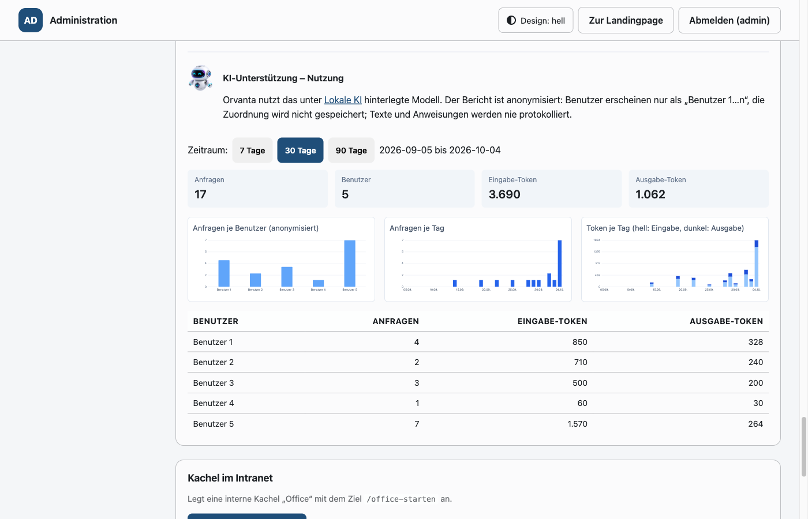

### Lokaler Testendpunkt (Docker)

```bash
docker compose --profile ki up -d          # llama.cpp-Server, Port KI_PORT (8089)
# .env: OFFICE_AI_SEED_URL=http://ki:8080/v1  OFFICE_AI_SEED_MODEL=qwen2.5-0.5b-instruct
```

Der Dienst `ki` lädt beim ersten Start ein kleines Modell
(`Qwen/Qwen2.5-0.5B-Instruct-GGUF`, ca. 400 MB) in das Volume `ki_models`.
Es reicht für den Funktionstest; brauchbare deutsche Texte liefert erst ein
größeres Modell, z. B. `KI_MODEL_REPO=unsloth/Qwen3.5-9B-GGUF`,
`KI_MODEL_FILE=Qwen3.5-9B-Q4_K_M.gguf`, `KI_MODEL_ALIAS=qwen3.5-9b` (ca. 6 GB,
mindestens 8 GB RAM für Docker; Denkmodus über `KI_REASONING` steuerbar,
Standard `off`). Mit den Screenshots unten wurde dieses Modell verwendet.
`scripts/seed.php` trägt den Endpunkt ein, sofern `OFFICE_AI_SEED_URL` gesetzt
ist und noch keine KI-Einstellungen existieren; alternativ im Adminbereich
unter Office → Lokale KI eintragen. Zeitlimit je Anfrage: `ORVANTA_AI_TIMEOUT`
(Standard 30 s). Die Erreichbarkeit wird höchstens alle 60 s per `GET /models`
geprüft (Cache `storage/cache/orvanta_ai.json`, wird beim Speichern der
KI-Einstellungen zurückgesetzt).

Screenshots aller Schritte: [docs/assets/orvanta-ai/README.md](assets/orvanta-ai/README.md).

---

## 8. Demo-Modus und Tests

- `exchange_host = demo` (nur bei `APP_ENV ≠ production`) aktiviert
  `DemoExchangeTransport` mit Beispieldaten für alle Module. Änderungen werden
  nicht gespeichert; der Status meldet `demo: true`. So lässt sich die
  Oberfläche ohne Exchange prüfen (die Screenshots in diesem Dokument stammen
  aus dem Demo-Modus mit `SSO_FAKE_USER`, siehe `docs/office.md`, Abschnitt
  „Testmodus“).
- `tests/Unit/OrvantaServiceTest.php` prüft Konfiguration, EWS-XML-Aufbau,
  Sanitizer, Anhang-Modi/Signaturen, Quota-Bereinigung, Erinnerungslogik und
  das Entfernen der KI-Marker beim Senden mit Fakes
  (`RecordingExchangeTransport`, Repository-Fakes).
- `tests/Unit/OrvantaAiTest.php` prüft die KI-Unterstützung mit
  `RecordingAiTransport`: Verfügbarkeit und Cache, Aufbau der
  `chat/completions`-Anfrage, Verfeinern, Validierung (422), Fehlerbilder
  (503/502), `stripMarkers()`, anonymisierte Auswertung und SVG-Bericht.

  ```bash
  php tests/run.php
  find . -name "*.php" -print0 | xargs -0 -n1 php -l
  ```

---

## 9. Sicherheit

- Alle Routen setzen einen SSO-Benutzer mit App-Freigabe voraus; schreibende
  API-Aufrufe prüfen das CSRF-Token.
- KI-Unterstützung: Nur der markierte Abschnitt verlässt den Browser (an den
  Intranet-Server, von dort an den lokalen KI-Endpunkt); KI-Marker werden vor
  dem Versand entfernt; gespeichert werden nur Zähler, der Adminbericht ist
  pseudonymisiert.
- Exchange-Zugriff ausschließlich per Impersonation des angemeldeten Benutzers;
  das Dienstkonto-Kennwort liegt verschlüsselt in der Datenbank und wird nie
  an den Browser übertragen.
- HTML-Mails werden serverseitig bereinigt (keine Skripte, keine externen
  Ressourcen, keine Inline-Styles → CSP-konform über CSSOM).
- Anhang-Links sind signiert, benutzergebunden und kurzlebig; Dateinamen werden
  für Nextcloud-Pfade bereinigt.
- TLS-Prüfung gegenüber Exchange ist standardmäßig aktiv.

---

## 10. Grenzen und Hinweise

- Keine Exchange-Online-/Graph-Anbindung; Ziel ist On-Premise ab 2016/2019.
- Serienregeln werden angezeigt und als Vorkommen geladen, aber nicht als
  Serie bearbeitet.
- S/MIME-Verschlüsselung und -Signatur werden nicht unterstützt.
- Der Zwischenspeicher dient dem schnellen Öffnen; Exchange bleibt die
  führende Datenquelle.
