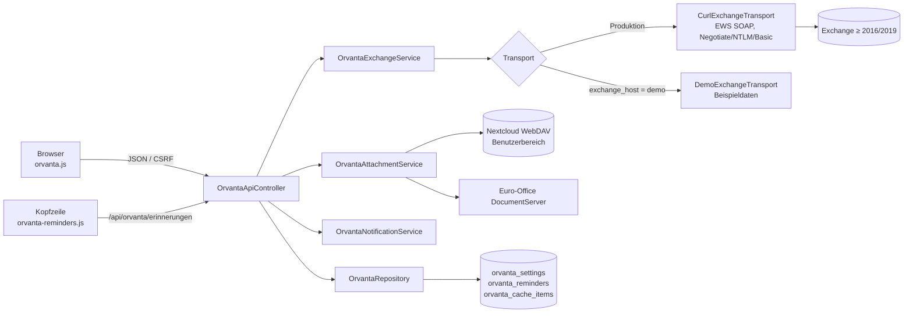
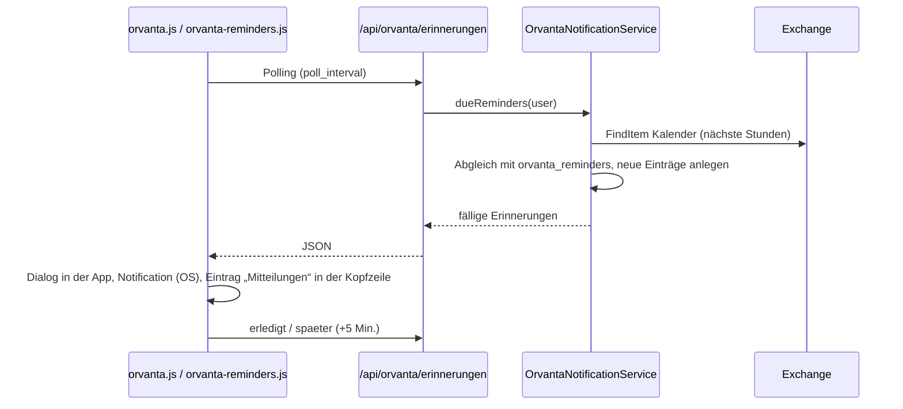

# Orvanta – Mail & Kalender im Intranet (Exchange On-Premise)

Orvanta ist die Mail-, Kalender-, Kontakte-, Aufgaben- und Notizen-App der
Office-Kachel – ein Outlook-Ersatz im Browser. Sie läuft vollständig im
Intranet (PHP, Vanilla JS, handgeschriebenes CSS, keine externen Abhängigkeiten)
und spricht über **Exchange Web Services (EWS)** mit einem Exchange-Server
On-Premise ab Version 2016/2019 (inkl. Subscription Edition). Der Zugriff
erfolgt im Namen des per Windows-Anmeldung (SSO) erkannten Benutzers.


---

## 1. Funktionsumfang

| Modul | Funktionen |
|---|---|
| **Mail** ✉ | Ordnerbaum (Posteingang, Entwürfe, Gesendet, Gelöscht, eigene Ordner), Nachrichtenliste mit Suche, Lesen (HTML bereinigt durch `MailHtmlSanitizer`), Verfassen/Antworten/Allen antworten/Weiterleiten, Entwürfe, Kennzeichnen, Gelesen/Ungelesen, Verschieben, Löschen, Anhänge öffnen/speichern |
| **Kalender** 📅 | Monats-, Wochen- und Tagesansicht, Termine anlegen/bearbeiten/löschen (ganztägig, Ort, Teilnehmer, Erinnerung), Besprechungsanfragen annehmen/unter Vorbehalt/ablehnen |
| **Kontakte** 👥 | Alphabetische Liste mit Buchstabengruppen, Details, Anlegen/Bearbeiten/Löschen, E-Mail direkt aus dem Kontakt |
| **Aufgaben** ✓ | Liste mit Fälligkeit/Priorität, Erledigt-Schalter, Anlegen/Bearbeiten/Löschen |
| **Notizen** 📝 | Kachelansicht, Anlegen/Bearbeiten/Löschen |
| **Erinnerungen** | Terminerinnerungen als Dialog in der App, als Browser-Benachrichtigung (HTML5 Notifications API) und in den **Mitteilungen** der Intranet-Kopfzeile |


---

## 2. Oberfläche

Das Layout folgt dem Notfallplan-Editor (Farbpalette, Ribbon-Schaltflächen,
Typografie, Statusleiste):

- **Kopfzeile:** Name „Orvanta“, Suchfeld, Einstellungen (⚙), Profil (👤).
- **Linke Navigationsleiste:** Umschaltung der Module Mail, Kalender, Kontakte,
  Aufgaben, Notizen (Icon + Text, `aria-pressed`).
- **Mittlere Spalte:** Ordnerbaum (Mail) bzw. Listen; im Kalender und bei
  Notizen wird die Spalte zur Hauptfläche (Raster/Kacheln).
- **Rechte Spalte:** Detailansicht (Nachricht mit Kopf und Anhängen, Termin,
  Kontakt …); wird nur geöffnet, wenn ein Element gewählt ist
  (Root-Klasse `ov--detail-open`).
- **Statusleiste:** Verbindungsstatus, Belegung des Zwischenspeichers (Quota)
  und Autoren-Hinweis „Orvanta Mail-App by Daniel-André Reinelt“.

Alle Styles liegen in `public/assets/css/orvanta.css`. Da die Content Security
Policy inline-`style`-Attribute verbietet, setzt das Frontend Styles
ausschließlich über das CSSOM (`node.style.cssText`); HTML-Mails werden dafür
vorab mit `inlineStylesToCssom()` umgeschrieben.

---

## 3. Architektur



| Baustein | Datei | Aufgabe |
|---|---|---|
| `OrvantaController` | `app/Controllers/OrvantaController.php` | Hauptansicht `/office/orvanta`, Rechteprüfung (`authorize()`), Anhang-Links (`openAttachment`, `attachmentFile`) |
| `OrvantaApiController` | `app/Controllers/OrvantaApiController.php` | JSON-API für Mail, Kalender, Kontakte, Aufgaben, Notizen, Anhänge, Zwischenspeicher, Erinnerungen |
| `Admin\OfficeController` | `app/Controllers/Admin/OfficeController.php` | `updateOrvanta()` (Einstellungen), `testOrvanta()` (Verbindungstest) |
| `OrvantaConfigService` | `app/Services/Orvanta/` | Einstellungen (`DEFAULTS`), Validierung, Dienstkonto-Kennwort verschlüsselt, Demo-Erkennung |
| `OrvantaExchangeService` | `app/Services/Orvanta/` | Fachlogik zu Exchange: Ordner, Nachrichten, Termine, Kontakte, Aufgaben, Notizen, Erinnerungen; Impersonation des Benutzers |
| `CurlExchangeTransport` / `DemoExchangeTransport` | `app/Services/Orvanta/` | EWS-SOAP per cURL (`ExchangeTransportInterface`) bzw. Beispieldaten ohne Server |
| `EwsXml` | `app/Services/Orvanta/` | Aufbau/Auswertung der SOAP-Nachrichten (`DOMDocument`) |
| `MailHtmlSanitizer` | `app/Services/Orvanta/` | HTML-Mails bereinigen (Skripte, externe Inhalte, Event-Handler entfernen) |
| `OrvantaAttachmentService` | `app/Services/Orvanta/` | Anhänge: signierte Kurzzeit-Links, Öffnungsmodus (`office`/`browser`/`download`), Zwischenspeicher und Ablage in Nextcloud (WebDAV), Quota |
| `OrvantaNotificationService` | `app/Services/Orvanta/` | Fällige Erinnerungen ermitteln, zustellen, verschieben, schließen; Einträge für die Kopfzeile |
| `OrvantaRepository` | `app/Repositories/OrvantaRepository.php` | Zugriff auf die drei Orvanta-Tabellen |
| Frontend | `public/assets/js/orvanta.js`, `orvanta-reminders.js`, `orvanta-viewer.js`, `public/assets/css/orvanta.css` | App, Erinnerungen in der Kopfzeile, Anhang-Viewer |
| Ansichten | `views/orvanta/index.php`, `views/orvanta/viewer.php`, `views/admin/office.php` (Karte `#orvanta`) | |
| Migration | `database/migrations/033_create_orvanta_tables.sql` | |
| Tests | `tests/Unit/OrvantaServiceTest.php` | Fakes für den Exchange-Transport |

### Datenbank

| Tabelle | Zweck | Wichtige Spalten |
|---|---|---|
| `orvanta_settings` | Einstellungen (Schlüssel/Wert) | `setting_key` (unique), `setting_value` |
| `orvanta_reminders` | Lokal zwischengespeicherte Terminerinnerungen je Benutzer | `user_uid`, `item_hash` (unique je Benutzer), `subject`, `location`, `starts_at`, `remind_at`, `state` (pending/delivered/dismissed/snoozed) |
| `orvanta_cache_items` | Bestand des Zwischenspeichers im Nextcloud-Bereich des Benutzers | `user_uid`, `kind` (attachment/message), `item_hash`, `name`, `path`, `content_type`, `size_bytes` |

### Routen

- Ansicht: `GET /office/orvanta` (SSO-Benutzer mit App-Freigabe `orvanta`).
- Anhänge: `GET /office/orvanta/anhang/oeffnen?token=…`,
  `GET /office/orvanta/anhang/datei?token=…` (Zugriff des DocumentServers).
- API (`/api/orvanta/…`, JSON, CSRF-Token im Header `X-CSRF-Token`):
  `status`, `mail/ordner`, `mail`, `mail/nachricht`, `mail/senden`,
  `mail/entwurf`, `mail/antworten`, `mail/aktion`, `anhang/link`,
  `anhang/nextcloud`, `zwischenspeicher`, `zwischenspeicher/leeren`,
  `kalender`, `kalender/termin` (GET/POST), `kalender/termin/loeschen`,
  `kalender/antwort`, `kontakte`, `kontakte/kontakt` (GET/POST),
  `kontakte/loeschen`, `aufgaben`, `aufgaben/aufgabe` (GET/POST),
  `aufgaben/loeschen`, `notizen`, `notizen/notiz` (GET/POST),
  `notizen/loeschen`, `erinnerungen`, `erinnerungen/erledigt`,
  `erinnerungen/spaeter`.
- Admin (`$requireAdmin`): `POST /admin/office/orvanta`,
  `POST /admin/office/orvanta/pruefen`.

---

## 4. Anbindung an Exchange

### Voraussetzungen

1. Exchange 2016/2019/SE On-Premise mit erreichbarem EWS-Endpunkt
   (`https://<host>/EWS/Exchange.asmx`).
2. Ein **Dienstkonto** mit der Rolle `ApplicationImpersonation`:

   ```powershell
   New-ManagementRoleAssignment -Name "Orvanta Impersonation" `
       -Role ApplicationImpersonation -User svc-orvanta
   ```

   Optional mit `-RecipientRestrictionFilter` auf die berechtigten Benutzer
   einschränken.
3. Windows-Anmeldung (SSO) im Intranet, damit der Benutzer bekannt ist
   (`docs/office.md`, Abschnitt „Anmeldung“). Ohne SSO zeigt die Office-Kachel
   keine Apps.

### Anmeldeverfahren

| Verfahren | Beschreibung |
|---|---|
| **Negotiate** (Standard) | Kerberos mit der Identität des `auth`-Containers (Keytab des Domänenbeitritts). Dienstkonto/Kennwort optional; ohne Angabe muss das Computerkonto die Impersonation-Rolle besitzen. |
| **NTLM** | Dienstkonto + Kennwort (`FIRMA\svc-orvanta` oder UPN). |
| **Basic** | Dienstkonto + Kennwort, nur über HTTPS mit TLS-Prüfung. |

Das Kennwort wird verschlüsselt in `orvanta_settings` abgelegt
(`Crypto`, `APP_KEY`). Die Postfach-Zuordnung erfolgt per E-Mail-Adresse aus dem
AD (Standard) oder per UPN (`benutzer@<UPN-Domäne>`); sie wird als
`ExchangeImpersonation`-Kopf an EWS übergeben.

### Admin-Einstellungen (`/admin/office#orvanta`)


| Schlüssel | Bedeutung | Standard |
|---|---|---|
| `exchange_enabled` | App in der Office-Kachel anbieten | aus |
| `exchange_host` | Hostname; `demo` aktiviert außerhalb der Produktion Beispieldaten | – |
| `exchange_ews_url` | EWS-Endpunkt (überschreibt den Hostnamen) | aus Host gebildet |
| `exchange_version` | `Exchange2016` (auch 2019/SE) oder `Exchange2013_SP1` | `Exchange2016` |
| `exchange_auth` | `negotiate`, `ntlm`, `basic` | `negotiate` |
| `exchange_service_user`, `exchange_service_password` | Dienstkonto | – |
| `exchange_identity`, `exchange_upn_domain` | Postfach-Zuordnung (`smtp`/`upn`) | `smtp` |
| `exchange_verify_tls` | TLS-Zertifikat prüfen | an |
| `exchange_timeout` | Zeitlimit je Anfrage (3–120 s) | 20 |
| `exchange_owa_url` | Link „Im Browser-Outlook öffnen“ | – |
| `cache_folder` | Ordner im Nextcloud-Bereich des Benutzers | `Orvanta` |
| `cache_quota_mb` | Quota des Zwischenspeichers je Benutzer (0 = aus) | 250 |
| `reminder_lead_minutes` | Vorlaufzeit, wenn ein Termin keine eigene Erinnerung hat | 15 |
| `reminder_header` | Fällige Erinnerungen auch in den Mitteilungen der Kopfzeile | an |
| `default_folder` | Startansicht (`inbox`, `calendar`, …) | `inbox` |
| `poll_interval` | Abfrageintervall der App in Sekunden | 60 |

Der **Verbindungstest** ruft `GetFolder` auf dem Posteingang auf – optional im
Namen eines angegebenen Postfachs – und meldet Version, Dauer und Fehlertext.

### Freigabe der App

Wie alle Office-Apps wird Orvanta unter **Admin → Office → Apps und
Berechtigungen** pro AD-Gruppe oder App-Paket freigegeben
(`office_app_permissions`, `app_key = orvanta`). Ohne Freigabe antwortet
`/office/orvanta` mit 403.

---

## 5. Anhänge, Zwischenspeicher und Nextcloud

- **Öffnen:** Klick auf einen Anhang → `POST /api/orvanta/anhang/link` liefert
  eine kurzlebige, signierte URL (`OrvantaAttachmentService::token()`/`verify()`, HMAC
  mit `APP_KEY`, Ablauf wenige Minuten). Der Browser öffnet sie in einem neuen
  Tab:
  - `docx`/`xlsx`/`pptx`/`odt`/… → Euro-Office-Viewer (`views/orvanta/viewer.php`),
    der DocumentServer holt die Datei über `anhang/datei?token=…`;
  - `pdf`, Text, Bilder → direkt im Browser (`browserCapable()`);
  - alles andere oder ohne DocumentServer → Download.
- **Zwischenspeicher:** Empfangene Anhänge werden beim Öffnen im
  Nextcloud-Bereich des Benutzers im Ordner `<cache_folder>/` (Dateiname mit
  Hash-Präfix) abgelegt und in `orvanta_cache_items` registriert. Überschreitet der Benutzer
  `cache_quota_mb`, werden die ältesten Einträge automatisch entfernt
  (FIFO). Die Belegung erscheint in der Statusleiste der App
  (`GET /api/orvanta/zwischenspeicher`), kann vom Benutzer geleert werden und
  wird im Adminbereich je Benutzer aufgelistet.
- **„In Nextcloud speichern“:** Legt den Anhang dauerhaft unter
  `<cache_folder>/Anhänge/` ab (zählt nicht zum Orvanta-Quota, sondern zum
  Nextcloud-Kontingent des Benutzers). Die Schaltfläche erscheint nur, wenn
  Nextcloud erreichbar ist. Die Übertragung läuft per WebDAV mit der
  Intranet-SSO-Identität (`intranet_integration`).

---

## 6. Terminerinnerungen



- Die App fragt beim Benutzer einmalig die Berechtigung für
  Desktop-Benachrichtigungen an (`Notification.requestPermission`).
- `public/assets/js/orvanta-reminders.js` wird auf allen Intranet-Seiten
  geladen, wenn `reminder_header` aktiv ist und der Benutzer die App nutzen
  darf. Fällige Erinnerungen erscheinen unter **Mitteilungen** in der Kopfzeile
  mit „5 Min. später“ und „Schließen“.


---

## 7. Demo-Modus und Tests

- `exchange_host = demo` (nur bei `APP_ENV ≠ production`) aktiviert
  `DemoExchangeTransport` mit Beispieldaten für alle Module. Änderungen werden
  nicht gespeichert; der Status meldet `demo: true`. So lässt sich die
  Oberfläche ohne Exchange prüfen (die Screenshots in diesem Dokument stammen
  aus dem Demo-Modus mit `SSO_FAKE_USER`, siehe `docs/office.md`, Abschnitt
  „Testmodus“).
- `tests/Unit/OrvantaServiceTest.php` prüft Konfiguration, EWS-XML-Aufbau,
  Sanitizer, Anhang-Modi/Signaturen, Quota-Bereinigung und
  Erinnerungslogik mit Fakes (`RecordingExchangeTransport`, Repository-Fakes).

  ```bash
  php tests/run.php
  find . -name "*.php" -print0 | xargs -0 -n1 php -l
  ```

---

## 8. Sicherheit

- Alle Routen setzen einen SSO-Benutzer mit App-Freigabe voraus; schreibende
  API-Aufrufe prüfen das CSRF-Token.
- Exchange-Zugriff ausschließlich per Impersonation des angemeldeten Benutzers;
  das Dienstkonto-Kennwort liegt verschlüsselt in der Datenbank und wird nie
  an den Browser übertragen.
- HTML-Mails werden serverseitig bereinigt (keine Skripte, keine externen
  Ressourcen, keine Inline-Styles → CSP-konform über CSSOM).
- Anhang-Links sind signiert, benutzergebunden und kurzlebig; Dateinamen werden
  für Nextcloud-Pfade bereinigt.
- TLS-Prüfung gegenüber Exchange ist standardmäßig aktiv.

---

## 9. Grenzen und Hinweise

- Keine Exchange-Online-/Graph-Anbindung; Ziel ist On-Premise ab 2016/2019.
- Serienregeln werden angezeigt und als Vorkommen geladen, aber nicht als
  Serie bearbeitet.
- S/MIME-Verschlüsselung und -Signatur werden nicht unterstützt.
- Der Zwischenspeicher dient dem schnellen Öffnen; Exchange bleibt die
  führende Datenquelle.
