# Orvanta – Mail & Kalender im Intranet (Exchange On-Premise)

Orvanta ist die Mail-, Kalender-, Kontakte-, Aufgaben- und Notizen-App der
Office-Kachel – ein Outlook-Ersatz im Browser. Sie läuft vollständig im
Intranet (PHP, Vanilla JS, handgeschriebenes CSS, keine externen Abhängigkeiten)
und spricht über **Exchange Web Services (EWS)** mit einem Exchange-Server
On-Premise ab Version 2016/2019 (inkl. Subscription Edition). Der Zugriff
erfolgt im Namen des per Windows-Anmeldung (SSO) erkannten Benutzers.

Benutzer **ohne Exchange-Postfach** können einem IMAP-/SMTP-Postfach zugeordnet
werden; Orvanta nutzt dann statt EWS den internen SMTP-/IMAP-Proxy (nur Mail,
siehe [Abschnitt 4b](#4b-smtp-imap-proxy-benutzer-ohne-exchange) und
[docs/mail-proxy.md](mail-proxy.md)).

Stellt Exchange die Postfächer in einer **Database Availability Group (DAG)**
auf mehreren Servern bereit, verteilt Orvanta seine Sitzungen auf die
Mitglieder der Gruppe und weicht bei einem Ausfall ohne Zutun des Benutzers
automatisch auf einen anderen Host aus (Abschnitt 4c,
Admin → Office → Orvanta – Exchange-DAG-Hosts).

Technische Details für Entwickler und Coding-Agenten (Code-Landkarte,
API-Verträge, EWS-Aufrufe, Invarianten, Änderungsrezepte):
[docs/orvanta-referenz.md](orvanta-referenz.md).


---

## 1. Funktionsumfang

| Modul | Funktionen |
|---|---|
| **Mail** ✉ | Ordnerbaum (Posteingang, Entwürfe, Gesendet, Gelöscht, eigene Ordner), Nachrichtenliste mit Suche, Lesen (HTML bereinigt durch `MailHtmlSanitizer`), Verfassen/Antworten/Allen antworten/Weiterleiten, Entwürfe, Kennzeichnen, Gelesen/Ungelesen, Verschieben (Dialog oder per Drag&Drop auf einen Ordner im Ordnerbaum), Löschen, Anhänge öffnen/speichern, **In Aufgabe übernehmen**; Indikatoren (↩/↪) in Liste und Nachrichtenkopf für beantwortete und weitergeleitete Nachrichten; Rechtsklick auf einen Ordner: Neuer Ordner, Alle als gelesen markieren, Eigenschaften (Größe und Anzahl der Elemente) |
| **Kalender** 📅 | Monats-, Wochen- und Tagesansicht, Termine anlegen/bearbeiten/löschen (ganztägig, Ort, Teilnehmer, Erinnerung), Termine per **Drag&Drop** verschieben (neue Startzeit als eingeblendete Hinweisbox), Besprechungsanfragen annehmen/unter Vorbehalt/ablehnen |
| **Kontakte** 👥 | Alphabetische Liste mit Buchstabengruppen, Details, Anlegen/Bearbeiten/Löschen, E-Mail direkt aus dem Kontakt |
| **Aufgaben** ✓ | Liste mit Fälligkeit/Priorität, Erledigt-Schalter, Anlegen/Bearbeiten/Löschen, Übernahme einer E-Mail als Aufgabe |
| **Notizen** 📝 | Kachelansicht, Anlegen/Bearbeiten/Löschen |
| **Erinnerungen** | Terminerinnerungen als Dialog in der App, als Browser-Benachrichtigung (HTML5 Notifications API) und in den **Mitteilungen** der Intranet-Kopfzeile |
| **KI-Unterstützung** 🤖 | Markierten Text per Rechtsklick vom lokalen KI-Modell (Office → Lokale KI) umformulieren lassen – in E-Mails, Terminen und Erinnerungen; Vorschläge hellblau markiert, verfeinerbar, zurücksetzbar; Marker werden vor dem Senden entfernt (Abschnitt 7) |
| **Rechtschreibprüfung** ✍ | Deutsche Rechtschreibung in E-Mail- und Termin-Editoren: fehlerhafte Wörter rot gewellt unterstrichen, Rechtsklick → „Rechtschreibprüfung“ → „---Vorschläge---“ mit Ersetzen per Auswahl, „Alle ignorieren“ und „Zum Wörterbuch hinzufügen“ (persönliches Wörterbuch, Abschnitt 7b) |
| **Abwesenheitsnotiz** 🌴 | Abwesenheitsnotiz des Exchange-Postfachs aus Orvanta setzen: Vorlage aus dem Adminbereich (fester Text + anpassbarer dynamischer Teil), Empfängerkreis (nur intern oder auch extern), Zeitraum von–bis oder bis zum Abschalten; Exchange versendet die Notiz selbstständig; Banner unter dem Menüband, solange die Notiz aktiv ist (Abschnitt 4d) |
| **Weitere Postfächer** 📂 | Zusätzlich per „Vollzugriff“ berechtigte Postfächer wie in Outlook als eigene Knoten im Ordnerbaum und in allen Modulen nutzbar; Absender-Dropdown im Verfassen-Dialog (Default = Postfach, aus dem der Editor geöffnet wurde); Kalender der weiteren Postfächer per Checkbox ein- und ausblendbar; **nicht** archiviert (Abschnitt 4e) |


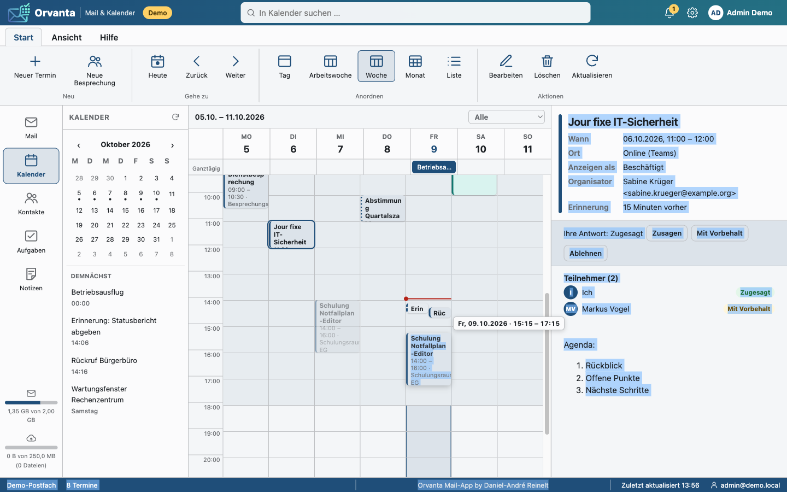


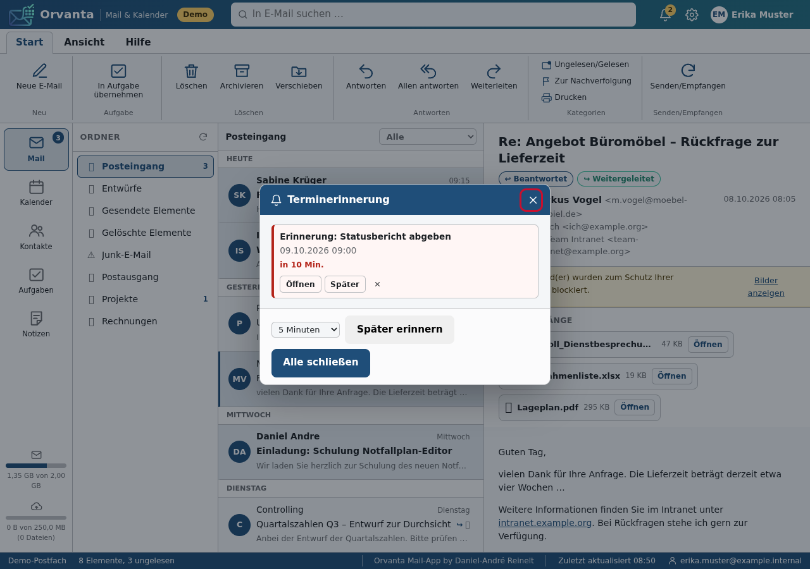

Nachrichten, die schon beantwortet oder weitergeleitet wurden, kennzeichnet
Orvanta in der Nachrichtenliste mit einem kleinen **↩** (beantwortet) bzw.
**↪** (weitergeleitet) neben dem Betreff und im Nachrichtenkopf zusätzlich mit
den Marken „↩ Beantwortet“ und „↪ Weitergeleitet“. Die Angaben kommen aus dem
Exchange-Postfach selbst (`IconIndex`, `PR_LAST_VERB_EXECUTED`) bzw. bei
Postfächern ohne Exchange aus den IMAP-Flags (`\Answered`, `$Forwarded`); die
genauen Felder stehen in
[docs/orvanta-referenz.md](orvanta-referenz.md) (Abschnitt 5.2) und
[docs/mail-proxy-referenz.md](mail-proxy-referenz.md).

Der Verfassen-Dialog lässt sich über die Schaltfläche „In neuem Tab öffnen“
(Kopfzeile des Dialogs) aus dem Overlay in einen eigenen Browser-Tab
verschieben. Empfänger, Betreff, Priorität, bereits getippter Text und
hochgeladene Anhänge werden vollständig übernommen; der ursprüngliche Tab
bleibt frei für die weitere Arbeit in Orvanta, ohne die Nachricht im neuen
Tab zu beeinflussen. Senden oder Verwerfen schließt den eigenen Tab wieder.

Die Felder „An“, „Cc“ und „Bcc“ (sowie die Teilnehmerfelder von Terminen)
schlagen beim Tippen Empfänger vor – nach demselben Combobox-Mechanismus wie
die AD-Gruppen-Vorschläge im Adminbereich (Inline-Ergänzung, Liste, Pfeiltasten,
Enter/Tab übernehmen, Esc schließt). Quellen sind die **Telefonliste** (lokal
synchronisierter AD-Bestand, nur Einträge mit E-Mail-Adresse) und der
**eigene Verlauf**: Adressen, an die der Benutzer bereits gesendet hat, auch
wenn sie weder in der Telefonliste noch in den Exchange-Kontakten stehen.
Der Verlauf liegt je Benutzer als versteckte Datei `.empfaenger.json` im
Orvanta-Ordner seiner Nextcloud (`<cache_folder>/`) und wird nach jedem
Versand aktualisiert; Verlaufstreffer stehen in der Liste oben
(„Zuletzt verwendet“). Ohne Nextcloud gibt es nur die Telefonliste.

Ist eine Nachricht im Lesebereich geöffnet, übernimmt die Menüband-Schaltfläche
**„In Aufgabe übernehmen“** (Reiter *Start*, Gruppe *Aufgabe*) die Nachricht in
eine neue Aufgabe: Der Betreff wird zum Aufgabentitel, der Nachrichtentext zur
Notiz. Der Aufgabendialog öffnet sich vorausgefüllt, sodass Fälligkeitsdatum,
Erinnerung, Status und Priorität vor dem Speichern ergänzt werden können. Die
Aufgabe landet wie jede andere im Modul **Aufgaben** (Exchange); die E-Mail
selbst bleibt unverändert.

Termine lassen sich im Kalender mit der Maus **per Drag&Drop verschieben**.
Während des Ziehens zeigt Orvanta neben dem Zeiger eine dezente Hinweisbox mit
der neuen Startzeit („Di, 06.10.2026 · 14:30 – 16:30“, in der Monatsansicht
zusätzlich das Tagesdatum); das Ziel wird hervorgehoben und der Termin als
blasse Vorschau an der neuen Position angedeutet. In der Wochen- und
Tagesansicht rastet die Zeit auf 15 Minuten ein, in der Monatsansicht und im
Ganztägig-Bereich wandert der Termin um ganze Tage und behält seine Uhrzeit.
Abgelegt wird nur, wenn sich Beginn oder Ende tatsächlich ändern; Loslassen
außerhalb des Kalenders bricht ab. Die Details stehen in
[docs/orvanta-referenz.md](orvanta-referenz.md) (Abschnitte 3.1, 6 und 9.1).

---

## 2. Oberfläche

Das Layout folgt dem Notfallplan-Editor (Farbpalette, Ribbon-Schaltflächen,
Typografie, Statusleiste):

- **Kopfzeile:** Name „Orvanta“, Suchfeld, Einstellungen (⚙), Profil (👤).
- **Linke Navigationsleiste:** Umschaltung der Module Mail, Kalender, Kontakte,
  Aufgaben, Notizen (Icon + Text, `aria-pressed`).
- **Mittlere Spalte:** Ordnerbaum (Mail) bzw. Listen; im Kalender und bei
  Notizen wird die Spalte zur Hauptfläche (Raster/Kacheln).
- **Rechte Spalte:** Detailansicht (Nachricht mit Kopf und Anhängen, Termin,
  Kontakt …); wird nur geöffnet, wenn ein Element gewählt ist
  (Root-Klasse `ov--detail-open`).
- **Statusleiste:** Verbindungsstatus, Belegung des Zwischenspeichers (Quota),
  Autoren-Hinweis „Orvanta Mail-App by Daniel-André Reinelt“ (Klick öffnet
  einen Hinweisdialog zum Namen und zur KI-gestützten Entwicklung) und – sobald die
  KI-Unterstützung verfügbar ist – ein kleines Roboter-Symbol (Klick öffnet die
  Kurzanleitung, siehe Abschnitt 7).
- **Speicheranzeigen unten links:** Zwei kleine Balken unter den Modulen
  zeigen die Belegung des **Exchange-Postfachs** (Summe aller Ordner ohne
  Suchordner und „Wiederherstellbare Elemente“ – entspricht `TotalItemSize`
  aus `Get-MailboxStatistics` – gegen die vom Server gesetzte Sendegrenze,
  ab 80 % orange) und des
  **Anhang-Zwischenspeichers** in Nextcloud. Der Einstellungsdialog (Zahnrad)
  nennt zusätzlich die Grenzen „Warnung ab“, „Senden gesperrt ab“ und
  „Empfang gesperrt ab“. Exchange liefert diese Grenzen über EWS meist nicht;
  dann werden sie aus dem **Active Directory** der Identitätsquelle des
  Benutzers gelesen: `mDBStorageQuota` (Warnung), `mDBOverQuotaLimit`
  (Senden) und `mDBOverHardQuotaLimit` (Empfang) am Benutzer – bzw. bei
  `mDBUseDefaults = TRUE` an der Postfachdatenbank (`homeMDB`, Partition
  „Configuration“; das LDAP-Bindkonto braucht dort Leserechte, was für
  authentifizierte Benutzer standardmäßig gilt). Das Ergebnis wird je
  Sitzung 15 Minuten zwischengespeichert. Findet sich auch dort keine
  Grenze, gilt die im Adminbereich eingetragene **Postfachgröße**
  (`mailbox_quota_mb`). Ist auch diese 0, erscheint nur die Größe („ohne
  Grenze“); ist Exchange nicht erreichbar, „Nicht verfügbar“.

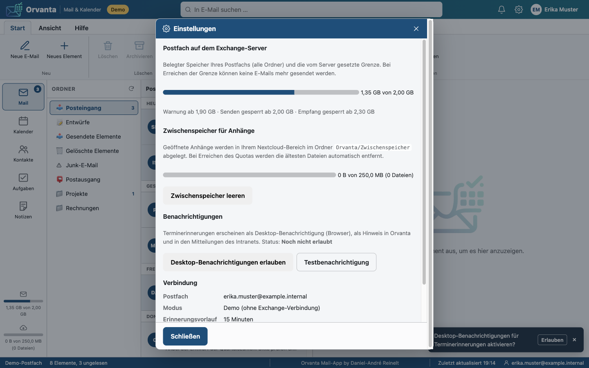

Alle Styles liegen in `public/assets/css/orvanta.css`. Da die Content Security
Policy inline-`style`-Attribute verbietet, setzt das Frontend Styles
ausschließlich über das CSSOM (`node.style.cssText`); HTML-Mails werden dafür
vorab mit `inlineStylesToCssom()` umgeschrieben.

---

## 3. Architektur

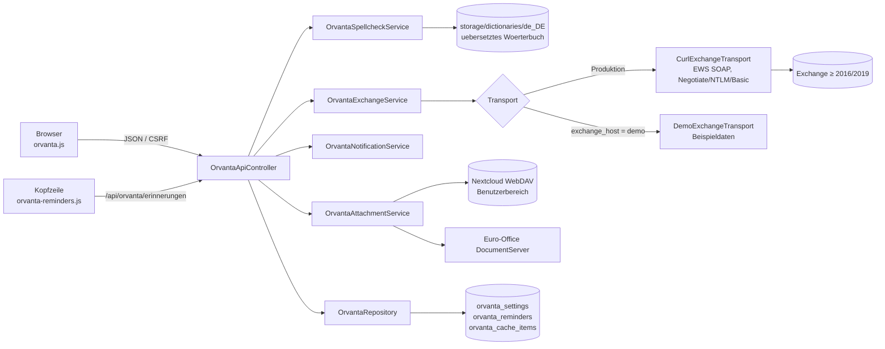
```mermaid
flowchart LR
    B[Browser<br>orvanta.js] -- JSON / CSRF --> API[OrvantaApiController]
    H[Kopfzeile<br>orvanta-reminders.js] -- /api/orvanta/erinnerungen --> API
    API --> EX[OrvantaExchangeService]
    API --> AT[OrvantaAttachmentService]
    API --> NO[OrvantaNotificationService]
    API --> SP[OrvantaSpellcheckService]
    SP --> SD[(storage/dictionaries/de_DE<br>uebersetztes Woerterbuch)]
    EX --> T{Transport}
    T -- Produktion --> C[CurlExchangeTransport<br>EWS SOAP, Negotiate/NTLM/Basic]
    T -- exchange_host = demo --> D[DemoExchangeTransport<br>Beispieldaten]
    C --> X[(Exchange ≥ 2016/2019)]
    AT --> NC[(Nextcloud WebDAV<br>Benutzerbereich)]
    AT --> EO[Euro-Office DocumentServer]
    API --> R[OrvantaRepository]
    R --> DB[(orvanta_settings<br>orvanta_reminders<br>orvanta_cache_items)]
```

| Baustein | Datei | Aufgabe |
|---|---|---|
| `OrvantaController` | `app/Controllers/OrvantaController.php` | Hauptansicht `/office/orvanta`, Rechteprüfung (`authorize()`), Anhang-Links (`openAttachment`, `attachmentFile`) |
| `OrvantaApiController` | `app/Controllers/OrvantaApiController.php` | JSON-API für Mail, Kalender, Kontakte, Aufgaben, Notizen, Anhänge, Zwischenspeicher, Erinnerungen |
| `Admin\OfficeController` | `app/Controllers/Admin/OfficeController.php` | `updateOrvanta()` (Einstellungen), `testOrvanta()` (Verbindungstest) |
| `OrvantaConfigService` | `app/Services/Orvanta/` | Einstellungen (`DEFAULTS`), Validierung, Dienstkonto-Kennwort verschlüsselt, Demo-Erkennung |
| `OrvantaExchangeService` | `app/Services/Orvanta/` | Fachlogik zu Exchange: Ordner, Nachrichten, Termine, Kontakte, Aufgaben, Notizen, Erinnerungen; Impersonation des Benutzers; Failover über die Hosts der DAG (Abschnitt 4c) |
| `OrvantaExchangePool` | `app/Services/Orvanta/` | Lastverteilung (Fair-use, Sitzungszahl, Antwortzeit), Sitzungsaffinität, Failover und Kachelwerte des DAG-Dashboards |
| `OrvantaExchangeHostRepository` | `app/Repositories/` | Tabellen `orvanta_exchange_hosts` und `orvanta_exchange_sessions` (Hostliste, Lastkennzahlen, Sitzungszuordnung) |
| `Admin\OrvantaHostController` | `app/Controllers/Admin/OrvantaHostController.php` | DAG-Dashboard unter `/admin/office/orvanta/hosts` (Hosts ergänzen, Wartung, entfernen, Verbindungstest, JSON-Kachelwerte) |
| `CurlExchangeTransport` / `DemoExchangeTransport` | `app/Services/Orvanta/` | EWS-SOAP per cURL (`ExchangeTransportInterface`) bzw. Beispieldaten ohne Server |
| `EwsXml` | `app/Services/Orvanta/` | Aufbau/Auswertung der SOAP-Nachrichten (`DOMDocument`) |
| `MailHtmlSanitizer` | `app/Services/Orvanta/` | HTML-Mails bereinigen (Skripte, externe Inhalte, Event-Handler entfernen) |
| `OrvantaAttachmentService` | `app/Services/Orvanta/` | Anhänge: signierte Kurzzeit-Links, Öffnungsmodus (`office`/`browser`/`download`), Zwischenspeicher und Ablage in Nextcloud (WebDAV), Quota |
| `OrvantaRecipientService` | `app/Services/Orvanta/` | Empfänger-Vorschläge für An/Cc/Bcc: Telefonliste + Verlauf gesendeter Adressen (versteckte Datei `.empfaenger.json` in der Nextcloud des Benutzers, kurz in der Sitzung gehalten) |
| `OrvantaNotificationService` | `app/Services/Orvanta/` | Fällige Erinnerungen ermitteln, zustellen, verschieben, schließen; Einträge für die Kopfzeile |
| `OrvantaSignatureService` | `app/Services/Orvanta/` | Signaturvorlagen (Abschnitt 4a): Validierung, Zuordnung per AD-Gruppe, E-Mail-taugliches HTML aus Vorlage + Telefonliste + Design, `append()`/`strip()` beim Senden |
| `OrvantaSpellcheckService` | `app/Services/Orvanta/` | Deutsche Rechtschreibprüfung (Abschnitt 7b): `check()` (Hunspell-Algorithmus: Affixe, Zusammensetzungen, Bindestrich-Zerlegung, Groß-/Kleinschreibung) und `suggest()` (Vorschläge, der wahrscheinlichste zuerst) |
| `OrvantaSpellcheckSupplement` | `app/Services/Orvanta/` | Mitgelieferte Ergänzungen zum Wörterbuch (`Hr.`, `OK`, `Homeoffice`, `MfG`, …) |
| `OrvantaSpellcheckUserWords` / `OrvantaSpellcheckWordRepository` | `app/Services/Orvanta/`, `app/Repositories/` | Persönliches Wörterbuch je Benutzer (Tabelle `orvanta_spellcheck_words`): Validierung, Obergrenze 1000 Wörter |
| `OrvantaSpellcheckCompiler` / `OrvantaSpellcheckDictionary` / `OrvantaSpellcheckCasing` | `app/Services/Orvanta/` | Übersetzt die Hunspell-Quelldateien einmalig in ein kompaktes Format bzw. liest es zur Laufzeit verzögert ein; gemeinsame Logik für Groß-/Kleinschreibung und scharfes S |
| `scripts/spellcheck_dictionary.php` | `scripts/` | Einmaliger Download + Übersetzung des Wörterbuchs beim Containerstart (Abschnitt 7b) |
| `Admin\OrvantaSignatureController` | `app/Controllers/Admin/OrvantaSignatureController.php` | Pflege der Signaturvorlagen unter `/admin/office/signaturen` (Liste, Formular, Vorschau-iframe) |
| `OrvantaOofService` | `app/Services/Orvanta/` | Abwesenheitsnotizen (Abschnitt 4d): Vorlagen und Zuordnung per AD-Gruppe, Zusammensetzen von festem Text, dynamischem Text und Signatur, Übertragen auf den Exchange-Server (`SetUserOofSettings`), Zustand für Banner und Dialog |
| `Admin\OrvantaOofController` | `app/Controllers/Admin/OrvantaOofController.php` | Pflege der Abwesenheitsnotiz-Vorlagen unter `/admin/office/abwesenheit` (Liste, Formular, Vorschau-iframe) |
| `OrvantaSharedMailboxService` | `app/Services/Orvanta/` | Zusätzlich berechtigte Postfächer (Abschnitt 4e): Zuordnungen je Benutzer, Erreichbarkeitsprüfung über EWS (`probeMailbox()`), Absenderprüfung, Kalender-Sichtbarkeit |
| `OrvantaSharedMailboxRepository` | `app/Repositories/` | Tabelle `orvanta_shared_mailboxes`; Abgleich mit den AD-Postfächern (`syncDiscovered()`); Benutzersuche für den Adminbereich (Telefonliste + Identitätsquellen) |
| `OrvantaDelegateDirectory` | `app/Services/Orvanta/` | Liest die per Auto-Mapping eingebundenen Postfächer des Benutzers aus dem AD (`msExchDelegateListBL`, `LdapClient::delegatedMailboxes()`), 15 Minuten je Sitzung zwischengespeichert |
| `Admin\OrvantaSharedMailboxController` | `app/Controllers/Admin/OrvantaSharedMailboxController.php` | Zuordnung weiterer Postfächer unter `/admin/office/orvanta/postfaecher` (Suche, Zuordnung, Prüfen, Entfernen) |
| `OrvantaRepository` | `app/Repositories/OrvantaRepository.php` | Zugriff auf die drei Orvanta-Tabellen |
| `OrvantaSignatureRepository` | `app/Repositories/OrvantaSignatureRepository.php` | Tabelle `orvanta_signatures` |
| `OrvantaOofRepository` | `app/Repositories/OrvantaOofRepository.php` | Tabellen `orvanta_oof_templates` und `orvanta_oof_settings` |
| Frontend | `public/assets/js/orvanta.js`, `orvanta-reminders.js`, `orvanta-viewer.js`, `admin-orvanta-hosts.js`, `admin-oof.js`, `public/assets/css/orvanta.css` | App, Erinnerungen in der Kopfzeile, Anhang-Viewer, Live-Aktualisierung des DAG-Dashboards, Live-Vorschau der Abwesenheitsnotiz-Vorlage |
| Ansichten | `views/orvanta/index.php`, `views/orvanta/viewer.php`, `views/admin/office.php` (Karte `#orvanta`), `views/admin/orvanta-signatures.php`, `views/admin/orvanta-signature.php`, `views/admin/orvanta-oof-templates.php`, `views/admin/orvanta-oof-template.php`, `views/admin/orvanta-hosts.php`, `views/admin/orvanta-shared-mailboxes.php` | |
| Migrationen | `database/migrations/033_create_orvanta_tables.sql`, `034_create_orvanta_ai_usage.sql`, `035_orvanta_signatures.sql`, `036_orvanta_signature_colors.sql`, `037_orvanta_signature_name_format.sql`, `042_orvanta_spellcheck_words.sql`, `043_orvanta_exchange_dag.sql`, `044_orvanta_exchange_session_client.sql`, `045_orvanta_oof.sql`, `046_orvanta_shared_mailboxes.sql`, `047_orvanta_shared_mailboxes_reverify.sql`, `048_orvanta_flow_presence.sql` | |
| `OrvantaMailRouter`, `ProxyMailBackend` | `app/Services/MailProxy/` | Backend-Auswahl je Benutzer (Exchange oder SMTP-/IMAP-Proxy, gemeinsames `OrvantaMailBackendInterface`); Details in [mail-proxy.md](mail-proxy.md) |
| Tests | `tests/Unit/OrvantaServiceTest.php`, `tests/Unit/OrvantaSignatureTest.php`, `tests/Unit/OrvantaSpellcheckTest.php`, `tests/Unit/MailProxyTest.php`, `tests/Unit/OrvantaSharedMailboxTest.php` | Fakes für den Exchange-Transport bzw. den Proxy; Signaturen und zusätzliche Postfächer gegen SQLite; Rechtschreibung gegen ein eigenes Mini-Wörterbuch |

### Datenbank

| Tabelle | Zweck | Wichtige Spalten |
|---|---|---|
| `orvanta_settings` | Einstellungen (Schlüssel/Wert) | `setting_key` (unique), `setting_value` |
| `orvanta_reminders` | Lokal zwischengespeicherte Terminerinnerungen je Benutzer | `user_uid`, `item_hash` (unique je Benutzer), `subject`, `location`, `starts_at`, `remind_at`, `state` (pending/delivered/dismissed/snoozed) |
| `orvanta_cache_items` | Bestand des Zwischenspeichers im Nextcloud-Bereich des Benutzers | `user_uid`, `kind` (attachment/message), `item_hash`, `name`, `path`, `content_type`, `size_bytes` |
| `orvanta_ai_usage` | Zähler der KI-Unterstützung (Migration 034) – nur Metadaten, nie Texte | `user_uid`, `kind` (mail_compose/mail_reply/mail_forward/event/reminder), `model`, `input_tokens`, `output_tokens`, `created_at` |
| `orvanta_signatures` | Signaturvorlagen (Migrationen 035–037) | `name`, `greeting`, `name_format` (first_last/last_first), `street`, `postal_city`, `phone_mode` (prefix/full), `phone_prefix`, `text_color`, `separator_color` (Schlüssel einer Designfarbe), `ad_groups` (JSON-Liste), `sort_order`, `active` |
| `orvanta_oof_templates` | Vorlagen der Abwesenheitsnotiz (Migration 045) | `name`, `fixed_text` (fester, für den Benutzer schreibgeschützter Teil), `example_text` (dynamischer Beispieltext), `ad_groups` (JSON-Liste), `sort_order`, `active` |
| `orvanta_oof_settings` | Letzter Stand der Abwesenheitsnotiz je Benutzer (Migration 045) | `user_uid`, `template_id`, `dynamic_text`, `external_audience` (none/all), `schedule_mode` (range/until_off), `start_date`, `end_date`, `active`; maßgeblich ist der Zustand auf dem Exchange-Server |
| `orvanta_spellcheck_words` | Persönliches Wörterbuch der Rechtschreibprüfung (Migration 042) | `user_uid` (klein geschrieben), `word` (≤ 64, Schreibweise genau unterschieden; unique je Benutzer), `created_at` |
| `orvanta_shared_mailboxes` | Zusätzlich berechtigte Postfächer je Benutzer (Migration 046, Neuprüfung als Benutzer durch Migration 047, Abschnitt 4e) | `user_uid` + `email` (unique, ohne Beachtung der Groß-/Kleinschreibung), `display_name`, `source` (`exchange` = Auto-Mapping aus dem AD, `admin` = manuell), `send_as` („Senden als“ erlaubt), `active`, `verified_at`/`verify_error`/`checked_at` (Erreichbarkeitsprüfung), `calendar_visible` (Kalender eingeblendet), `sort_order` |
| `orvanta_archives` | Langzeitarchiv je Benutzer (Migration 038) | `user_uid` (unique), `mailbox`, `storage_folder`, `format_version`, `status` (active/error), Zähler, `last_successful_run`, `last_notice` |
| `orvanta_archive_folders` | Abbild der Exchange-Ordner im Archiv | `archive_id` + `folder_hash` (unique), `exchange_folder_id`, `name`, `path` |
| `orvanta_archive_items` | Journal und Suchindex je archivierter Nachricht – die Inhalte selbst liegen nur in den Containern | `archive_id` + `item_hash` (unique), `internet_message_id`, `subject`, `from_*`, `recipients`, `item_date`, `kind` (immer `mime`; `json` ist reserviert und wird nicht mehr geschrieben), `content_hash`, `chunk_name`/`chunk_offset`/`chunk_length`, `search_text`, `status` (pending/committed/deleted/failed) |
| `orvanta_archive_jobs` | Archivierungsläufe inkl. Sperre (höchstens ein Lauf je Archiv) | `archive_id`, `status` (running/completed/failed), `locked_until`, Zähler, `last_error` |
| `orvanta_exchange_hosts` | Hosts der Exchange-DAG (Migration 043, Abschnitt 4c) | `host` (unique), `ews_url`, `is_primary`, `active` (Wartung), `sort_order`, `latency_ms`/`latency_samples`/`last_latency_ms`, `last_session_at` (Fair-use), `last_check_at`, `last_ok`, `last_error`, `failures` |
| `orvanta_exchange_sessions` | Zuordnung laufender Orvanta-Sitzungen zu einem Host (Migrationen 043, 044) | `session_hash` (unique, `sha1` des Affinitätsschlüssels Benutzer + Client), `user_uid`, `client_ip`, `client_host` (Client des Sitzungsbeginns), `host`, `failovers`, `requests`, `started_at`, `last_seen_at` |

### Routen

- Ansicht: `GET /office/orvanta` (SSO-Benutzer mit App-Freigabe `orvanta`).
- Anhänge: `GET /office/orvanta/anhang/oeffnen?token=…`,
  `GET /office/orvanta/anhang/datei?token=…` (Zugriff des DocumentServers).
- API (`/api/orvanta/…`, JSON, CSRF-Token im Header `X-CSRF-Token`):
  `status`, `sitzung` (Keep-alive, aktuelles CSRF-Token und aktueller Exchange-Host der Sitzung), `mail/ordner`, `mail/ordner/eigenschaften`, `mail/ordner/neu`, `mail/ordner/gelesen` (Ordner-Kontextmenü), `mail/kennwort` (nur Proxy-Postfächer: geändertes Kennwort übernehmen), `mail`, `mail/nachricht`, `mail/kopfzeilen` (rohe Kopfzeilen, Kontextmenü „Info“), `mail/senden`,
  `empfaenger` (Vorschläge für An/Cc/Bcc), `mail/entwurf`, `mail/antworten`, `mail/aktion`, `anhang/link`,
  `anhang/nextcloud`, `zwischenspeicher`, `zwischenspeicher/leeren`,
  `kalender`, `kalender/termin` (GET/POST), `kalender/termin/loeschen`,
  `kalender/antwort`, `kalender/postfach` (POST: Kalender eines weiteren
  Postfachs ein-/ausblenden, Abschnitt 4e), `kontakte`, `kontakte/kontakt` (GET/POST),
  `kontakte/loeschen`, `aufgaben`, `aufgaben/aufgabe` (GET/POST),
  `aufgaben/loeschen`, `notizen`, `notizen/notiz` (GET/POST),
  `notizen/loeschen`, `erinnerungen`, `erinnerungen/erledigt`,
  `erinnerungen/spaeter`, `ki/verbessern` (POST, KI-Unterstützung),
  `rechtschreibung/pruefen` und `rechtschreibung/vorschlaege` (POST,
  Rechtschreibprüfung, Abschnitt 7b), `rechtschreibung/woerterbuch`
  (GET/POST) und `rechtschreibung/woerterbuch/entfernen` (POST, persönliches
  Wörterbuch),
  Langzeitarchiv (alle GET): `archiv/status`, `archiv/ordner`, `archiv/mail`,
  `archiv/mail/detail`, `archiv/suche`,
  `abwesenheit` (GET/POST: Abwesenheitsnotiz lesen bzw. setzen oder
  abschalten, Abschnitt 4d).
- Admin (`$requireAdmin`): `GET|POST /admin/office/orvanta`,
  `POST /admin/office/orvanta/pruefen`; Signaturvorlagen
  `GET /admin/office/signaturen`, `GET|POST /admin/office/signaturen/vorlage`,
  `POST /admin/office/signaturen/loeschen`,
  `GET /admin/office/signaturen/vorschau` (iframe mit eigener CSP);
  Abwesenheitsnotiz-Vorlagen (Abschnitt 4d)
  `GET /admin/office/abwesenheit`,
  `GET|POST /admin/office/abwesenheit/vorlage`,
  `POST /admin/office/abwesenheit/loeschen`,
  `GET /admin/office/abwesenheit/vorschau` (iframe mit eigener CSP);
  Exchange-DAG (Abschnitt 4c):
  `GET /admin/office/orvanta/hosts` (Dashboard),
  `POST /admin/office/orvanta/hosts` (Hosts ergänzen, DAG bestätigt),
  `POST /admin/office/orvanta/hosts/status` (Wartung/aktivieren),
  `POST /admin/office/orvanta/hosts/loeschen` (entfernen),
  `POST /admin/office/orvanta/hosts/pruefen` (Verbindungstest einzeln/alle),
  `POST /admin/office/orvanta/hosts/pruefpostfach` (Prüfpostfach für den Verbindungstest),
  `GET /admin/office/orvanta/hosts/daten` (Kachelwerte als JSON);
  zusätzlich berechtigte Postfächer (Abschnitt 4e):
  `GET /admin/office/orvanta/postfaecher` (Übersicht der aus Exchange
  übernommenen Postfächer),
  `POST /admin/office/orvanta/postfaecher/pruefen` (Erreichbarkeit über EWS);
  Nachrichtenfluss-Dashboard (Abschnitt 4f):
  `GET /admin/office/orvanta/nachrichtenfluss` (Dashboard),
  `GET /admin/office/orvanta/nachrichtenfluss/daten` (Kennzahlen als JSON für
  die Live-Aktualisierung),
  `POST /admin/office/orvanta/nachrichtenfluss/quellen/pruefen`
  (Verbindungstest je Identitätsquelle).

---

## 4. Anbindung an Exchange

### Voraussetzungen

1. Exchange 2016/2019/SE On-Premise mit erreichbarem EWS-Endpunkt
   (`https://<host>/EWS/Exchange.asmx`).
2. Ein **Dienstkonto** mit der Rolle `ApplicationImpersonation`:

   ```powershell
   New-ManagementRoleAssignment -Name "Orvanta Impersonation" `
       -Role ApplicationImpersonation -User svc-orvanta
   ```

   Optional mit `-RecipientRestrictionFilter` auf die berechtigten Benutzer
   einschränken.
3. Windows-Anmeldung (SSO) im Intranet, damit der Benutzer bekannt ist
   (`docs/office.md`, Abschnitt „Anmeldung“). Ohne SSO zeigt die Office-Kachel
   keine Apps.

### Anmeldeverfahren

| Verfahren | Beschreibung |
|---|---|
| **Negotiate** (Standard) | Dienstkonto + Kennwort; die Windows-Anmeldung wird per NTLM ausgehandelt. Der Intranet-Server (`app`-Container) besitzt keine eigene Kerberos-Identität – die Keytab liegt nur im `auth`-Container –, daher ist das Dienstkonto Pflicht. |
| **NTLM** | Dienstkonto + Kennwort (`FIRMA\svc-orvanta` oder UPN). |
| **Basic** | Dienstkonto + Kennwort, nur über HTTPS mit TLS-Prüfung. |

Das Kennwort wird verschlüsselt in `orvanta_settings` abgelegt
(`Crypto`, `APP_KEY`). Die Postfach-Zuordnung erfolgt per E-Mail-Adresse aus dem
AD (Standard) oder per UPN (`benutzer@<UPN-Domäne>`); sie wird als
`ExchangeImpersonation`-Kopf an EWS übergeben. Beide Angaben sind nur dann eine
Postfach-Kennung, wenn Exchange sie als Alias oder UPN kennt – bei neu
angelegten Konten fehlt das, und Exchange meldet
`ErrorNonExistentMailbox`, obwohl das Postfach existiert. Maßgeblich ist daher
die primäre SMTP-Adresse des Postfachs aus dem Active Directory
(`proxyAddresses`, Eintrag mit `SMTP:`), die Orvanta beim Öffnen der App liest
und je Sitzung 15 Minuten hält; schlägt das fehl (kein Postfach, AD nicht
erreichbar), gilt weiter die Konfiguration. Ist die verwendete AD-Adresse nur
ein Alias des Postfachs (`ErrorNonPrimarySmtpAddress`), übernimmt Orvanta die
von Exchange genannte primäre Adresse, wiederholt die Anfrage und merkt sich die
Zuordnung 24 Stunden (`storage/cache/orvanta_primary_smtp.json`).

### Admin-Einstellungen (`/admin/office/orvanta`)


| Schlüssel | Bedeutung | Standard |
|---|---|---|
| `exchange_enabled` | App in der Office-Kachel anbieten | aus |
| `exchange_host` | Hostname; `demo` aktiviert außerhalb der Produktion Beispieldaten | – |
| `exchange_ews_url` | EWS-Endpunkt (überschreibt den Hostnamen) | aus Host gebildet |
| `exchange_version` | `Exchange2016` (auch 2019/SE) oder `Exchange2013_SP1` | `Exchange2016` |
| `exchange_auth` | `negotiate`, `ntlm`, `basic` | `negotiate` |
| `exchange_service_user`, `exchange_service_password` | Dienstkonto (Pflicht bei aktivierter Anbindung außer im Demo-Modus) | – |
| `exchange_identity`, `exchange_upn_domain` | Postfach-Zuordnung (`smtp`/`upn`) | `smtp` |
| `exchange_verify_tls` | TLS-Zertifikat prüfen | an |
| `exchange_timeout` | Zeitlimit je Anfrage (3–120 s) | 20 |
| `exchange_owa_url` | Link „Im Browser-Outlook öffnen“ | – |
| `mailbox_quota_mb` | Postfachgröße für die Belegungsanzeige, wenn weder Exchange noch das AD eine Grenze liefern (0 = ohne Grenze) | 0 |
| `cache_folder` | Ordner im Nextcloud-Bereich des Benutzers | `Orvanta` |
| `cache_quota_mb` | Quota des Zwischenspeichers je Benutzer (0 = aus) | 250 |
| `reminder_lead_minutes` | Vorlaufzeit, wenn ein Termin keine eigene Erinnerung hat | 15 |
| `reminder_header` | Fällige Erinnerungen auch in den Mitteilungen der Kopfzeile | an |
| `flow_ai_user_names` | Namen der KI-Nutzer im Nachrichtenfluss-Dashboard anzeigen (sonst pseudonym „Benutzer 1 …“) | aus |
| `default_folder` | Startansicht (`inbox`, `calendar`, …) | `inbox` |
| `poll_interval` | Abfrageintervall der App in Sekunden (neue E-Mails, Ungelesen-Zähler, Erinnerungen) | 60 |
| `archive_enabled` | Langzeitarchiv aktivieren (siehe Abschnitt 7a) | aus |
| `archive_group` | AD-Gruppe, deren Mitglieder archiviert werden; Pflicht bei aktivierter Archivierung, ohne Gruppe wird niemand archiviert | leer |
| `archive_threshold`, `archive_threshold_unit` | Auslöse-Schwelle der Postfachbelegung (`percent` der Postfachgrenze oder `mb` absolut) | 80 / `percent` |
| `archive_age_days` | Mindestalter in Tagen – nur ältere Nachrichten werden archiviert (1–3650) | 60 |
| `archive_folder` | Ordner im Nextcloud-Bereich des Benutzers für die Archivcontainer | `Orvanta-Archiv` |
| `archive_batch_size` | Nachrichten je Verarbeitungsschritt (1–200) | 50 |
| `archive_poll_interval` | Prüfintervall des Archiv-Workers in Sekunden (60–86400) | 3600 |

Der **Verbindungstest** ruft `GetFolder` auf dem Posteingang auf – optional im
Namen eines angegebenen Postfachs – und meldet Version, Dauer und Fehlertext.

### Freigabe der App

Wie alle Office-Apps wird Orvanta unter **Admin → Office → Apps und
Berechtigungen** pro AD-Gruppe oder App-Paket freigegeben
(`office_app_permissions`, `app_key = orvanta`). Ohne Freigabe antwortet
`/office/orvanta` mit 403.

---

## 4a. Signaturvorlagen

Unter **Admin → Office → Signaturvorlagen verwalten**
(`/admin/office/signaturen`) werden beliebig viele E-Mail-Signaturen
gepflegt. Die Zuordnung zum Benutzer erfolgt über **AD-Gruppen**; passen
mehrere Vorlagen, gilt die mit der kleinsten Reihenfolge. Ohne passende
Vorlage wird keine Signatur angefügt.


Aufbau der Signatur (Beispiel):

```
Mit freundlichen Grüßen

[Logo]  **Daniel-André Reinelt** ■ Administrator ■ Informationstechnologie (IT / EDV)
        Alter Weg 80 ■ 38302 Wolfenbüttel
        T.: +49 (05331) 934 - **1849**
```

| Bestandteil | Quelle |
|---|---|
| Grußformel, Straße + Hausnummer, PLZ + Ort | Vorlage |
| Name, Position, Abteilung | Active Directory (Telefonliste: `first_name`, `last_name`, `title`, `department`; LDAP-Attribut `LDAP_ATTR_TITLE`, Standard `title`) |
| Darstellung des Namens | je Vorlage wählbar: **Vorname Nachname** (Standard) oder **Nachname, Vorname**; fehlt im AD Vor- oder Nachname, wird der Anzeigename (`display_name`) unverändert übernommen |
| Rufnummer | wählbar: **Präfix aus der Vorlage + vierstellige Durchwahl** (letzte vier Ziffern der AD-Rufnummer, fett) oder **komplette Rufnummer aus dem AD** (`T.: …`); ohne AD-Rufnummer entfällt die Zeile |
| Schriftfarbe / Farbe der Trennzeichen (■) | je Vorlage wählbar aus den Farben der Designeinstellungen (Standard „Textfarbe (hell)“ `color_text` / „Akzentfarbe“ `color_accent`); gespeichert wird der Farbschlüssel, Designänderungen wirken also sofort |
| Logo links neben dem Text | das im Adminbereich hochgeladene Logo (als `data:`-URI eingebettet; Höhe = Anzahl Textzeilen × 18 px, Breite proportional, höchstens 240 px; feste `width`/`height`-Attribute, damit Outlook es nicht in Originalgröße zeigt) |

Verhalten in Orvanta:

- Die Signatur erscheint beim Verfassen, Antworten und Weiterleiten direkt im
  Textfeld – unterhalb des eigenen Textes bzw. oberhalb des Zitats – als
  **schreibgeschützter Block** (`contenteditable="false"`). Eingaben, die den
  Block berühren, werden auf den übrigen Text beschränkt; wird er dennoch
  entfernt oder verändert (etwa über „Alles auswählen“ + Formatierung), fügt
  der Editor ihn sofort wieder ein.
- Maßgeblich ist die **serverseitig** beim Senden, Antworten und Speichern von
  Entwürfen angefügte Fassung (`OrvantaSignatureService::append()`): Bereits
  enthaltene Blöcke (z. B. aus einem Entwurf) werden ersetzt, es gibt also nie
  zwei Signaturen und keine manipulierte Fassung.
- Benutzer können die Signatur weder abwählen noch bearbeiten.


Die Vorschau im Adminbereich zeigt die Vorlage mit Beispieldaten
(„Erika Musterfrau“) und aktualisiert sich beim Ändern der Felder.

---

## 4b. SMTP-/IMAP-Proxy (Benutzer ohne Exchange)

Unter **Admin → Office → SMTP-/IMAP-Proxy** (`/admin/office/mail-proxy`) wird
je Identitätsquelle ein IMAP-/SMTP-Mailserver eingerichtet; AD-Benutzer werden
einzelnen Postfächern zugeordnet. Für zugeordnete Benutzer wählt
`OrvantaMailRouter` das `ProxyMailBackend` statt `OrvantaExchangeService`.

- Verfügbar: Mail lesen/senden/antworten/weiterleiten, Anhänge, Ordner, Suche,
  Entwürfe, Markierungen, Verschieben/Löschen, Kontingent.
- Nicht verfügbar: Kalender, Kontakte, Aufgaben, Notizen, Erinnerungen,
  Langzeitarchiv. Die Oberfläche blendet sie aus (`capabilities` in der
  Seitenkonfiguration und in `/api/orvanta/status`), die API antwortet mit 409.
- Ohne gültige Zuordnung bleibt alles beim Exchange-Verhalten; ein deaktiviertes
  Postfach sperrt Orvanta für den Benutzer (403) ohne Rückfall.
- Orvanta wird in der Office-Kachel auch angeboten, wenn Exchange nicht
  aktiviert ist, aber ein aktiver Proxy-Mailserver existiert.
- Lehnt der Mailserver das hinterlegte Kennwort ab (z. B. vom Benutzer
  geändert), fragt Orvanta in einem Overlay nach dem aktuellen Kennwort. Es wird
  am Mailserver geprüft und ersetzt bei Erfolg den vom Admin eingetragenen Wert
  (`POST /api/orvanta/mail/kennwort`).

Einrichtung, Sicherheit, Cache und Fehlersuche: [docs/mail-proxy.md](mail-proxy.md).

---

## 4c. Exchange-DAG: mehrere Hosts, Lastverteilung und Failover

Exchange On-Premise kann Postfächer in einer **Database Availability Group
(DAG)** auf mehreren Servern replizieren. Orvanta verteilt seine Sitzungen dann
auf die Mitglieder der Gruppe, statt nur einen Server zu nutzen.

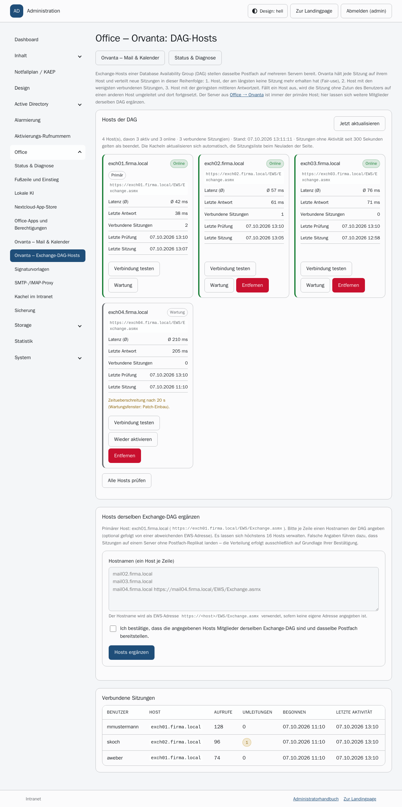

**Grundsatz:** Eine DAG lässt sich nur zu einer **vorhandenen, getesteten
Konfiguration** ergänzen. Der unter Office → Orvanta eingetragene Server
(`exchange_host`) ist und bleibt der **primäre Host**; ohne ihn gibt es keine
Hostliste. Beim Ergänzen bestätigt der Admin per Kontrollkästchen und Rückfrage
(Ja/Abbrechen), dass die angegebenen Server Mitglieder **derselben** DAG sind
und dasselbe Postfach bereitstellen – Orvanta kann das nicht prüfen, und eine
falsche Angabe führt dazu, dass Benutzer ihre Mails nicht öffnen können. Der
Demo-Modus (`exchange_host = demo`) kennt keine echten Hosts.

**Verteilung neuer Sitzungen** (`OrvantaExchangePool::session()`), in dieser
Reihenfolge:

| Priorität | Kriterium | Bedeutung |
|---|---|---|
| 1 | Fair-use | Der Host, der am längsten keine neue Sitzung mehr erhalten hat (`last_session_at`), ist zuerst an der Reihe; noch nie bediente Hosts zuerst. |
| 2 | Sitzungszahl | Bei gleicher Wartezeit erhält der Host mit den wenigsten verbundenen Sitzungen die neue Sitzung (Sitzungen ohne Aktivität seit 300 Sekunden gelten als beendet). |
| 3 | Antwortzeit | Bleibt es gleich, entscheidet die geringste gemittelte Antwortzeit (`latency_ms`, gleitendes Mittel der letzten Messungen). Ein noch nicht gemessener Host gilt als bester Wert und wird dadurch zuerst geprüft. |

Ist eine Sitzung einem Host zugeordnet, bleibt sie dort
(**Sitzungsaffinität**). Eine Sitzung ist das Paar aus **Benutzer und
Client**: der Schlüssel lautet `user:<office_uid>|client:<Client-IP>`
(`OrvantaExchangePool::affinityKey()`) und steht als
`sha1('orvanta-dag:' . Schlüssel)` in `orvanta_exchange_sessions`. Er hängt
bewusst nicht an der PHP-Sitzung: eine neue Sitzungs-ID (Windows- oder
Admin-Anmeldung), ein zweiter Browser-Tab oder der Adminbereich nutzen
dieselbe Zuordnung weiter. Je Benutzer und Arbeitsplatz gibt es damit genau
eine Sitzung – ein Postfach wird nie auf zwei Hosts der DAG verteilt, was den
Synchronisationsaufwand vervielfachen würde. Ohne erkannten Benutzer gilt
ersatzweise die PHP-Sitzung.

**Failover:** Antwortet der gewählte Host nicht (Verbindungsfehler, Zeitlimit,
HTTP ≥ 500 ohne fachlichen EWS-Fehler), markiert Orvanta ihn als gestört und
schreibt die Zuordnung der Sitzung auf den nächsten Host nach derselben
Prioritätenfolge um. Lesende Anfragen wiederholt Orvanta dort – der Benutzer
merkt davon nichts. Ändernde Anfragen (z. B. Senden, Verschieben, Löschen)
werden nur wiederholt, wenn sie den gestörten Host nie erreicht haben; sonst
erhält der Benutzer eine Fehlermeldung, damit keine Mail doppelt verschickt
wird. Der Vorgang wird in
`orvanta_exchange_sessions.failovers` gezählt und im Protokoll als
Host-Fehler (`last_error`, `failures`) geführt. Ein frisch gestörter Host ist
60 Sekunden lang nachrangig (Selbstheilung), danach wird er wieder geprüft.
HTTP **401/403** löst **kein** Failover aus: eine abgelehnte Anmeldung betrifft
alle Hosts der DAG. Dasselbe gilt für fachliche SOAP-Fehler wie ein nicht
vorhandenes Postfach oder eine verweigerte Impersonation.

**Sichtbar für den Benutzer:** Im Fußbereich der App nennt der Tooltipp über der
Verbindungsanzeige („Verbunden mit Exchange“) den aktuellen Exchange-Host der
Sitzung (`OrvantaController::exchangeHost()`). Nach einer Umleitung zieht er
nach, sobald die App die Sitzung auffrischt (`GET /api/orvanta/sitzung`). Bei
Postfächern am SMTP-/IMAP-Proxy (Abschnitt 4b) und im Demo-Modus gibt es keinen
Tooltipp – dort ist kein Exchange-Host beteiligt.

**Dashboard:** Admin → Office → **Orvanta – Exchange-DAG-Hosts**
(`/admin/office/orvanta/hosts`) zeigt je Host eine Kachel mit Hostname,
Status (Online/Gestört/Wartung/Ungeprüft), Latenz (Ø und letzte Antwort),
verbundenen Sitzungen, letzter Prüfung, letzter Sitzungszuweisung und der
letzten Fehlermeldung. Aktionen je Kachel: **Verbindung testen**, **Wartung**
(aktivieren/deaktivieren) und **Entfernen** (nicht für den primären Host). Ein
Host in Wartung erhält keine neuen Sitzungen, bestehende werden beim nächsten
Aufruf umgeleitet; der letzte aktive Host lässt sich nicht abschalten. Die
Kacheln aktualisieren sich automatisch (`GET …/hosts/daten`, JSON, nur lesend,
Intervall aus `poll_interval`), die Seite bleibt ohne JavaScript bedienbar.
Unter den Kacheln stehen die aktiven Sitzungen (Benutzer, Host, Client-IP,
Client-Host, Umleitungen, Aufrufe, Beginn, letzte Aktivität). IP und Hostname
stammen aus dem Aufruf, der die Sitzung begonnen hat – zuletzt
`X-Forwarded-For` (der Auth-Proxy hängt die Client-Adresse am Ende an), sonst
`REMOTE_ADDR`; den Namen ermittelt Orvanta einmalig per Reverse-DNS und lässt
die Spalte leer, wenn er sich nicht auflösen lässt. Die Liste entsteht beim
Laden der Seite neu.
Der Verbindungstest öffnet den Posteingang des **Prüfpostfachs** (auf dem
Dashboard einstellbar, Impersonation); ohne Angabe den des Dienstkontos. Hat
das Dienstkonto kein eigenes Postfach, muss ein Prüfpostfach eingetragen
werden, sonst melden alle Hosts „Gestört“.

**Grenzen:** höchstens 16 Hosts (Vorgabe von Exchange), Hostname je Zeile
(optional mit abweichender EWS-Adresse), keine Prüfung der DAG-Zugehörigkeit
durch Orvanta. Ohne Migration 043 arbeitet Orvanta unverändert mit dem
konfigurierten Server weiter (die Verteilung fällt still auf ihn zurück).
Beendete Sitzungszeilen räumt der Archiv-Worker auf
(`OrvantaExchangePool::purge()`, älter als 24 Stunden).

---

## 4d. Abwesenheitsnotizen

Unter **Admin → Office → Abwesenheitsnotizen** (`/admin/office/abwesenheit`)
werden die Vorlagen für Abwesenheitsnotizen gepflegt. Die Zuordnung zum
Benutzer erfolgt wie bei den Signaturen über **AD-Gruppen**: Passen mehrere
Vorlagen, gilt die mit der kleinsten Reihenfolge; ohne passende Vorlage steht
den Benutzern die Abwesenheitsnotiz nicht zur Verfügung.

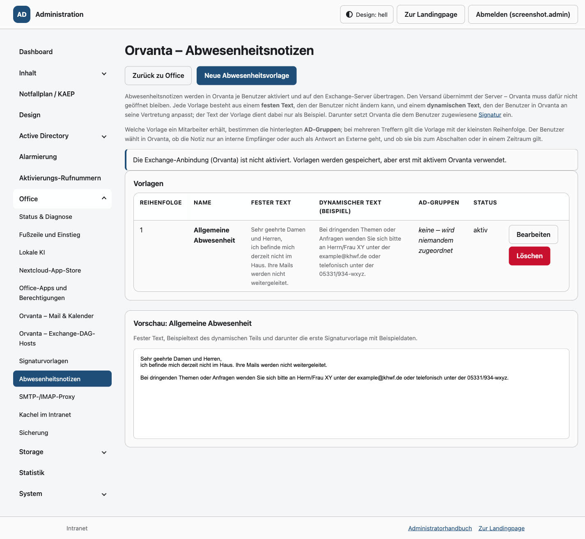

Aufbau einer Vorlage:

| Bestandteil | Quelle | Sicht des Benutzers |
|---|---|---|
| **Fester Text** | Vorlage | schreibgeschützt – kann in Orvanta nicht geändert werden |
| **Dynamischer Beispieltext** | Vorlage | editierbar; wird beim Zuweisen einer neuen Vorlage übernommen und ist nur ein Muster (z. B. Vertretung, Durchwahl) |
| **Signatur** | Signaturvorlagen (Abschnitt 4a) | schreibgeschützt, wird unter dem Text angehängt |

Beispiel:

```
Sehr geehrte Damen und Herren,
ich befinde mich derzeit nicht im Haus. Ihre Mails werden nicht weitergeleitet.

Bei dringenden Themen oder Anfragen wenden Sie sich bitte an Herrn/Frau XY
unter der example@khwf.de oder telefonisch unter der 05331/934-wxyz.

[Signatur des Benutzers]
```

Der feste Text ist im Formular als schreibgeschützter Teil gepflegt, der
dynamische Beispieltext daneben als Muster; die Vorschau zeigt beide Teile
samt Signatur.

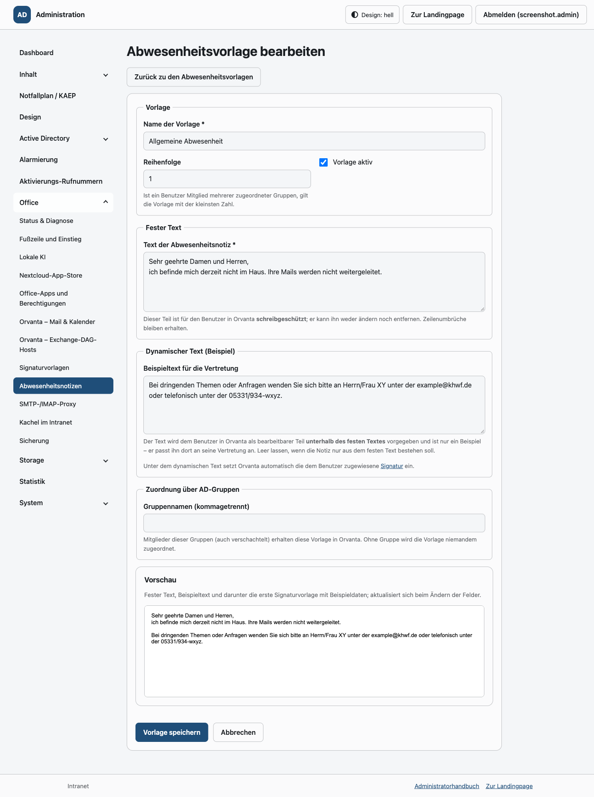

Verhalten in Orvanta:

- Die Abwesenheitsnotiz wird über den Menüband-Punkt **Abwesenheit** gesetzt
  und abgeschaltet. **Den Versand übernimmt der Exchange-Server** – Orvanta
  muss dafür nicht geöffnet bleiben.
- **Empfängerkreis:** nur interne Nutzer oder auch Antworten an Externe.
- **Zeitraum:** von–bis oder bis zum manuellen Abschalten.
- Solange die Notiz im Postfach aktiv ist, zeigt Orvanta unter dem Menüband
  einen **Banner** mit dem Zustand; der Zustand kommt vom Exchange-Server, die
  Anzeige stimmt also auch, wenn die Notiz an anderer Stelle gesetzt wurde.
  Auch der Dialog zeigt oben diesen Zustand.
- **Vorlagenwechsel:** Wird dem Benutzer eine andere Vorlage zugewiesen,
  bleibt eine aktive Notiz mit dem bisherigen Text aktiv; der Dialog weist
  darauf hin, und „Übernehmen“ überträgt den neuen Text.
- **Ohne Vorlage:** Wurde die Vorlage entzogen (z. B. AD-Gruppe entfernt),
  lässt sich eine noch aktive Notiz weiterhin abschalten – Orvanta fragt beim
  Öffnen des Dialogs nach. Aktivieren ist ohne Vorlage nicht möglich.
- Die Abwesenheitsnotiz ist eine Exchange-Funktion. Für Benutzer, die über den
  SMTP-/IMAP-Proxy angebunden sind (Abschnitt 4b), steht sie nicht zur
  Verfügung.

Der Dialog zeigt den festen Vorlagentext schreibgeschützt, darunter die
anpassbare Ergänzung, Empfängerkreis, Zeitraum und die Signatur:

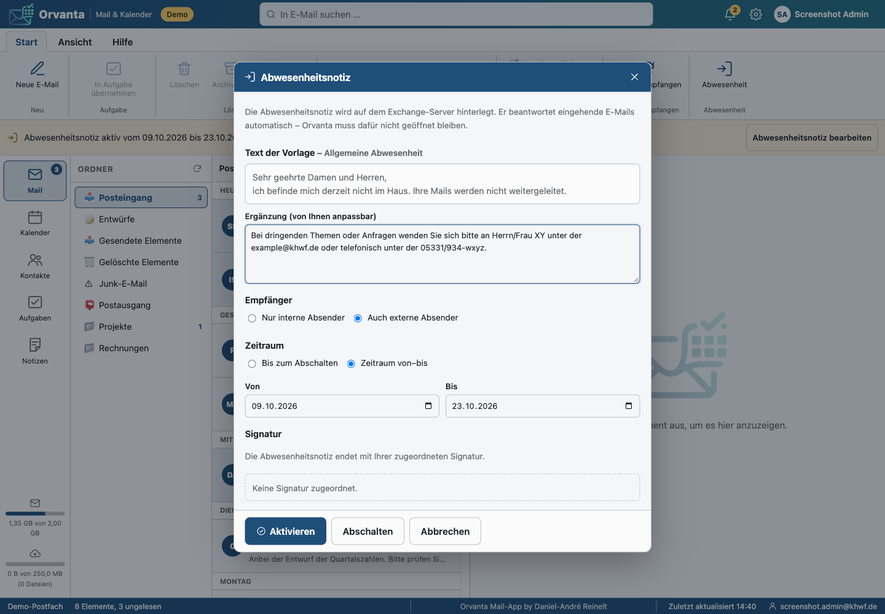

Solange die Notiz aktiv ist, steht der Zustand als Banner unter dem Menüband:

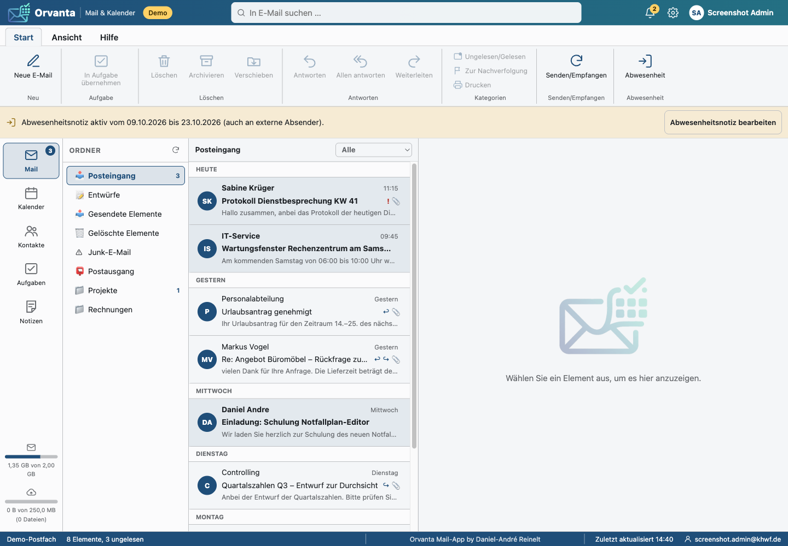

Die Vorschau im Adminbereich zeigt den festen und den dynamischen Text; als
Signatur dient die erste gepflegte Signaturvorlage.

---

## 4e. Weitere Postfächer (Vollzugriff / „Senden als“)

Erhält ein Benutzer auf dem Exchange-Server **Vollzugriff** auf ein weiteres
Postfach (oder „Senden als“), erscheint dieses in Outlook als zusätzlicher
Knoten im Ordnerbaum. Orvanta bildet das genauso ab: Zusätzlich berechtigte
Postfächer stehen als eigene Knoten im Ordnerbaum, und **alle Module** (Mail,
Kalender, Kontakte, Aufgaben, Notizen) lassen sich auf das jeweilige Postfach
umschalten.

Die Zuordnung wird **ausschließlich im Exchange gepflegt** (ECP bzw.
`Add-MailboxPermission`), nicht im Intranet. Erteilt der Exchange-Administrator
einem Benutzer Vollzugriff, trägt Exchange ihn am Postfach ein
(**Auto-Mapping**, AD-Attribut `msExchDelegateListLink`); am Benutzer entsteht
der Rückverweis `msExchDelegateListBL` mit allen so eingebundenen Postfächern.
Outlook bindet genau diese Postfächer automatisch ein – Orvanta ebenso: Beim
Öffnen der App liest es den Rückverweis aus der Identitätsquelle des Benutzers
(LDAP, dasselbe Konto wie die AD-Synchronisation), übernimmt neue Postfächer
(„Senden als“ vorbelegt, Exchange prüft es beim Versand), aktualisiert
Anzeigenamen und Reihenfolge und entfernt Postfächer, deren Vollzugriff
entzogen wurde. Das Ergebnis gilt 15 Minuten je Sitzung; ohne Antwort aus dem
AD (Demo-Modus, kein LDAP, AD nicht erreichbar) bleibt der bisherige Bestand
unverändert. Jedes Postfach wird anschließend über EWS **als der Benutzer**
geprüft, bevor es im Ordnerbaum erscheint: Orvanta gibt sich als der Benutzer
aus und öffnet dessen Zugriff auf das weitere Postfach (`GetFolder` auf
`msgfolderroot` des Postfachs). Erfolgreich ist das nur, wenn Exchange dem
Benutzer **Vollzugriff** gewährt; die Rechte des Dienstkontos allein genügen
nicht. Das Ergebnis gilt 12 Stunden. Steht in der Telefonliste keine
Postfachadresse des Benutzers, bleibt das Postfach „noch nicht geprüft“ und
wird bei seiner nächsten Anmeldung in Orvanta geprüft. Schlägt die Prüfung
fehl, wird das Postfach dem Benutzer nicht angeboten.

Hinweis: Vollzugriff **ohne** Auto-Mapping (`-AutoMapping $false`) erzeugt
keinen Rückverweis im AD und erscheint deshalb – wie in Outlook – nicht
automatisch. Soll ein Postfach in Orvanta sichtbar sein, ist die Berechtigung
mit Auto-Mapping zu erteilen.

**Admin → Office → Orvanta → Weitere Postfächer**
(`/admin/office/orvanta/postfaecher`) zeigt den aktuellen Bestand aller
Benutzer nur lesend: Postfach, Anzeigename, Reihenfolge, Kalender-Zustand und
das Ergebnis der EWS-Prüfung. Über **Prüfen** lässt sich die Prüfung eines
Postfachs sofort wiederholen (z. B. nachdem die Berechtigung im ECP korrigiert
wurde). Eine manuelle Zuordnung gibt es hier bewusst nicht.

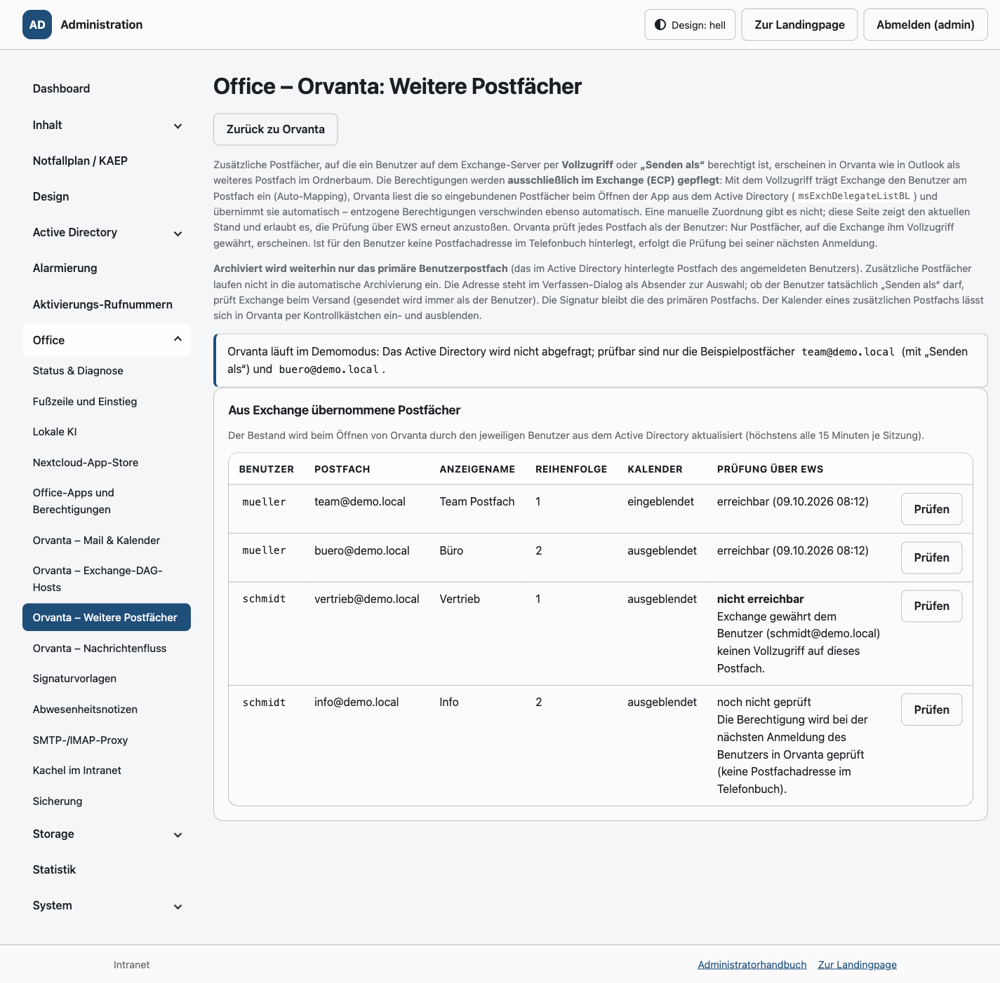

In Orvanta:

- **Ordnerbaum:** Über der Ordnerliste steht ein Umschalter mit dem eigenen
  Postfach und allen aktiven, erreichbaren weiteren Postfächern; die
  Unterknoten (Posteingang, Entwürfe, Gesendet, Gelöscht, eigene Ordner) sind
  ausklappbar. Jeder Ordner, jede Nachricht und jede Aktion (Verschieben,
  Löschen, Kennzeichnen, Entwurf speichern, Anhänge, Kopfzeilen,
  Terminantworten, neue Ordner) gilt für das gewählte Postfach. Verschoben
  wird nur innerhalb eines Postfachs; Ordner anderer Postfächer und die
  Postfach-Wurzelknoten nehmen keine Nachrichten per Drag & Drop an.
- **Kalender:** Die Kalender der weiteren Postfächer werden über
  **Checkboxen** über der Kalenderansicht ein- und ausgeblendet; der eigene
  Kalender ist immer sichtbar. Termine aus weiteren Postfächern sind mit dem
  Namen des Postfachs gekennzeichnet (auch im Agenda-Bereich der
  Monatsansicht). Eingeblendete Kalender werden beim Aufruf der Ansicht
  gemeldet und in der Datenbank festgehalten.
- **Absender:** Ist „Senden als“ erlaubt, erscheint die Adresse im
  **Dropdown „Von“** des Verfassen-Dialogs. Vorbelegt ist immer das Postfach,
  aus dem der Editor geöffnet wurde – aus dem eigenen Posteingang also die
  eigene Adresse, aus einem weiteren Postfach dessen Adresse. Die **Signatur
  bleibt die des primären Benutzerpostfachs**; beim Senden trägt Orvanta die
  gewählte Adresse als `From` in den Exchange-Auftrag ein. Gesendet wird mit
  den Rechten des Benutzers, damit Exchange „Senden als“ durchsetzt; die
  Kopie unter „Gesendete Elemente“ landet im Postfach des Absenders.
- **Archivierung:** In die Langzeitarchivierung (Abschnitt 7a) läuft
  **weiterhin nur das primäre Benutzerpostfach** ein – also das Postfach, das
  dem angemeldeten Benutzer im Active Directory hinterlegt ist. Zusätzlich
  berechtigte Postfächer werden **nie** automatisch archiviert; der
  Menüband-Punkt „Archivierung“ bezieht sich immer auf das eigene Postfach.
  Ebenso beziehen sich Abwesenheitsnotiz, Postfachbelegung und
  Terminerinnerungen ausschließlich auf das eigene Postfach.

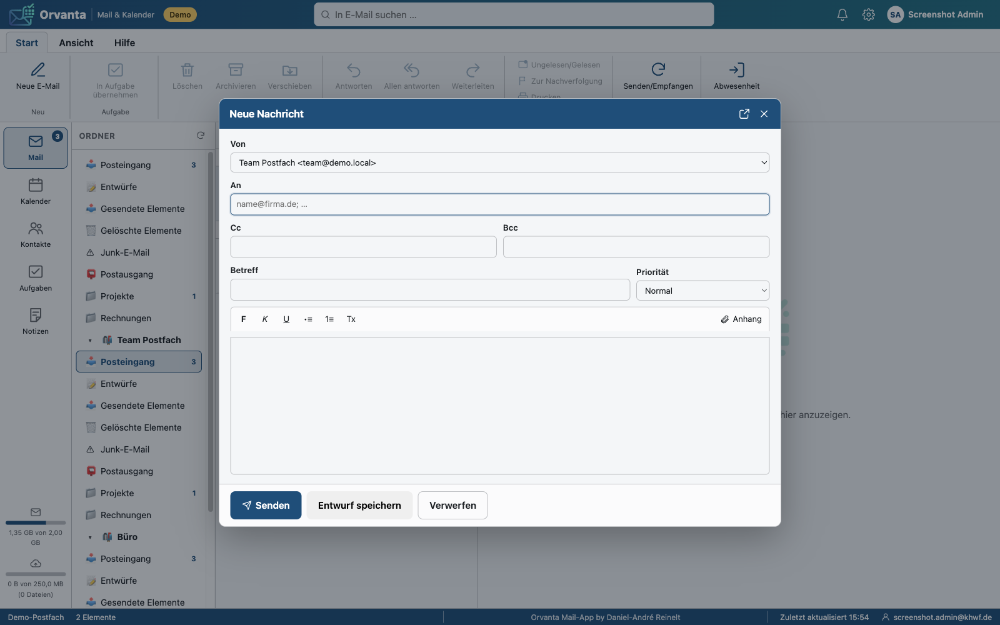

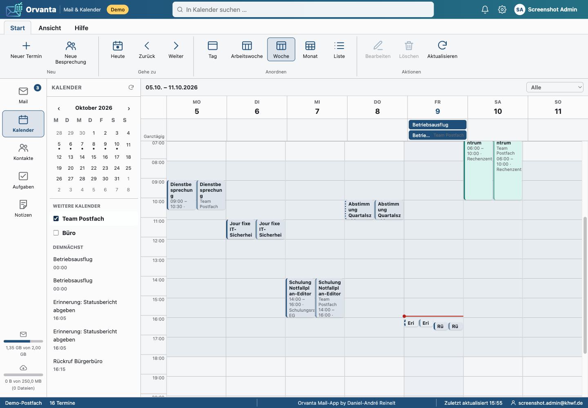

Migration 047 setzt bei bestehenden Zuordnungen den Prüfzeitpunkt zurück,
damit sie bei der nächsten Anmeldung des Benutzers mit seinen Rechten erneut
geprüft werden. Vor dieser Version im Adminbereich angelegte Zuordnungen
werden beim nächsten Öffnen der App durch den Benutzer mit dem AD abgeglichen
und entfernt, falls Exchange das Postfach nicht (mehr) per Auto-Mapping
zuweist.

Ohne die Migration 046 fehlt die Tabelle `orvanta_shared_mailboxes`; der
Adminbereich weist darauf hin, und die App arbeitet wie bisher nur mit dem
eigenen Postfach. Im **Demo-Modus** (Abschnitt 8) stehen zwei Beispielpostfächer
zur Verfügung: `team@demo.local` („Team Postfach“, „Senden als“ erlaubt) und
`buero@demo.local` („Büro“, ohne „Senden als“); nur diese beiden lassen sich
prüfen, jede andere Adresse meldet „nicht erreichbar“.

---

## 4f. Nachrichtenfluss-Dashboard

Unter **Office → Orvanta – Nachrichtenfluss**
(`/admin/office/orvanta/nachrichtenfluss`) zeigt Orvanta auf **einer** Seite,
wie eine Nachricht durch die Umgebung läuft und wie es den beteiligten
Elementen gerade geht. Die Seite ist rein lesend; sie ändert keine
Einstellung und sendet nichts.


**Aufbau (von links nach rechts):**

- **Spur „Identitätsquellen und Proxy“** – jede Identitätsquelle als Wolke mit
  der Zahl ihrer Postfächer (vorhanden / verbunden / aktiv), daneben der
  IMAP-/SMTP-Proxy mit Containerstatus.
- **Spur „Exchange“** – die Hosts der Exchange-DAG, an jedem Host eine Wolke
  mit den verbundenen Clients, daneben der Knoten der Orvanta-Nutzer.
- **Speicher-Tiers** mit belegt/von in GB je Tier.
- **Orvanta-Zwischenspeicher** mit Belegung; die Einfärbung wechselt ab 75 %
  auf „eingeschränkt“ und ab 90 % auf „Störung“.
- **KI-Endpunkte** mit den Top-10-Nutzern der letzten 30 Tage (Zahl der
  Anfragen) sowie „X weitere Nutzer“ und der Gesamtzahl der Anfragen.
- **Kennzahlen** oben: Nutzer, Quellen, Zuordnungen, Proxy, Exchange,
  Speicher, Zwischenspeicher und KI.
- **Aktive Orvanta-Nutzer** (aktuell / Minimum / Maximum der letzten 24
  Stunden). Ein Klick darauf öffnet die **Verlaufsgrafik** über 365, 180, 90,
  30 und 14 Tage als Overlay – die kurzen Zeiträume liegen oben, Lücken in den
  Daten bleiben sichtbar. Die Grafik ist für Retina-Displays als SVG gezeichnet
  und funktioniert in hellem und dunklem Design.


**Störungen** werden sofort sichtbar: Ist der Proxy ausgefallen, trägt er ein
rotes Ausrufezeichen, und die Identitätsquellen samt Postfächern werden
ausgegraut. Ist eine einzelne Identitätsquelle gestört (Netzwerk oder
Anmeldung), trägt sie das Ausrufezeichen, und nur ihre Postfächer werden
ausgegraut. Gestörte Exchange-Hosts grauen ihre Clientwolke aus, ausgefallene
oder deaktivierte Tiers werden ausgegraut. Ein Hinweis am Knoten nennt immer
den Grund („Werte ausgegraut (Proxy nicht erreichbar)“). Eine Störungsliste
oben fasst alle Befunde zusammen.


**Live-Aktualisierung:** Die Seite frischt Kennzahlen, Knotenzustände, Wolken
und die Störungsliste selbstständig in einstellbarem Abstand nach (Ableitung
aus `poll_interval`), ohne die Seite neu zu laden. Der Knopf **Aktualisieren**
stößt das sofort an.

**Verbindungstest:** Der Knopf **Identitätsquellen prüfen** testet je Quelle
das erste aktive Postfach über den Proxy und schreibt das Ergebnis in den
Quellenzustand. Sind mehr als 16 aktive Quellen eingerichtet, prüft die Seite
sie nur einzeln (Auswahl je Quelle), damit die Anfrage nicht zu lange läuft.
Quellen ohne aktives Postfach werden als „nicht geprüft“ gemeldet.

**Einstellung:** `flow_ai_user_names` (Abschnitt 4, Adminbereich) schaltet die
Klarnamen der KI-Nutzer frei; ohne die Einstellung stehen dort Pseudonyme
(„Benutzer 1 …“). Die Nutzerzahlen des Verlaufs entstehen aus kurzen
Minutenproben (5-Minuten-Raster, 400 Tage Vorhaltung); gespeichert werden
ausschließlich Zähler, nie Inhalte.

Ohne die Migration 048 fehlen die Tabellen für Präsenz und Verlauf; die Seite
zeigt dann weiter alle Knoten, aber keine Nutzerzahlen und keine
Verlaufsgrafik. Konzept und Umsetzungsplan stehen in
[docs/orvanta-nachrichtenfluss.md](orvanta-nachrichtenfluss.md), die technische
Umsetzung in [docs/orvanta-referenz.md](orvanta-referenz.md) Abschnitt 23.

---

## 5. Anhänge, Zwischenspeicher und Nextcloud

- **Öffnen:** Klick auf einen Anhang → `POST /api/orvanta/anhang/link` liefert
  eine kurzlebige, signierte URL (`OrvantaAttachmentService::token()`/`verify()`, HMAC
  mit `APP_KEY`, Ablauf wenige Minuten). Der Browser öffnet sie in einem neuen
  Tab:
  - `docx`/`xlsx`/`pptx`/`odt`/… → Euro-Office-Viewer (`views/orvanta/viewer.php`),
    der DocumentServer holt die Datei über `anhang/datei?token=…`;
  - `pdf`, Text, Bilder → direkt im Browser (`browserCapable()`);
  - alles andere oder ohne DocumentServer → Download.
- **Zwischenspeicher:** Empfangene Anhänge werden beim Öffnen im
  Nextcloud-Bereich des Benutzers im Ordner `<cache_folder>/` (Dateiname mit
  Hash-Präfix) abgelegt und in `orvanta_cache_items` registriert. Überschreitet der Benutzer
  `cache_quota_mb`, werden die ältesten Einträge automatisch entfernt
  (FIFO). Die Belegung erscheint unten links in der Modulleiste und im
  Einstellungsdialog (`GET /api/orvanta/zwischenspeicher`, liefert zusätzlich
  die Postfachbelegung auf dem Exchange als `mailbox`), kann vom Benutzer
  geleert werden und wird im Adminbereich je Benutzer aufgelistet.
- **„In Nextcloud speichern“:** Legt den Anhang dauerhaft unter
  `<cache_folder>/Anhänge/` ab (zählt nicht zum Orvanta-Quota, sondern zum
  Nextcloud-Kontingent des Benutzers). Die Schaltfläche erscheint nur, wenn
  Nextcloud erreichbar ist. Die Übertragung läuft per WebDAV mit der
  Intranet-SSO-Identität (`intranet_integration`).
- **Empfänger-Verlauf:** `<cache_folder>/.empfaenger.json` (versteckt, max.
  500 Adressen mit Name, Zähler und letzter Verwendung) speist die Vorschläge
  in An/Cc/Bcc. Die Datei zählt nicht zum Orvanta-Quota und wird nicht in
  `orvanta_cache_items` geführt; Lesefehler führen nur zu fehlenden
  Verlaufsvorschlägen. Versteckte Dateinamen (führender Punkt) sind in der
  Dateischnittstelle nur für Dateien, nicht für Ordner zulässig
  (`isSafeFileName()` auf beiden Seiten).

---

## 6. Terminerinnerungen

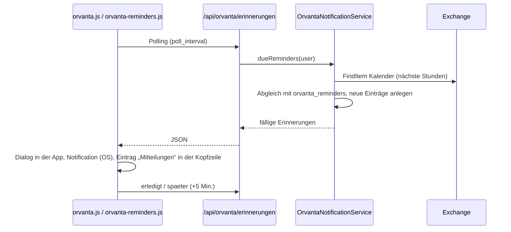
```mermaid
sequenceDiagram
    participant App as orvanta.js / orvanta-reminders.js
    participant API as /api/orvanta/erinnerungen
    participant N as OrvantaNotificationService
    participant X as Exchange
    App->>API: Polling (poll_interval)
    API->>N: dueReminders(user)
    N->>X: FindItem Kalender (nächste Stunden)
    N->>N: Abgleich mit orvanta_reminders, neue Einträge anlegen
    N-->>API: fällige Erinnerungen
    API-->>App: JSON
    App->>App: Dialog in der App, Notification (OS), Eintrag „Mitteilungen“ in der Kopfzeile
    App->>API: erledigt / spaeter (+5 Min.)
```

- Die App fragt beim Benutzer einmalig die Berechtigung für
  Desktop-Benachrichtigungen an (`Notification.requestPermission`).
- `public/assets/js/orvanta-reminders.js` wird auf allen Intranet-Seiten
  geladen, wenn `reminder_header` aktiv ist und der Benutzer die App nutzen
  darf. Fällige Erinnerungen erscheinen unter **Mitteilungen** in der Kopfzeile
  mit „5 Min. später“ und „Schließen“.


---

## 7. KI-Unterstützung beim Schreiben

Orvanta kann markierte Textabschnitte in E-Mails, Terminen und Erinnerungen
durch das **unter Office → Lokale KI hinterlegte Modell** umformulieren lassen.
Es gibt keine eigene KI-Konfiguration in Orvanta: Adresse, Modell und
API-Schlüssel stammen ausschließlich aus den globalen Einstellungen
(`OfficeAiService`). Ist dort kein Modell aktiv oder der Endpunkt nicht
erreichbar, bleibt Orvanta unverändert – weder Roboter-Symbol noch
Kontextmenü erscheinen.


### Bedienung

1. Text im Editor markieren (neue Nachricht, Antwort, Weiterleitung,
   Terminbeschreibung) und mit der **rechten Maustaste** das Menü
   „Mit KI verbessern …“ öffnen. Ohne Markierung bleibt das normale
   Browser-Menü (z. B. Rechtschreibung) erhalten.
2. Im Dialog die Anweisung eingeben („höflicher“, „kürzer“, „als Aufzählung“,
   „ins Englische“); die Vorschlagschips füllen das Feld. Angezeigt wird ein
   Auszug des markierten Textes und der Hinweis, was übertragen wird.
3. Der erzeugte Text ersetzt die Markierung und ist **hellblau umrandet**
   (`span.ov-ai-block`). Rechtsklick auf den Block bietet:
   *Weiter verfeinern …* (neue Anweisung, die KI kennt Original und bisherige
   Fassung), *Auf Original zurücksetzen* (nur solange der Dialog offen ist;
   der Originaltext liegt ausschließlich im Browser-Speicher) und
   *Markierung entfernen*.
4. Beim Senden, Entwurf speichern und Termin speichern werden alle Marker
   **serverseitig** entfernt (`OrvantaAiService::stripMarkers()` vor dem
   Sanitizer). Empfänger sehen nur den Text, ohne Klassen, Attribute oder
   Rahmen.


### Was übertragen wird

- Nur der markierte Abschnitt (max. 8 000 Zeichen), die Anweisung
  (max. 1 000 Zeichen), bei Verfeinerung die bisherige Fassung sowie als
  Kontext der Betreff (gekürzt) und die **Anzahl** der Empfänger – nie
  Adressen, nie die restliche Nachricht oder das Postfach.
- Der Aufruf geht vom Server an `POST {office_ai_url}/chat/completions`
  (OpenAI-kompatibel, Bearer-Schlüssel falls hinterlegt). Der Browser spricht
  nie direkt mit dem KI-Endpunkt. HTTP und HTTPS sind wie beim
  Verbindungstest im Adminbereich zulässig (lokale Endpunkte wie llama.cpp
  laufen meist ohne TLS); für Endpunkte außerhalb des internen Netzes HTTPS
  verwenden.
- Protokolliert werden ausschließlich Zähler (`orvanta_ai_usage`): Benutzer,
  Einsatzort, Modell, Eingabe-/Ausgabe-Token, Zeitpunkt. Texte und Anweisungen
  werden weder gespeichert noch geloggt.

### Nutzungsbericht im Adminbereich

Unter `/admin/office/orvanta#orvanta-ki` zeigt die Orvanta-Karte den anonymisierten
Bericht: Anfragen je Benutzer (Pseudonyme „Benutzer 1…n“, Zuordnung wird nicht
gespeichert und wechselt je Zeitraum), Anfragen je Tag und Token je Tag, jeweils
als serverseitig erzeugtes SVG ohne JavaScript und ohne `style`-Attribute
(CSP). Zeitraum: 7, 30 oder 90 Tage (`?ki_zeitraum=`).


### Lokaler Testendpunkt (Docker)

```bash
docker compose --profile ki up -d          # llama.cpp-Server, Port KI_PORT (8089)
# .env: OFFICE_AI_SEED_URL=http://ki:8080/v1  OFFICE_AI_SEED_MODEL=qwen2.5-0.5b-instruct
```

Der Dienst `ki` lädt beim ersten Start ein kleines Modell
(`Qwen/Qwen2.5-0.5B-Instruct-GGUF`, ca. 400 MB) in das Volume `ki_models`.
Es reicht für den Funktionstest; brauchbare deutsche Texte liefert erst ein
größeres Modell, z. B. `KI_MODEL_REPO=unsloth/Qwen3.5-9B-GGUF`,
`KI_MODEL_FILE=Qwen3.5-9B-Q4_K_M.gguf`, `KI_MODEL_ALIAS=qwen3.5-9b` (ca. 6 GB,
mindestens 8 GB RAM für Docker; Denkmodus über `KI_REASONING` steuerbar,
Standard `off`). Mit den Screenshots unten wurde dieses Modell verwendet.
`scripts/seed.php` trägt den Endpunkt ein, sofern `OFFICE_AI_SEED_URL` gesetzt
ist und noch keine KI-Einstellungen existieren; alternativ im Adminbereich
unter Office → Lokale KI eintragen. Zeitlimit je Anfrage: `ORVANTA_AI_TIMEOUT`
(Standard 30 s). Die Erreichbarkeit wird höchstens alle 60 s per `GET /models`
geprüft (Cache `storage/cache/orvanta_ai.json`, wird beim Speichern der
KI-Einstellungen zurückgesetzt).

Screenshots aller Schritte: [docs/assets/orvanta-ai/README.md](assets/orvanta-ai/README.md).

---

## 7a. Langzeitarchiv

Das Langzeitarchiv verlagert alte E-Mails (Standard: älter als 60 Tage) aus
dem Exchange-Postfach in komprimierte, integritätsgesicherte Container im
Nextcloud-Bereich des jeweiligen Benutzers und löscht sie erst danach aus
Exchange. Leitprinzip: **Niemals Datenverlust** – gelöscht wird ausschließlich,
was nachweislich hochgeladen, zurückgelesen und per Prüfsumme verifiziert
wurde (Ablauf Kopieren → Verifizieren → Festschreiben → Löschen, Details in
`docs/orvanta-referenz.md`, Abschnitt 17).

Ablauf und Bedienung:

- **Aktivierung:** Admin → Office → Orvanta, Abschnitt „Langzeitarchiv“
  (Einstellungen `archive_*`, siehe Tabelle oben). Standardmäßig ist die
  Archivierung aus. Sie gilt nur für Mitglieder der AD-Gruppe
  `archive_group` (Abgleich über die SSO-Gruppen bzw. für den Worker über die
  AD-Synchronisation); ohne Gruppe wird niemand archiviert. Wird ein Benutzer
  aus der Gruppe entfernt, archiviert der Worker sein Postfach nicht mehr –
  bereits archivierte E-Mails bleiben lesbar. Die Archivierung startet,
  wenn die Postfachbelegung die Schwelle überschreitet (`archive_threshold`
  in Prozent der Postfachgrenze oder in MB).
- **Registrierung:** Beim Öffnen von Orvanta (Statusabfrage
  `archiv/status`) wird das Postfach eines Gruppenmitglieds für die
  Hintergrund-Archivierung registriert; danach arbeitet der Worker
  unabhängig von einer geöffneten Oberfläche. Ein Postfach, das noch nie
  Orvanta geöffnet hat, wird nicht archiviert.
- **Worker:** Der Container `mail-archive` (eigener Dienst in
  `docker-compose.yml`) führt `scripts/orvanta_archive_worker.php` zyklisch
  aus; ein Python-Supervisor (`docker/mail-archive/archive_supervisor.py`)
  übernimmt Zeitsteuerung (`ARCHIVE_POLL_INTERVAL` bzw.
  `archive_poll_interval`), Signalbehandlung und Backoff bei Fehlern.
  Der Container läuft wie `app` als `www-data` und erhält dasselbe
  Euro-Office-Secret (`OFFICE_JWT_SECRET_FILE`) für den Nextcloud-Upload.
  Manueller Lauf: `docker compose exec mail-archive php /var/www/html/scripts/orvanta_archive_worker.php --once`.
- **Speicherort:** Container (`chunk-….ova`, gzip-komprimiert, je ≤ 15 MB)
  und ein Transparenz-Manifest (`manifest.json`) liegen im Ordner
  `archive_folder` (Standard `Orvanta-Archiv`) des persönlichen
  Nextcloud-Bereichs. Der maßgebliche Index bleibt die Datenbank. Die
  Ordnerhierarchie des Postfachs (Eltern/Kind, Pfad `Posteingang/Projekte`)
  wird im Archiv übernommen.
- **Vollständigkeit:** Archiviert wird ausschließlich der vollständige
  MIME-Quelltext (Kopfzeilen, Body, Anhänge). Liefert Exchange für eine
  Nachricht keinen MIME-Inhalt, bleibt sie im Postfach und wird im Journal
  als `failed` vermerkt – es gibt keinen verkürzten Ersatzdatensatz.
- **Oberfläche:** Archivierte Ordner erscheinen in der Mail-Ordnerliste unter
  „📦 Langzeitarchiv“; archivierte Nachrichten sind mit 📦 gekennzeichnet,
  werden beim Öffnen aus dem Container gelesen (inkl. Anhänge) und von der
  Suche mitdurchsucht. Archivierte Nachrichten sind nur lesbar (Antworten per
  Zitat weiterhin möglich).
- **Sicherheit:** Zugriff nur auf das eigene Archiv (Identität aus dem SSO),
  HTML-Inhalte laufen auch aus dem Archiv durch den `MailHtmlSanitizer`,
  jede Nachricht wird beim Lesen gegen ihre gespeicherte Prüfsumme geprüft.
- **Demo-Modus:** Mit `exchange_host = demo` liefert der Posteingang fünf
  alte Beispielnachrichten (70–400 Tage, zwei davon mit Anhängen als
  `multipart/mixed`), an denen sich der komplette Archivlauf gefahrlos
  durchspielen lässt.

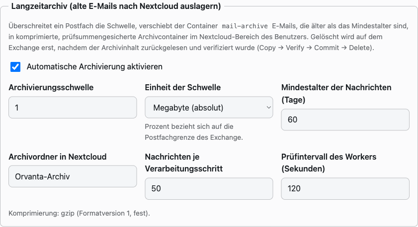

*Admin → Office → Orvanta: Schwelle, Mindestalter, Zielordner und Worker-Intervall des Langzeitarchivs.*

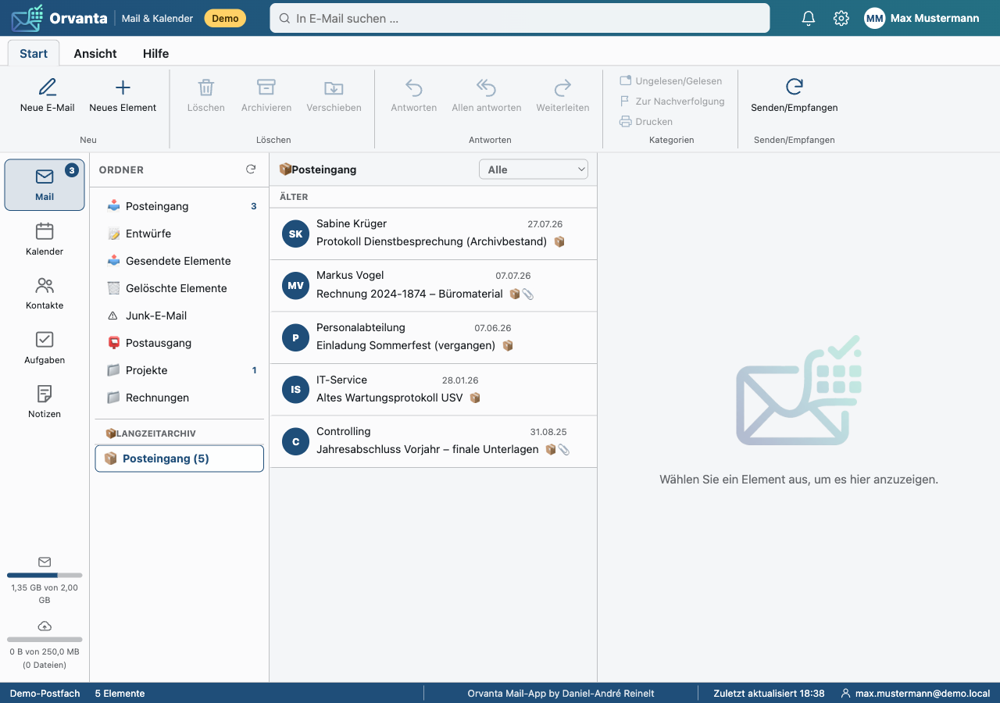

*Nach dem ersten Lauf erscheinen archivierte Ordner unter „📦 Langzeitarchiv“; die fünf alten Demo-Nachrichten wurden aus dem Posteingang verschoben.*

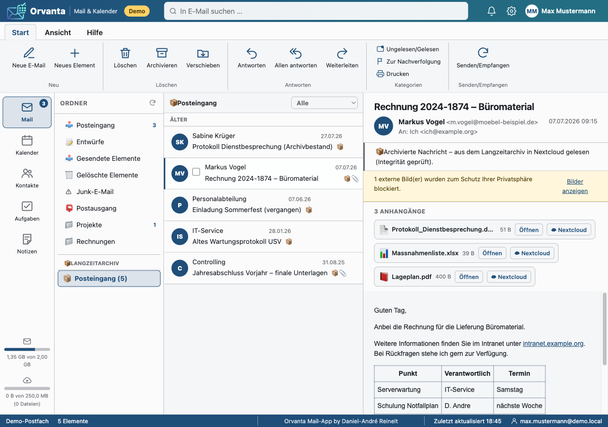

*Lesen aus dem Container: Hinweis „Archivierte Nachricht … (Integrität geprüft)“, Anhänge werden aus dem Archiv geliefert.*

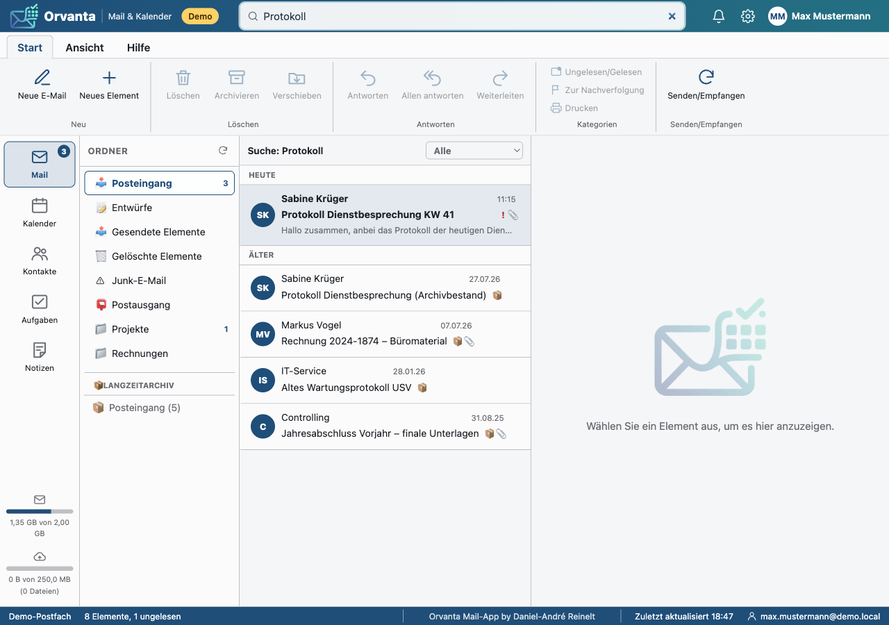

*Die Suche zeigt Live-Treffer aus Exchange und mit 📦 markierte Archivtreffer in einer Liste.*

---

## 7b. Rechtschreibprüfung

Orvanta prüft deutsche Texte in den Editoren für E-Mails und Termine gegen das
freie Wörterbuch **de_DE_frami** (igerman98 + frami, GPL) – unabhängig von der
Rechtschreibhilfe des Browsers, die auf dem Server nicht steuerbar ist.

### Bedienung

1. Beim Tippen prüft Orvanta den Text und unterstreicht unbekannte Wörter
   **rot gewellt**. Geprüft werden nur E-Mails (Verfassen, Antworten,
   Weiterleiten, Entwürfe) und Terminbeschreibungen – nicht der
   Signaturblock (der stammt aus der Vorlage, Abschnitt 4a) und nicht
   Betreff- oder Empfängerfelder. Wie in Word/Outlook bleiben Web- und
   E-Mail-Adressen, Wörter mit Ziffern (`A4`, `3x`) und Wörter ganz in
   Großbuchstaben (`EDV`, `LG`) ungeprüft. Zahlen und Datumsangaben
   (`1,5`, `07.10.2026`) gelten als richtig, Abkürzungen werden mit ihrem
   Punkt geprüft (`usw.`, `bzw.`).
2. Rechtsklick auf ein markiertes Wort → Untermenü **„Rechtschreibprüfung“** →
   **„---Vorschläge---“** listet bis zu acht Vorschläge, der wahrscheinlichste
   zuerst. Ein Klick ersetzt das Wort an Ort und Stelle.
3. Ein Wort, das erst kurz zuvor getippt wurde, zeigt statt der Vorschläge
   „Wird geprüft …“ bzw. „Wird gesucht …“; die Liste füllt sich, sobald die
   Antwort des Servers da ist (ohne erneuten Rechtsklick).
4. Ist ein Wort richtig geschrieben, erscheint das Untermenü gar nicht – das
   normale Kontextmenü bleibt unverändert.
5. Unter den Vorschlägen stehen **„Alle ignorieren“** (das Wort gilt bis zum
   Neuladen der Seite als richtig) und **„Zum Wörterbuch hinzufügen“** (das
   Wort kommt in Ihr persönliches Wörterbuch und gilt dauerhaft und auf allen
   Geräten als richtig). Ihre eigenen Wörter sehen und entfernen Sie unter
   **Einstellungen (⚙) → „Rechtschreibprüfung – eigenes Wörterbuch“**.

Die Unterstreichung wird mit der **CSS Custom Highlight API** gezeichnet, der
Editorinhalt selbst also nicht verändert. Dadurch bleiben Cursorposition,
Auswahl, Formatierung und die Rückgängig-Historie des Browsers unberührt, und
beim Senden ist kein Entfernen von Markierungen nötig (anders als bei den
KI-Markern, Abschnitt 7). Browser ohne diese API (älter als Chrome/Edge 105,
Safari 17.2, Firefox 140) verlieren nur die Unterstreichung; die Prüfung per
Kontextmenü funktioniert weiter.

### Wörterbuch

Neben dem Wörterbuch gelten zwei Ergänzungen:

- **Mitgelieferte Ergänzungen** (`OrvantaSpellcheckSupplement`): im
  Büroalltag übliche Wörter und Abkürzungen, die de_DE_frami nicht kennt –
  etwa `Hr.`, `Mo.`, `OK`/`ok`, `MfG`, `LG`, `Homeoffice`, `Telko`,
  `Webinar`, `Outlook`, `Nextcloud`. Erweitern: Eintrag in der Liste ergänzen.
- **Persönliches Wörterbuch** je Benutzer (Tabelle `orvanta_spellcheck_words`,
  höchstens 1000 Wörter). Die Schreibweise gilt genau; ein kleingeschriebenes
  Wort ist am Satzanfang auch großgeschrieben richtig, jedes Wort auch in
  GROSSBUCHSTABEN und als Teil einer Bindestrich-Zusammensetzung
  (`Lanpa-Projekt`). Eigene Wörter erscheinen auch in den Vorschlägen.

- Das Wörterbuch wird **einmalig beim Start des `app`-Containers** aus dem Netz
  geholt und in eine kompakte, beim Start nur teilweise gelesene Form
  übersetzt (`storage/dictionaries/de_DE/`, nicht im Repository). Danach ist
  kein Netzzugriff mehr nötig.
- Quelle: `https://raw.githubusercontent.com/LibreOffice/dictionaries/master/de`
  (`de_DE_frami.aff` und `.dic`), Lizenz GPLv2/GPLv3; die Herkunft steht in
  `storage/dictionaries/de_DE/QUELLE.txt`.
- Der Vorgang ist idempotent und bricht nichts ab: Ist das Verzeichnis bereits
  gültig, passiert nichts. Schlägt Download oder Übersetzung fehl, startet
  Orvanta normal weiter – nur ohne Rechtschreibprüfung. Manuell anstoßen:

  ```bash
  php scripts/spellcheck_dictionary.php --force   # neu laden und übersetzen
  ```

- **Speicher:** Für jeden Seitenaufbau wird nur die kleine Kennwertdatei
  gelesen (≈ 0,14 MB je Apache-Prozess); Index und Regeln kommen erst bei der
  ersten echten Prüfung dazu (≈ 1,3 MB), die Wortliste selbst wird nie
  vollständig geladen, sondern Eintrag für Eintrag gelesen. Das ist bei den
  176 Apache-Workern des Images der entscheidende Unterschied. Ist der
  Bestand unvollständig, meldet die Prüfung jedes Wort als korrekt – lieber
  keine Markierung als lauter falsche rote Wellenlinien.

### Einstellungen

| `.env` | Standard | Bedeutung |
| --- | --- | --- |
| `ORVANTA_SPELLCHECK` | `true` | Rechtschreibprüfung ein-/ausschalten |
| `ORVANTA_SPELLCHECK_DIR` | `storage/dictionaries/de_DE` | Ablage des übersetzten Wörterbuchs |
| `ORVANTA_SPELLCHECK_URL` | LibreOffice-Repository (s. o.) | Basisadresse der beiden Wörterbuchdateien |
| `ORVANTA_SPELLCHECK_TIMEOUT` | `120` | Zeitlimit für den einmaligen Download (Sekunden) |

Ist die Prüfung abgeschaltet oder fehlt das Wörterbuch, zeigt das Frontend
weder Unterstreichung noch Kontextmenü-Eintrag. Die Prüfung läuft auf dem
Intranet-Server; **kein** Wortinhalt verlässt das Haus, es gibt keine externe
Rechtschreib-API. Anfragen sind auf 400 Wörter je Aufruf und 64 Zeichen je
Wort begrenzt, der Browser schickt nur Wörter, die er noch nicht kennt.

---

## 8. Demo-Modus und Tests

- `exchange_host = demo` (nur bei `APP_ENV ≠ production`) aktiviert
  `DemoExchangeTransport` mit Beispieldaten für alle Module. Änderungen werden
  nicht gespeichert; der Status meldet `demo: true`. So lässt sich die
  Oberfläche ohne Exchange prüfen (die Screenshots in diesem Dokument stammen
  aus dem Demo-Modus mit `SSO_FAKE_USER`, siehe `docs/office.md`, Abschnitt
  „Testmodus“).
- `tests/Unit/OrvantaServiceTest.php` prüft Konfiguration, EWS-XML-Aufbau,
  Sanitizer, Anhang-Modi/Signaturen, Quota-Bereinigung, Erinnerungslogik und
  das Entfernen der KI-Marker beim Senden mit Fakes
  (`RecordingExchangeTransport`, Repository-Fakes).
- `tests/Unit/OrvantaAiTest.php` prüft die KI-Unterstützung mit
  `RecordingAiTransport`: Verfügbarkeit und Cache, Aufbau der
  `chat/completions`-Anfrage, Verfeinern, Validierung (422), Fehlerbilder
  (503/502), `stripMarkers()`, anonymisierte Auswertung und SVG-Bericht.
- `tests/Unit/OrvantaSpellcheckTest.php` prüft die Rechtschreibprüfung gegen ein
  eigenes Mini-Wörterbuch (wird im Test einmal übersetzt): Stammwörter, Affixe
  und Groß-/Kleinschreibung, Umlaute/scharfes S/verbotene Schreibweisen,
  Zusammensetzungen über Fortsetzungsflags, Zerlegung an Bindestrichen,
  Vorschläge, Abschalten über die Konfiguration, die Anfragegrenzen,
  mitgelieferte Ergänzungen und das persönliche Wörterbuch (gegen SQLite).
- `tests/Unit/OrvantaArchiveTest.php` prüft das Langzeitarchiv: Konfiguration,
  Stichtag, Copy-Verify-Commit-Delete, Wiederaufnahme nach Abbrüchen,
  Korruptionserkennung, Sperren, Suche und einen Massentest mit 1000
  Nachrichten (verlustfrei archiviert und verifiziert).
- `tests/Unit/OrvantaOofTest.php` prüft die Abwesenheitsnotizen gegen SQLite
  und den aufzeichnenden Exchange-Transport: Vorlagenvalidierung, Zuordnung per
  AD-Gruppe, Benutzereinstellungen und deren Validierung, den
  `SetUserOofSettings`-Aufruf (Zustand, Empfängerkreis, Zeitraum, kein Text bei
  „abgeschaltet“), die Signatur am Ende der Notiz sowie Zustand und HTML.
  Im Demo-Modus bestätigt `DemoExchangeTransport` das Setzen nur – der Banner
  folgt dort den gespeicherten Einstellungen und dem Datumsfenster.

  ```bash
  php tests/run.php
  find . -name "*.php" -print0 | xargs -0 -n1 php -l
  ```

---

## 9. Sicherheit

- Alle Routen setzen einen SSO-Benutzer mit App-Freigabe voraus; schreibende
  API-Aufrufe prüfen das CSRF-Token.
- KI-Unterstützung: Nur der markierte Abschnitt verlässt den Browser (an den
  Intranet-Server, von dort an den lokalen KI-Endpunkt); KI-Marker werden vor
  dem Versand entfernt; gespeichert werden nur Zähler, der Adminbericht ist
  pseudonymisiert.
- Exchange-Zugriff ausschließlich per Impersonation des angemeldeten Benutzers;
  das Dienstkonto-Kennwort liegt verschlüsselt in der Datenbank und wird nie
  an den Browser übertragen.
- HTML-Mails werden serverseitig bereinigt (keine Skripte, keine externen
  Ressourcen, keine Inline-Styles → CSP-konform über CSSOM).
- Anhang-Links sind signiert, benutzergebunden und kurzlebig; Dateinamen werden
  für Nextcloud-Pfade bereinigt.
- Rechtschreibprüfung: Der Text bleibt im Haus – geprüft wird auf dem
  Intranet-Server gegen ein lokales Wörterbuch, es gibt keine externe
  Rechtschreib-API. Nur einzelne Wörter (nie Zusammenhänge, nie Adressen)
  gehen als JSON an `/api/orvanta/rechtschreibung/*`. Gespeichert werden nur
  die Wörter, die ein Benutzer selbst ins persönliche Wörterbuch aufnimmt.
- TLS-Prüfung gegenüber Exchange ist standardmäßig aktiv.

---

## 10. Grenzen und Hinweise

- Keine Exchange-Online-/Graph-Anbindung; Ziel ist On-Premise ab 2016/2019.
- Proxy-Postfächer (IMAP/SMTP) bieten nur Mail; Kalender, Kontakte, Aufgaben,
  Notizen, Erinnerungen und Langzeitarchiv setzen Exchange voraus.
- Serienregeln werden angezeigt und als Vorkommen geladen, aber nicht als
  Serie bearbeitet.
- S/MIME-Verschlüsselung und -Signatur werden nicht unterstützt.
- Der Zwischenspeicher dient dem schnellen Öffnen; Exchange bleibt die
  führende Datenquelle.
- Die Rechtschreibprüfung deckt die Editoren für E-Mails und Termine ab, nicht
  Betreff-/Empfängerfelder, nicht den Signaturblock (der stammt aus der
  Vorlage) und nicht die reine Nachrichtenanzeige. Die rote Unterstreichung
  braucht einen Browser mit CSS Custom Highlight API (Abschnitt 7b); ohne sie
  funktioniert nur noch die Prüfung per Kontextmenü. Ein Wort, das im
  Wörterbuch fehlt (Fachbegriffe, Namen), wird als Fehler unterstrichen, bis
  es ignoriert oder ins persönliche Wörterbuch aufgenommen wird. Ein
  gemeinsames Wörterbuch für alle Benutzer pflegen nur Entwickler
  (`OrvantaSpellcheckSupplement`); persönliche Wörter bilden keine
  Zusammensetzungen ohne Bindestrich (`Lanpaprojekt` bleibt markiert).
- Das Wörterbuch wird beim Start des `app`-Containers einmalig aus dem Netz
  geholt (Abschnitt 7b). Ohne ausgehenden Internetzugang beim ersten Start
  bleibt die Rechtschreibprüfung aus, bis die Dateien bereitstehen.
