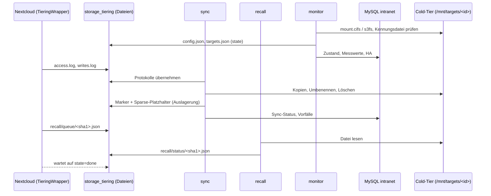

# Speicher-Tiering und HA – technische Referenz (für Entwickler und Coding-Agenten)

Ergänzt [docs/storage.md](storage.md) (Bedienung und Betrieb). Dieses Dokument
beschreibt, **wie** das Speichermodul aufgebaut ist: Dateien, Prozesse,
Datenformate, Algorithmen, Zustände, Invarianten, Tests und typische
Änderungsaufgaben. Alle Konstanten und Schwellwerte sind mit ihrer Fundstelle
angegeben – bei Abweichungen gilt der Code.

**Kurzfassung (TL;DR)**

- Container `storage-sync` (Profil `office`) spiegelt Nextcloud-Daten,
  Nextcloud-Konfiguration, Euro-Office-Daten und einen PostgreSQL-Abzug auf
  **jedes** aktive Speicherziel (SMB per `mount.cifs`, S3 per `s3fs`).
- Selten genutzte Nextcloud-Benutzerdateien werden im Hot-Tier durch
  **Sparse-Platzhalter** ersetzt („ausgelagert“, Katalogzustand `evicted`).
  Nextcloud holt sie über den `TieringWrapper` bei Zugriff zurück.
- Drei Endlosprozesse: `monitor` (Einbindung, Messwerte, HA, alle 5 s),
  `sync` (Erfassen, Übertragen, Auslagern, DB-Abzug), `recall` (Rückholungen,
  max. 4 parallel).
- Kommunikation: MySQL `intranet` (Admin ⇄ Agent), SQLite-Katalog
  (Agent intern), Dateien im Volume `storage_tiering` (Agent ⇄ Nextcloud).
- Schutzmechanismen: Massenlöschsperre, SHA-256-Prüfung, Kennungsdatei je
  Ziel, Vorfallerkennung (Ransomware) mit Schreibsperre für Benutzer und
  schreibgeschütztem Schutzziel.

---

## Inhalt

1. [Begriffe und Code-Bezeichner](#1-begriffe-und-code-bezeichner)
2. [Code-Landkarte](#2-code-landkarte)
3. [Laufzeitarchitektur](#3-laufzeitarchitektur)
4. [Datenhaltung und Formate](#4-datenhaltung-und-formate)
5. [Abläufe im Detail](#5-abläufe-im-detail)
6. [Zustände, Status und Exit-Codes](#6-zustände-status-und-exit-codes)
7. [Invarianten (nicht brechen!)](#7-invarianten-nicht-brechen)
8. [Adminbereich, Routen und Aufträge](#8-adminbereich-routen-und-aufträge)
9. [Tests](#9-tests)
10. [Änderungsrezepte](#10-änderungsrezepte)
11. [Fehlersuche und Betriebsbefehle](#11-fehlersuche-und-betriebsbefehle)
12. [Bekannte Eigenheiten](#12-bekannte-eigenheiten)

---

## 1. Begriffe und Code-Bezeichner

| Oberfläche / Doku | Code | Bedeutung |
| --- | --- | --- |
| Hot-Tier (lokales Storage) | `nextcloud_data`, `eurooffice_data`, `Catalog::STATE_LOCAL` | Lokale Docker-Volumes; Datei liegt mit Inhalt lokal. |
| Cold-Tier (SMB-/S3-Tier) | `storage_targets`, `Mounter`, `/mnt/targets/<id>` | Alle Speicherziele; jedes hält den vollständigen Bestand. |
| Speicherziel | Zeile in `storage_targets`, `kind` = `smb`/`s3` | Eine SMB-Freigabe oder ein S3-Bucket (+ Präfix). |
| primäres Ziel | `is_primary = 1` | Bevorzugte Quelle für Rückholungen; genau eins (`clearPrimary`). |
| ausgelagert | `Catalog::STATE_EVICTED`, Marker `stubs/<pfad>.json` | Lokal nur Sparse-Platzhalter, Inhalt im Cold-Tier. |
| Rückholung | `Recaller`, `recall/queue`, `recall/status` | Platzhalter wird durch echten Inhalt ersetzt. |
| Rehydrierung | `SyncEngine::rehydrate()` | Agent holt selbst zurück, wenn Regeln/Platz es erlauben. |
| Modus „nur Cold-Tier“ | `Pressure::REMOTE_ONLY` (`remote_only`) | Hot-Tier voll; sonst `Pressure::NORMAL` (`normal`). |
| Quelle | `PathRules::SOURCE_*` | `nextcloud-data`, `nextcloud-config`, `eurooffice-data`, `nextcloud-db`. |
| Vorfall | `storage_incidents`, `ThreatDetector` | Ransomware-/Überschreibverdacht. |
| Schutzziel | `frozen_target_id` | Ziel, das bei offenem Vorfall nur lesend eingebunden und nicht synchronisiert wird. |
| Instanz-ID | Einstellung `storage_instance_id`, `.lanpa-storage.json` | Bindet Ziele an genau eine Installation. |

Nicht verwechseln: **Speicherplatz/Kontingente** (`StorageQuotaService`,
`/admin/speicherplatz`, Tabellen `storage_quota_*`) sind Nextcloud-Quotas und
gehören **nicht** zu diesem Modul.

---

## 2. Code-Landkarte

### Intranet-Anwendung (`app/`)

| Datei | Aufgabe |
| --- | --- |
| `app/Services/Storage/StorageService.php` | Adminlogik: Ziele anlegen/ändern/löschen (Validierung SMB/S3, Verschlüsselung per `SecretBox`), Einstellungen speichern, Aufträge (`request()`), Gesamtbild `overview()`, Live-JSON `liveData()`, Dashboard-Hinweis `dashboardAlert()`, SNMP-Ausgabe `snmp()`, Hochrechnungstext `forecastText()`. |
| `app/Services/Storage/StorageSettings.php` | Einstellungen `storage_*` (Defaults, Grenzen, Validierung), `GRACE_SECONDS = 600`. |
| `app/Services/Storage/StorageHealth.php` | Reine Funktionen: HA-/Sync-Bewertung `evaluate()`, Hochrechnung `forecast()`, Füllstand `fill()`, Formatierung. Exit-Codes `EXIT`. |
| `app/Services/Storage/IncidentSettings.php` | Einstellungen `incident_*`, Standardliste der Ransomware-Endungen/-Muster, `matchName()`, Benutzerhinweis. |
| `app/Services/Storage/IncidentService.php` | Adminlogik der Vorfälle: Liste, Erledigen, Einstellungen, Dashboard-Hinweis. |
| `app/Repositories/StorageRepository.php` | MySQL: `storage_targets`, `storage_target_status`, `storage_status`, `storage_events`, `storage_usage_samples`, `storage_requests`. `StorageRepository::NOW` = Platzhalter für `NOW()`. |
| `app/Repositories/IncidentRepository.php` | MySQL: `storage_incidents` (offen/erledigt, Schutzziel zuweisen/freigeben). |
| `app/Controllers/Admin/StorageController.php` | Routen `/admin/speicher-ha*` (CSRF-geprüft). |
| `app/Controllers/Admin/IncidentController.php` | Routen `/admin/vorfaelle*`. |
| `views/admin/storage.php`, `views/admin/storage_target.php`, `views/admin/incidents.php` | Oberflächen. |
| `public/assets/js/admin-storage.js`, `public/assets/js/admin-storage-target.js` | Live-Aktualisierung (5 s, pausiert im Hintergrund-Tab), Zielformular (SMB/S3 umschalten). |

### Agent (`app/Services/Storage/Agent/`, läuft nur im Container `storage-sync`)

| Datei | Aufgabe |
| --- | --- |
| `Agent.php` | Einstieg der Prozesse `monitor()`, `sync()`, `recall()`, `recallOne()`, `restore()`, `resume()`; Vorfallbehandlung `handleIncidents()`, Schutzzielwahl `chooseProtectTarget()`, DB-Abzug `dumpDatabase()`, Veröffentlichung `config.json`. |
| `SyncEngine.php` | Kern: `scan()` (Erfassen), `syncTarget()` (Übertragen), `tier()` (Auslagern/Rehydrieren), Massenlöschsperre. |
| `Catalog.php` | SQLite-Katalog (WAL): Dateien, Versionen, Stand je Ziel, Löschen/Umbenennen-Aufträge, Zugriffe, Zähler, Meta. |
| `TieringStore.php` | Gemeinsames Verzeichnis mit Nextcloud: Marker, Platzhalter (`makeStub()`), Rückhol-Warteschlange/-Status, Zugriffs- und Schreibprotokoll, `config.json`, `agent.alive`. |
| `Mounter.php` | Einbinden/Aushängen (CIFS, s3fs), Erreichbarkeit, Füllstand, Kennungsdatei, verständliche Fehlermeldungen. |
| `TargetMap.php` | `state/targets.json`: vom Monitor geschrieben, von `sync`/`recall` gelesen. Älter als 120 s ⇒ alle Ziele gelten als offline. |
| `FileCopier.php` | Blockweise Kopie (1 MiB) über Temp-Datei + `rename`, SHA-256, `fsync`, Zähler für MB/s/IOPS. |
| `Recaller.php` | Eine Rückholung: Ziel wählen, kopieren, Prüfsumme, Platzhalter atomar ersetzen. |
| `Restore.php` | Wiederherstellung aus einem Ziel (Kopie oder Platzhalter), Katalog-Reset. |
| `Pressure.php` | Füllstand des Hot-Tiers mit Hysterese, `bytesToFree()`, `roomFor()`. |
| `PathRules.php` | Was synchronisiert bzw. ausgelagert werden darf; Konstanten für Sonderpfade. |
| `ThreatDetector.php` | Vorfallerkennung (Endung, Inhalt/Entropie, Massenüberschreiben), Zuordnung über Schreibprotokoll. |
| `InotifyWatcher.php` | `inotifywait -m -r` als Hinweisquelle; Ausfall ⇒ häufigere Vollabgleiche. |
| `Metrics.php` | Raten aus kumulierten Zählern (`/sys/dev/block/…/stat`, `/proc/fs/cifs/Stats`, Agent-Zähler). |
| `ExcludeFilter.php` | Verzeichnisfilter beim Durchlaufen (keine Symlinks, `PathRules::isExcluded`). |
| `Shell.php` | Externe Programme ohne Shell, mit `timeout -k 5`. |
| `TargetUnavailable.php` | Ausnahme: Ziel während der Übertragung weggefallen. |

### Nextcloud-App `intranet_integration` (`docker/nextcloud/apps/intranet_integration/`)

| Datei | Aufgabe |
| --- | --- |
| `lib/Storage/TieringClient.php` | Gegenstück zu `TieringStore` (ohne Nextcloud-Abhängigkeiten, getestet in `tests/Unit/StorageTieringClientTest.php`). Platzhaltererkennung, Rückholauftrag + Warten, Marker bei Umbenennen/Löschen nachführen, Zugriffs-/Schreibprotokoll, Schreibsperre. |
| `lib/Storage/TieringWrapper.php` | Storage-Wrapper (Priorität 1000, innerste Schicht) um den lokalen Datenspeicher; ruft `TieringClient` bei Lesen/Schreiben/Kopieren/Umbenennen/Löschen. |
| `lib/Storage/TieringException.php` | Fehler der Rückholung (wird als `StorageNotAvailableException` ⇒ WebDAV 503 weitergereicht). |
| `lib/AppInfo/Application.php` | `addTieringWrapper()` (Hook `OC_Filesystem::preSetup`), `tieringClient()` (Basis `/var/lib/lanpa-tiering`, überschreibbar per Systemwert `intranet_integration.tiering_dir`). |
| `lib/Controller/RecallController.php`, Route `GET /api/recall` | Rückholstatus des angemeldeten Benutzers + Hinweis auf Einschränkung. |
| `lib/Listener/RecallScriptListener.php`, `js/recall.js`, `css/recall.css` | Fortschrittsbalken unten rechts. |

### Betrieb

| Datei | Aufgabe |
| --- | --- |
| `docker/storage-sync/Dockerfile` | `php:8.5-cli` + `cifs-utils`, `fuse3`, `s3fs`, `inotify-tools`, `postgresql-client`, `procps`. Healthcheck: `agent.alive` jünger als 30 s. |
| `docker/storage-sync/entrypoint.sh` | Startet `monitor`, `sync`, `recall`; endet einer ⇒ Container beendet sich (Neustart durch `restart: unless-stopped`). Mit Argumenten: Einzelbefehl. |
| `docker/storage-sync/storage-sync.ini` | `max_execution_time = 0`, `memory_limit = 512M`. |
| `scripts/storage_sync.php` | CLI des Agenten (siehe [Abschnitt 11](#11-fehlersuche-und-betriebsbefehle)). |
| `scripts/storage_status.php` | SNMP-Prüfungen (läuft im `app`-Container). |
| `scripts/storage-restore.sh` | Wiederherstellung auf dem Docker-Host inkl. `pg_restore`. |
| `docker/office-backup/office-backup.sh` | Sichert `nextcloud-data` mit `tar --sparse` und die Marker als `storage-tiering.tar`. |
| `docker/snmp/entrypoint.sh` | `exec storage_*` (Index 13–16) und `extend storage_metrics/storage_targets`. |
| `database/migrations/022_storage_tiering.sql`, `023_storage_incidents.sql`, `024_storage_s3_targets.sql` | Schema. |

---

## 3. Laufzeitarchitektur

### Container, Volumes, Pfade

`storage-sync` (Compose-Profil `office`, `depends_on` `db` und `nextcloud-db`
healthy) erhält `CAP_SYS_ADMIN`, `CAP_DAC_READ_SEARCH`,
`device_cgroup_rules: "c 10:229 rwm"` (FUSE), `apparmor:unconfined` und ein
tmpfs `/run/storage-sync` (0700).

| Volume | Pfad in `storage-sync` | Weitere Nutzer | Inhalt |
| --- | --- | --- | --- |
| `nextcloud_data` | `/data/nextcloud-data` | `nextcloud`, `office-backup` | Quelle `nextcloud-data` (Hot-Tier). |
| `nextcloud_html` | `/data/nextcloud-html` (Konfig unter `config/`) | `nextcloud` | Quelle `nextcloud-config` (nur `*.php`, `*.json`). |
| `eurooffice_data` | `/data/eurooffice-data` | `eurooffice` | Quelle `eurooffice-data` (ohne `.private`). |
| `storage_tiering` | `/var/lib/lanpa-tiering` | `nextcloud`, `nextcloud-cron`, `nextcloud-ai-worker` (gleicher Pfad), `office-backup` (`/data/storage-tiering`) | Austausch Agent ⇄ Nextcloud. |
| `storage_sync_state` | `/var/lib/storage-sync` | – | `catalog.sqlite`, `targets.json`, `dumps/`, `s3-tmp/`. |
| `app_storage` | `/var/www/html/storage` | `app` | `keys/secrets.key` zum Entschlüsseln der Zugangsdaten. |
| tmpfs | `/run/storage-sync` | – | `cred-<id>` (0600), `s3fs-<id>.log`. |
| – | `/mnt/targets/<id>` | – | Einhängepunkte der Ziele. |

Pfade sind über Umgebungsvariablen änderbar (`Agent::defaults()`):
`STORAGE_STATE_DIR`, `STORAGE_TIERING_DIR`, `STORAGE_MOUNT_BASE`,
`STORAGE_CREDENTIAL_DIR`, `STORAGE_NEXTCLOUD_DATA`, `STORAGE_NEXTCLOUD_CONFIG`,
`STORAGE_EUROOFFICE_DATA`, `NEXTCLOUD_DB_HOST`, `NEXTCLOUD_DB_PASSWORD_FILE`,
`STORAGE_DATA_OWNER` (Standard `33:33`), `STORAGE_SYNC_SCRIPT`.

### Prozesse und Takte

| Prozess | Takt | Schreibt | Liest |
| --- | --- | --- | --- |
| `monitor` | 5 s (`Agent::MONITOR_INTERVAL`) | `storage_target_status` (Zustand, Füllstand, Raten), `storage_status` (`heartbeat_at`, HA, Hot-Tier-Werte), `targets.json`, `config.json`, `storage_usage_samples` (alle 300 s), Meta `sparse_supported` (stündlich) | `storage_targets`, `storage_requests` (`remount`), offene Vorfälle |
| `sync` | sofort nach inotify-Ereignis, sonst Warten bis 5 s (bei offener Arbeit 0,2 s) | Katalog, Ziele, Marker/Platzhalter, `storage_status` (`sync_*`, Bestand, Modus, Rückstand), `storage_target_status` (Synchronität), `storage_incidents`, `dumps/nextcloud.dump` | `targets.json`, `access.log`, `writes.log`, `storage_requests` (`sync_now`, `full_scan`, `confirm_deletes`) |
| `recall` | 0,25 s | `agent.alive`, `recall/status/*`, Meta `recalls_*`, `storage_status.recalls_active` (alle 5 s) | `recall/queue/*` |
| `recall-one <id>` | je Auftrag (Kindprozess, max. 4 = `Agent::MAX_RECALLS`) | Hot-Tier-Datei, Marker, Katalog, Status (alle 0,5 s) | Ziele |

Fehlerbehandlung (`Agent::guarded()`): `PDOException` ⇒ Verbindung verwerfen
(`Database::set(null)`, `Container::reset()`), 5 s warten; andere Ausnahmen
⇒ protokollieren, 2 s warten. Ein Prozess beendet sich dadurch nie selbst.

### Datenfluss



---

## 4. Datenhaltung und Formate

### 4.1 MySQL (`intranet`)

| Tabelle | Schreiber | Leser | Hinweise |
| --- | --- | --- | --- |
| `storage_targets` | Adminbereich | Agent, Admin | `password` per `SecretBox` (`enc:v1:…`), wird nie an den Browser gegeben. `unc_path` eindeutig; bei S3 kanonisch `s3://host[:port]/bucket[/präfix]`. |
| `storage_target_status` | `monitor` (Zustand/Füllstand/Raten, `updated_at`), `sync` (Synchronität, `sync_updated_at`) | Admin, SNMP | `ON DELETE CASCADE`. Älter als 90 s ⇒ Anzeige `unknown`. |
| `storage_status` (genau `id = 1`) | `monitor`, `sync`, `recall` | Admin, SNMP | Herzschläge `heartbeat_at` (Monitor) und `sync_heartbeat_at`. |
| `storage_usage_samples` | `monitor` (alle 5 min) | Hochrechnung | Ältere als 35 Tage werden gelöscht. |
| `storage_events` | Agent, Admin | Admin | Auf 2 000 Einträge gekürzt (stündlich). Kategorien: `sync`, `target`, `tiering`, `recall`, `restore`, `incident`, `config`. |
| `storage_requests` | Admin | Agent (`claimRequest()` atomar über `picked_at`) | Ältere als 7 Tage werden gelöscht; Admin lehnt ab, wenn > 20 offene (letzte Stunde). |
| `storage_incidents` | `sync` (anlegen/fortschreiben), Admin (erledigen) | Agent, Admin | `status` `open`/`resolved`. |
| `settings` | Admin | Agent (bei jedem Durchlauf neu, `resetCache()`) | Schlüssel siehe 4.2. |

### 4.2 Einstellungen (`settings`)

`StorageSettings` (`app/Services/Storage/StorageSettings.php`):

| Schlüssel | Standard | Grenzen | Verwendung |
| --- | --- | --- | --- |
| `storage_enabled` | `0` | bool | Hauptschalter. Aus ⇒ Ziele werden ausgehängt, Sync `disabled`. Abschalten wird abgelehnt, solange `files_evicted > 0`. |
| `storage_eviction_enabled` | `1` | bool | Aus ⇒ reiner Spiegel; ausgelagerte Dateien werden rehydriert. |
| `storage_local_days` | 30 | 1–3650 | Regel „Alter“. |
| `storage_hot_access_days` | 3 | 1–30 | Zugriffstage (letzte 30 Tage), ab denen eine alte Datei lokal bleibt. |
| `storage_local_max_file_mb` | 0 | 0–10485760 | Regel „Größe“ (0 = aus). |
| `storage_local_limit_mb` | 0 | 0–1073741824 | Limit des Hot-Tiers (0 = automatisch nach freiem Platz). |
| `storage_full_scan_minutes` | 60 | 5–1440 | Vollabgleich (ohne inotify höchstens alle 5 min). |
| `storage_db_dump_minutes` | 60 | 5–1440 | `pg_dump`. |
| `storage_lag_warn_minutes` | 15 | 1–1440 | Ab hier `lagging` bzw. HA `degraded`. |
| `storage_fill_warn_percent` / `storage_fill_crit_percent` | 85 / 95 | 50–99 / 50–100, warn < crit | Füllstandsbewertung Hot und Cold. |
| `storage_recall_timeout` | 600 | 30–7200 | Wartezeit von Nextcloud (über `config.json`). |
| `storage_instance_id` | leer | 32 Hex | Wird beim ersten Ziel bzw. Speichern der Einstellungen erzeugt; Restore kann sie übernehmen. Ohne Instanz-ID arbeitet der Agent nicht. |

`IncidentSettings` (`app/Services/Storage/IncidentSettings.php`):

| Schlüssel | Standard | Bedeutung |
| --- | --- | --- |
| `incident_detection_enabled` | `1` | Erkennung an/aus. |
| `incident_freeze_target` | `1` | 1 = zusätzlich Schutzziel einfrieren, 0 = nur Benutzer einschränken. |
| `incident_window_minutes` | 10 | Zeitfenster der Regeln. |
| `incident_overwrite_files` | 200 | Regel `overwrite`. |
| `incident_content_files` | 20 | Regel `content`. |
| `incident_extension_files` | 1 | Regel `extension`. |
| `incident_protect_target` | 0 | Bevorzugtes Schutzziel (0 = automatisch). |
| `incident_extensions` | `DEFAULT_PATTERNS` (zeilenweise) | Endungen ohne Platzhalter oder Namensmuster mit `*`/`?` (max. 1 000 Einträge à 100 Zeichen). |
| `incident_support_contact` | leer | Wird an den Benutzerhinweis angehängt (max. 200 Zeichen). |

### 4.3 SQLite-Katalog (`/var/lib/storage-sync/catalog.sqlite`)

WAL, `busy_timeout` 60 s, von allen drei Prozessen genutzt. Schema in
`Catalog::migrate()`:

| Tabelle | Spalten (Auszug) | Zweck |
| --- | --- | --- |
| `files` | `source`, `path` (unique je Quelle), `size`, `mtime`, `inode`, `version`, `sha256`, `state` (`local`/`evicted`), `tiered`, `last_access`, `evict_reason` (`age`/`size`/`pressure`), `changed_at`, `seen` (Generation) | Bestand aller Quellen. Jede Inhaltsänderung erhöht `version` und setzt `sha256 = NULL`, `state = local`. |
| `target_files` | `target_id`, `file_id`, `version` | Welche Version liegt auf welchem Ziel. Aktuell, wenn `version = files.version`. |
| `ops` | `target_id`, `op` (`delete`/`rename`), `source`, `path`, `new_path` | Ausstehende Lösch-/Umbenennungsaufträge je Ziel (nur für Ziele, die die Datei hatten). |
| `access` | `file_id`, `day` | Zugriffstage (31 Tage aufbewahrt). |
| `counters` | `target_id` (0 = Hot-Tier) | Kumulierte Bytes/Operationen für MB/s und IOPS. |
| `activity`, `writes`, `clients` | | Vorfallerkennung (24 h aufbewahrt). |
| `meta` | `key`, `value` | Siehe unten. |

Meta-Schlüssel: `generation`, `last_full_scan`, `last_db_dump`, `blocked`
(Text der Massenlöschsperre), `confirm_deletes`, `mode`, `mode_reason`,
`mode_since`, `mode_since_reported`, `sparse_supported`, `paused`
(`1` = Sync angehalten, Restore), `access_pruned`, `recalls_total`,
`recalls_failed`, `last_recall`, `incident_frozen`.

Der Katalog ist **wiederherstellbar**: Geht er verloren, erfasst der nächste
Vollabgleich alles neu; vorhandene gleiche Dateien auf Zielen (Größe und
mtime ±1 s) werden als `adopted` übernommen, Platzhalter über ihre Marker als
`evicted` erkannt. Der Erstabgleich (leerer Katalog je Quelle) löst keine
Vorfälle aus.

### 4.4 Gemeinsames Verzeichnis `storage_tiering` (`/var/lib/lanpa-tiering`)

Format abgestimmt zwischen `TieringStore` (Agent) und `TieringClient`
(Nextcloud). JSON wird immer über Temp-Datei + `rename` geschrieben.

| Pfad | Schreiber | Inhalt |
| --- | --- | --- |
| `config.json` | `monitor` (alle 5 s), `sync` bei neuem Vorfall | `{"enabled":bool,"recall_timeout":int,"updated":int,"restricted":[uid,…],"restriction_message":string}` |
| `agent.alive` | `recall` (alle 0,25 s, `touch`) | Lebenszeichen; Nextcloud: tot, wenn älter als 30 s; Healthcheck ebenso. |
| `stubs/<rel>.json` | Agent (Auslagern, Restore), Nextcloud (verschieben/entfernen) | `{"path","size","mtime","sha256","version","targets":[ids],"evicted_at","reason"}` |
| `recall/queue/<sha1(rel)>.json` | Nextcloud bzw. Agent (`enqueue`) | `{"path","uid","requested_at"}` |
| `recall/status/<sha1(rel)>.json` | `recall-one` | `{"path","uid","request","started","state":"running|done|failed","bytes","total","message"?,"finished"?,"updated"}`; erledigte nach 600 s entfernt. |
| `access/access.log` | Nextcloud | Zeilen `<unix-zeit> <rel>` (Lesen außer Vorschau). |
| `access/writes.log` | Nextcloud | JSON-Zeilen `{"t","u","ip","ua","p"}`, nur `<uid>/files/…`, je Pfad und Anfrage einmal, max. 64 MB. |

`<rel>` ist immer relativ zum Nextcloud-Datenverzeichnis, z. B.
`alice/files/Projekte/plan.docx`. Die Protokolle übernimmt `sync` per
`rename` nach `*.work` und löscht sie danach.

### 4.5 Dateien in `storage_sync_state`

- `targets.json`: `{"updated":ts,"targets":[{"id","label","root","online","primary","active"}]}`.
  Nur `online` + `active` sind für `sync`/`recall` nutzbar; älter als 120 s ⇒
  keines.
- `dumps/nextcloud.dump`: `pg_dump -Fc` (wird als Quelle `nextcloud-db`
  synchronisiert).
- `s3-tmp/`: Zwischenspeicher von s3fs (beim Start geleert).

### 4.6 Aufbau eines Speicherziels

```
<ziel>/
  .lanpa-storage.json      {"instance":"<32 hex>","created_at":"…","label":"…"}
  nextcloud-data/<rel>     Spiegel des Datenverzeichnisses (ohne Ausschlüsse)
  nextcloud-config/…       *.php, *.json
  nextcloud-db/nextcloud.dump
  eurooffice-data/…
```

Die Kennungsdatei dient zugleich als **Erreichbarkeitsprobe**
(`SyncEngine::assertReachable()`): Fehlt sie während einer Übertragung, wird
`TargetUnavailable` geworfen und das Ziel in diesem Durchlauf übersprungen.

---

## 5. Abläufe im Detail

### 5.1 Monitor-Durchlauf (`Agent::monitorPass()`)

1. `TieringStore::prepare()` (Verzeichnisse, Rechte, `.lanpa-recall` im
   Datenverzeichnis), `config.json` veröffentlichen.
2. Stündlich Sparse-Probe (`sparseSupported()`: 8 MiB `ftruncate`, belegt
   < 1 MiB?).
3. `Mounter::cleanup()` hängt Einbindungen gelöschter Ziele aus.
4. Offene `remount`-Aufträge abholen (`target_id` NULL = alle).
5. Je Ziel `Mounter::check()` (bzw. `disabled`, wenn Tiering aus oder keine
   Instanz-ID); Schutzziel wird **nur lesend** (`ro`) eingebunden. Wechsel
   rw ⇄ ro erzwingt Neueinbindung.
6. Raten: SMB aus `/proc/fs/cifs/Stats` (Schlüssel `host\share`), sonst
   Agent-Zähler. Zustandswechsel ⇒ Ereignis (`target`).
7. `targets.json` schreiben.
8. Hot-Tier: `disk_total_space`/`disk_free_space` des Datenverzeichnisses,
   Raten aus dem Blockgerät (`metrics_source = blockdev`) oder Agent-Zählern.
9. `StorageHealth::evaluate()` ⇒ `ha_state`/`ha_message`.
10. Alle 300 s eine Zeile in `storage_usage_samples`.

`Mounter::check()` – Ergebnisse:

| `state` | Bedingung |
| --- | --- |
| `disabled` | Ziel `active = 0` (wird ausgehängt). |
| `offline` | Einbinden fehlgeschlagen, `stat -f` (SMB) bzw. `ls -A` (S3) fehlgeschlagen/Zeitüberschreitung ⇒ zusätzlich `umount -l`. |
| `invalid` | Kennungsdatei gehört einer anderen Instanz, ist bei `ro` unlesbar oder kann nicht geschrieben werden. |
| `online` | eingebunden, erreichbar, Kennung passt (fehlende Kennung wird bei rw angelegt). |

SMB-Optionen: `rw|ro, credentials=/run/storage-sync/cred-<id> (oder guest),
uid=33, gid=33, file_mode=0660, dir_mode=0770, soft, echo_interval=10,
actimeo=1, nobrl, noperm, iocharset=utf8[, vers=…]`.
S3-Optionen: `[ro,] passwd_file, url, uid/gid, umask=0007, tmpdir, retries=3,
connect_timeout=10, readwrite_timeout=60, stat_cache_expire=30,
complement_stat, compat_dir, dbglevel=err[, endpoint=<region>]
[, use_path_request_style][, no_check_certificate, ssl_verify_hostname=0],
logfile`. Quelle `bucket` bzw. `bucket:/präfix`. S3-Füllstand: `total =
capacity_bytes`, `free = capacity − synced_bytes` (ohne Kapazität 0/0 ⇒
„ohne Grenze“).

### 5.2 Synchronisations-Durchlauf (`Agent::syncPass()`)

Vorbedingungen in `Agent::sync()`: Tiering an und Instanz-ID gesetzt (sonst
`sync_state = disabled`, 10 s Pause), Meta `paused` ≠ `1` (sonst `paused`).

1. Schreibprotokoll übernehmen (`ThreatDetector::ingestWrites`).
2. Aufträge `sync_now`, `full_scan`, `confirm_deletes` abholen
   (`confirm_deletes` und `full_scan` erzwingen einen Vollabgleich).
3. DB-Abzug fällig? ⇒ `pg_dump` nach `dumps/.nextcloud.dump.lanpa-tmp`,
   dann `rename` (Zeitlimit 1 h). Ohne inotify zusätzlich Vollabgleich.
4. Erfassen: Vollabgleich (`scan(null)`), wenn erzwungen oder Intervall
   abgelaufen, sonst nur inotify-Hinweise (`scan($hints)`).
5. Zugriffsprotokoll übernehmen ⇒ `last_access`, `access`-Tage (täglich
   bereinigt).
6. `forgetTargets()` – Stand gelöschter Ziele entfernen.
7. Vorfälle auswerten (`handleIncidents()`, 5.6) ⇒ ggf. Schutzziel.
8. Je erreichbarem, aktivem Ziel (primäres zuerst, Schutzziel ausgenommen)
   `syncTarget($target, 20)` – Zeitbudget 20 s je Ziel und Durchlauf.
9. `tier()` (5.4).
10. Rückstand je aktivem Ziel ⇒ `storage_target_status`
    (`in_sync = pending_files == 0`); Gesamtwerte = Maximum ohne Schutzziel.
11. `sync_state`: `blocked` (Massenlöschsperre) > `error` (Zielfehler oder
    fehlgeschlagene Dateien) > `syncing` (ausstehend) > `in_sync`.

#### Erfassen (`SyncEngine::scan()`)

- Jede Datei wird mit `stat` beobachtet (`observe()`): neu ⇒ `insert`
  (`version 1`); Größe oder mtime geändert ⇒ `changed()` (`version + 1`).
- Bei Platzhaltern (`evicted`): unverändert ⇒ nur `seen`; nur mtime geändert
  (Größe gleich, belegt < 4 KiB) ⇒ Marker-mtime nachziehen, **keine** neue
  Version (nie Nullen übertragen); sonst überschrieben ⇒ neue Version, Marker
  weg.
- Verschwundene Dateien (`seen < generation`): gleicher Inode **und** gleiche
  Größe/mtime wie eine neu gesehene Datei ⇒ Umbenennung (`ops: rename`,
  Marker verschieben), sonst Löschung (`ops: delete`, Marker entfernen).
- **Massenlöschsperre**: Löschungen einer Quelle > `max(1000,
  ceil(Bestand × 0,25))` (`MASS_DELETE_MIN`, `MASS_DELETE_RATIO`) werden
  verworfen, Meta `blocked` gesetzt. `confirm_deletes` hebt die Sperre für den
  nächsten **Vollabgleich** auf.
- Hinweise aus inotify: geändertes Verzeichnis ⇒ rekursiv, Datei ⇒
  Elternverzeichnis flach.
- Fehlt eine Quelle (`is_dir` false) bei vorhandenem Katalog ⇒ Ereignis,
  Quelle wird übersprungen (kein Löschen).

#### Übertragen (`SyncEngine::syncTarget()` / `copyFile()`)

1. Zuerst `ops` (Löschen/Umbenennen) in Reihenfolge. Scheitert eine
   Umbenennung, wird die Zieldatei neu übertragen (`unsync`).
2. Dann ausstehende Dateien (`target_files.version < files.version`), älteste
   Änderung zuerst, seitenweise à 200.
3. Ergebnis je Datei:
   - `adopted`: Ziel hat Größe gleich und mtime ±1 s ⇒ nur als synchron
     markieren (ohne Hash!).
   - `copied` aus Hot-Tier: lokale Datei vor und nach der Kopie unverändert
     (Größe, mtime), übertragene Bytes = Größe ⇒ `markSynced` + `setHash`
     (nur wenn Version noch aktuell).
   - `copied` von anderem Ziel: Datei ist `evicted` ⇒ von einem Ziel mit
     aktueller Version kopieren, mit Prüfung gegen `sha256`.
   - `skipped`: Datei zwischenzeitlich geändert/fehlt ⇒ nächster Durchlauf.
   - `failed`: Kopierfehler ⇒ Ereignis, `sync_state = error`.

### 5.3 HA-Bewertung (`StorageHealth::evaluate()`)

Reihenfolge der Prüfung (erste zutreffende gewinnt):

| Bedingung | `ha` |
| --- | --- |
| Tiering aus | `disabled` |
| kein aktives Ziel | `disabled` |
| Monitor-Herzschlag fehlt / > 90 s | `critical` (Sync `error`) |
| kein aktives Ziel `online` | `critical` |
| einige Ziele nicht `online` | `degraded` |
| ein Ziel (nicht Schutzziel) mit Rückstand > `storage_lag_warn_minutes` | `degraded` |
| nur ein aktives Ziel | `degraded` (keine Redundanz) |
| ein Ziel (nicht Schutzziel) nicht `in_sync` | `degraded` |
| sonst | `ok` |

Zusätzlich: Schutzziel vorhanden und nicht `critical` ⇒ `degraded` mit Hinweis.

Sync-Bewertung: Sync-Herzschlag fehlt / > 300 s ⇒ `error`; sonst
`sync_state` `error`/`blocked`/`paused` übernehmen; ausstehend und (Rückstand >
Warnschwelle oder kein Ziel online) ⇒ `lagging`; ausstehend ⇒ `syncing`;
sonst `in_sync`. `lagging` entsteht **nur** hier, nie im Agenten.

### 5.4 Tiering (`SyncEngine::tier()`)

**Modus (`Pressure`)** – Messgrößen: `bytes_local` (Katalog, Summe lokaler
Dateien ohne `nextcloud-db`), Plattengröße und freier Platz des
Datenverzeichnisses.

| | ohne Limit | mit Limit `L` |
| --- | --- | --- |
| ⇒ `remote_only` (`aboveHigh`) | frei < 10 % | `bytes_local > L` oder frei < 5 % |
| ⇒ `normal` (`belowLow`) | frei ≥ 15 % | `bytes_local ≤ 0,9 L` und frei ≥ 10 % |
| `bytesToFree()` | bis 15 % frei | bis `0,9 L` und 10 % frei |
| `roomFor(size)` (Rehydrierung) | danach frei ≥ 15 % + 2 % | frei ≥ 10 % + 2 % und `bytes_local + size ≤ 0,85 L` |

**Auslagerung** nur wenn `storage_eviction_enabled`, Sparse unterstützt und
mindestens ein Ziel online. Kandidaten (`Catalog::evictable()`): `tiered = 1`,
`state = local`, `size ≥ 64 KiB` (`PathRules::MIN_TIER_SIZE`), sortiert nach
ältester Aktivität, dann Größe, max. 5 000 je Durchlauf. Je Kandidat:

1. Aktivität (`max(mtime, last_access)`) jünger als 600 s ⇒ überspringen.
2. Regelgrund (`policyReason()`): `size` (> `storage_local_max_file_mb`) oder
   `age` (Aktivität älter als `storage_local_days` **und** Zugriffstage <
   `storage_hot_access_days`).
3. Regelbetrieb: Grund vorhanden **und** alle aktiven Ziele online **und**
   aktuelle Version auf allen ⇒ auslagern.
   Sonst bei `remote_only` mit `toFree > 0` **und** aktuelle Version auf ≥ 1
   Online-Ziel ⇒ auslagern mit Grund `pressure`.
4. `evict()`: Ohne gespeicherten Hash (übernommene Kopie) wird lokale Datei
   **und** Kopie auf dem ersten Halter gehasht und verglichen; Abweichung ⇒
   `unsync`, keine Auslagerung. Dann Marker schreiben, `makeStub()`:
   Temp-Datei mit `ftruncate(size)`, Rechte/Besitzer/mtime übernehmen, vor dem
   `rename` erneut prüfen (Inode, Größe, mtime unverändert), sonst Abbruch.

**Rehydrierung** (nur Modus `normal`, ≥ 1 Ziel online): bis zu 50
(`REHYDRATE_BATCH`) ausgelagerte Dateien (zuletzt aktiv zuerst), für die kein
Regelgrund mehr besteht (bzw. alle, wenn Auslagerung aus), solange
`roomFor()` – per `TieringStore::enqueue()` in die normale
Rückhol-Warteschlange.

### 5.5 Rückholung

**Nextcloud** (`TieringWrapper`): Nur Pfade `<uid>/(files|files_versions|files_trashbin)/…`.

| Operation | Verhalten |
| --- | --- |
| `fopen` lesend/`a`/`c`/`r+`, `file_get_contents`, `hash`, `getLocalFile` | Platzhalter ⇒ Rückholung (blockierend), danach `logAccess`. |
| Vorschau-URLs (`core/preview`, `…/thumbnail`, …) | Keine Rückholung, `StorageNotAvailableException`; kein Zugriffseintrag. |
| `fopen` `w`/`x`, `file_put_contents`, `writeStream` | Keine Rückholung; Marker entfernen, Schreibprotokoll. |
| `copy`, `copyFromStorage` | Quelle (auch ganze Ordner über `stubs/<rel>/`) erst zurückholen. |
| `rename`, `moveFromStorage`, `unlink`, `rmdir` | Direkt auf Platzhalter; Marker(-baum) verschieben bzw. entfernen. |
| Benutzer in `restricted` | Schreiboperationen auf `files`, `files_versions`, `files_trashbin`, `uploads` ⇒ `ForbiddenException` mit Hinweistext. |

`TieringClient::recall()`: Agent tot (> 30 s) ⇒ sofort Fehler. Auftrag
anlegen (bestehender wird übernommen), alle 0,2 s Status prüfen; `done` und
kein Platzhalter mehr ⇒ fertig; `failed` ⇒ Fehler; Zeitlimit
(`recall_timeout`) ⇒ „dauert noch an“. Die PHP-Session wird vorher
geschlossen, damit der Fortschrittsbalken parallel abgefragt werden kann.
Fehler ⇒ `StorageNotAvailableException` (WebDAV 503).

**Agent** (`Agent::recallOne()` ⇒ `Recaller::recall()`):

1. Pfad validieren (nicht ausgeschlossen, `sha1(rel) = id`).
2. Kein Marker ⇒ nichts zu tun. Datei inzwischen gelöscht ⇒ Marker
   entfernen. Datei kein Platzhalter mehr (neu geschrieben) ⇒ Marker
   entfernen, im Katalog als `local` markieren. In allen drei Fällen meldet
   der Status `done`.
3. Kandidaten: Ziele mit aktueller Version laut Katalog + `targets` aus dem
   Marker, nur online, primäres zuerst; Notfall: alle Online-Ziele.
4. Größe auf dem Ziel muss passen; Kopie nach
   `<datadir>/.lanpa-recall/<id>.lanpa-tmp` mit SHA-256-Prüfung gegen den
   Marker.
5. `replace()`: Inode des Platzhalters unverändert und Marker vorhanden?
   Sonst verwerfen. Rechte/Besitzer/mtime übernehmen, `rename`, Marker
   entfernen, Katalog `local` + Hash + Zugriff.

### 5.6 Vorfälle (Ransomware-Schutz)

**Erkennung** (`ThreatDetector::observe()`, aufgerufen aus `scan()` nur für
`nextcloud-data`, Pfad `<owner>/files/…`, und nur wenn der Katalog der Quelle
nicht leer ist):

| Art (`activity.kind`) | Bedingung |
| --- | --- |
| `extension` | Dateiname passt zu `incident_extensions` (Endung exakt oder Muster). Zählt auch für neue Dateien. |
| `content` | Bestehende Datei überschrieben, ≥ 256 Byte, Entropie der ersten 8 KiB ≥ 7,2 Bit/Byte und Textendung **oder** bekannte Endung ohne passende Signatur (OOXML/ODF/ZIP `PK`, OLE, PDF, PNG, JPEG, GIF, BMP, TIFF, 7z, RAR, GZ, RTF, RIFF). |
| `changed` | Bestehende Datei überschrieben (sonst). |

Neue Dateien ohne Musterübereinstimmung zählen nicht.

**Auswertung** (`evaluate()`): je Benutzer im Zeitfenster; Benutzer =
`writes.uid` (letzter Schreiber laut Nextcloud) oder sonst Eigentümer des
Ordners (`attribution`). Regeln: `extension` ≥ `incident_extension_files`,
`content` ≥ `incident_content_files`, `changed` ≥ `incident_overwrite_files`
(Regel `overwrite`). Aktivität vor einer Erledigung (+1 s) zählt nicht
(`floors`).

**Maßnahmen** (`Agent::handleIncidents()`):

1. Neuer Befund ohne offenen Vorfall des Benutzers ⇒ `storage_incidents`
   anlegen (`user_restricted = 1`), Ereignis, `config.json` sofort
   veröffentlichen (`restricted`). Bestehender Vorfall ⇒ Zähler/Regeln
   fortschreiben (nie verringern).
2. `incident_freeze_target = 0` ⇒ kein Schutzziel (bestehendes freigeben).
3. Sonst Schutzziel wählen (`chooseProtectTarget()`): eingestelltes Ziel (wenn
   aktiv) > online + synchron + nicht primär > online + synchron > online mit
   geringstem Rückstand > erstes aktives. Bleibt bis zur Erledigung aller
   Vorfälle bestehen.
4. Schutzziel: im Monitor `ro` eingebunden, im Sync übersprungen, in HA und
   Rückstandssummen ausgenommen.

**Erledigung** (`IncidentService::resolve()`): Status `resolved`, Ereignis. Die
Einschränkung entfällt beim nächsten `config.json` (≤ 5 s), sofern kein
anderer offener Vorfall des Benutzers besteht; das Schutzziel wird freigegeben,
wenn kein Vorfall mehr offen ist (dann rw-Neueinbindung und Nachsynchronisation
des aktuellen Stands).

### 5.7 Wiederherstellung

`scripts/storage-restore.sh <id> [--full]` (Host) ⇒ stoppt Nextcloud, Cron,
KI-Worker, Euro-Office ⇒ startet `storage-sync` ⇒ wartet auf `targets.json` ⇒
`storage_sync.php restore --target=<id> --keep-paused [--full]` ⇒
`pg_restore --clean --if-exists` aus `dumps/nextcloud.dump` ⇒ `resume` ⇒
`docker compose up -d`.

`Agent::restore()`:

1. Ziel aus `targets.json` (online) oder `adoptTarget()`: direkt einbinden;
   bei `invalid` die fremde Instanz-ID aus `.lanpa-storage.json` verwenden.
2. Meta `paused = 1`, Instanz-ID des Ziels übernehmen.
3. `Restore::run()`: je Quelle alle Dateien des Ziels; gleiche lokale Datei
   (Größe, mtime ±1 s) ⇒ `skipped`; ohne `--full`, Sparse vorhanden,
   `nextcloud-data`, ausgelagerter Pfad, ≥ 64 KiB und älter als
   `storage_local_days` ⇒ Platzhalter + Marker (`sha256 = null`,
   `targets = [id]`); sonst kopieren. Danach `chown -R --reference`.
4. `Catalog::reset()` ⇒ nächster Vollabgleich baut den Katalog neu auf
   (Kopien auf Zielen werden `adopted`).
5. Ohne `--keep-paused` wird `paused` sofort zurückgesetzt.

### 5.8 Hochrechnung (`StorageHealth::forecast()`)

Lineare Regression über `storage_usage_samples.data_total_bytes` der letzten
7 Tage (mindestens 2 Werte über ≥ 1 h). Wachstum < 1 MiB/Tag ⇒ „nicht
wachsend“. `days_free = local_free_bytes / rate`, optional `days_limit` für
das Limit. SNMP: `forecast_days` (−1 = keine Hochrechnung).

---

## 6. Zustände, Status und Exit-Codes

| Größe | Werte | Quelle |
| --- | --- | --- |
| Ziel `state` | `online`, `offline`, `invalid`, `disabled`, `unknown` (Status älter als 90 s, nur Anzeige) | `Mounter::check()`, `StorageService::overview()` |
| `ha_state` | `ok` 0, `degraded` 1, `critical` 2, `disabled` 3 | `StorageHealth::EXIT` |
| `sync_state` | `in_sync` 0, `syncing` 0, `lagging` 1, `paused` 1, `error` 2, `blocked` 2, `disabled` 3 | Agent bzw. `StorageHealth` |
| `mode` | `normal`, `remote_only` | `Pressure` |
| Datei `state` | `local`, `evicted` | `Catalog` |
| `evict_reason` | `age`, `size`, `pressure` | `SyncEngine::tier()` |
| Rückholung `state` | `running`, `done`, `failed` | `recall/status` |
| Vorfall `status` | `open`, `resolved`; `rules` ⊂ {`extension`,`content`,`overwrite`} | `IncidentRepository` |
| Auftrag `action` | `sync_now`, `full_scan`, `remount`, `confirm_deletes` | `StorageService::REQUEST_ACTIONS` |
| Füllstand | `ok` < warn ≤ `degraded` < crit ≤ `critical` | `StorageHealth::fill()` |

---

## 7. Invarianten (nicht brechen!)

1. **Kein Datenverlust durch Auslagerung:** Ein Platzhalter entsteht nur, wenn
   die aktuelle Version (gleiche `version`) auf mindestens einem erreichbaren
   Ziel liegt – im Regelbetrieb auf **allen** aktiven Zielen. Ohne bekannten
   Hash wird vorher verglichen.
2. **Atomare Ersetzung:** Jede Datei (Ziel, Platzhalter, Rückholung, JSON)
   wird über eine Temp-Datei (`.lanpa-tmp` bzw. `.tmp`) und `rename`
   geschrieben; vor dem Ersetzen wird geprüft, dass die Datei nicht
   zwischenzeitlich geändert wurde (Inode/Größe/mtime).
3. **Nie Nullen übertragen:** Ein Platzhalter darf nicht als neue Version
   gelten, solange er „sparse“ ist und die Größe zum Marker passt.
4. **Pfadregeln an drei Stellen synchron halten:** `PathRules::TIERED`,
   `TieringClient::TIERED` (Nextcloud) und `InotifyWatcher::EXCLUDE` /
   `PathRules::isExcluded()`.
5. **Dateiformat `storage_tiering`** ist ein Vertrag zwischen
   `TieringStore` und `TieringClient` – Änderungen immer in beiden und in
   beiden Testdateien.
6. **Ziele gehören genau einer Instanz** (`.lanpa-storage.json`); fremde Ziele
   werden nie beschrieben (`invalid`).
7. **Massenlöschungen** werden nie ohne `confirm_deletes` übertragen.
8. **Schutzziel** wird bei offenem Vorfall (und `incident_freeze_target = 1`)
   weder beschrieben noch rw eingebunden.
9. **Zugangsdaten** nur verschlüsselt in MySQL, im Klartext ausschließlich in
   `/run/storage-sync` (tmpfs, 0600), nie in Ereignissen, Logs, Live-JSON
   oder SNMP. Fehlermeldungen von `mount.cifs`/`s3fs` werden über
   `mountError()`/`s3MountError()` übersetzt.
10. **Externe Programme** nur über `Shell::run()` (Argumentliste, Zeitlimit).
11. **Abschalten/Entfernen** ist gesperrt, solange ausgelagerte Dateien sonst
    verloren wären (`saveSettings()`, `assertRemovable()`).
12. Der Hot-Tier ist führend: Änderungen direkt auf einem Ziel werden nicht
    zurücksynchronisiert.

---

## 8. Adminbereich, Routen und Aufträge

Alle Routen hinter `$requireAdmin` (`public/index.php`), POST mit CSRF.

| Methode | Pfad | Controller | Zweck |
| --- | --- | --- | --- |
| GET | `/admin/speicher-ha` | `StorageController::index` | Übersicht |
| GET | `/admin/speicher-ha/status` | `::live` | Live-JSON (`StorageService::liveData()`, `Cache-Control: no-store`, ohne Zugangsdaten) |
| POST | `/admin/speicher-ha/einstellungen` | `::updateSettings` | `storage_*` |
| GET/POST | `/admin/speicher-ha/ziel` (`?id=`) | `::editTarget` / `::saveTarget` | Ziel anlegen/ändern (Änderung ⇒ Auftrag `remount`) |
| POST | `/admin/speicher-ha/ziel/loeschen` | `::deleteTarget` | Ziel entfernen (Daten auf dem Ziel bleiben) |
| POST | `/admin/speicher-ha/auftrag` | `::request` | `sync_now`, `full_scan`, `remount`, `confirm_deletes` |
| GET | `/admin/vorfaelle` | `IncidentController::index` | Vorfallliste |
| POST | `/admin/vorfaelle/erledigt` | `::resolve` | Vorfall erledigen |
| POST | `/admin/vorfaelle/einstellungen` | `::updateSettings` | `incident_*`, Standardliste wiederherstellen |

Nextcloud: `GET /office/apps/intranet_integration/api/recall` ⇒
`{ok, enabled, recalls:[…], restricted, message}` (nur eigene Aufträge).

Validierung der Ziele (`StorageService::validateTarget()`): SMB-UNC über
`NetworkDriveService::parseUnc()`, Benutzer-/Domänenmuster, SMB-Version aus
`SMB_VERSIONS`; S3-Endpunkt nur `https?://host[:port]`, Bucket nach S3-Regeln,
Präfixsegmente `[A-Za-z0-9._-]`, Region, Kapazität ≤ `S3_MAX_CAPACITY_GB`.
Leeres Kennwort/Secret beim Bearbeiten ⇒ bisheriger Wert bleibt (nicht bei
Wechsel der Art SMB ⇄ S3). Das erste Ziel wird automatisch primär.

---

## 9. Tests

```bash
php tests/run.php            # alle Tests (eigener Runner, kein PHPUnit)
php -l <datei>               # Syntaxprüfung
```

| Datei | Abdeckung |
| --- | --- |
| `tests/Unit/StorageAgentTest.php` | Pfadregeln, Hysterese, Raten/CIFS-Statistik, Mount-/s3fs-Optionen und Fehlermeldungen, Sync inkl. Umbenennen/Löschen, Massenlöschsperre, Auslagern/Rückholen, überschriebener Platzhalter, `remote_only` und Rückkehr, Katalogverlust. Arbeitet mit Temp-Verzeichnissen als Ziele (ohne echte Mounts). |
| `tests/Unit/StorageTieringTest.php` | Einstellungen, HA-Bewertung, Live-Daten ohne Zugangsdaten, Zielvalidierung (SMB/S3) und Verschlüsselung, Views ohne Inline-Styles, SNMP-Ausgabe. |
| `tests/Unit/StorageIncidentTest.php` | Muster, Inhaltsprüfung, Regeln, Zuordnung über Schreibprotokoll, Schutzzielwahl, `ro`-Einbindung, Erledigung, Adminseite. |
| `tests/Unit/StorageTieringClientTest.php` | Nextcloud-Seite: Rückholung über Warteschlange, Fehler/ausgefallener Agent, Marker bei Umbenennen/Verschieben/Löschen, Zeitstempel, Zugriffsprotokoll. |

Bei Änderungen am Agenten mindestens diese vier Dateien laufen lassen (der
Runner führt immer alle Tests aus). Neue Logik möglichst als reine Funktion
(wie `StorageHealth`, `Pressure`) oder mit injizierbarer Uhr (`$clock` in
`SyncEngine`, `ThreatDetector`, `TieringClient`) testbar halten.

---

## 10. Änderungsrezepte

**Neue Einstellung des Tierings**
1. Schlüssel in `StorageSettings::NUMERIC` bzw. `BOOLEAN` (Default, Grenzen),
   ggf. Getter.
2. Formularfeld in `views/admin/storage.php`.
3. Verwendung im Agenten (Einstellungen werden je Durchlauf neu gelesen – kein
   Neustart nötig). Werte für Nextcloud nur über `publishTieringConfig()` ⇒
   `config.json` ⇒ `TieringClient`.
4. Test in `StorageTieringTest.php` (Validierung), Doku in `docs/storage.md`
   (Tabelle Abschnitt 3) und hier (4.2).

**Neuer Auftrag aus dem Adminbereich**
`StorageService::REQUEST_ACTIONS` erweitern, Button in der View, im Agenten mit
`claimRequest([...])` im passenden Prozess abholen und `finishRequest()`
aufrufen. Aufträge, die kein Prozess abholt, bleiben offen und zählen gegen
das Limit von 20.

**Neuer Speicherzieltyp**
`StorageService::KINDS` + Validierung in `validateTarget()`, Spalten per neuer
Migration (`database/migrations/0NN_…sql`, nur `ADD COLUMN`),
`StorageRepository::TARGET_FIELDS`, `Mounter::check()` (Einbinden, Probe,
Füllstand, Fehlermeldungen), Pakete im Dockerfile, Formular +
`admin-storage-target.js`, SNMP `kind`. Alles oberhalb des Einhängepunkts
bleibt unverändert, solange der Typ ein POSIX-Dateisystem mit `rename`
liefert.

**Pfadregeln ändern (was synchronisiert/ausgelagert wird)**
`PathRules` **und** `TieringClient::TIERED` / `TieringWrapper::isUserFile()`
**und** `InotifyWatcher::EXCLUDE` anpassen; Tests in `StorageAgentTest.php`
(„Pfadregeln“) und `StorageTieringClientTest.php`.

**Neue Vorfallregel**
`ThreatDetector::observe()` (neue `kind`), Zählung in `evaluate()`/`stats()`,
Schwelle in `IncidentSettings::NUMERIC`, Text in `Agent::summary()` und
`IncidentService::RULE_LABELS`, Formular in `views/admin/incidents.php`.

**Neuer SNMP-Wert**
Für Kennzahlen eine Zeile in `storage_metrics` (`StorageService::snmp()`)
ergänzen – Schlüssel nie umbenennen (Monitoring-Abhängigkeiten). Neue
Prüfungen mit eigenem Index zusätzlich in `SNMP_CHECKS`,
`docker/snmp/entrypoint.sh`, `views/admin/snmp.php`, `agentsindex.md`
(Abschnitt SNMP).

**Schemaänderung**
Nur neue Migrationsdatei, nie bestehende ändern. SQLite-Katalog: in
`Catalog::migrate()` ausschließlich `CREATE … IF NOT EXISTS` bzw. tolerant
ergänzen (bestehende Kataloge werden nicht migriert).

---

## 11. Fehlersuche und Betriebsbefehle

```bash
docker compose --profile office logs -f storage-sync                 # Protokoll aller drei Prozesse
docker compose exec storage-sync cat /var/lib/storage-sync/targets.json
docker compose exec storage-sync cat /var/lib/lanpa-tiering/config.json
docker compose exec storage-sync ls /var/lib/lanpa-tiering/recall/queue /var/lib/lanpa-tiering/recall/status
docker compose exec storage-sync grep /mnt/targets /proc/self/mountinfo
docker compose exec app php scripts/storage_status.php storage_metrics
docker compose exec app php scripts/storage_status.php storage_targets

# Katalog lesen (kein sqlite3 im Image)
docker compose exec storage-sync php -r '$p=new PDO("sqlite:/var/lib/storage-sync/catalog.sqlite");
  foreach($p->query("SELECT key,value FROM meta") as $r) echo $r["key"],"=",$r["value"],PHP_EOL;'

# Einzelbefehle des Agenten
docker compose exec storage-sync php scripts/storage_sync.php resume
docker compose exec storage-sync php scripts/storage_sync.php restore --target=<id> [--full] [--keep-paused]
```

| Symptom | Ursache / Prüfung |
| --- | --- |
| HA `critical`, „storage-sync meldet sich nicht“ | Container läuft nicht oder Monitor hängt (`heartbeat_at` > 90 s). Logs prüfen. |
| Ziel `invalid` | Fremde Instanz-ID in `.lanpa-storage.json` (anderer Ordner/Präfix oder Restore), fehlende Schreibrechte, S3 Object Lock auf der Kennungsdatei. |
| Ziel `offline` mit „Kennwort kann nicht entschlüsselt werden“ | `storage/keys/secrets.key` geändert ⇒ Zugangsdaten neu eingeben. |
| S3: „FUSE ist im Container nicht verfügbar“ | `fuse`-Modul auf dem Host laden, `device_cgroup_rules` prüfen. |
| `sync_state = blocked` | Massenlöschsperre; Ursache prüfen (Volume leer?), dann „Löschungen übernehmen“. |
| `sync_state = paused` | Restore lief mit `--keep-paused` ⇒ `storage_sync.php resume`. |
| Nichts wird ausgelagert | Tiering-Schalter, `sparse_supported = 0` (Dateisystem), nicht alle Ziele online/synchron, Dateien < 64 KiB, Aktivität < 10 min, Pfad nicht unter `files*`. |
| Nextcloud 503 „Speicher nicht verfügbar“ | Rückholung: Agent tot, kein Ziel erreichbar, Datei fehlt/Größe falsch auf allen Zielen oder Zeitlimit. Status in `recall/status/<sha1>.json`. |
| Benutzer kann nicht schreiben | Offener Vorfall (`config.json` → `restricted`), unter **Vorfälle** erledigen. |
| inotify-Warnung im Log | `fs.inotify.max_user_watches` auf dem Host erhöhen; bis dahin Vollabgleich alle 5 min. |

---

## 12. Bekannte Eigenheiten

- `TieringClient::isStub()` (Nextcloud) prüft Größe und Belegung, aber nicht
  die mtime; `TieringStore::isStub()` (Agent) zusätzlich die mtime.
- `adopted`-Dateien haben bis zur Auslagerung keinen Hash; `evict()` hasht sie
  dann einmal lokal und auf dem Ziel.
- S3 meldet keinen Plattenplatz; Füllstand = synchronisierte Bytes /
  `capacity_bytes`. Ohne Kapazität zählt das Ziel in `storage_cold_fill` als
  „ohne Grenze“ (Exit 0).
- `storage_metrics.cold_*` summiert nur aktive Online-Ziele.
- Die Konfiguration (`nextcloud-config`), Euro-Office-Daten und der DB-Abzug
  werden nie ausgelagert; `bytes_local`/Limits beziehen sich auf alle lokal
  vorgehaltenen Katalogdateien außer dem DB-Abzug.
- `targets.json` gilt nach 120 s als veraltet – fällt nur der Monitor aus,
  stoppen Synchronisation und Rückholung, Daten bleiben unverändert.
- Ereignisse in `storage_events` sind „best effort“ (Fehler werden ignoriert).
