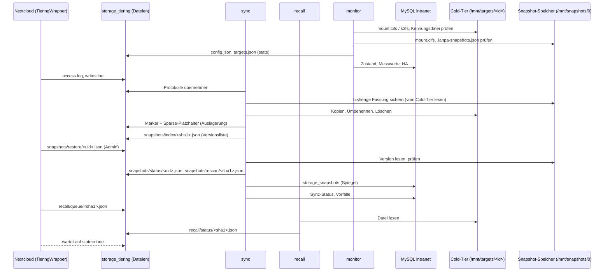
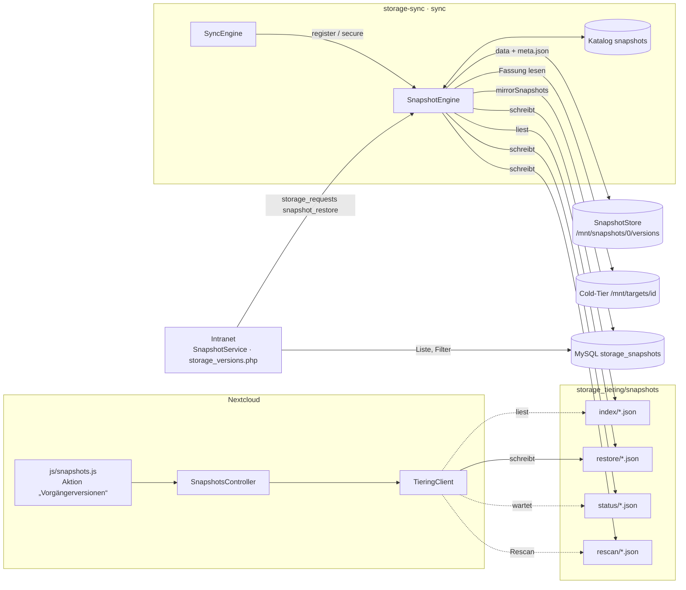
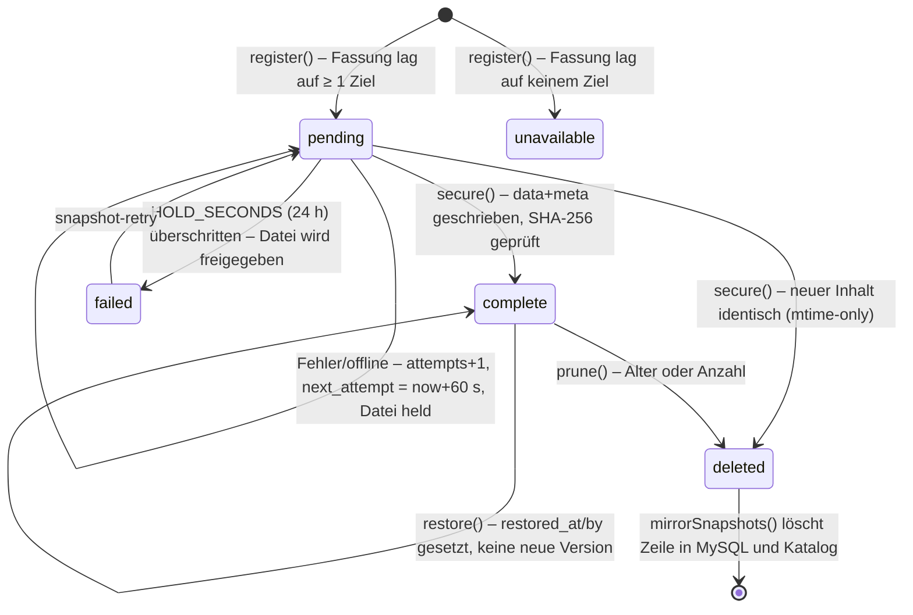
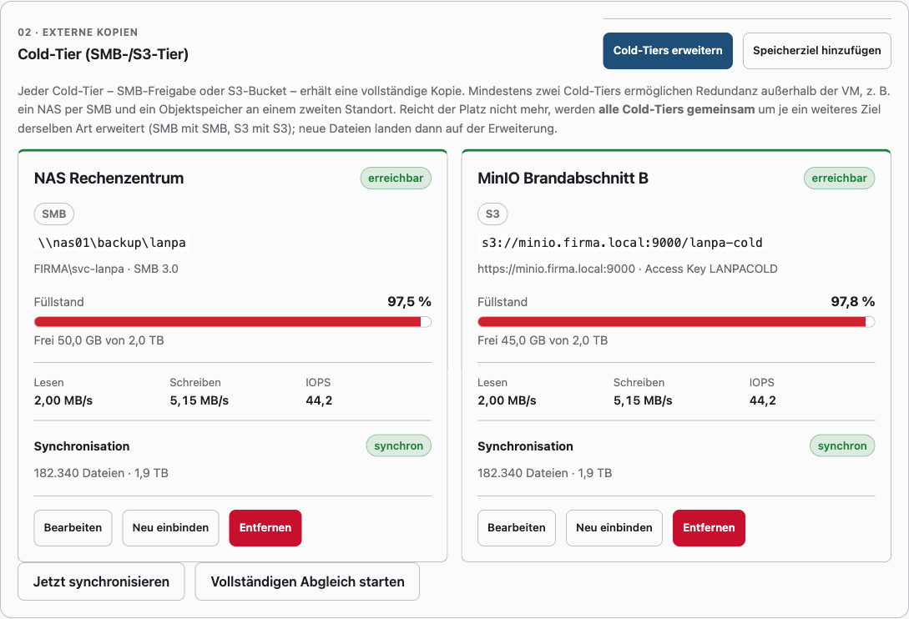
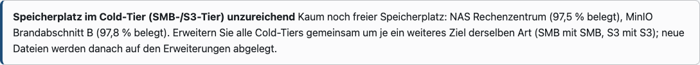
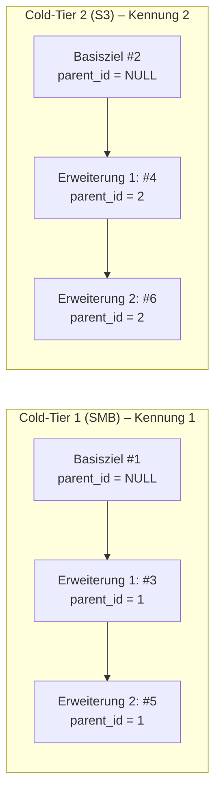
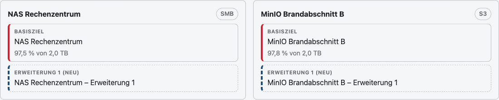
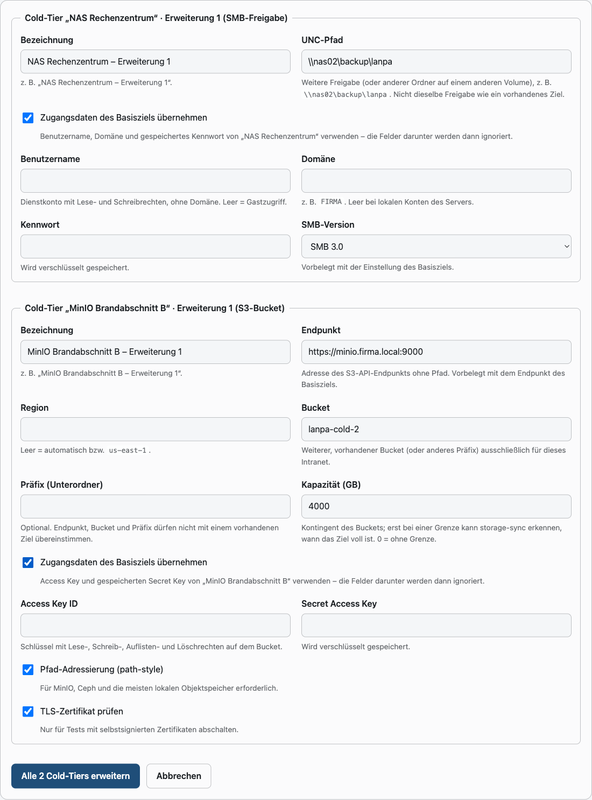
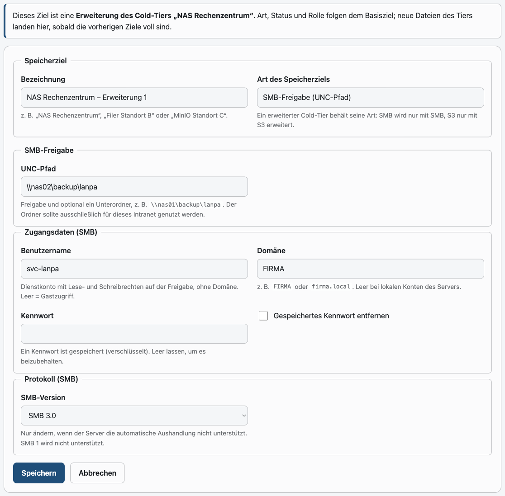
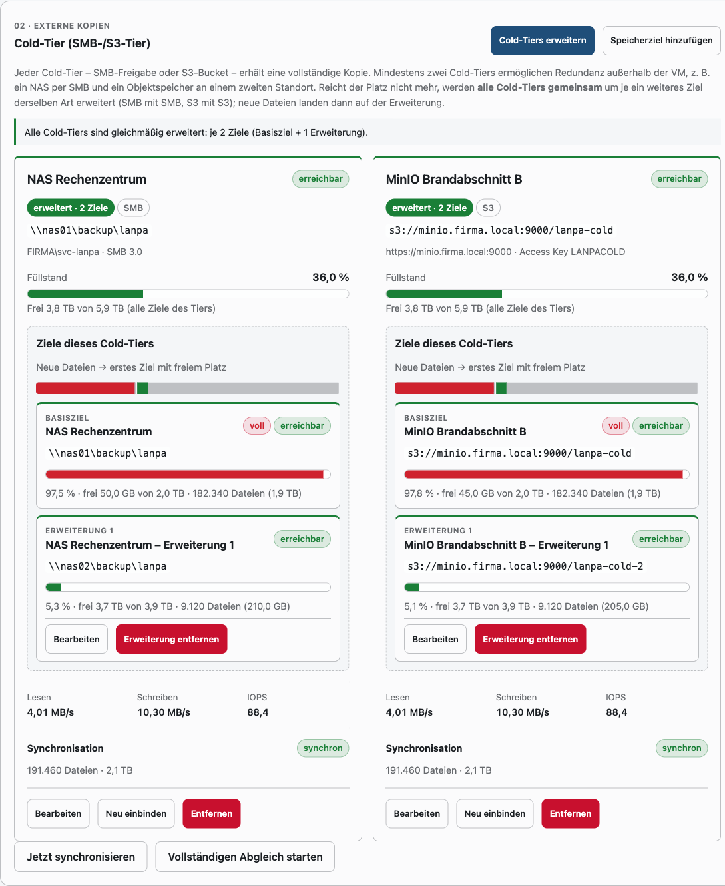

# Speicher-Tiering und HA – technische Referenz (für Entwickler und Coding-Agenten)

Ergänzt [docs/storage.md](storage.md) (Bedienung und Betrieb). Dieses Dokument
beschreibt, **wie** das Speichermodul aufgebaut ist: Dateien, Prozesse,
Datenformate, Algorithmen, Zustände, Invarianten, Tests und typische
Änderungsaufgaben. Alle Konstanten und Schwellwerte sind mit ihrer Fundstelle
angegeben – bei Abweichungen gilt der Code.

**Kurzfassung (TL;DR)**

- Container `storage-sync` (Profil `office`) spiegelt Nextcloud-Daten,
  Nextcloud-Konfiguration, Euro-Office-Daten und einen PostgreSQL-Abzug auf
  **jedes** aktive Speicherziel (SMB per `mount.cifs`, S3 per `s3fs`).
- Selten genutzte Nextcloud-Benutzerdateien werden im Hot-Tier durch
  **Sparse-Platzhalter** ersetzt („ausgelagert“, Katalogzustand `evicted`).
  Nextcloud holt sie über den `TieringWrapper` bei Zugriff zurück.
- Drei Endlosprozesse: `monitor` (Einbindung, Messwerte, HA, alle 5 s),
  `sync` (Erfassen, Übertragen, Auslagern, DB-Abzug), `recall` (Rückholungen,
  max. 4 parallel).
- Kommunikation: MySQL `intranet` (Admin ⇄ Agent), SQLite-Katalog
  (Agent intern), Dateien im Volume `storage_tiering` (Agent ⇄ Nextcloud).
- Schutzmechanismen: Massenlöschsperre, SHA-256-Prüfung, Kennungsdatei je
  Ziel, Vorfallerkennung (Ransomware) mit Schreibsperre für Benutzer und
  schreibgeschütztem Schutzziel.
- **Snapshot-Speicher** (optional, eigene SMB-Freigabe, `SnapshotEngine`):
  vor jedem Überschreiben/Löschen einer Benutzerdatei im Cold-Tier wird die
  bisherige Fassung unveränderlich dort abgelegt (`versions/<quelle>/<uid>/`);
  Admins stellen Versionen über Intranet oder Nextcloud wieder her – ohne
  dass dabei eine neue Version entsteht. Läuft ausschließlich im Prozess
  `sync`, nie im Nextcloud-Request.
- **Cold-Tier-Erweiterungen** (Migration 031, `storage_targets.parent_id`,
  `TierLayout`): Ein Cold-Tier besteht aus einem Basisziel und beliebig
  vielen Erweiterungen derselben Art (SMB nur mit SMB, S3 nur mit S3). Er
  bleibt **eine** logische Kopie – jede Datei liegt auf genau einem Ziel des
  Tiers; neue Dateien laufen über, sobald die bisherigen Ziele voll sind.
  Alle Cold-Tiers werden gemeinsam erweitert (`extendTiers()`), Füllstand
  und Warnungen gelten für den ganzen Tier (Abschnitt 14).

---

## Inhalt

1. [Begriffe und Code-Bezeichner](#1-begriffe-und-code-bezeichner)
2. [Code-Landkarte](#2-code-landkarte)
3. [Laufzeitarchitektur](#3-laufzeitarchitektur)
4. [Datenhaltung und Formate](#4-datenhaltung-und-formate)
5. [Abläufe im Detail](#5-abläufe-im-detail)
6. [Zustände, Status und Exit-Codes](#6-zustände-status-und-exit-codes)
7. [Invarianten (nicht brechen!)](#7-invarianten-nicht-brechen)
8. [Adminbereich, Routen und Aufträge](#8-adminbereich-routen-und-aufträge)
9. [Tests](#9-tests)
10. [Änderungsrezepte](#10-änderungsrezepte)
11. [Fehlersuche und Betriebsbefehle](#11-fehlersuche-und-betriebsbefehle)
12. [Bekannte Eigenheiten](#12-bekannte-eigenheiten)
13. [Snapshot-Speicher (Dateiversionen)](#13-snapshot-speicher-dateiversionen)
14. [Cold-Tier-Erweiterungen (mehrere Ziele je Tier)](#14-cold-tier-erweiterungen-mehrere-ziele-je-tier)

---

## 1. Begriffe und Code-Bezeichner

| Oberfläche / Doku | Code | Bedeutung |
| --- | --- | --- |
| Hot-Tier (lokales Storage) | `nextcloud_data`, `eurooffice_data`, `Catalog::STATE_LOCAL` | Lokale Docker-Volumes; Datei liegt mit Inhalt lokal. |
| Cold-Tier (SMB-/S3-Tier) | `storage_targets`, `Mounter`, `/mnt/targets/<id>` | Alle Speicherziele; jeder **Tier** (Basisziel + Erweiterungen) hält den vollständigen Bestand. |
| Speicherziel | Zeile in `storage_targets`, `kind` = `smb`/`s3` | Eine SMB-Freigabe oder ein S3-Bucket (+ Präfix). |
| Tier (einzelner Cold-Tier, eine Kachel) | `StorageService::tiers()`, Eintrag in `targets.json` mit `members`, Kennung = `id` des Basisziels | Basisziel samt Erweiterungen; eine vollständige Kopie. Katalog, Rückstand, Aufträge und Schutzziel beziehen sich auf die Tier-Kennung. |
| Basisziel | `parent_id IS NULL`, Rolle `root` | Erstes Ziel eines Tiers; bestimmt Art, „aktiv“ und „primär“. |
| Erweiterung (Stufe *n*) | `parent_id = <Basisziel>`, Rolle `extension`, `level` = Position im Tier | Weiteres Ziel derselben Art; nimmt neue Dateien auf, wenn die vorherigen Ziele voll sind. |
| primäres Ziel | `is_primary = 1` | Bevorzugte Quelle für Rückholungen; genau eins (`clearPrimary`). |
| ausgelagert | `Catalog::STATE_EVICTED`, Marker `stubs/<pfad>.json` | Lokal nur Sparse-Platzhalter, Inhalt im Cold-Tier. |
| Rückholung | `Recaller`, `recall/queue`, `recall/status` | Platzhalter wird durch echten Inhalt ersetzt. |
| Rehydrierung | `SyncEngine::rehydrate()` | Agent holt selbst zurück, wenn Regeln/Platz es erlauben. |
| Modus „nur Cold-Tier“ | `Pressure::REMOTE_ONLY` (`remote_only`) | Hot-Tier voll; sonst `Pressure::NORMAL` (`normal`). |
| Quelle | `PathRules::SOURCE_*` | `nextcloud-data`, `nextcloud-config`, `eurooffice-data`, `nextcloud-db`. |
| Vorfall | `storage_incidents`, `ThreatDetector` | Ransomware-/Überschreibverdacht. |
| Schutzziel | `frozen_target_id` | Ziel, das bei offenem Vorfall nur lesend eingebunden und nicht synchronisiert wird. |
| Instanz-ID | Einstellung `storage_instance_id`, `.lanpa-storage.json` | Bindet Ziele an genau eine Installation. |
| Snapshot-Speicher (Dateiversionen) | `SnapshotStore`, `SnapshotEngine`, Einstellungen `storage_snapshot_*`, `/mnt/snapshots/0`, `.lanpa-snapshots.json` | Eigene SMB-Freigabe für Vorgängerversionen; **kein** Speicherziel. |
| Vorgängerversion / Snapshot | Zeile in Katalog `snapshots` bzw. MySQL `storage_snapshots`, Kennung `uid` (40 Hex) | Unveränderliche Kopie einer Fassung (`data` + `meta.json`). |
| Vormerkung | `snapshots.status = pending` | Version ist erkannt, aber noch nicht vom Cold-Tier gesichert. |
| zurückgehalten | `SyncEngine::copyFile()` ⇒ `held` | Datei wird auf diesem Ziel nicht ersetzt, solange ihre Vormerkung nicht gesichert ist. |

Nicht verwechseln: **Speicherplatz/Kontingente** (`StorageQuotaService`,
`/admin/speicherplatz`, Tabellen `storage_quota_*`) sind Nextcloud-Quotas und
gehören **nicht** zu diesem Modul.

---

## 2. Code-Landkarte

### Intranet-Anwendung (`app/`)

| Datei | Aufgabe |
| --- | --- |
| `app/Services/Storage/StorageService.php` | Adminlogik: Ziele anlegen/ändern/löschen (Validierung SMB/S3, Verschlüsselung per `SecretBox`), Cold-Tiers bilden (`tiers()`, `tierOf()`, `tierViews()`) und gemeinsam erweitern (`extendTiers()`, `deleteExtensionLevel()`), volle Tiers (`fullTiers()`), Kapazitätsanteil (`memberShare()`), Einstellungen speichern, Aufträge (`request()`), Gesamtbild `overview()`, Live-JSON `liveData()`, Dashboard-Hinweis `dashboardAlert()`, SNMP-Ausgabe `snmp()`, Hochrechnungstext `forecastText()`. |
| `app/Services/Storage/StorageSettings.php` | Einstellungen `storage_*` (Defaults, Grenzen, Validierung), `GRACE_SECONDS = 600`. |
| `app/Services/Storage/StorageHealth.php` | Reine Funktionen: HA-/Sync-Bewertung `evaluate()`, Hochrechnung `forecast()`, Füllstand `fill()`, Formatierung. Exit-Codes `EXIT`. |
| `app/Services/Storage/IncidentSettings.php` | Einstellungen `incident_*`, Standardliste der Ransomware-Endungen/-Muster, `matchName()`, Benutzerhinweis. |
| `app/Services/Storage/IncidentService.php` | Adminlogik der Vorfälle: Liste, Erledigen, Einstellungen, Dashboard-Hinweis. |
| `app/Services/Storage/SnapshotSettings.php` | Einstellungen `storage_snapshot_*` (Defaults, Grenzen, `validate()` mit Cold-Tier-Konflikt, `mountRow()` für den `Mounter`). |
| `app/Services/Storage/SnapshotService.php` | Adminlogik des Snapshot-Speichers: `settings()`/`saveSettings()` (Kennwort per `SecretBox`), `status()` (aus `storage_snapshot_status`), `filter()` (Listenfilter bereinigen), `list()`, `requestRestore()` (Auftrag `snapshot_restore`), `restoreResults()`. |
| `app/Repositories/StorageRepository.php` | MySQL: `storage_targets`, `storage_target_status`, `storage_status`, `storage_events`, `storage_usage_samples`, `storage_requests`, `storage_snapshots`, `storage_snapshot_status`. `StorageRepository::NOW` = Platzhalter für `NOW()`. |
| `app/Repositories/IncidentRepository.php` | MySQL: `storage_incidents` (offen/erledigt, Schutzziel zuweisen/freigeben). |
| `app/Controllers/Admin/StorageController.php` | Routen `/admin/speicher-ha*` (CSRF-geprüft). |
| `app/Controllers/Admin/IncidentController.php` | Routen `/admin/vorfaelle*`. |
| `views/admin/storage.php`, `views/admin/storage_target.php`, `views/admin/storage_extend.php`, `views/admin/incidents.php`, `views/admin/storage_versions.php` | Oberflächen (`storage.php` enthält die Cold-Tier-Kacheln mit gestapelter Kapazitätsleiste und Zielliste sowie die Karte `#snapshots`; `storage_extend.php` das Formular „Cold-Tiers erweitern“; `storage_versions.php` die Versionsliste mit Filtern und Ja/Nein-Dialog). |
| `public/assets/js/admin-storage.js`, `public/assets/js/admin-storage-target.js`, `public/assets/js/admin-storage-versions.js` | Live-Aktualisierung (5 s, pausiert im Hintergrund-Tab, inkl. Ziele je Tier und Karte Snapshot-Speicher), Zielformular (SMB/S3 umschalten) und Erweiterungsformular (Vorschau, Zugangsdaten übernehmen), Bestätigungsdialog der Wiederherstellung (`<dialog>`, ohne JS: normales Formular). |

### Agent (`app/Services/Storage/Agent/`, läuft nur im Container `storage-sync`)

| Datei | Aufgabe |
| --- | --- |
| `Agent.php` | Einstieg der Prozesse `monitor()`, `sync()`, `recall()`, `recallOne()`, `restore()`, `resume()`; Vorfallbehandlung `handleIncidents()`, Schutzzielwahl `chooseProtectTarget()`, DB-Abzug `dumpDatabase()`, Veröffentlichung `config.json`. |
| `SyncEngine.php` | Kern: `scan()` (Erfassen), `syncTarget()` (Übertragen, je Cold-Tier über alle Ziele), `tier()` (Auslagern/Rehydrieren), Massenlöschsperre. Optionaler neunter Konstruktorparameter `?SnapshotEngine`: `register()` beim Erkennen, `secure()` vor dem Ersetzen/Löschen auf dem Ziel, Ergebnis `held`. Optionaler zehnter Parameter `?TierLayout` (Tests: injizierter freier Platz). |
| `TierLayout.php` | Verteilung der Dateien eines Cold-Tiers auf seine Ziele: `members()`, `locate()` (wo liegt die Datei), `copies()` (alle Kopien), `place()` (Ziel für eine neue Fassung), `placed()`/`free()` (Platzbuchhaltung), `reserve()` (Freihaltereserve). Abschnitt 14.4. |
| `SnapshotStore.php` | Dateilayout der Snapshot-Freigabe (`versions/<quelle>/<uid[0:2]>/<uid>/data|meta.json`), Kennzeichen `.lanpa-snapshots.json`, `available()`, `write()` (Temp + `rename`, SHA-256), `verify()`, `remove()`, `cleanupTemp()`, `all()` (für Neuaufbau), `uid()`/`validUid()`. |
| `SnapshotEngine.php` | Ablauf: `register()` (vormerken), `secure()` (sichern bzw. zurückhalten, identischen Inhalt verwerfen), `restore()` (wiederherstellen ohne neue Version), `prune()` (Aufbewahrung), `rebuild()` (Katalog aus `meta.json`), `refreshIndex()` (Versionsliste für Nextcloud). `RETRY_SECONDS = 60`, `HOLD_SECONDS = 86400`. |
| `Catalog.php` | SQLite-Katalog (WAL): Dateien, Versionen, Stand je Ziel, Löschen/Umbenennen-Aufträge, Zugriffe, Zähler, Meta, Tabelle `snapshots` (`addSnapshot`, `pendingSnapshots`, `snapshotsFor`, `snapshotsBefore`, `snapshotsExceeding`, `retrySnapshots`, `expirePendingSnapshots`, `unmirroredSnapshots`, `relinkSnapshots`, `snapshotStats`), `restored()`. Zähler-ID `Catalog::SNAPSHOT = -1`. |
| `TieringStore.php` | Gemeinsames Verzeichnis mit Nextcloud: Marker, Platzhalter (`makeStub()`), Rückhol-Warteschlange/-Status, Zugriffs- und Schreibprotokoll, `config.json`, `agent.alive`, Snapshot-Austausch (`writeSnapshotIndex()`, `snapshotRestoreIds()`/`readSnapshotRestore()`, `writeSnapshotStatus()`, `requestRescan()`). |
| `Mounter.php` | Einbinden/Aushängen (CIFS, s3fs), Erreichbarkeit, Füllstand, Kennungsdatei, verständliche Fehlermeldungen. Konstruktorparameter `marker` erlaubt eine andere Kennungsdatei (Snapshot-Speicher: `.lanpa-snapshots.json`, eigener `mountBase` und Zugangsdatei-Ordner). |
| `TargetMap.php` | `state/targets.json`: vom Monitor geschrieben, von `sync`/`recall` gelesen – ein Eintrag je Cold-Tier mit `members`. Älter als 120 s ⇒ alle Ziele gelten als offline. Einträge ohne `members` (alte Datei) werden zu einem Tier mit genau einem Ziel ergänzt. |
| `FileCopier.php` | Blockweise Kopie (1 MiB) über Temp-Datei + `rename`, SHA-256, `fsync`, Zähler für MB/s/IOPS. |
| `Recaller.php` | Eine Rückholung: Tier wählen, Datei im Tier finden (`TierLayout::locate()`), kopieren, Prüfsumme, Platzhalter atomar ersetzen. |
| `Restore.php` | Wiederherstellung aus einem Cold-Tier (alle Ziele des Tiers, Kopie oder Platzhalter), Katalog-Reset. |
| `Pressure.php` | Füllstand des Hot-Tiers mit Hysterese, `bytesToFree()`, `roomFor()`. |
| `PathRules.php` | Was synchronisiert bzw. ausgelagert werden darf; Konstanten für Sonderpfade. |
| `ThreatDetector.php` | Vorfallerkennung (Endung, Inhalt/Entropie, Massenüberschreiben), Zuordnung über Schreibprotokoll. |
| `InotifyWatcher.php` | `inotifywait -m -r` als Hinweisquelle; Ausfall ⇒ häufigere Vollabgleiche. |
| `Metrics.php` | Raten aus kumulierten Zählern (`/sys/dev/block/…/stat`, `/proc/fs/cifs/Stats`, Agent-Zähler). |
| `ExcludeFilter.php` | Verzeichnisfilter beim Durchlaufen (keine Symlinks, `PathRules::isExcluded`). |
| `Shell.php` | Externe Programme ohne Shell, mit `timeout -k 5`. |
| `TargetUnavailable.php` | Ausnahme: Ziel während der Übertragung weggefallen. |

### Nextcloud-App `intranet_integration` (`docker/nextcloud/apps/intranet_integration/`)

| Datei | Aufgabe |
| --- | --- |
| `lib/Storage/TieringClient.php` | Gegenstück zu `TieringStore` (ohne Nextcloud-Abhängigkeiten, getestet in `tests/Unit/StorageTieringClientTest.php`). Platzhaltererkennung, Rückholauftrag + Warten, Marker bei Umbenennen/Löschen nachführen, Zugriffs-/Schreibprotokoll, Schreibsperre. |
| `lib/Storage/TieringWrapper.php` | Storage-Wrapper (Priorität 1000, innerste Schicht) um den lokalen Datenspeicher; ruft `TieringClient` bei Lesen/Schreiben/Kopieren/Umbenennen/Löschen. |
| `lib/Storage/TieringException.php` | Fehler der Rückholung (wird als `StorageNotAvailableException` ⇒ WebDAV 503 weitergereicht). |
| `lib/AppInfo/Application.php` | `addTieringWrapper()` (Hook `OC_Filesystem::preSetup`), `tieringClient()` (Basis `/var/lib/lanpa-tiering`, überschreibbar per Systemwert `intranet_integration.tiering_dir`). |
| `lib/Controller/RecallController.php`, Route `GET /api/recall` | Rückholstatus des angemeldeten Benutzers + Hinweis auf Einschränkung. |
| `lib/Listener/RecallScriptListener.php`, `js/recall.js`, `css/recall.css` | Fortschrittsbalken unten rechts. |
| `lib/Controller/SnapshotsController.php`, Routen `GET /api/snapshots?fileId=`, `POST /api/snapshots/restore` | Vorgängerversionen einer Datei (nur Admin-Gruppe, Datei muss im Home-Storage unter `files/` liegen) und Wiederherstellungsauftrag (wartet bis 20 s, stößt `occ`-freien Rescan des Knotens an). |
| `lib/Listener/SnapshotScriptListener.php`, `js/snapshots.js`, `css/snapshots.css` | Kontextaktion „Vorgängerversionen“ (nur Admins, `window._nc_fileactions`), Overlay mit Liste, Ja/Nein-Rückfrage. |
| `lib/Storage/TieringClient.php` (`snapshotsFor()`, `requestSnapshotRestore()`, `waitForSnapshotRestore()`, `takeRescans()`) | Snapshot-Austausch über `storage_tiering/snapshots/*`. `RecallController::rescan()` arbeitet `takeRescans()` ab (Cron/Request-getrieben). |

### Betrieb

| Datei | Aufgabe |
| --- | --- |
| `docker/storage-sync/Dockerfile` | `php:8.5-cli` + `cifs-utils`, `fuse3`, `s3fs`, `inotify-tools`, `postgresql-client`, `procps`. Healthcheck: `agent.alive` jünger als 30 s. |
| `docker/storage-sync/entrypoint.sh` | Startet `monitor`, `sync`, `recall`; endet einer ⇒ Container beendet sich (Neustart durch `restart: unless-stopped`). Mit Argumenten: Einzelbefehl. |
| `docker/storage-sync/storage-sync.ini` | `max_execution_time = 0`, `memory_limit = 512M`. |
| `scripts/storage_sync.php` | CLI des Agenten (siehe [Abschnitt 11](#11-fehlersuche-und-betriebsbefehle)). |
| `scripts/storage_status.php` | SNMP-Prüfungen (läuft im `app`-Container). |
| `scripts/storage-restore.sh` | Wiederherstellung auf dem Docker-Host inkl. `pg_restore`. |
| `docker/office-backup/office-backup.sh` | Sichert `nextcloud-data` mit `tar --sparse` und die Marker als `storage-tiering.tar`. |
| `docker/snmp/entrypoint.sh` | `exec storage_*` (Index 13–17) und `extend storage_metrics/storage_targets`. |
| `database/migrations/022_storage_tiering.sql`, `023_storage_incidents.sql`, `024_storage_s3_targets.sql`, `030_storage_snapshots.sql` | Schema. |

---

## 3. Laufzeitarchitektur

### Container, Volumes, Pfade

`storage-sync` (Compose-Profil `office`, `depends_on` `db` und `nextcloud-db`
healthy) erhält `CAP_SYS_ADMIN`, `CAP_DAC_READ_SEARCH`,
`device_cgroup_rules: "c 10:229 rwm"` (FUSE), `apparmor:unconfined` und ein
tmpfs `/run/storage-sync` (0700).

| Volume | Pfad in `storage-sync` | Weitere Nutzer | Inhalt |
| --- | --- | --- | --- |
| `nextcloud_data` | `/data/nextcloud-data` | `nextcloud`, `office-backup` | Quelle `nextcloud-data` (Hot-Tier). |
| `nextcloud_html` | `/data/nextcloud-html` (Konfig unter `config/`) | `nextcloud` | Quelle `nextcloud-config` (nur `*.php`, `*.json`). |
| `eurooffice_data` | `/data/eurooffice-data` | `eurooffice` | Quelle `eurooffice-data` (ohne `.private`). |
| `storage_tiering` | `/var/lib/lanpa-tiering` | `nextcloud`, `nextcloud-cron`, `nextcloud-ai-worker` (gleicher Pfad), `office-backup` (`/data/storage-tiering`) | Austausch Agent ⇄ Nextcloud. |
| `storage_sync_state` | `/var/lib/storage-sync` | – | `catalog.sqlite`, `targets.json`, `dumps/`, `s3-tmp/`. |
| `app_storage` | `/var/www/html/storage` | `app` | `keys/secrets.key` zum Entschlüsseln der Zugangsdaten. |
| tmpfs | `/run/storage-sync` | – | `cred-<id>` (0600), `s3fs-<id>.log`. |
| – | `/mnt/targets/<id>` | – | Einhängepunkte der Ziele. |
| – | `/mnt/snapshots/0` | – | Einhängepunkt des Snapshot-Speichers (`STORAGE_SNAPSHOT_MOUNT_BASE`); Zugangsdatei unter `/run/storage-sync/snapshot/`. |

Pfade sind über Umgebungsvariablen änderbar (`Agent::defaults()`):
`STORAGE_STATE_DIR`, `STORAGE_TIERING_DIR`, `STORAGE_MOUNT_BASE`,
`STORAGE_SNAPSHOT_MOUNT_BASE`, `STORAGE_CREDENTIAL_DIR`, `STORAGE_NEXTCLOUD_DATA`, `STORAGE_NEXTCLOUD_CONFIG`,
`STORAGE_EUROOFFICE_DATA`, `NEXTCLOUD_DB_HOST`, `NEXTCLOUD_DB_PASSWORD_FILE`,
`STORAGE_DATA_OWNER` (Standard `33:33`), `STORAGE_SYNC_SCRIPT`.

### Prozesse und Takte

| Prozess | Takt | Schreibt | Liest |
| --- | --- | --- | --- |
| `monitor` | 5 s (`Agent::MONITOR_INTERVAL`) | `storage_target_status` (Zustand, Füllstand, Raten), `storage_status` (`heartbeat_at`, HA, Hot-Tier-Werte), `storage_snapshot_status` (Zustand/Füllstand/Raten der Snapshot-Freigabe), `targets.json`, `config.json`, `storage_usage_samples` (alle 300 s), Meta `sparse_supported` (stündlich) | `storage_targets`, Einstellungen `storage_snapshot_*`, `storage_requests` (`remount`, `snapshot_remount`), offene Vorfälle |
| `sync` | sofort nach inotify-Ereignis, sonst Warten bis 5 s (bei offener Arbeit 0,2 s) | Katalog, Ziele, Marker/Platzhalter, Snapshot-Freigabe (`versions/…`), `storage_status` (`sync_*`, Bestand, Modus, Rückstand), `storage_target_status` (Synchronität), `storage_snapshots` (Spiegel), `storage_snapshot_status` (Zähler), `storage_incidents`, `dumps/nextcloud.dump`, `snapshots/index|status|rescan` | `targets.json`, `access.log`, `writes.log`, `snapshots/restore/*`, `storage_requests` (`sync_now`, `full_scan`, `confirm_deletes`, `snapshot_restore`) |
| `recall` | 0,25 s | `agent.alive`, `recall/status/*`, Meta `recalls_*`, `storage_status.recalls_active` (alle 5 s) | `recall/queue/*` |
| `recall-one <id>` | je Auftrag (Kindprozess, max. 4 = `Agent::MAX_RECALLS`) | Hot-Tier-Datei, Marker, Katalog, Status (alle 0,5 s) | Ziele |

Fehlerbehandlung (`Agent::guarded()`): `PDOException` ⇒ Verbindung verwerfen
(`Database::set(null)`, `Container::reset()`), 5 s warten; andere Ausnahmen
⇒ protokollieren, 2 s warten. Ein Prozess beendet sich dadurch nie selbst.

### Datenfluss



---

## 4. Datenhaltung und Formate

### 4.1 MySQL (`intranet`)

| Tabelle | Schreiber | Leser | Hinweise |
| --- | --- | --- | --- |
| `storage_targets` | Adminbereich | Agent, Admin | `password` per `SecretBox` (`enc:v1:…`), wird nie an den Browser gegeben. `unc_path` eindeutig; bei S3 kanonisch `s3://host[:port]/bucket[/präfix]`. `parent_id` (Migration 031, Index `idx_storage_targets_parent`): `NULL` = Basisziel eines Cold-Tiers, sonst Kennung des Basisziels (Erweiterung). Kein Fremdschlüssel – das Entfernen eines Tiers löscht Basisziel und Erweiterungen gemeinsam (`deleteTargets()`, Transaktion). |
| `storage_target_status` | `monitor` (Zustand/Füllstand/Raten, `updated_at`), `sync` (Synchronität, `sync_updated_at`) | Admin, SNMP | Eine Zeile je **physischem** Ziel (auch Erweiterungen). `in_sync`, `pending_*`, `lag_seconds` gelten für den Tier und werden auf alle Ziele des Tiers geschrieben; `synced_files`/`synced_bytes` je Ziel (`Catalog::memberStats()`). `ON DELETE CASCADE`. Älter als 90 s ⇒ Anzeige `unknown`. |
| `storage_status` (genau `id = 1`) | `monitor`, `sync`, `recall` | Admin, SNMP | Herzschläge `heartbeat_at` (Monitor) und `sync_heartbeat_at`. |
| `storage_usage_samples` | `monitor` (alle 5 min) | Hochrechnung | Ältere als 35 Tage werden gelöscht. |
| `storage_events` | Agent, Admin | Admin | Auf 2 000 Einträge gekürzt (stündlich). Kategorien: `sync`, `target`, `tiering`, `recall`, `restore`, `incident`, `config`, `snapshot`. |
| `storage_requests` | Admin | Agent (`claimRequest()` atomar über `picked_at`) | Ältere als 7 Tage werden gelöscht; Admin lehnt ab, wenn > 20 offene (letzte Stunde). Spalte `detail` (Migration 030) trägt bei `snapshot_restore` die `uid`; `recentRequestResults()` liefert Ergebnisse der letzten Stunde für die Versionsliste. |
| `storage_incidents` | `sync` (anlegen/fortschreiben), Admin (erledigen) | Agent, Admin | `status` `open`/`resolved`. |
| `storage_snapshots` | `sync` (`mirrorSnapshots()`: `upsertSnapshot`/`deleteSnapshot`, Statusmarkierung über Katalogspalte `mirrored`) | Admin (Liste, Filter), `requestRestore()` | Spiegel des Katalogs; `file_deleted = 1` ⇔ `file_id IS NULL` im Katalog; `path_hash = sha1(path)`; Status `complete`/`pending`/`failed`/`unavailable` (`deleted` wird gelöscht statt gespiegelt). Nie Quelle der Wahrheit – der Agent prüft jeden Auftrag erneut gegen Katalog und Freigabe. |
| `storage_snapshot_status` (genau `id = 1`) | `monitor` (`state`, `message`, Füllstand, Raten, `state_since`, `updated_at`), `sync` (Zähler `snapshots_total/bytes`, `pending`, `failed`, `last_snapshot_at`, `last_error`) | Admin, SNMP | Älter als 90 s ⇒ Anzeige `unknown`. |
| `settings` | Admin | Agent (bei jedem Durchlauf neu, `resetCache()`) | Schlüssel siehe 4.2. |

### 4.2 Einstellungen (`settings`)

`StorageSettings` (`app/Services/Storage/StorageSettings.php`):

| Schlüssel | Standard | Grenzen | Verwendung |
| --- | --- | --- | --- |
| `storage_enabled` | `0` | bool | Hauptschalter. Aus ⇒ Ziele werden ausgehängt, Sync `disabled`. Abschalten wird abgelehnt, solange `files_evicted > 0`. |
| `storage_eviction_enabled` | `1` | bool | Aus ⇒ reiner Spiegel; ausgelagerte Dateien werden rehydriert. |
| `storage_local_days` | 30 | 1–3650 | Regel „Alter“. |
| `storage_hot_access_days` | 3 | 1–30 | Zugriffstage (letzte 30 Tage), ab denen eine alte Datei lokal bleibt. |
| `storage_local_max_file_mb` | 0 | 0–10485760 | Regel „Größe“ (0 = aus). |
| `storage_local_limit_mb` | 0 | 0–1073741824 | Limit des Hot-Tiers (0 = automatisch nach freiem Platz). |
| `storage_full_scan_minutes` | 60 | 5–1440 | Vollabgleich (ohne inotify höchstens alle 5 min). |
| `storage_db_dump_minutes` | 60 | 5–1440 | `pg_dump`. |
| `storage_lag_warn_minutes` | 15 | 1–1440 | Ab hier `lagging` bzw. HA `degraded`. |
| `storage_fill_warn_percent` / `storage_fill_crit_percent` | 85 / 95 | 50–99 / 50–100, warn < crit | Füllstandsbewertung Hot und Cold. |
| `storage_recall_timeout` | 600 | 30–7200 | Wartezeit von Nextcloud (über `config.json`). |
| `storage_instance_id` | leer | 32 Hex | Wird beim ersten Ziel bzw. Speichern der Einstellungen erzeugt; Restore kann sie übernehmen. Ohne Instanz-ID arbeitet der Agent nicht. |

`SnapshotSettings` (`app/Services/Storage/SnapshotSettings.php`):

| Schlüssel | Standard | Grenzen | Verwendung |
| --- | --- | --- | --- |
| `storage_snapshot_enabled` | `0` | bool | Aus ⇒ `SnapshotEngine` ist No-op (`register()` false, `secure()` true), Monitor hängt die Freigabe aus, `storage_snapshot` ⇒ UNKNOWN. |
| `storage_snapshot_unc_path` | leer | UNC per `NetworkDriveService::parseUnc()`; Pflicht bei aktiv; darf keinem `storage_targets.unc_path` entsprechen (Vergleich ohne Groß/Klein, Schrägstriche normalisiert); umgekehrt lehnt `validateTarget()` die Snapshot-UNC ab | Freigabe. |
| `storage_snapshot_username`, `storage_snapshot_domain` | leer | `StorageService::USERNAME_PATTERN` / `DOMAIN_PATTERN` | Dienstkonto. |
| `storage_snapshot_password` | leer | ≤ 256 Zeichen, keine Zeilenumbrüche; gespeichert als `enc:v1:…` | Leer beim Speichern ⇒ beibehalten; `storage_snapshot_password_clear` ⇒ löschen. |
| `storage_snapshot_smb_version` | `auto` | `StorageService::SMB_VERSIONS` | |
| `storage_snapshot_retention_days` | 90 | 0–3650 (0 = unbegrenzt) | `prune()` über `snapshotsBefore()`. |
| `storage_snapshot_max_versions` | 20 | 0–10000 (0 = unbegrenzt) | `prune()` über `snapshotsExceeding()`. |

`SnapshotSettings::mountRow()` liefert eine Pseudo-Zielzeile (`id = 0`,
`kind = smb`, `active = enabled`) für den `Mounter`.

`IncidentSettings` (`app/Services/Storage/IncidentSettings.php`):

| Schlüssel | Standard | Bedeutung |
| --- | --- | --- |
| `incident_detection_enabled` | `1` | Erkennung an/aus. |
| `incident_freeze_target` | `1` | 1 = zusätzlich Schutzziel einfrieren, 0 = nur Benutzer einschränken. |
| `incident_window_minutes` | 10 | Zeitfenster der Regeln. |
| `incident_overwrite_files` | 200 | Regel `overwrite`. |
| `incident_content_files` | 20 | Regel `content`. |
| `incident_extension_files` | 1 | Regel `extension`. |
| `incident_protect_target` | 0 | Bevorzugtes Schutzziel (0 = automatisch). |
| `incident_extensions` | `DEFAULT_PATTERNS` (zeilenweise) | Endungen ohne Platzhalter oder Namensmuster mit `*`/`?` (max. 1 000 Einträge à 100 Zeichen). |
| `incident_support_contact` | leer | Wird an den Benutzerhinweis angehängt (max. 200 Zeichen). |

### 4.3 SQLite-Katalog (`/var/lib/storage-sync/catalog.sqlite`)

WAL, `busy_timeout` 60 s, von allen drei Prozessen genutzt. Schema in
`Catalog::migrate()`:

| Tabelle | Spalten (Auszug) | Zweck |
| --- | --- | --- |
| `files` | `source`, `path` (unique je Quelle), `size`, `mtime`, `inode`, `version`, `sha256`, `state` (`local`/`evicted`), `tiered`, `last_access`, `evict_reason` (`age`/`size`/`pressure`), `changed_at`, `seen` (Generation) | Bestand aller Quellen. Jede Inhaltsänderung erhöht `version` und setzt `sha256 = NULL`, `state = local`. |
| `target_files` | `target_id`, `file_id`, `version`, `member_id` | Welche Version liegt auf welchem Cold-Tier (`target_id` = Kennung des Basisziels). Aktuell, wenn `version = files.version`. `member_id` (tolerant ergänzt, `DEFAULT 0`): Ziel innerhalb des Tiers, auf dem die Datei liegt; `0` = Basisziel. Nur für die Anzeige/den S3-Füllstand (`memberStats()`), nicht für das Auffinden – dafür prüft `TierLayout::locate()` das Dateisystem. |
| `ops` | `target_id`, `op` (`delete`/`rename`), `source`, `path`, `new_path` | Ausstehende Lösch-/Umbenennungsaufträge je Cold-Tier (nur für Tiers, die die Datei hatten); ausgeführt auf dem Ziel, auf dem die Datei liegt. |
| `access` | `file_id`, `day` | Zugriffstage (31 Tage aufbewahrt). |
| `counters` | `target_id` (0 = Hot-Tier) | Kumulierte Bytes/Operationen für MB/s und IOPS. |
| `activity`, `writes`, `clients` | | Vorfallerkennung (24 h aufbewahrt). |
| `snapshots` | `uid` (unique), `file_id` (NULL = Datei gelöscht), `source`, `path`, `user`, `version`, `size`, `mtime`, `sha256` (NULL bis bekannt), `status` (`pending`/`complete`/`failed`/`unavailable`/`deleted`), `error`, `attempts`, `next_attempt`, `created_at`, `stored_at`, `restored_at`, `restored_by`, `mirrored` | Vormerkungen und gesicherte Versionen (Abschnitt 13). `mirrored = 0` ⇒ beim nächsten `syncPass()` nach MySQL spiegeln. |
| `meta` | `key`, `value` | Siehe unten. |

Meta-Schlüssel: `generation`, `last_full_scan`, `last_db_dump`, `blocked`
(Text der Massenlöschsperre), `confirm_deletes`, `mode`, `mode_reason`,
`mode_since`, `mode_since_reported`, `sparse_supported`, `paused`
(`1` = Sync angehalten, Restore), `access_pruned`, `recalls_total`,
`recalls_failed`, `last_recall`, `incident_frozen`, `snapshot_pruned`
(letzte Aufbewahrungsprüfung, alle 600 s), `snapshot_temp_cleaned`
(stündlich).

Der Katalog ist **wiederherstellbar**: Geht er verloren, erfasst der nächste
Vollabgleich alles neu; vorhandene gleiche Dateien auf Zielen (Größe und
mtime ±1 s) werden als `adopted` übernommen, Platzhalter über ihre Marker als
`evicted` erkannt. Der Erstabgleich (leerer Katalog je Quelle) löst keine
Vorfälle aus. Die Tabelle `snapshots` lässt sich nach Verlust über
`snapshot-rebuild` aus den `meta.json` der Snapshot-Freigabe ergänzen.

### 4.4 Gemeinsames Verzeichnis `storage_tiering` (`/var/lib/lanpa-tiering`)

Format abgestimmt zwischen `TieringStore` (Agent) und `TieringClient`
(Nextcloud). JSON wird immer über Temp-Datei + `rename` geschrieben.

| Pfad | Schreiber | Inhalt |
| --- | --- | --- |
| `config.json` | `monitor` (alle 5 s), `sync` bei neuem Vorfall | `{"enabled":bool,"recall_timeout":int,"updated":int,"restricted":[uid,…],"restriction_message":string}` |
| `agent.alive` | `recall` (alle 0,25 s, `touch`) | Lebenszeichen; Nextcloud: tot, wenn älter als 30 s; Healthcheck ebenso. |
| `stubs/<rel>.json` | Agent (Auslagern, Restore), Nextcloud (verschieben/entfernen) | `{"path","size","mtime","sha256","version","targets":[ids],"evicted_at","reason"}` |
| `recall/queue/<sha1(rel)>.json` | Nextcloud bzw. Agent (`enqueue`) | `{"path","uid","requested_at"}` |
| `recall/status/<sha1(rel)>.json` | `recall-one` | `{"path","uid","request","started","state":"running|done|failed","bytes","total","message"?,"finished"?,"updated"}`; erledigte nach 600 s entfernt. |
| `access/access.log` | Nextcloud | Zeilen `<unix-zeit> <rel>` (Lesen außer Vorschau). |
| `access/writes.log` | Nextcloud | JSON-Zeilen `{"t","u","ip","ua","p"}`, nur `<uid>/files/…`, je Pfad und Anfrage einmal, max. 64 MB. |
| `snapshots/index/<sha1(rel)>.json` | `sync` (`SnapshotEngine::refreshIndex()`, nach Sichern/Wiederherstellen/Aufräumen/Umbenennen) | `{"path","snapshots":[{"uid","version","size","mtime","created_at","user","restored_at"}],"updated"}`, nur Status `complete`, neueste zuerst; fehlt ⇒ keine Versionen. |
| `snapshots/restore/<uid>.json` | Nextcloud (`requestSnapshotRestore()`, nur Admin) | `{"uid","path","user","requested_at"}`. `sync` prüft, dass `uid` zum `path` gehört (`expectedPath`). |
| `snapshots/status/<uid>.json` | `sync` | `{"uid","state":"done|failed","path","message"?,"updated"}`; nach 600 s entfernt (`cleanupSnapshotStatus()`). |
| `snapshots/rescan/<sha1(rel)>.json` | `sync` nach Wiederherstellung | `{"path","requested_at"}`; Nextcloud (`takeRescans()`) liest den Pfad neu ein und löscht die Datei. |

`<rel>` ist immer relativ zum Nextcloud-Datenverzeichnis, z. B.
`alice/files/Projekte/plan.docx`. Die Protokolle übernimmt `sync` per
`rename` nach `*.work` und löscht sie danach.

### 4.5 Dateien in `storage_sync_state`

- `targets.json`: `{"updated":ts,"targets":[{"id","label","root","online","primary","active","members":[{"id","label","root","online","kind","total_bytes","free_bytes"}]}]}`
  – ein Eintrag je Cold-Tier (`id`/`root` = Basisziel), `online` nur, wenn
  **alle** `members` online sind (Abschnitt 14.3). Nur `online` + `active`
  sind für `sync`/`recall` nutzbar; älter als 120 s ⇒ keines.
- `dumps/nextcloud.dump`: `pg_dump -Fc` (wird als Quelle `nextcloud-db`
  synchronisiert).
- `s3-tmp/`: Zwischenspeicher von s3fs (beim Start geleert).

### 4.6 Aufbau eines Speicherziels

```
<ziel>/
  .lanpa-storage.json      {"instance":"<32 hex>","created_at":"…","label":"…"}
  nextcloud-data/<rel>     Spiegel des Datenverzeichnisses (ohne Ausschlüsse)
  nextcloud-config/…       *.php, *.json
  nextcloud-db/nextcloud.dump
  eurooffice-data/…
```

Die Kennungsdatei dient zugleich als **Erreichbarkeitsprobe**
(`SyncEngine::assertReachable()`): Fehlt sie während einer Übertragung, wird
`TargetUnavailable` geworfen und das Ziel in diesem Durchlauf übersprungen.
Bei erweiterten Tiers trägt **jedes** Ziel dieses Layout und eine eigene
Kennungsdatei derselben Instanz; der Inhalt ist auf die Ziele verteilt
(dieselbe relative Datei liegt im Regelfall auf genau einem Ziel), geprüft
werden die Kennungen aller Ziele des Tiers.

### 4.7 Aufbau des Snapshot-Speichers

```
<freigabe>/
  .lanpa-snapshots.json                 {"instance":"<32 hex>","created_at":"…","label":"Snapshot-Speicher"}
  versions/nextcloud-data/<uid[0:2]>/<uid>/
    data                                 Byte-identische Kopie der Fassung (mtime = Original)
    meta.json                            {"uid","source","path","user","version","size","mtime","sha256","created_at","stored_at"}
```

`uid = sha1(source \0 path \0 version \0 size \0 mtime)`
(`SnapshotStore::uid()`) – dieselbe Fassung ergibt immer dieselbe Kennung,
Wiederholungen erzeugen keine Duplikate. Geschrieben wird `data` als
`.data.<zufall>.lanpa-tmp` + `rename`, danach `meta.json` (ebenfalls Temp +
`rename`); eine Version **existiert** erst mit `meta.json` (`exists()`).
Vorhandene Dateien werden nie überschrieben (`write()` bricht ab, wenn
`data` existiert). Enthält die Freigabe `nextcloud-data/` oder
`eurooffice-data/` (Cold-Tier-Layout), meldet der Monitor `invalid`.

---

## 5. Abläufe im Detail

### 5.1 Monitor-Durchlauf (`Agent::monitorPass()`)

1. `TieringStore::prepare()` (Verzeichnisse, Rechte, `.lanpa-recall` im
   Datenverzeichnis), `config.json` veröffentlichen.
2. Stündlich Sparse-Probe (`sparseSupported()`: 8 MiB `ftruncate`, belegt
   < 1 MiB?).
3. `Mounter::cleanup()` hängt Einbindungen gelöschter Ziele aus.
4. Offene `remount`-Aufträge abholen (`target_id` NULL = alle).
   Anschließend `monitorSnapshotPass()`: Snapshot-Freigabe über einen
   eigenen `Mounter` (`/mnt/snapshots`, Zugangsdatei-Ordner
   `/run/storage-sync/snapshot`, Kennung `.lanpa-snapshots.json`, `id = 0`)
   einbinden bzw. bei `snapshot_remount` neu einbinden, deaktiviert ⇒
   aushängen; Zustand/Füllstand/Raten (`cifs:<share>` bzw. Agent-Zähler
   `Catalog::SNAPSHOT`) nach `storage_snapshot_status`; Ereignis bei
   Zustandswechsel; `snapshotMap()` in `state/` für `sync`.
5. Je Ziel `Mounter::check()` (bzw. `disabled`, wenn Tiering aus oder keine
   Instanz-ID); Schutzziel wird **nur lesend** (`ro`) eingebunden. Wechsel
   rw ⇄ ro erzwingt Neueinbindung.
6. Raten: SMB aus `/proc/fs/cifs/Stats` (Schlüssel `host\share`), sonst
   Agent-Zähler. Zustandswechsel ⇒ Ereignis (`target`).
7. `targets.json` schreiben – über `Agent::tierMap()` je Cold-Tier ein
   Eintrag mit allen Zielen; ein Tier ist nur `online`, wenn alle seine Ziele
   `online` sind, und wird mit diesem Zustand bewertet (Schritt 9). Ist der
   Tier Schutzziel, werden **alle** seine Ziele `ro` eingebunden.
8. Hot-Tier: `disk_total_space`/`disk_free_space` des Datenverzeichnisses,
   Raten aus dem Blockgerät (`metrics_source = blockdev`) oder Agent-Zählern.
9. `StorageHealth::evaluate()` ⇒ `ha_state`/`ha_message`.
10. Alle 300 s eine Zeile in `storage_usage_samples`.

`Mounter::check()` – Ergebnisse:

| `state` | Bedingung |
| --- | --- |
| `disabled` | Ziel `active = 0` (wird ausgehängt). |
| `offline` | Einbinden fehlgeschlagen, `stat -f` (SMB) bzw. `ls -A` (S3) fehlgeschlagen/Zeitüberschreitung ⇒ zusätzlich `umount -l`. |
| `invalid` | Kennungsdatei gehört einer anderen Instanz, ist bei `ro` unlesbar oder kann nicht geschrieben werden. |
| `online` | eingebunden, erreichbar, Kennung passt (fehlende Kennung wird bei rw angelegt). |

SMB-Optionen: `rw|ro, credentials=/run/storage-sync/cred-<id> (oder guest),
uid=33, gid=33, file_mode=0660, dir_mode=0770, soft, echo_interval=10,
actimeo=1, nobrl, noperm, iocharset=utf8[, vers=…]`.
S3-Optionen: `[ro,] passwd_file, url, uid/gid, umask=0007, tmpdir, retries=3,
connect_timeout=10, readwrite_timeout=60, stat_cache_expire=30,
complement_stat, compat_dir, dbglevel=err[, endpoint=<region>]
[, use_path_request_style][, no_check_certificate, ssl_verify_hostname=0],
logfile`. Quelle `bucket` bzw. `bucket:/präfix`. S3-Füllstand: `total =
capacity_bytes`, `free = capacity − synced_bytes` (ohne Kapazität 0/0 ⇒
„ohne Grenze“).

### 5.2 Synchronisations-Durchlauf (`Agent::syncPass()`)

Vorbedingungen in `Agent::sync()`: Tiering an und Instanz-ID gesetzt (sonst
`sync_state = disabled`, 10 s Pause), Meta `paused` ≠ `1` (sonst `paused`).

1. Schreibprotokoll übernehmen (`ThreatDetector::ingestWrites`).
2. Aufträge `sync_now`, `full_scan`, `confirm_deletes` abholen
   (`confirm_deletes` und `full_scan` erzwingen einen Vollabgleich).
   `SyncEngine` wird mit einer `SnapshotEngine` gebaut
   (`enabled = storage_snapshot_enabled`).
3. DB-Abzug fällig? ⇒ `pg_dump` nach `dumps/.nextcloud.dump.lanpa-tmp`,
   dann `rename` (Zeitlimit 1 h). Ohne inotify zusätzlich Vollabgleich.
4. Erfassen: Vollabgleich (`scan(null)`), wenn erzwungen oder Intervall
   abgelaufen, sonst nur inotify-Hinweise (`scan($hints)`).
5. Zugriffsprotokoll übernehmen ⇒ `last_access`, `access`-Tage (täglich
   bereinigt).
6. `forgetTargets()` – Stand gelöschter Tiers entfernen (behalten werden die
   Kennungen der Basisziele).
7. Vorfälle auswerten (`handleIncidents()`, 5.6, nur mit Basiszielen) ⇒ ggf.
   Schutzziel (immer ein ganzer Tier).
8. Je erreichbarem, aktivem Cold-Tier (primäres zuerst, Schutzziel
   ausgenommen) `syncTarget($tier, 20)` – Zeitbudget 20 s je Tier und
   Durchlauf.
   Summe `held` ⇒ Statusmeldung „N Datei(en) warten auf den
   Snapshot-Speicher“.
9. `tier()` (5.4).
9a. `snapshotPass()` (Abschnitt 13.4): Wiederherstellungsaufträge, Aufbewahrung,
    Temp-Bereinigung, Spiegel nach MySQL. Fehler darin brechen den
    Durchlauf nicht ab.
10. Rückstand je aktivem Tier ⇒ `storage_target_status` aller Ziele des Tiers
    (`in_sync = pending_files == 0`), belegte Dateien/Bytes je Ziel aus
    `memberStats()`; Gesamtwerte = Maximum ohne Schutzziel.
11. `sync_state`: `blocked` (Massenlöschsperre) > `error` (Zielfehler oder
    fehlgeschlagene Dateien) > `syncing` (ausstehend) > `in_sync`.

#### Erfassen (`SyncEngine::scan()`)

- Jede Datei wird mit `stat` beobachtet (`observe()`): neu ⇒ `insert`
  (`version 1`); Größe oder mtime geändert ⇒ `changed()` (`version + 1`),
  unmittelbar davor `SnapshotEngine::register($row)` mit der **alten**
  Katalogzeile (Vormerkung der bisherigen Fassung).
- Bei Platzhaltern (`evicted`): unverändert ⇒ nur `seen`; nur mtime geändert
  (Größe gleich, belegt < 4 KiB) ⇒ Marker-mtime nachziehen, **keine** neue
  Version (nie Nullen übertragen); sonst überschrieben ⇒ neue Version, Marker
  weg.
- Verschwundene Dateien (`seen < generation`): gleicher Inode **und** gleiche
  Größe/mtime wie eine neu gesehene Datei ⇒ Umbenennung (`ops: rename`,
  Marker verschieben, Snapshots folgen über `Catalog::rename()`, Index für
  alten und neuen Pfad neu geschrieben), sonst Löschung (`ops: delete`,
  Marker entfernen, `register($row, deleted: true)` ⇒ Vormerkung ohne
  `file_id`).
- **Massenlöschsperre**: Löschungen einer Quelle > `max(1000,
  ceil(Bestand × 0,25))` (`MASS_DELETE_MIN`, `MASS_DELETE_RATIO`) werden
  verworfen, Meta `blocked` gesetzt. `confirm_deletes` hebt die Sperre für den
  nächsten **Vollabgleich** auf.
- Hinweise aus inotify: geändertes Verzeichnis ⇒ rekursiv, Datei ⇒
  Elternverzeichnis flach.
- Fehlt eine Quelle (`is_dir` false) bei vorhandenem Katalog ⇒ Ereignis,
  Quelle wird übersprungen (kein Löschen).

#### Übertragen (`SyncEngine::syncTarget()` / `copyFile()`)

1. Zuerst `ops` (Löschen/Umbenennen) in Reihenfolge. Vor einem `delete`
   wird `secure()` für die Zieldatei aufgerufen; liefert es `false`, bleibt
   die Operation stehen (`held`) und der Durchlauf endet mit `more = true`.
   Gelöscht werden alle Kopien im Tier (`TierLayout::copies()`), leere
   Verzeichnisse auf jedem Ziel entfernt. Umbenannt wird auf dem Ziel, auf
   dem die Datei liegt (`locate()`); scheitert das, wird die Zieldatei neu
   übertragen (`unsync`).
2. Dann ausstehende Dateien (`target_files.version < files.version`), älteste
   Änderung zuerst, seitenweise à 200.
3. Ablageort: vorhandene Kopie per `locate()`, neues Ziel per
   `TierLayout::place()` (Abschnitt 14.4). Liegt die neue Fassung auf einem
   anderen Ziel als die alte, wird die alte Kopie nach erfolgreicher
   Übertragung entfernt (`dropMoved()`), sodass jede Datei nur einmal je Tier
   liegt.
4. Ergebnis je Datei:
   - `adopted`: Ziel hat Größe gleich und mtime ±1 s ⇒ nur als synchron
     markieren (ohne Hash!).
   - `held`: Ziel hat eine ältere Fassung, deren Vormerkung noch nicht auf
     dem Snapshot-Speicher liegt (`secure()` false) ⇒ Datei auf diesem Ziel
     nicht anfassen, nächster Durchlauf.
   - `copied` aus Hot-Tier: lokale Datei vor und nach der Kopie unverändert
     (Größe, mtime), übertragene Bytes = Größe ⇒ `markSynced` + `setHash`
     (nur wenn Version noch aktuell).
   - `copied` von anderem Ziel: Datei ist `evicted` ⇒ von einem Ziel mit
     aktueller Version kopieren, mit Prüfung gegen `sha256`.
   - `skipped`: Datei zwischenzeitlich geändert/fehlt ⇒ nächster Durchlauf.
   - `failed`: Kopierfehler ⇒ Ereignis, `sync_state = error`.

### 5.3 HA-Bewertung (`StorageHealth::evaluate()`)

Reihenfolge der Prüfung (erste zutreffende gewinnt):

| Bedingung | `ha` |
| --- | --- |
| Tiering aus | `disabled` |
| kein aktives Ziel | `disabled` |
| Monitor-Herzschlag fehlt / > 90 s | `critical` (Sync `error`) |
| kein aktives Ziel `online` | `critical` |
| einige Ziele nicht `online` | `degraded` |
| ein Ziel (nicht Schutzziel) mit Rückstand > `storage_lag_warn_minutes` | `degraded` |
| nur ein aktives Ziel | `degraded` (keine Redundanz) |
| ein Ziel (nicht Schutzziel) nicht `in_sync` | `degraded` |
| sonst | `ok` |

Zusätzlich: Schutzziel vorhanden und nicht `critical` ⇒ `degraded` mit Hinweis.

Sync-Bewertung: Sync-Herzschlag fehlt / > 300 s ⇒ `error`; sonst
`sync_state` `error`/`blocked`/`paused` übernehmen; ausstehend und (Rückstand >
Warnschwelle oder kein Ziel online) ⇒ `lagging`; ausstehend ⇒ `syncing`;
sonst `in_sync`. `lagging` entsteht **nur** hier, nie im Agenten.

### 5.4 Tiering (`SyncEngine::tier()`)

**Modus (`Pressure`)** – Messgrößen: `bytes_local` (Katalog, Summe lokaler
Dateien ohne `nextcloud-db`), Plattengröße und freier Platz des
Datenverzeichnisses.

| | ohne Limit | mit Limit `L` |
| --- | --- | --- |
| ⇒ `remote_only` (`aboveHigh`) | frei < 10 % | `bytes_local > L` oder frei < 5 % |
| ⇒ `normal` (`belowLow`) | frei ≥ 15 % | `bytes_local ≤ 0,9 L` und frei ≥ 10 % |
| `bytesToFree()` | bis 15 % frei | bis `0,9 L` und 10 % frei |
| `roomFor(size)` (Rehydrierung) | danach frei ≥ 15 % + 2 % | frei ≥ 10 % + 2 % und `bytes_local + size ≤ 0,85 L` |

**Auslagerung** nur wenn `storage_eviction_enabled`, Sparse unterstützt und
mindestens ein Ziel online. Kandidaten (`Catalog::evictable()`): `tiered = 1`,
`state = local`, `size ≥ 64 KiB` (`PathRules::MIN_TIER_SIZE`), sortiert nach
ältester Aktivität, dann Größe, max. 5 000 je Durchlauf. Je Kandidat:

1. Aktivität (`max(mtime, last_access)`) jünger als 600 s ⇒ überspringen.
2. Regelgrund (`policyReason()`): `size` (> `storage_local_max_file_mb`) oder
   `age` (Aktivität älter als `storage_local_days` **und** Zugriffstage <
   `storage_hot_access_days`).
3. Regelbetrieb: Grund vorhanden **und** alle aktiven Ziele online **und**
   aktuelle Version auf allen ⇒ auslagern.
   Sonst bei `remote_only` mit `toFree > 0` **und** aktuelle Version auf ≥ 1
   Online-Ziel ⇒ auslagern mit Grund `pressure`.
4. `evict()`: Ohne gespeicherten Hash (übernommene Kopie) wird lokale Datei
   **und** Kopie auf dem ersten Halter gehasht und verglichen; Abweichung ⇒
   `unsync`, keine Auslagerung (der Halterpfad wird per `locate()` im Tier
   ermittelt, `holderPath()`). Dann Marker schreiben, `makeStub()`:
   Temp-Datei mit `ftruncate(size)`, Rechte/Besitzer/mtime übernehmen, vor dem
   `rename` erneut prüfen (Inode, Größe, mtime unverändert), sonst Abbruch.

**Rehydrierung** (nur Modus `normal`, ≥ 1 Ziel online): bis zu 50
(`REHYDRATE_BATCH`) ausgelagerte Dateien (zuletzt aktiv zuerst), für die kein
Regelgrund mehr besteht (bzw. alle, wenn Auslagerung aus), solange
`roomFor()` – per `TieringStore::enqueue()` in die normale
Rückhol-Warteschlange.

### 5.5 Rückholung

**Nextcloud** (`TieringWrapper`): Nur Pfade `<uid>/(files|files_versions|files_trashbin)/…`.

| Operation | Verhalten |
| --- | --- |
| `fopen` lesend/`a`/`c`/`r+`, `file_get_contents`, `hash`, `getLocalFile` | Platzhalter ⇒ Rückholung (blockierend), danach `logAccess`. |
| Vorschau-URLs (`core/preview`, `…/thumbnail`, …) | Keine Rückholung, `StorageNotAvailableException`; kein Zugriffseintrag. |
| `fopen` `w`/`x`, `file_put_contents`, `writeStream` | Keine Rückholung; Marker entfernen, Schreibprotokoll. |
| `copy`, `copyFromStorage` | Quelle (auch ganze Ordner über `stubs/<rel>/`) erst zurückholen. |
| `rename`, `moveFromStorage`, `unlink`, `rmdir` | Direkt auf Platzhalter; Marker(-baum) verschieben bzw. entfernen. |
| Benutzer in `restricted` | Schreiboperationen auf `files`, `files_versions`, `files_trashbin`, `uploads` ⇒ `ForbiddenException` mit Hinweistext. |

`TieringClient::recall()`: Agent tot (> 30 s) ⇒ sofort Fehler. Auftrag
anlegen (bestehender wird übernommen), alle 0,2 s Status prüfen; `done` und
kein Platzhalter mehr ⇒ fertig; `failed` ⇒ Fehler; Zeitlimit
(`recall_timeout`) ⇒ „dauert noch an“. Die PHP-Session wird vorher
geschlossen, damit der Fortschrittsbalken parallel abgefragt werden kann.
Fehler ⇒ `StorageNotAvailableException` (WebDAV 503).

**Agent** (`Agent::recallOne()` ⇒ `Recaller::recall()`):

1. Pfad validieren (nicht ausgeschlossen, `sha1(rel) = id`).
2. Kein Marker ⇒ nichts zu tun. Datei inzwischen gelöscht ⇒ Marker
   entfernen. Datei kein Platzhalter mehr (neu geschrieben) ⇒ Marker
   entfernen, im Katalog als `local` markieren. In allen drei Fällen meldet
   der Status `done`.
3. Kandidaten: Cold-Tiers mit aktueller Version laut Katalog + `targets` aus
   dem Marker (Tier-Kennungen), nur online, primäres zuerst; Notfall: alle
   Online-Tiers. Innerhalb eines Tiers wird die Datei per
   `TierLayout::locate()` auf Basisziel und Erweiterungen gesucht.
4. Größe auf dem Ziel muss passen; Kopie nach
   `<datadir>/.lanpa-recall/<id>.lanpa-tmp` mit SHA-256-Prüfung gegen den
   Marker.
5. `replace()`: Inode des Platzhalters unverändert und Marker vorhanden?
   Sonst verwerfen. Rechte/Besitzer/mtime übernehmen, `rename`, Marker
   entfernen, Katalog `local` + Hash + Zugriff.

### 5.6 Vorfälle (Ransomware-Schutz)

**Erkennung** (`ThreatDetector::observe()`, aufgerufen aus `scan()` nur für
`nextcloud-data`, Pfad `<owner>/files/…`, und nur wenn der Katalog der Quelle
nicht leer ist):

| Art (`activity.kind`) | Bedingung |
| --- | --- |
| `extension` | Dateiname passt zu `incident_extensions` (Endung exakt oder Muster). Zählt auch für neue Dateien. |
| `content` | Bestehende Datei überschrieben, ≥ 256 Byte, Entropie der ersten 8 KiB ≥ 7,2 Bit/Byte und Textendung **oder** bekannte Endung ohne passende Signatur (OOXML/ODF/ZIP `PK`, OLE, PDF, PNG, JPEG, GIF, BMP, TIFF, 7z, RAR, GZ, RTF, RIFF). |
| `changed` | Bestehende Datei überschrieben (sonst). |

Neue Dateien ohne Musterübereinstimmung zählen nicht.

**Auswertung** (`evaluate()`): je Benutzer im Zeitfenster; Benutzer =
`writes.uid` (letzter Schreiber laut Nextcloud) oder sonst Eigentümer des
Ordners (`attribution`). Regeln: `extension` ≥ `incident_extension_files`,
`content` ≥ `incident_content_files`, `changed` ≥ `incident_overwrite_files`
(Regel `overwrite`). Aktivität vor einer Erledigung (+1 s) zählt nicht
(`floors`).

**Maßnahmen** (`Agent::handleIncidents()`):

1. Neuer Befund ohne offenen Vorfall des Benutzers ⇒ `storage_incidents`
   anlegen (`user_restricted = 1`), Ereignis, `config.json` sofort
   veröffentlichen (`restricted`). Bestehender Vorfall ⇒ Zähler/Regeln
   fortschreiben (nie verringern).
2. `incident_freeze_target = 0` ⇒ kein Schutzziel (bestehendes freigeben).
3. Sonst Schutzziel wählen (`chooseProtectTarget()`): eingestelltes Ziel (wenn
   aktiv) > online + synchron + nicht primär > online + synchron > online mit
   geringstem Rückstand > erstes aktives. Bleibt bis zur Erledigung aller
   Vorfälle bestehen.
4. Schutzziel: im Monitor `ro` eingebunden, im Sync übersprungen, in HA und
   Rückstandssummen ausgenommen.

**Erledigung** (`IncidentService::resolve()`): Status `resolved`, Ereignis. Die
Einschränkung entfällt beim nächsten `config.json` (≤ 5 s), sofern kein
anderer offener Vorfall des Benutzers besteht; das Schutzziel wird freigegeben,
wenn kein Vorfall mehr offen ist (dann rw-Neueinbindung und Nachsynchronisation
des aktuellen Stands).

### 5.7 Wiederherstellung

`scripts/storage-restore.sh <id> [--full]` (Host) ⇒ stoppt Nextcloud, Cron,
KI-Worker, Euro-Office ⇒ startet `storage-sync` ⇒ wartet auf `targets.json` ⇒
`storage_sync.php restore --target=<id> --keep-paused [--full]` ⇒
`pg_restore --clean --if-exists` aus `dumps/nextcloud.dump` ⇒ `resume` ⇒
`docker compose up -d`.

`Agent::restore()`:

1. Tier aus `targets.json` (online) oder `adoptTarget()`: alle Ziele des
   Tiers direkt einbinden; bei `invalid` die fremde Instanz-ID aus
   `.lanpa-storage.json` verwenden. `--target` darf auch die Kennung einer
   Erweiterung sein – es wird immer der ganze Tier verwendet; ist ein Ziel
   des Tiers nicht erreichbar, bricht die Wiederherstellung ab.
2. Meta `paused = 1`, Instanz-ID des Ziels übernehmen.
3. `Restore::run()`: je Quelle alle Dateien aller Ziele des Tiers (Basisziel
   zuerst; eine schon übernommene Datei wird wie jede gleiche lokale Datei übersprungen); gleiche lokale Datei
   (Größe, mtime ±1 s) ⇒ `skipped`; ohne `--full`, Sparse vorhanden,
   `nextcloud-data`, ausgelagerter Pfad, ≥ 64 KiB und älter als
   `storage_local_days` ⇒ Platzhalter + Marker (`sha256 = null`,
   `targets = [id]`); sonst kopieren. Danach `chown -R --reference`.
4. `Catalog::reset()` ⇒ nächster Vollabgleich baut den Katalog neu auf
   (Kopien auf Zielen werden `adopted`).
5. Ohne `--keep-paused` wird `paused` sofort zurückgesetzt.

### 5.8 Hochrechnung (`StorageHealth::forecast()`)

Lineare Regression über `storage_usage_samples.data_total_bytes` der letzten
7 Tage (mindestens 2 Werte über ≥ 1 h). Wachstum < 1 MiB/Tag ⇒ „nicht
wachsend“. `days_free = local_free_bytes / rate`, optional `days_limit` für
das Limit. SNMP: `forecast_days` (−1 = keine Hochrechnung).

---

## 6. Zustände, Status und Exit-Codes

| Größe | Werte | Quelle |
| --- | --- | --- |
| Ziel `state` | `online`, `offline`, `invalid`, `disabled`, `unknown` (Status älter als 90 s, nur Anzeige) | `Mounter::check()`, `StorageService::overview()` |
| `ha_state` | `ok` 0, `degraded` 1, `critical` 2, `disabled` 3 | `StorageHealth::EXIT` |
| `sync_state` | `in_sync` 0, `syncing` 0, `lagging` 1, `paused` 1, `error` 2, `blocked` 2, `disabled` 3 | Agent bzw. `StorageHealth` |
| `mode` | `normal`, `remote_only` | `Pressure` |
| Datei `state` | `local`, `evicted` | `Catalog` |
| `evict_reason` | `age`, `size`, `pressure` | `SyncEngine::tier()` |
| Rückholung `state` | `running`, `done`, `failed` | `recall/status` |
| Vorfall `status` | `open`, `resolved`; `rules` ⊂ {`extension`,`content`,`overwrite`} | `IncidentRepository` |
| Auftrag `action` | `sync_now`, `full_scan`, `remount`, `confirm_deletes`, `snapshot_remount`, `snapshot_restore` (`detail = uid`) | `StorageService::REQUEST_ACTIONS`, `SnapshotService::ACTION_RESTORE` |
| Snapshot-Speicher `state` | `online`, `offline`, `invalid`, `disabled`, `unknown` | `Mounter::check()`, `SnapshotService::status()` |
| Snapshot `status` | `pending` (vorgemerkt), `complete` (gesichert, wiederherstellbar), `failed` (aufgegeben, per `snapshot-retry` erneut), `unavailable` (Fassung lag auf keinem Ziel), `deleted` (entfernt, nur Katalog bis zur Spiegelung) | `Catalog::SNAPSHOT_*` |
| Wiederherstellung (Nextcloud) `state` | `done`, `failed` | `snapshots/status` |
| `storage_snapshot` Exit | 3 deaktiviert, 2 `offline`/`invalid`, sonst Füllstand (`fill()`), ≥ 1 bei `failed > 0` | `StorageService::snmp()` |
| Füllstand | `ok` < warn ≤ `degraded` < crit ≤ `critical` | `StorageHealth::fill()` |
| Rolle eines Ziels | `root` (Basisziel), `extension` (Erweiterung, `level` ≥ 1) | `StorageService::tierViews()`, SNMP `storage_targets` |
| Tier-Zustand | erster nicht `online`-Zustand seiner Ziele, sonst `online`; Meldung „<Ziel>: <Meldung>“ | `tierViews()`, `Agent::tierMap()` |

---

## 7. Invarianten (nicht brechen!)

1. **Kein Datenverlust durch Auslagerung:** Ein Platzhalter entsteht nur, wenn
   die aktuelle Version (gleiche `version`) auf mindestens einem erreichbaren
   Ziel liegt – im Regelbetrieb auf **allen** aktiven Zielen. Ohne bekannten
   Hash wird vorher verglichen.
2. **Atomare Ersetzung:** Jede Datei (Ziel, Platzhalter, Rückholung, JSON)
   wird über eine Temp-Datei (`.lanpa-tmp` bzw. `.tmp`) und `rename`
   geschrieben; vor dem Ersetzen wird geprüft, dass die Datei nicht
   zwischenzeitlich geändert wurde (Inode/Größe/mtime).
3. **Nie Nullen übertragen:** Ein Platzhalter darf nicht als neue Version
   gelten, solange er „sparse“ ist und die Größe zum Marker passt.
4. **Pfadregeln an drei Stellen synchron halten:** `PathRules::TIERED`,
   `TieringClient::TIERED` (Nextcloud) und `InotifyWatcher::EXCLUDE` /
   `PathRules::isExcluded()`.
5. **Dateiformat `storage_tiering`** ist ein Vertrag zwischen
   `TieringStore` und `TieringClient` – Änderungen immer in beiden und in
   beiden Testdateien.
6. **Ziele gehören genau einer Instanz** (`.lanpa-storage.json`); fremde Ziele
   werden nie beschrieben (`invalid`).
7. **Massenlöschungen** werden nie ohne `confirm_deletes` übertragen.
8. **Schutzziel** wird bei offenem Vorfall (und `incident_freeze_target = 1`)
   weder beschrieben noch rw eingebunden.
9. **Zugangsdaten** nur verschlüsselt in MySQL, im Klartext ausschließlich in
   `/run/storage-sync` (tmpfs, 0600), nie in Ereignissen, Logs, Live-JSON
   oder SNMP. Fehlermeldungen von `mount.cifs`/`s3fs` werden über
   `mountError()`/`s3MountError()` übersetzt.
10. **Externe Programme** nur über `Shell::run()` (Argumentliste, Zeitlimit).
11. **Abschalten/Entfernen** ist gesperrt, solange ausgelagerte Dateien sonst
    verloren wären (`saveSettings()`, `assertRemovable()`).
12. Der Hot-Tier ist führend: Änderungen direkt auf einem Ziel werden nicht
    zurücksynchronisiert.
13. **Snapshot vor Ersetzen:** Eine Datei mit offener Vormerkung (`pending`)
    wird auf einem Ziel weder überschrieben noch gelöscht, bis die Fassung
    auf dem Snapshot-Speicher liegt (`secure()`), höchstens aber
    `HOLD_SECONDS` (24 h) – danach `failed` und Ereignis „Dateiversion
    verloren“. Alle anderen Dateien laufen weiter (keine globale Blockade).
14. **Wiederherstellung erzeugt keine Version:** `SnapshotEngine::restore()`
    setzt über `Catalog::restored()` Größe/mtime/Inode/SHA-256 und
    `version + 1` **ohne** `register()`; der nächste `scan()` sieht keine
    Abweichung, `copyFile()` findet keine Vormerkung. Ein Test prüft das
    über zwei Folgeabgleiche (`StorageSnapshotTest`).
15. **Versionen sind unveränderlich:** `SnapshotStore::write()` überschreibt
    nie, `data`/`meta.json` werden nur von `prune()` entfernt. Kennungen
    werden überall mit `validUid()` (40 Hex) geprüft, bevor sie in Pfade
    gelangen.
16. **Keine Benutzerwartezeit durch Snapshots:** Sichern, Prüfen und
    Wiederherstellen laufen ausschließlich im Prozess `sync`. Nextcloud
    schreibt nur Dateien in `storage_tiering` und wartet höchstens 20 s auf
    ein Ergebnis (`waitForSnapshotRestore()`), nie beim Speichern/Löschen.
17. **Snapshot-Speicher ≠ Speicherziel:** gleiche UNC wird in beide
    Richtungen abgelehnt; Cold-Tier-Layout auf der Freigabe ⇒ `invalid`.
18. **Ein Tier = eine vollständige Kopie:** Katalog, `ops`, Marker-`targets`,
    Rückstand und Schutzziel verwenden ausschließlich die Kennung des
    Basisziels. Erweiterungen sind nie eigenständige Kopien und erscheinen
    nicht als eigene Kachel, in `health.active`/`online` oder in der
    Vorfall-Zielauswahl.
19. **Gleiche Art im Tier:** Erweiterungen haben immer die Art des
    Basisziels (`extendTiers()`/`updateTarget()` erzwingen das); die Art eines
    erweiterten Basisziels ist nicht änderbar.
20. **Balance:** Erweitert wird nur gemeinsam (alle Tiers, alles oder nichts,
    eine Transaktion); entfernt wird nur die letzte Stufe in allen Tiers und
    nur, solange sie leer ist (`synced_files = 0`).
21. **Volle Ziele bleiben voll angezeigt:** Füllstand je Ziel wird nie
    geschönt; nur die Warnung „Speicherplatz unzureichend“ und
    `storage_cold_fill` bewerten den Tier gesamt.

---

## 8. Adminbereich, Routen und Aufträge

Alle Routen hinter `$requireAdmin` (`public/index.php`), POST mit CSRF.

| Methode | Pfad | Controller | Zweck |
| --- | --- | --- | --- |
| GET | `/admin/speicher-ha` | `StorageController::index` | Übersicht |
| GET | `/admin/speicher-ha/status` | `::live` | Live-JSON (`StorageService::liveData()`, `Cache-Control: no-store`, ohne Zugangsdaten) |
| POST | `/admin/speicher-ha/einstellungen` | `::updateSettings` | `storage_*` |
| GET/POST | `/admin/speicher-ha/ziel` (`?id=`) | `::editTarget` / `::saveTarget` | Ziel anlegen/ändern (Änderung ⇒ Auftrag `remount`) |
| POST | `/admin/speicher-ha/ziel/loeschen` | `::deleteTarget` | Basisziel ⇒ ganzen Cold-Tier samt Erweiterungen entfernen; Erweiterung ⇒ letzte Erweiterungsstufe in allen Tiers entfernen (nur leer). Daten auf den Zielen bleiben. |
| GET | `/admin/speicher-ha/erweitern` | `::extendForm` | Formular „Cold-Tiers erweitern“ (ohne Tier ⇒ Rücksprung mit Fehlermeldung) |
| POST | `/admin/speicher-ha/erweitern` | `::extend` | Felder `tiers[<id Basisziel>][<feld>]` ⇒ `StorageService::extendTiers()`; Fehler ⇒ 422 mit Formular (Kennwort/Secret werden nicht zurückgegeben) |
| POST | `/admin/speicher-ha/auftrag` | `::request` | `sync_now`, `full_scan`, `remount`, `confirm_deletes`, `snapshot_remount` |
| POST | `/admin/speicher-ha/snapshot-einstellungen` | `::updateSnapshotSettings` | `storage_snapshot_*` (`SnapshotService::saveSettings()`) |
| GET | `/admin/speicher-ha/dateiversionen` | `::versions` | Versionsliste; Query `from`, `to`, `user`, `path`, `status`, `deleted`, `limit` (`SnapshotService::filter()`, nur gebundene Parameter, `LIKE … ESCAPE`) |
| POST | `/admin/speicher-ha/dateiversionen/wiederherstellen` | `::restoreVersion` | `uid` + `filter_*` (Rücksprung); legt Auftrag `snapshot_restore` an |
| GET | `/admin/vorfaelle` | `IncidentController::index` | Vorfallliste |
| POST | `/admin/vorfaelle/erledigt` | `::resolve` | Vorfall erledigen |
| POST | `/admin/vorfaelle/einstellungen` | `::updateSettings` | `incident_*`, Standardliste wiederherstellen |

Nextcloud: `GET /office/apps/intranet_integration/api/recall` ⇒
`{ok, enabled, recalls:[…], restricted, message}` (nur eigene Aufträge).
`GET …/api/snapshots?fileId=` ⇒ `{ok, path, uid, snapshots:[…]}` und
`POST …/api/snapshots/restore` (`fileId`, `uid`) ⇒ `{ok, state, message}` –
beide nur für Mitglieder der Gruppe `admin` (`IGroupManager::isAdmin()`),
sonst 403; die Datei muss im Home-Storage des Eigentümers unter `files/`
liegen (`SnapshotsController`).

Validierung der Ziele (`StorageService::validateTarget()`): SMB-UNC über
`NetworkDriveService::parseUnc()`, Benutzer-/Domänenmuster, SMB-Version aus
`SMB_VERSIONS`; S3-Endpunkt nur `https?://host[:port]`, Bucket nach S3-Regeln,
Präfixsegmente `[A-Za-z0-9._-]`, Region, Kapazität ≤ `S3_MAX_CAPACITY_GB`.
Leeres Kennwort/Secret beim Bearbeiten ⇒ bisheriger Wert bleibt (nicht bei
Wechsel der Art SMB ⇄ S3). Das erste Ziel wird automatisch primär.
Beim Bearbeiten einer Erweiterung übernimmt `updateTarget()` Art und „aktiv“
vom Basisziel und setzt `is_primary = 0`; „aktiv“ eines Basisziels wird per
`setTierActive()` auf alle Erweiterungen übertragen.

---

## 9. Tests

```bash
php tests/run.php            # alle Tests (eigener Runner, kein PHPUnit)
php -l <datei>               # Syntaxprüfung
```

| Datei | Abdeckung |
| --- | --- |
| `tests/Unit/StorageAgentTest.php` | Pfadregeln, Hysterese, Raten/CIFS-Statistik, Mount-/s3fs-Optionen und Fehlermeldungen, Sync inkl. Umbenennen/Löschen, Massenlöschsperre, Auslagern/Rückholen, überschriebener Platzhalter, `remote_only` und Rückkehr, Katalogverlust. Cold-Tier-Erweiterungen: `TargetMap` mit `members`, `TierLayout::place()`/`reserve()`/`free()`, Überlauf auf die Erweiterung (volles Basisziel per injiziertem freiem Platz), Verschieben geänderter Dateien, Umbenennen/Löschen/Rückholen über Ziele hinweg, `memberStats()`, `Agent::tierMap()` (Tier nur mit allen Zielen online, Schutzziel). Helfer `storageAgentExtendedTier()`. Arbeitet mit Temp-Verzeichnissen als Ziele (ohne echte Mounts). |
| `tests/Unit/StorageTieringTest.php` | Einstellungen, HA-Bewertung, Live-Daten ohne Zugangsdaten, Zielvalidierung (SMB/S3) und Verschlüsselung, Views ohne Inline-Styles, SNMP-Ausgabe. Cold-Tier-Erweiterungen: `extendTiers()` (alle Tiers nötig, gleiche Art, eigener Ort, Zugangsdaten übernehmen, `parent_id`), Art eines erweiterten Basisziels gesperrt, Entfernen nur leerer letzter Stufe, aggregierter Füllstand, Warnung vorher/nachher, SNMP `tier=`/`role=`, Live-Daten `members`, Kachel- und Formular-Rendering. Helfer `storageTierPdo()` (SQLite mit `NOW()`/`TIMESTAMPDIFF()`-Ersatz), `storageTierStatus()`, `storageTierViews()`. |
| `tests/Unit/StorageIncidentTest.php` | Muster, Inhaltsprüfung, Regeln, Zuordnung über Schreibprotokoll, Schutzzielwahl, `ro`-Einbindung, Erledigung, Adminseite. |
| `tests/Unit/StorageTieringClientTest.php` | Nextcloud-Seite: Rückholung über Warteschlange, Fehler/ausgefallener Agent, Marker bei Umbenennen/Verschieben/Löschen, Zeitstempel, Zugriffsprotokoll. |
| `tests/Unit/StorageSnapshotTest.php` | Snapshot-Speicher: Pfadregel/Kennung, Version bei Inhaltsänderung (Layout, `meta.json`, Index), keine Version bei mtime-only/Umbenennen/außerhalb `files/`/Auslagern/Zurückholen, Löschung sichert letzte Fassung und Wiederherstellung legt sie neu an, harter Akzeptanztest „Restore erzeugt keinen Snapshot“, Zurückhalten bei nicht erreichbarem Speicher mit Wiederholung (injizierte Uhr), Abbruch ohne halbe Versionen + Temp-Bereinigung, Aufbewahrung und Neuaufbau, deaktiviert, Einstellungsvalidierung, Listenfilter gegen Injektion, View-Escaping, Dashboard-Hinweis. Helfer `storageSnapshotEnv()` (wie `storageAgentEnv()` plus `SnapshotStore`/`SnapshotEngine`). |

Bei Änderungen am Agenten mindestens diese fünf Dateien laufen lassen (der
Runner führt immer alle Tests aus). Neue Logik möglichst als reine Funktion
(wie `StorageHealth`, `Pressure`) oder mit injizierbarer Uhr (`$clock` in
`SyncEngine`, `SnapshotEngine`, `ThreatDetector`, `TieringClient`) testbar
halten. MySQL-spezifisches SQL (`NOW()`, `ON DUPLICATE KEY`) ist in den
SQLite-Tests nicht ausführbar – `StorageSnapshotTest::storageSnapshotPdo()`
übersetzt den Einstellungs-Upsert; Auftragsabläufe werden daher nur bis zur
Validierung getestet.

---

## 10. Änderungsrezepte

**Neue Einstellung des Tierings**
1. Schlüssel in `StorageSettings::NUMERIC` bzw. `BOOLEAN` (Default, Grenzen),
   ggf. Getter.
2. Formularfeld in `views/admin/storage.php`.
3. Verwendung im Agenten (Einstellungen werden je Durchlauf neu gelesen – kein
   Neustart nötig). Werte für Nextcloud nur über `publishTieringConfig()` ⇒
   `config.json` ⇒ `TieringClient`.
4. Test in `StorageTieringTest.php` (Validierung), Doku in `docs/storage.md`
   (Tabelle Abschnitt 3) und hier (4.2).

**Neuer Auftrag aus dem Adminbereich**
`StorageService::REQUEST_ACTIONS` erweitern, Button in der View, im Agenten mit
`claimRequest([...])` im passenden Prozess abholen und `finishRequest()`
aufrufen. Aufträge, die kein Prozess abholt, bleiben offen und zählen gegen
das Limit von 20.

**Neuer Speicherzieltyp**
`StorageService::KINDS` + Validierung in `validateTarget()`, Spalten per neuer
Migration (`database/migrations/0NN_…sql`, nur `ADD COLUMN`),
`StorageRepository::TARGET_FIELDS`, `Mounter::check()` (Einbinden, Probe,
Füllstand, Fehlermeldungen), Pakete im Dockerfile, Formular +
`admin-storage-target.js`, SNMP `kind`. Alles oberhalb des Einhängepunkts
bleibt unverändert, solange der Typ ein POSIX-Dateisystem mit `rename`
liefert.

**Pfadregeln ändern (was synchronisiert/ausgelagert wird)**
`PathRules` **und** `TieringClient::TIERED` / `TieringWrapper::isUserFile()`
**und** `InotifyWatcher::EXCLUDE` anpassen; Tests in `StorageAgentTest.php`
(„Pfadregeln“) und `StorageTieringClientTest.php`.

**Snapshot-Regeln ändern (was versioniert wird)**
`PathRules::isSnapshotted()` (nur `nextcloud-data`, `<uid>/files/**`) und
`SnapshotEngine::register()` (Größe > 0). Auslöser bleiben `scan()`
(Inhaltsänderung) und die Löschbehandlung; `secure()` verwirft Vormerkungen,
deren SHA-256 dem neuen lokalen Inhalt entspricht (mtime-only). Tests in
`StorageSnapshotTest.php` ergänzen; `docs/storage.md` Abschnitt 5a „Was wird
gesichert“ nachziehen.

**Neues Feld in `meta.json` / Versionsliste**
`SnapshotStore::write()` (Schreiben), `SnapshotEngine::rebuild()` (Lesen),
`refreshIndex()` + `TieringClient::snapshotsFor()` (Nextcloud-Liste),
`Catalog::migrate()` nur additiv, `StorageRepository::upsertSnapshot()` und
Migration für MySQL, Views `storage_versions.php` / `js/snapshots.js`.

**Neue Vorfallregel**
`ThreatDetector::observe()` (neue `kind`), Zählung in `evaluate()`/`stats()`,
Schwelle in `IncidentSettings::NUMERIC`, Text in `Agent::summary()` und
`IncidentService::RULE_LABELS`, Formular in `views/admin/incidents.php`.

**Neuer SNMP-Wert**
Für Kennzahlen eine Zeile in `storage_metrics` (`StorageService::snmp()`)
ergänzen – Schlüssel nie umbenennen (Monitoring-Abhängigkeiten). Neue
Prüfungen mit eigenem Index zusätzlich in `SNMP_CHECKS`,
`docker/snmp/entrypoint.sh`, `docker/snmp/check_status.sh`,
`views/admin/snmp.php`, `agentsindex.md` (Abschnitt SNMP). Index 17 ist
`storage_snapshot`.

**Schemaänderung**
Nur neue Migrationsdatei, nie bestehende ändern. SQLite-Katalog: in
`Catalog::migrate()` ausschließlich `CREATE … IF NOT EXISTS` bzw. tolerant
ergänzen (bestehende Kataloge werden nicht migriert).

---

## 11. Fehlersuche und Betriebsbefehle

```bash
docker compose --profile office logs -f storage-sync                 # Protokoll aller drei Prozesse
docker compose exec storage-sync cat /var/lib/storage-sync/targets.json
docker compose exec storage-sync cat /var/lib/lanpa-tiering/config.json
docker compose exec storage-sync ls /var/lib/lanpa-tiering/recall/queue /var/lib/lanpa-tiering/recall/status
docker compose exec storage-sync grep /mnt/targets /proc/self/mountinfo
docker compose exec app php scripts/storage_status.php storage_metrics
docker compose exec app php scripts/storage_status.php storage_targets

# Katalog lesen (kein sqlite3 im Image)
docker compose exec storage-sync php -r '$p=new PDO("sqlite:/var/lib/storage-sync/catalog.sqlite");
  foreach($p->query("SELECT key,value FROM meta") as $r) echo $r["key"],"=",$r["value"],PHP_EOL;'

# Einzelbefehle des Agenten
docker compose exec storage-sync php scripts/storage_sync.php resume
docker compose exec storage-sync php scripts/storage_sync.php restore --target=<id> [--full] [--keep-paused]

# Snapshot-Speicher
docker compose exec storage-sync php scripts/storage_sync.php snapshot-status
docker compose exec storage-sync php scripts/storage_sync.php snapshots --path=alice/files --limit=20
docker compose exec storage-sync php scripts/storage_sync.php snapshot-restore --id=<40 hex>
docker compose exec storage-sync php scripts/storage_sync.php snapshot-retry      # failed -> pending
docker compose exec storage-sync php scripts/storage_sync.php snapshot-prune      # Aufbewahrung sofort
docker compose exec storage-sync php scripts/storage_sync.php snapshot-rebuild    # Katalog aus meta.json
docker compose exec storage-sync grep /mnt/snapshots /proc/self/mountinfo
docker compose exec storage-sync ls /var/lib/lanpa-tiering/snapshots/restore /var/lib/lanpa-tiering/snapshots/status
docker compose exec app php scripts/storage_status.php storage_snapshot
```

| Symptom | Ursache / Prüfung |
| --- | --- |
| HA `critical`, „storage-sync meldet sich nicht“ | Container läuft nicht oder Monitor hängt (`heartbeat_at` > 90 s). Logs prüfen. |
| Ziel `invalid` | Fremde Instanz-ID in `.lanpa-storage.json` (anderer Ordner/Präfix oder Restore), fehlende Schreibrechte, S3 Object Lock auf der Kennungsdatei. |
| Ziel `offline` mit „Kennwort kann nicht entschlüsselt werden“ | `storage/keys/secrets.key` geändert ⇒ Zugangsdaten neu eingeben. |
| S3: „FUSE ist im Container nicht verfügbar“ | `fuse`-Modul auf dem Host laden, `device_cgroup_rules` prüfen. |
| `sync_state = blocked` | Massenlöschsperre; Ursache prüfen (Volume leer?), dann „Löschungen übernehmen“. |
| `sync_state = paused` | Restore lief mit `--keep-paused` ⇒ `storage_sync.php resume`. |
| Nichts wird ausgelagert | Tiering-Schalter, `sparse_supported = 0` (Dateisystem), nicht alle Ziele online/synchron, Dateien < 64 KiB, Aktivität < 10 min, Pfad nicht unter `files*`. |
| Nextcloud 503 „Speicher nicht verfügbar“ | Rückholung: Agent tot, kein Ziel erreichbar, Datei fehlt/Größe falsch auf allen Zielen oder Zeitlimit. Status in `recall/status/<sha1>.json`. |
| Benutzer kann nicht schreiben | Offener Vorfall (`config.json` → `restricted`), unter **Vorfälle** erledigen. |
| inotify-Warnung im Log | `fs.inotify.max_user_watches` auf dem Host erhöhen; bis dahin Vollabgleich alle 5 min. |
| Sync-Status „N Datei(en) warten auf den Snapshot-Speicher“ | Freigabe `offline`/voll/Schreibfehler: Karte Snapshot-Speicher und `storage_events` (Kategorie `snapshot`) prüfen, `snapshot_remount`. Nach 24 h werden die Vormerkungen aufgegeben (`failed`). |
| Snapshot-Speicher `invalid` | Fremde Instanz-ID in `.lanpa-snapshots.json` oder Cold-Tier-Layout (`nextcloud-data/`) auf der Freigabe. |
| Version in Nextcloud nicht sichtbar, im Intranet schon | Index fehlt: `snapshots/index/<sha1>.json` wird nur bei Status `complete` geschrieben; `snapshot-rebuild` schreibt alle Indizes neu. Aktion nur für Admins sichtbar. |
| Wiederherstellung „Die Dateiversion gehört zu einer anderen Datei“ | Auftrag aus Nextcloud nennt einen Pfad, der nicht zur `uid` passt (Datei zwischenzeitlich verschoben) – Liste neu öffnen. |
| `storage_snapshots` leer, Katalog voll | Spiegelung erfolgt je `syncPass()`; MySQL-Fehler werden protokolliert und beim nächsten Durchlauf wiederholt (`mirrored = 0`). |

---

## 12. Bekannte Eigenheiten

- `TieringClient::isStub()` (Nextcloud) prüft Größe und Belegung, aber nicht
  die mtime; `TieringStore::isStub()` (Agent) zusätzlich die mtime.
- `adopted`-Dateien haben bis zur Auslagerung keinen Hash; `evict()` hasht sie
  dann einmal lokal und auf dem Ziel.
- S3 meldet keinen Plattenplatz; Füllstand = synchronisierte Bytes /
  `capacity_bytes`. Ohne Kapazität zählt das Ziel in `storage_cold_fill` als
  „ohne Grenze“ (Exit 0).
- `storage_metrics.cold_*` summiert nur aktive Online-Tiers (bei erweiterten
  Tiers bereits über alle Ziele summiert).
- Erweiterte Tiers: Erweiterungen erhalten erst nach dem nächsten Monitor-
  Durchlauf einen Status. Bis dahin ist der Tier `unknown` (Anzeige) bzw.
  nicht `online` (`targets.json`) – kurz nach dem Erweitern kann deshalb die
  Meldung „Cold-Tier nicht verfügbar“ erscheinen.
- Die Konfiguration (`nextcloud-config`), Euro-Office-Daten und der DB-Abzug
  werden nie ausgelagert; `bytes_local`/Limits beziehen sich auf alle lokal
  vorgehaltenen Katalogdateien außer dem DB-Abzug.
- `targets.json` gilt nach 120 s als veraltet – fällt nur der Monitor aus,
  stoppen Synchronisation und Rückholung, Daten bleiben unverändert.
- Ereignisse in `storage_events` sind „best effort“ (Fehler werden ignoriert).
- Snapshots: `register()` kennt die Vormerkung schon beim `scan()`, gesichert
  wird aber erst in `copyFile()`/`applyOp()` – zwischen zwei Abgleichen
  mehrfach geänderte Dateien ergeben eine Version je **übertragener**
  Fassung. Eine Fassung, die nie auf einem Ziel lag, wird `unavailable`.
- `secure()` hasht die neue lokale Datei nur, wenn Größe gleich und SHA-256
  der Vormerkung bekannt ist (`adopted`-Dateien haben keinen ⇒ Version wird
  gesichert, auch wenn der Inhalt gleich wäre).
- `restored()` erhöht `version`, damit alle Ziele den wiederhergestellten
  Stand übernehmen; dadurch kann dieselbe Fassung später erneut (mit neuer
  `version`, also neuer `uid`) gesichert werden – gewollt, da die Historie
  die Reihenfolge abbildet.
- `storage_target_status`/`storage_snapshot_status` werden mit `NOW()`
  geschrieben; in SQLite-Tests sind diese Pfade nicht ausführbar.

---

## 13. Snapshot-Speicher (Dateiversionen)

Bedienung und Betrieb: [docs/storage.md, Abschnitt 5a](storage.md#5a-snapshot-speicher-dateiversionen-auf-eigener-smb-freigabe).

### 13.1 Komponenten



### 13.2 Lebenszyklus einer Version



### 13.3 Sichern im Detail (`SnapshotEngine::secure()`)

Aufruf aus `SyncEngine::copyFile()` (mit `fileId` und lokalem Pfad) und
`applyOp()` bei `delete` (`fileId = null`, kein lokaler Pfad). Für jede
`pending`-Vormerkung der Datei:

1. `targetVersion(target, fileId) ≠ snapshot.version` ⇒ dieses Ziel hat eine
   andere Fassung, überspringen (ein anderes Ziel sichert sie).
2. `stat(remote).size ≠ snapshot.size` ⇒ Kopie passt nicht, überspringen.
3. Lokaler Pfad vorhanden, SHA-256 der Vormerkung bekannt, lokale Größe
   gleich ⇒ lokale Datei einmal hashen; identisch ⇒ Vormerkung `deleted`
   (keine Version ohne Inhaltsänderung).
4. Version existiert bereits auf der Freigabe (`exists()`) ⇒ `complete`.
5. `next_attempt > now` ⇒ warten (`held`), außer die Haltefrist ist um
   (`expired()` ⇒ `failed`, Datei freigeben).
6. `SnapshotStore::write(remote, …, expectedSha)` – liest **vom Ziel**, nicht
   vom Hot-Tier; Fehler ⇒ `attempts + 1`, `next_attempt = now + 60`,
   Ereignis beim 1., 10., 20. … Versuch, Rückgabe `false` (`held`).
7. Erfolg ⇒ `complete`, `stored_at`, Ereignis, `refreshIndex()`.

Rückgabe `true` nur, wenn keine Vormerkung dieser Datei mehr offen ist (bzw.
alle aufgegeben wurden).

### 13.4 `Agent::snapshotPass()` (nach `tier()` in jedem `syncPass()`)

1. `storage_requests` mit `action = snapshot_restore` abholen (`detail =
   uid`) ⇒ `restore(uid, requested_by)` ⇒ `finishRequest()` mit Ergebnistext
   („Wiederhergestellt: <pfad>“ oder Fehlermeldung); die Versionsliste zeigt
   ihn über `recentRequestResults()`.
2. `snapshots/restore/*.json` (Nextcloud) ⇒ `restore(uid, 'nextcloud:<user>',
   expectedPath)` ⇒ `snapshots/status/<uid>.json` `done`/`failed`.
3. Alle 600 s (Meta `snapshot_pruned`): `prune(retentionDays, maxVersions)`,
   `expirePendingSnapshots(now − 86400)`, `cleanupSnapshotStatus()`.
4. Stündlich (Meta `snapshot_temp_cleaned`): `cleanupTemp()` (Temp-Dateien
   älter als 1 h).
5. `mirrorSnapshots()`: `unmirroredSnapshots()` ⇒ `upsertSnapshot()` bzw.
   bei `deleted` `deleteSnapshot()` + `removeSnapshot()`; danach
   `markSnapshotsMirrored()`. `storage_snapshot_status`-Zähler aus
   `snapshotStats()`.

### 13.5 Wiederherstellen (`SnapshotEngine::restore()`)

Prüfreihenfolge mit Fehlermeldungen (werden 1:1 angezeigt): `validUid` →
Katalogzeile vorhanden → Status `complete` → `expectedPath` passt →
`PathRules::isSnapshotted(path)` → Freigabe erreichbar → `verify()`
(Größe + SHA-256 der `data`). Dann: Marker entfernen (falls Platzhalter),
Zielordner anlegen, `FileCopier::copy(data → hot, mtime = now, sha)`, in einer
Katalog-Transaktion `restored()` (bestehende Zeile) oder `insert()`
(gelöschte Datei), `updateSnapshot(restored_at/by, file_id)`,
`relinkSnapshots()` (ältere Versionen der gelöschten Datei wieder an die
neue Zeile hängen), `requestRescan(path)`, Ereignis, `refreshIndex()`.
Der nächste `syncPass()` überträgt die Datei als neue `version` auf alle
Ziele; `copyFile()` findet keine Vormerkung ⇒ kein Snapshot.


---

## 14. Cold-Tier-Erweiterungen (mehrere Ziele je Tier)

Reicht der Platz eines Cold-Tiers nicht mehr, wird er um ein weiteres Ziel
**derselben Art** erweitert – eine SMB-Freigabe nur um eine SMB-Freigabe,
ein S3-Bucket nur um einen S3-Bucket/-Präfix. Damit jeder Cold-Tier weiterhin
eine vollständige Kopie aufnehmen kann, werden **alle** Cold-Tiers in einem
Schritt erweitert (Balance). Ein erweiterter Cold-Tier bleibt eine logische
Kopie und eine Kachel; die Ziele erscheinen innerhalb der Kachel.

| Vorher (Basisziele zu 97,5 % belegt) | Warnung im Dashboard |
| --- | --- |
|  |  |

### 14.1 Datenmodell



- Migration `031_storage_tier_extensions.sql`: `storage_targets.parent_id INT
  UNSIGNED NULL` + Index. Bestehende Ziele bleiben Basisziele (`NULL`) –
  keine Datenmigration.
- `StorageService::tiers($rows)` bildet die Tiers: Basisziele in
  Tabellenreihenfolge, je Tier `members` = Basisziel + Erweiterungen nach
  `id` aufsteigend. Die Position in `members` ist die **Erweiterungsstufe**
  (`level`, 0 = Basisziel). Eine Zeile, deren `parent_id` auf kein vorhandenes Ziel
  zeigt, gilt als eigenständiger Tier (defensiv; entsteht durch die
  Löschregeln nicht). `StorageService::parentId()` liest `parent_id` tolerant (Zeilen ohne
  Spalte ⇒ Basisziel).
- `tierOf($id)` liefert zu jeder Ziel-ID den Tier (Controller: Bearbeiten /
  Entfernen einer Erweiterung).
- Basisziel bestimmt `kind`, `active` und `is_primary` des Tiers. Erweiterungen
  haben eigene Zugangsdaten, eigenen Ort und – bei S3 – eigene Kapazität.
- Jedes Ziel wird einzeln eingebunden (`/mnt/targets/<id>`, eigene
  `.lanpa-storage.json`, eigene Zeile in `storage_target_status`).

### 14.2 Erweitern (`StorageService::extendTiers()`)

Eingabe `tiers[<id Basisziel>][<feld>]` mit denselben Feldern wie das
Zielformular (`label`, `unc_path`/`username`/`domain`/`password`/
`smb_version` bzw. `s3_endpoint`/`s3_region`/`s3_bucket`/`s3_prefix`/
`s3_access_key`/`s3_secret_key`/`capacity_gb`) plus `reuse_credentials`.

| Regel | Fehlerschlüssel / Verhalten |
| --- | --- |
| Kein Tier vorhanden | `tiers` („Es ist noch kein Cold-Tier eingerichtet.“); Formular-GET leitet mit Fehlermeldung zurück. |
| Für jeden Tier ein Ziel | fehlender Block ⇒ `tier_<id>_label` („alle Cold-Tiers werden gemeinsam erweitert“). |
| Gleiche Art | `kind` wird vom Basisziel übernommen; abweichendes `kind` ⇒ `tier_<id>_kind`. Das Formular sendet die Art als verstecktes Feld und zeigt keine Auswahl. |
| Normale Zielprüfung | `validateTarget()` (UNC/Bucket, Zugangsdaten, Eindeutigkeit gegen bestehende Ziele, Snapshot-UNC). Fehler ⇒ `tier_<id>_<feld>`. |
| Eigenes Ziel je Tier | Gleicher Ort (UNC bzw. kanonische S3-URL, ohne Groß/Klein, ohne abschließenden Schrägstrich) in zwei Tiers ⇒ `tier_<id>_unc_path` bzw. `tier_<id>_s3_bucket`. |
| Zugangsdaten übernehmen | `reuse_credentials` ⇒ Benutzer/Domäne bzw. Access Key und das **verschlüsselte** Kennwort/Secret des Basisziels werden kopiert (kein Entschlüsseln). Felder im Formular per JS gesperrt. |
| Alles oder nichts | Erst nach fehlerfreier Prüfung aller Tiers: `StorageRepository::createTargets()` legt alle Ziele in **einer Transaktion** an (`parent_id`, `is_primary = 0`, `active` wie Basisziel). |
| Protokoll | je Ziel ein `storage_events`-Eintrag (`config`, „Cold-Tier „…“ um „…“ erweitert (…)“). |

Die neuen Ziele werden beim nächsten Monitor-Durchlauf eingebunden; bis
dahin ist der Tier `unknown` (siehe 12).





### 14.3 Bearbeiten und Entfernen

- **Erweiterung bearbeiten** (`/admin/speicher-ha/ziel?id=<Erweiterung>`):
  Hinweis „Erweiterung n von Cold-Tier …“, Art gesperrt, keine Felder
  „aktiv“/„primär“. `updateTarget()` erzwingt Art/aktiv des Basisziels und
  `is_primary = 0`. Jede Änderung stellt einen `remount`-Auftrag ein.
- **Basisziel bearbeiten**: Art nicht mehr änderbar, sobald Erweiterungen
  existieren (Fehler `kind`). „aktiv“ wird per
  `StorageRepository::setTierActive()` auf alle Erweiterungen übertragen.
- **Basisziel entfernen** ⇒ ganzer Tier (`deleteTargets()`, alle Ziele in
  einer Transaktion; Daten auf den Zielen bleiben).
- **Erweiterung entfernen** ⇒ `deleteExtensionLevel()`: nur die **letzte**
  Stufe (höchstes `level` über alle Tiers), gemeinsam in allen Tiers, und nur
  wenn keines dieser Ziele synchronisierte Dateien hat (`synced_files = 0`).
  Ältere Stufen oder belegte Erweiterungen werden mit Fehlermeldung
  abgelehnt – ein Umschichten von Daten findet nicht statt.



### 14.4 Verteilung der Dateien (`TierLayout`)

Ein Tier ist für den Agenten ein Ziel mit mehreren Wurzeln. Jede Datei liegt
unter demselben relativen Pfad (`<quelle>/<pfad>`) auf **genau einem** Ziel
des Tiers.

| Methode | Verhalten |
| --- | --- |
| `members($target)` | Ziele aus `targets.json` (`members`), sonst ein Ziel aus `id`/`root`. |
| `locate($target, $rel)` | Erstes Ziel (Basisziel zuerst), auf dem `<root>/<rel>` als Datei existiert ⇒ `{member, path}` oder `null`. |
| `copies($target, $rel)` | Alle vorhandenen Kopien (zum Löschen; Überbleibsel abgebrochener Verschiebungen). |
| `place($target, $size, $current)` | Ein Ziel ⇒ immer dieses (keine Prüfung, Verhalten wie bisher). Sonst: bisheriges Ziel bevorzugt, wenn dort `frei − Reserve ≥ size − bisherige Größe`; danach erstes Ziel in Stufenreihenfolge mit `frei − Reserve ≥ size`; Ziel ohne Grenze (S3 ohne Kapazität) wird sofort genommen; passt nichts, das Ziel mit dem meisten freien Platz (die Übertragung scheitert dann regulär und wird wiederholt). |
| `free($member)` | SMB: live `disk_free_space()` des Einhängepunkts (Fallback `free_bytes` − in diesem Durchlauf geschrieben). S3: `free_bytes` aus `targets.json` (Kapazität − synchronisiert) − in diesem Durchlauf geschrieben; ohne Kapazität `null` (= unbegrenzt). |
| `placed($id, $bytes)` | Bucht geschriebene Bytes (S3 meldet keinen Live-Platz). |
| `reserve($member)` | `min(1 GiB, max(64 MiB, total / 100))` – freigehaltener Puffer, damit ein Ziel nicht bis aufs letzte Byte gefüllt wird. |

Folge: Ein Basisziel füllt sich bis knapp unter die Reserve, danach laufen neue
Dateien auf Erweiterung 1, dann 2 usw. Bestehende Dateien werden **nicht**
umverteilt; nur eine geänderte Datei, deren neue Fassung auf ihrem bisherigen
Ziel keinen Platz hat, wandert (`dropMoved()` entfernt die alte Kopie nach
erfolgreicher Übertragung).

### 14.5 Agent

| Bereich | Verhalten bei erweiterten Tiers |
| --- | --- |
| Monitor | Jedes Ziel wird einzeln geprüft/eingebunden und erhält seinen Status. `Agent::tierMap()` fasst sie je Tier zusammen: `online` nur, wenn alle Ziele online; Zustand = erster abweichender Zustand. Schutzziel ⇒ alle Ziele des Tiers `ro`. HA-Bewertung je Tier. |
| `targets.json` | Ein Eintrag je Tier mit `members` (Format 4.5). `TargetMap::read()` ergänzt fehlende `members` (alte Datei) zu einem Ziel. |
| Sync | `syncTarget()` je Tier; Kopie auf `place()`-Ziel, `target_files.member_id` = tatsächliches Ziel (0 = Basisziel). `assertReachable()` prüft bei Fehlern die Kennungen aller Ziele. |
| `ops` | `delete`: alle Kopien (`copies()`), leere Verzeichnisse je Ziel bereinigt. `rename`: auf dem Ziel, auf dem die Datei liegt. |
| Rückstand / Status | je Tier berechnet, auf alle Ziele geschrieben; `synced_files/bytes` je Ziel aus `Catalog::memberStats($tierId)` (Grundlage des S3-Füllstands `capacity − synced_bytes`). |
| Auslagern | Halter = `locate()` im Tier (`holderPath()`), Größen-/mtime-Prüfung dort. Marker `targets` enthält Tier-Kennungen. |
| Rückholung | `Recaller` sucht die Datei per `locate()` auf allen Zielen des Tiers. |
| Wiederherstellung | `adoptTarget()` bindet alle Ziele des Tiers ein (fremde Instanz-ID wird übernommen); `Restore::run()` liest alle Wurzeln, DB-Abzug per `locate()`. |
| Vorfälle | Schutzziel und Zielauswahl nur über Basisziele (= Tiers). |

### 14.6 Füllstand, Warnungen, Monitoring

- `overview()['targets']` enthält **je Tier einen Eintrag** (`tierViews()`):
  bei mehreren Zielen Summen von `total_bytes`, `free_bytes`,
  `capacity_bytes`, Raten, `synced_*`; `fill` über die Summe; `unbounded`,
  sobald ein Ziel ohne Grenze ist (dann kein Gesamt-Füllstand). `members`
  enthält jede Zielansicht mit `role`/`level` und eigenem `fill`.
- **Volles Ziel bleibt voll:** Füllstand und Zustand je Ziel werden
  unverändert angezeigt (Füllbalken, Badge „voll“ ab kritischer Grenze, SNMP
  `storage_targets`).
- **Warnung entfällt nach Erweiterung:** `fullTiers()` bewertet nur den
  Gesamt-Füllstand aktiver, erreichbarer Tiers. Die Dashboard-Meldung
  „Speicherplatz im Cold-Tier (SMB-/S3-Tier) unzureichend“ (Stufe `warning`,
  nach „nicht verfügbar“/„eingeschränkt“/„Hot-Tier am Limit“, vor
  „Snapshot-Speicher nicht verfügbar“) erscheint nur, solange ein Tier
  insgesamt kritisch belegt ist.
- SNMP `storage_cold_fill`: Wert je Tier (Gesamtfüllstand), Zusatz
  „(n Ziele)“ bei erweiterten Tiers; Exit-Code nach dem höchsten Tier.
- SNMP `storage_targets`: eine Zeile je **physischem** Ziel; angehängt
  `tier=<Kennung Basisziel> role=root|extension`. `in_sync`,
  `pending_files`, `lag_seconds` sind die Werte des Tiers. Bestehende
  Schlüssel unverändert.
- `storage_metrics.cold_*`: Summen über die Tiers (also über alle Ziele).
- `liveData()`: je Tier `members` mit Zustand, Meldung, `fill`, frei/gesamt,
  `synced_*` und `share` (Anteil an der Gesamtkapazität, `memberShare()`),
  damit `admin-storage.js` (`renderMembers()`) Zielliste, Badge „voll“ und
  Kapazitätsleiste live aktualisiert. Ändert sich die Zielmenge eines Tiers,
  zeigt die Seite „Speicherziele wurden geändert. Bitte Seite neu laden …“.

### 14.7 Oberfläche

- **Kachel** (`views/admin/storage.php`): Bei mehr als einem Ziel zeigt die
  Kachel eine gestapelte Kapazitätsleiste (SVG, Segmentbreite = Anteil des
  Ziels an der Gesamtkapazität, Füllung = Belegung, Farbe nach Füllstand) und
  eine Zielliste (`.tier-members`) mit Rolle („Basisziel“/„Erweiterung n“),
  Ort, Zustand, Badge „voll“, Füllbalken und Bearbeiten-Link. Kopfzeile und
  Gesamtwerte gelten für den Tier.
- **Balance-Hinweis** (`.tier-balance`): grün, wenn alle Tiers gleich viele
  Ziele haben; sonst Warnung mit „a / b Ziele“ (z. B. nach dem Hinzufügen
  eines neuen Tiers).
- **Schaltfläche** „Cold-Tiers erweitern“ in der Kartenkopfzeile (nur mit
  mindestens einem Tier).
- **Formular** (`views/admin/storage_extend.php`): Plan je Tier
  (`ol.tier-plan` – vorhandene Ziele mit Füllstand, neue Stufe hervorgehoben,
  Bezeichnung live aus dem Formular), darunter je Tier ein `fieldset` mit den
  Feldern seiner Art (S3: Endpoint/Region vom Basisziel vorbelegt) und
  „Zugangsdaten des Basisziels übernehmen“. Eine Schaltfläche legt alle
  Erweiterungen an.



### 14.8 Änderungsrezepte

**Weitere Felder für Erweiterungen** – `validateTarget()` (gemeinsam), Felder
in `storage_extend.php` (`tiers[<id>][feld]`, ids `tier-<id>-<feld>`, Fehler
`tier_<id>_<feld>`), `StorageController::extend()` (Kennwort/Secret nie
zurückgeben).

**Andere Verteilungsstrategie** – ausschließlich `TierLayout::place()`
(z. B. gleichmäßig nach freiem Platz). `locate()` muss unabhängig von der
Strategie funktionieren (Suche im Dateisystem); `member_id` dient nur der
Statistik. Tests „Cold-Tier-Erweiterung“ in `StorageAgentTest.php` anpassen.

**Umverteilen / Ziel leeren** (nicht vorhanden) – müsste Dateien je Tier per
`copyFile()` auf ein anderes Ziel kopieren, `member_id` setzen und erst dann
die Quelle löschen; Auslagerungs-Marker bleiben gültig, weil sie Tier-
Kennungen enthalten.

**Neue Anzeige je Ziel** – `targetView()` (Wert), `tierViews()` (Summe für
den Tier, falls sinnvoll), `liveData()` → `members`, `renderMembers()` in
`admin-storage.js`.
