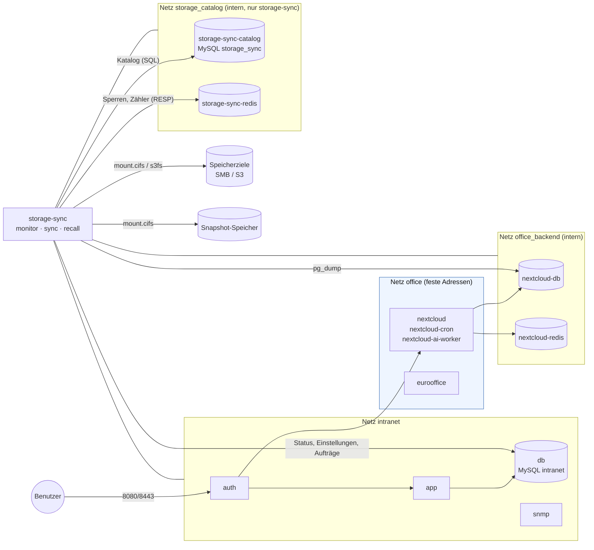
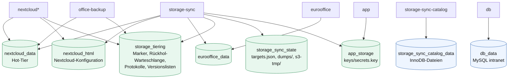
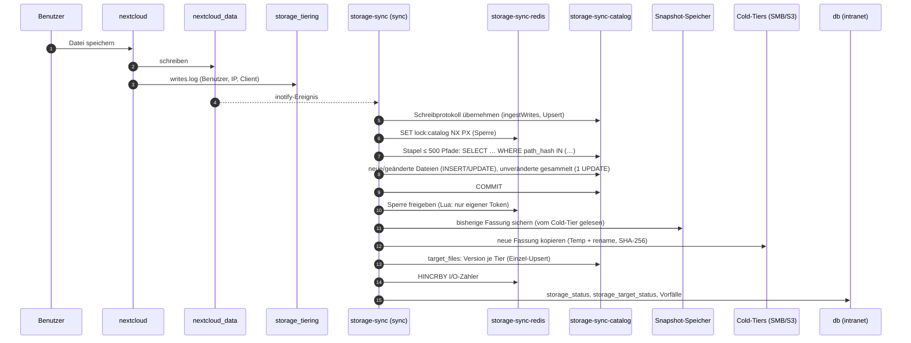
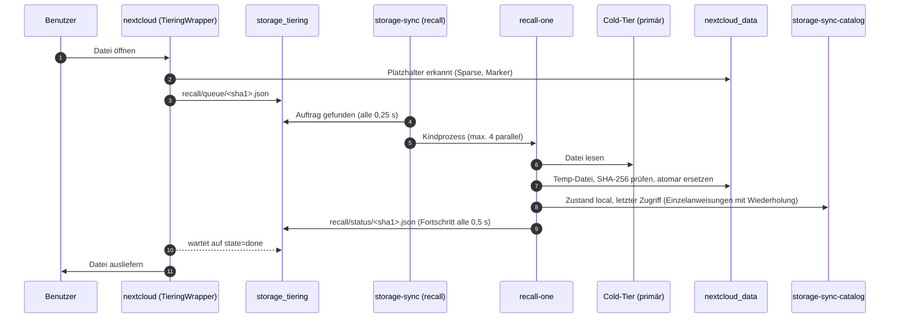
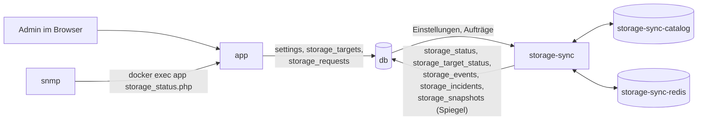
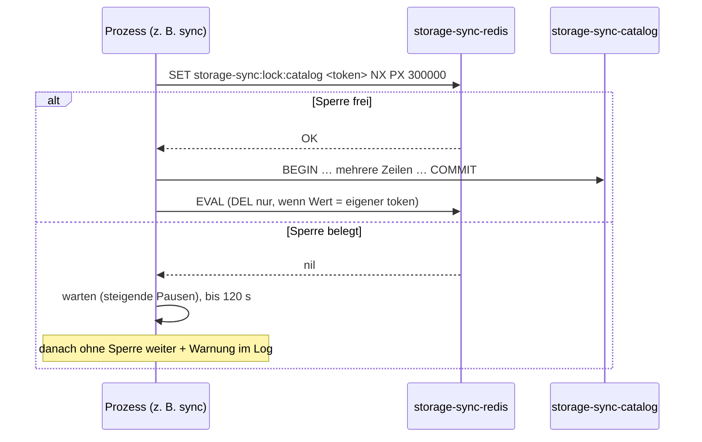
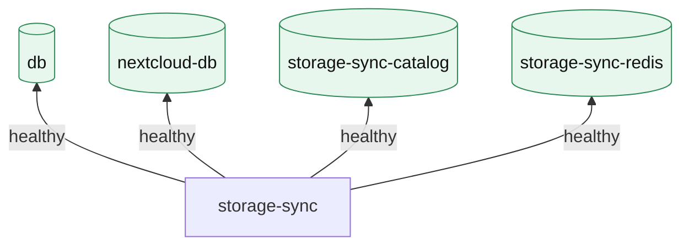
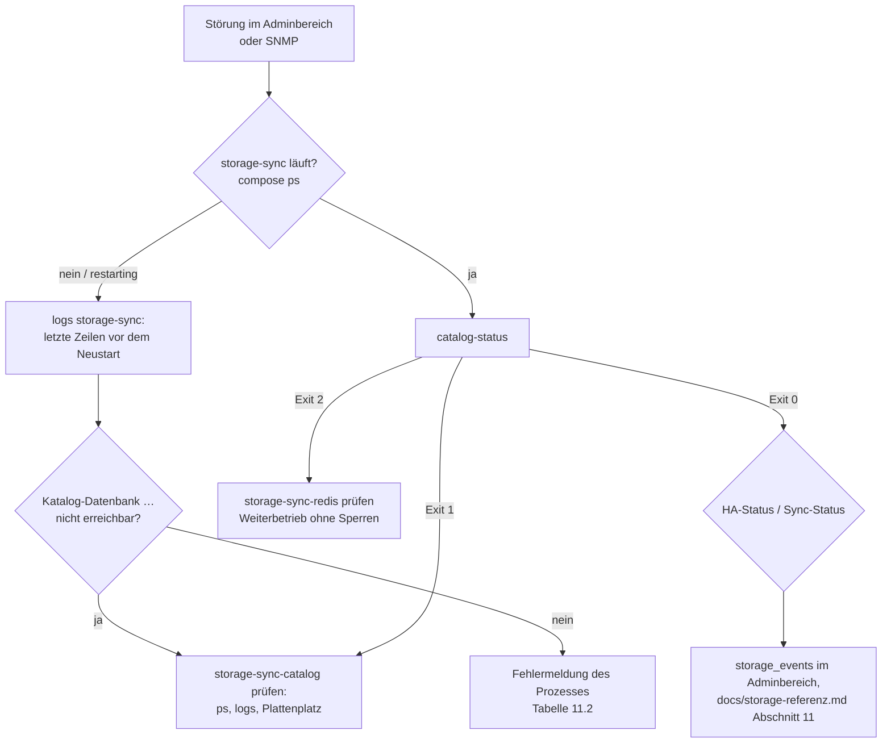
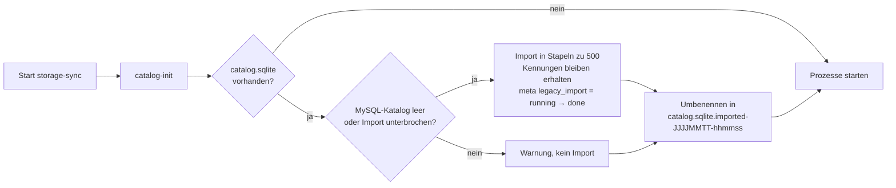

# Storage-Stack – Container, Zusammenspiel, Administration und Fehlersuche

Dieses Dokument beschreibt **alle Container**, die am Speicher-Tiering und an
der HA-Synchronisation beteiligt sind: was jeder Container tut, über welche
Netze und Volumes sie zusammenarbeiten, was beim Ausfall eines Containers
passiert und wie man Störungen findet und behebt.

| Dokument | Inhalt |
| --- | --- |
| [docs/storage.md](storage.md) | Einrichtung und Bedienung (Adminbereich, Regeln, Snapshot-Speicher, SNMP). |
| **docs/storage-stack.md** (dieses) | Container, Netze, Volumes, Datenflüsse, Katalog-Datenbank, Redis-Helfer, Ausfallverhalten, Betriebsbefehle, Fehlersuche. |
| [docs/storage-referenz.md](storage-referenz.md) | Technische Referenz für Entwickler (Code, Formate, Algorithmen, Invarianten, Tests). |

---

## Inhalt

1. [Kurzfassung](#1-kurzfassung)
2. [Container im Überblick](#2-container-im-überblick)
3. [Netze](#3-netze)
4. [Volumes und Datenhaltung](#4-volumes-und-datenhaltung)
5. [Zusammenspiel im Betrieb](#5-zusammenspiel-im-betrieb)
6. [Katalog-Datenbank `storage-sync-catalog`](#6-katalog-datenbank-storage-sync-catalog)
7. [Redis-Helfer `storage-sync-redis`](#7-redis-helfer-storage-sync-redis)
8. [Start, Abhängigkeiten und Healthchecks](#8-start-abhängigkeiten-und-healthchecks)
9. [Ausfallverhalten](#9-ausfallverhalten)
10. [Administration](#10-administration)
11. [Fehlersuche](#11-fehlersuche)
12. [Umstieg vom SQLite-Katalog](#12-umstieg-vom-sqlite-katalog)
13. [Sicherung des Storage-Stacks](#13-sicherung-des-storage-stacks)

---

## 1. Kurzfassung

- **`storage-sync`** ist das Arbeitspferd: Es bindet die Speicherziele ein
  (SMB/S3), kopiert jede Änderung auf alle Cold-Tiers, lagert selten genutzte
  Dateien aus, holt sie bei Zugriff zurück und sichert Vorgängerversionen.
- Der **Katalog** (welche Datei liegt in welcher Version wo) liegt in einer
  eigenen MySQL-Instanz **`storage-sync-catalog`**. Er wird nicht mehr in
  eine SQLite-Datei geschrieben.
- **`storage-sync-redis`** ist ein reiner Helfer ohne eigene Daten: kurze
  Sperren, die Deadlocks zwischen großen Katalog-Transaktionen verhindern,
  und flüchtige I/O-Zähler für MB/s und IOPS.
- Benutzer und Passwörter beider Dienste sind die der Anwendungsdatenbank:
  `DB_USER`, `DB_PASSWORD`, `DB_ROOT_PASSWORD` (Redis: `DB_PASSWORD`).
- Katalog-Datenbank und Redis hängen ausschließlich im internen Netz
  `storage_catalog`. Nur `storage-sync` erreicht sie.
- Die Wahrheit über die Dateien liegt immer in den Volumes und auf den
  Speicherzielen. Der Katalog ist wiederherstellbar (Vollabgleich,
  `snapshot-rebuild`), Redis ist vollständig verzichtbar.

---

## 2. Container im Überblick

Alle Container des Storage-Stacks gehören zum Compose-Profil `office`
(außer `app`, `db` und `snmp`, die immer laufen).

| Container | Image | Rolle im Storage-Stack | Netze | Wichtige Volumes |
| --- | --- | --- | --- | --- |
| **`storage-sync`** | eigenes (`docker/storage-sync/Dockerfile`, `php:8.5-cli` + `cifs-utils`, `s3fs`, `inotify-tools`, `postgresql-client`) | Agent mit den Prozessen `monitor`, `sync`, `recall` (+ je Rückholung ein `recall-one`). Einbinden der Ziele, Synchronisation, Auslagern, Rückholen, Snapshots, DB-Abzug von Nextcloud. | `intranet`, `office_backend`, `storage_catalog` | `nextcloud_data`, `nextcloud_html`, `eurooffice_data`, `storage_tiering`, `storage_sync_state`, `app_storage` |
| **`storage-sync-catalog`** | `mysql:${DB_IMAGE_TAG:-9.7.2}` | Katalog des Agenten: Datei-Bestand, Versionen je Ziel, Lösch-/Umbenennungsaufträge, Zugriffstage, Vorfall-Rohdaten, Snapshot-Vormerkungen, Meta-Werte. | `storage_catalog` (intern) | `storage_sync_catalog_data` |
| **`storage-sync-redis`** | `redis:${STORAGE_SYNC_REDIS_IMAGE_TAG:-7.4.5-alpine}` | Helfer: Sperren (Lease) für Mehrzeilen-Transaktionen, I/O-Zähler. Ohne Persistenz. | `storage_catalog` (intern) | – |
| `db` | `mysql:${DB_IMAGE_TAG:-9.7.2}` | Anwendungsdatenbank `intranet`: Speicherziele, Einstellungen, Status, Messwerte, Vorfälle, Ereignisse, Aufträge aus dem Adminbereich, Spiegel der Versionsliste. | `intranet` | `db_data` |
| `app` | eigenes (`docker/php/Dockerfile`) | Adminbereich **Speicher (HA)**, **Vorfälle**, Versionsliste; SNMP-Prüfskript `storage_status.php`. Legt Aufträge in `storage_requests` ab. | `intranet`, `office`, `office_backend` | `app_storage` (Schlüssel `secrets.key`) |
| `nextcloud` | `nextcloud:${NEXTCLOUD_IMAGE_TAG}` | Liest und schreibt Benutzerdateien im Hot-Tier. Die App `intranet_integration` (`TieringWrapper`) erkennt Platzhalter, stellt Rückhol-Aufträge, schreibt Zugriffs- und Schreibprotokoll. | `office`, `office_backend` | `nextcloud_data`, `nextcloud_html`, `storage_tiering` |
| `nextcloud-cron`, `nextcloud-ai-worker` | wie `nextcloud` | Hintergrundjobs bzw. KI-Aufgaben; greifen über denselben `TieringWrapper` auf Dateien zu. | `office`, `office_backend` | wie `nextcloud` |
| `nextcloud-db` | `postgres` | Nextcloud-Datenbank. `storage-sync` erstellt daraus regelmäßig einen Abzug (`pg_dump -Fc`) und spiegelt ihn auf die Ziele. | `office_backend` (intern) | `nextcloud_db` |
| `nextcloud-redis` | `redis` | Cache/Dateisperren **von Nextcloud** – nicht zu verwechseln mit `storage-sync-redis`. | `office_backend` (intern) | – |
| `eurooffice` | Euro-Office DocumentServer | Schreibt Editor-Daten nach `eurooffice_data` (Quelle `eurooffice-data`, wird gespiegelt, nie ausgelagert). | `office` | `eurooffice_data` |
| `office-backup` | eigenes | Klassische Sicherung (`tar --sparse`) inkl. der Platzhalter-Marker aus `storage_tiering`. | `intranet`, `office_backend` | `nextcloud_data`, `storage_tiering`, … |
| `snmp` | eigenes | Prüft den Speicherzustand per `docker exec app php scripts/storage_status.php …` (Indizes 13–17). | `intranet`, `office` | – |
| `auth` | eigenes | Öffentlicher Eingang (HTTP/HTTPS, SSO) für Intranet und Office. Für den Storage-Stack nur als Weg der Benutzer zu Nextcloud relevant. | `intranet`, `office` | – |

> Der Container `sync` (ohne Präfix) ist der **AD-/Benutzer-Synchronisierer**
> des Intranets und gehört nicht zum Storage-Stack.

### Prozesse in `storage-sync`

| Prozess | Takt | Katalog-Zugriff | Weitere Partner |
| --- | --- | --- | --- |
| `monitor` | alle 5 s | wenig (Meta, z. B. `sparse_supported`) | Ziele (mount), `db` (Status, Messwerte), Redis (I/O-Zähler lesen), `storage_tiering/config.json` |
| `sync` | sofort nach inotify, Vollabgleich nach Einstellung | **Hauptlast**: Erfassen in Stapeln zu 500 Dateien, Übertragungsstand, Auslagern, Snapshots, Vorfallerkennung | Ziele, Snapshot-Speicher, `db`, `nextcloud-db` (Abzug), `storage_tiering` |
| `recall` | alle 0,25 s | Meta (`recalls_*`) | `storage_tiering/recall/*`, startet `recall-one` |
| `recall-one <id>` | je Rückholung, max. 4 parallel | Einzelanweisungen (Zustand, Zugriff) | Ziel lesen, Hot-Tier schreiben |
| Einzelbefehle (`catalog-status`, `restore`, …) | manuell | je nach Befehl | – |

Endet einer der drei Hauptprozesse, beendet sich der Container und Docker
startet ihn neu (`restart: unless-stopped`).

---

## 3. Netze



| Netz | Typ | Teilnehmer | Zweck |
| --- | --- | --- | --- |
| `intranet` | Bridge | `app`, `db`, `auth`, `snmp`, `sync`, `mail`, `office-backup`, **`storage-sync`** | Anwendung und Anwendungsdatenbank. |
| `office` | Bridge, festes Subnetz (`OFFICE_SUBNET`) | `auth`, `app`, `nextcloud*`, `eurooffice`, `snmp` | Öffentlicher Office-Pfad hinter `auth`. |
| `office_backend` | **intern** | `nextcloud*`, `nextcloud-db`, `nextcloud-redis`, `app`, `office-backup`, **`storage-sync`** | Nextcloud-Datenbank und -Cache. |
| `storage_catalog` | **intern** | **`storage-sync`**, **`storage-sync-catalog`**, **`storage-sync-redis`** | Katalog und Redis-Helfer; kein anderer Container und kein Host-Port. |

Ausgehende Verbindungen zu SMB-Freigaben und S3-Endpunkten nimmt
`storage-sync` über das Netz `intranet` (Standard-Route des Hosts).

---

## 4. Volumes und Datenhaltung



| Volume | Wer schreibt | Inhalt | Verlust bedeutet |
| --- | --- | --- | --- |
| `nextcloud_data` | `nextcloud*`, `storage-sync` (Platzhalter, Rückholung) | Hot-Tier der Benutzerdateien | Wiederherstellung aus einem Cold-Tier (`restore`). |
| `storage_tiering` | `nextcloud*`, `storage-sync` | Marker ausgelagerter Dateien, `recall/queue|status`, `access.log`, `writes.log`, `config.json`, `agent.alive`, `snapshots/*` | Platzhalter sind nicht mehr zuordenbar → `restore` ohne `--full` stellt Marker wieder her. |
| `storage_sync_state` | `storage-sync` | `targets.json` (Zielkarte, vom Monitor), `dumps/nextcloud.dump`, `s3-tmp/`; nach dem Umstieg ggf. `catalog.sqlite.imported-*` | Wird beim nächsten Monitor-/Sync-Lauf neu erzeugt. |
| `storage_sync_catalog_data` | `storage-sync-catalog` | Katalog-Datenbank `storage_sync` | Leerer Katalog → nächster Vollabgleich baut ihn neu auf (ohne erneute Übertragung gleicher Dateien), `snapshot-rebuild` stellt die Versionsliste her. |
| `app_storage` | `app` | `keys/secrets.key` (entschlüsselt Zugangsdaten der Ziele) | Zugangsdaten der Ziele müssen neu eingegeben werden. |
| `db_data` | `db` | Einstellungen, Ziele, Status, Vorfälle | Aus der Sicherung des Intranets wiederherstellen. |

Der frühere Pfad `/var/lib/storage-sync/catalog.sqlite` wird nicht mehr
verwendet. Eine dort gefundene Datei wird beim Start einmalig übernommen
(siehe [Abschnitt 12](#12-umstieg-vom-sqlite-katalog)).

---

## 5. Zusammenspiel im Betrieb

### 5.1 Änderung einer Datei bis auf alle Cold-Tiers



### 5.2 Öffnen einer ausgelagerten Datei (Rückholung)



### 5.3 Adminbereich ⇄ Agent

Der Adminbereich (`app`) spricht **nie** direkt mit `storage-sync`,
`storage-sync-catalog` oder `storage-sync-redis`. Er schreibt Einstellungen
und Aufträge in `db` (`settings`, `storage_requests`); der Agent holt sie ab
und meldet Zustand, Messwerte und Ergebnisse in `db` zurück. Die
Versionsliste (`storage_snapshots`) ist ein Spiegel des Katalogs in `db`.



---

## 6. Katalog-Datenbank `storage-sync-catalog`

### 6.1 Warum ein eigener Container

- **Last trennen:** Ein Vollabgleich prüft Hunderttausende Dateien, jede
  Änderung erzeugt mehrere Katalog-Schreibvorgänge. Diese Last bremst die
  Anwendungsdatenbank `db` nicht.
- **Gleichzeitigkeit:** InnoDB sperrt Zeilen statt der ganzen Datei
  (SQLite: ein Schreiber je Datei). `sync`, `recall-one` und der Monitor
  schreiben gleichzeitig.
- **Eigenes Tuning:** Der Katalog ist wiederherstellbar. Daher darf er auf
  Durchsatz statt auf maximale Haltbarkeit eingestellt sein, was für die
  Anwendungsdatenbank nicht gilt.

### 6.2 Verbindung und Zugangsdaten

| Wert | Quelle | Standard |
| --- | --- | --- |
| Host | `STORAGE_CATALOG_DB_HOST` | `storage-sync-catalog` |
| Port | `STORAGE_CATALOG_DB_PORT` | `3306` |
| Datenbank | `STORAGE_CATALOG_DB_NAME` | `storage_sync` |
| Benutzer / Passwort | `DB_USER` / `DB_PASSWORD` (wie `db`) | – |
| Root-Passwort | `DB_ROOT_PASSWORD` (wie `db`) | – |
| Pufferpool | `STORAGE_CATALOG_BUFFER_POOL` | `512M` |

Die Zugangsdaten werden beim **ersten** Start des Volumes
`storage_sync_catalog_data` angelegt (wie beim offiziellen MySQL-Image
üblich). Wird `DB_PASSWORD` später geändert, muss das Passwort auch im
Katalog geändert werden (siehe [10.4](#104-passwort-ändern)).

Die Sitzung des Agenten setzt `READ COMMITTED`, `innodb_lock_wait_timeout = 60`
und einen strikten `sql_mode`. Eine Datei-SQLite als Katalog lehnt der
Agent ab.

### 6.3 Tabellen

| Tabelle | Schlüssel | Inhalt | Hauptschreiber |
| --- | --- | --- | --- |
| `files` | `id`; eindeutig `(source, path_hash)` | Bestand aller Quellen: Größe, mtime, Inode, Version, SHA-256, Zustand `local`/`evicted`, letzter Zugriff, Generation `seen` | `sync`, `recall-one` |
| `target_files` | `(target_id, file_id)` | Welche Version liegt auf welchem Cold-Tier (und auf welchem Ziel des Tiers) | `sync` |
| `ops` | `id`; `(target_id, id)` | Ausstehende Lösch-/Umbenennungsaufträge je Tier | `sync` |
| `access` | `(file_id, day)` | Zugriffstage (31 Tage) | `sync` (aus `access.log`) |
| `meta` | `name` | Generation, Modus, Sperren, Zeitstempel, `schema_version`, `legacy_import` | alle |
| `activity`, `writes`, `clients` | `id` / `path_hash` / `client_hash` | Rohdaten der Vorfallerkennung (24 h) | `sync` |
| `snapshots` | `id`; eindeutig `uid` | Vormerkungen und gesicherte Vorgängerversionen | `sync` |

Pfade werden **bytegenau** als `VARBINARY` gespeichert (auch Dateinamen, die
kein gültiges UTF-8 sind). Gesucht wird nie über den Pfad selbst, sondern
über `path_hash = SHA-256(path)` (32 Byte, fester, kurzer Index).

### 6.4 Leistung bei vielen gleichzeitigen Ereignissen

| Maßnahme | Wirkung |
| --- | --- |
| Erfassen in **Stapeln zu 500 Dateien**: ein `SELECT … IN (…)` zum Laden, eine Transaktion zum Schreiben, unveränderte Dateien mit **einem** `UPDATE … IN (…)` | Statt 3 Anweisungen je Datei wenige je Stapel; kurze Transaktionen. |
| Fester Hash-Index `(source, path_hash)` statt langer Pfad-Indizes | Kleine B-Bäume, passen in den Pufferpool, keine 3072-Byte-Indexgrenze. |
| Upserts (`INSERT … ON DUPLICATE KEY UPDATE`) statt „lesen, dann schreiben“ | Keine Wettläufe zwischen Prozessen, ein Roundtrip. |
| `READ COMMITTED` | Keine Gap-Locks → deutlich weniger Sperrkonflikte bei Einfügungen. |
| I/O-Zähler in Redis statt in einer Katalogzeile | Die früher am stärksten umkämpfte Zeile (`counters`) gibt es nicht mehr. |
| Mehrzeilen-Transaktionen nacheinander (Redis-Sperre) | Keine Deadlocks zwischen großen Transaktionen ([Abschnitt 7](#7-redis-helfer-storage-sync-redis)). |
| Automatische Wiederholung bei Deadlock/Lock-Timeout (1213/1205, bis 5×) für Einzelanweisungen und reine DB-Transaktionen | Kurze Konflikte mit `recall-one` sind für den Ablauf unsichtbar. |
| Zwischengespeicherte Prepared Statements (max. 128 je Verbindung) | Weniger Parse-Aufwand bei Millionen gleichartiger Anweisungen. |
| `TRUNCATE` statt `DELETE` beim Katalog-Reset (`restore`) | Kein Undo-Log für Millionen Zeilen. |

### 6.5 Server-Einstellungen (`docker/storage-sync-catalog/my.cnf`)

| Einstellung | Wert | Begründung |
| --- | --- | --- |
| `innodb_buffer_pool_size` | `STORAGE_CATALOG_BUFFER_POOL` (512M) | Faustregel ≈ 1 GB je 2 Mio. Dateien im Katalog. |
| `disable_log_bin` | – | Keine Replikation; spart einen zweiten Schreibvorgang je Commit. |
| `innodb_flush_log_at_trx_commit` | `2` | Redo-Log einmal pro Sekunde auf Platte. Bei einem Absturz des Hosts gehen höchstens ~1 s Katalogänderungen verloren; der nächste Abgleich holt sie nach. |
| `innodb_redo_log_capacity` | `1G` | Weniger Checkpoints bei Schreibspitzen. |
| `innodb_flush_method` | `O_DIRECT` | Kein doppeltes Puffern im Seitencache des Hosts. |
| `innodb_io_capacity(_max)` | `2000` / `4000` | Für SSDs; auf HDD-Hosts ggf. senken. |
| `transaction_isolation` | `READ-COMMITTED` | Siehe 6.4. |
| `innodb_autoinc_lock_mode` | `2` | Keine Tabellensperre für Auto-Increment bei Mehrzeilen-Inserts. |
| `innodb_print_all_deadlocks` | `ON` | Jeder Deadlock steht im Log des Containers (Fehlersuche). |
| `max_connections` | `64` | Bedarf: 3 Prozesse + bis 4 `recall-one` + Einzelbefehle. |

---

## 7. Redis-Helfer `storage-sync-redis`

### 7.1 Aufgaben

| Schlüssel | Typ | Zweck |
| --- | --- | --- |
| `storage-sync:lock:catalog` | String mit Ablaufzeit (Lease 300 s) | Sperre für Katalog-Transaktionen über mehrere Zeilen (Erfassen eines Stapels, Löschungen, Wiederherstellung, Import). |
| `storage-sync:lock:catalog-schema` | String mit Ablaufzeit | Sperre für das Anlegen/Ändern des Schemas beim Start. |
| `storage-sync:counters` | Hash, Felder `<ziel>:rb|wb|ro|wo` | Kumulierte Lese-/Schreib-Bytes und -Operationen je Ziel (`0` = Hot-Tier, `-1` = Snapshot-Speicher). Grundlage für MB/s und IOPS. |

Redis hält **keine** Daten, die nicht verloren gehen dürfen: keine
Persistenz (`save ""`, `appendonly no`), `maxmemory 64mb`. Das Passwort ist
`DB_PASSWORD`; es steht nur in einer Konfigurationsdatei im Container, nicht
in der Prozessliste.

### 7.2 Ablauf einer gesperrten Transaktion



- **Einzelanweisungen** (z. B. `recall-one` setzt den Zustand einer Datei)
  brauchen keine Sperre. Sie betreffen eine Zeile, können keinen Deadlock
  mit einer anderen Einzelanweisung bilden und werden bei einem Konflikt mit
  einer Transaktion automatisch wiederholt.
- Die Sperre ist **wiedereintrittsfähig** im selben Prozess (verschachtelte
  Transaktionen nehmen sie nicht erneut).
- Stirbt ein Prozess mit gehaltener Sperre, gibt Redis sie spätestens nach
  der Lease-Zeit (300 s) frei.

### 7.3 Ohne Redis

Ist Redis nicht erreichbar, arbeitet der Agent weiter:

- Sperren entfallen für 30 s, danach neuer Verbindungsversuch. In dieser Zeit
  ist der Katalog durch InnoDB-Zeilensperren weiter konsistent; nur
  gleichzeitige große Transaktionen könnten in einen Deadlock laufen (InnoDB
  bricht dann eine ab; der nächste Durchlauf wiederholt sie). Da nur der
  Prozess `sync` große Transaktionen ausführt, ist das im Betrieb praktisch
  ausgeschlossen.
- I/O-Zähler gehen verloren → MB/s und IOPS (vor allem S3-Ziele) zeigen
  kurzzeitig `0`. Ein Zurücksetzen der Zähler (Redis-Neustart) wird von der
  Ratenberechnung erkannt und nicht als negative Rate angezeigt.
- Im Log erscheint `Redis storage-sync-redis:6379 nicht erreichbar (…) - Katalog arbeitet vorerst ohne Redis-Helfer.`

---

## 8. Start, Abhängigkeiten und Healthchecks



| Container | Healthcheck |
| --- | --- |
| `storage-sync-catalog` | `mysqladmin ping` als root, alle 10 s, Startfrist 30 s |
| `storage-sync-redis` | `redis-cli ping` mit Passwort, alle 10 s |
| `storage-sync` | `agent.alive` (vom Prozess `recall`) jünger als 30 s |

Ablauf in `docker/storage-sync/entrypoint.sh`:

1. Verzeichnisse und `/dev/fuse` vorbereiten, `s3-tmp/` leeren.
2. Auf die Anwendungsdatenbank `db` warten (bis 120 s).
3. **`storage_sync.php catalog-init`** wiederholen, bis es gelingt (bis
   180 s): Verbindung zur Katalog-Datenbank, Schema anlegen bzw.
   aktualisieren, alten SQLite-Katalog einmalig übernehmen. Gelingt das
   nicht, beendet sich der Container mit
   `Katalog-Datenbank (storage-sync-catalog) nicht erreichbar - Abbruch.`
   und Docker versucht es erneut.
4. `monitor`, `sync`, `recall` starten. Endet einer, endet der Container.

---

## 9. Ausfallverhalten

| Fällt aus … | Auswirkung | Daten in Gefahr? | Erholung |
| --- | --- | --- | --- |
| `storage-sync` | Keine Synchronisation, keine Rückholung (Nextcloud meldet nach dem Zeitlimit 503 für ausgelagerte Dateien), HA-Status `critical` („meldet sich nicht“). Lokale Dateien bleiben nutzbar. | Nein | Automatischer Neustart; Rückstand wird nachgeholt. |
| `storage-sync-catalog` | Prozesse in `storage-sync` scheitern an Katalog-Zugriffen, protokollieren den Fehler und versuchen es alle 5 s neu (Container bleibt oben). Kein Sync, keine Rückholung. Beim Neustart von `storage-sync` wartet der Entrypoint bis 180 s. | Nein (Wahrheit liegt in den Volumes/Zielen) | Container starten; ggf. `catalog-status`. |
| Volume `storage_sync_catalog_data` verloren | Leerer Katalog. Nächster Vollabgleich erfasst alles neu; gleiche Dateien auf den Zielen werden übernommen (`adopted`), Platzhalter über Marker erkannt. Erstabgleich löst keine Vorfälle aus. | Nein | `snapshot-rebuild` für die Versionsliste. |
| `storage-sync-redis` | Weiterbetrieb ohne Sperren und mit Zählern auf 0 (Abschnitt 7.3). | Nein | Container starten; nichts weiter nötig. |
| `db` | Agent pausiert Status-/Einstellungszugriffe (Wiederholung alle 5 s); Adminbereich nicht verfügbar. | Nein | `db` starten. |
| `nextcloud-db` | Kein DB-Abzug; Nextcloud selbst nicht verfügbar. | Nein | – |
| Ein Speicherziel | HA `degraded`; die übrigen Tiers werden weiter bedient, Auslagern pausiert (Dateien müssen auf allen aktiven Zielen liegen). | Nein | Ziel wieder erreichbar → Rückstand wird übertragen. |
| Snapshot-Speicher | Nur Dateien, deren Vorgängerversion gesichert werden muss, werden zurückgehalten (bis 24 h). | Nein | Freigabe wieder erreichbar → Sicherung läuft weiter. |

---

## 10. Administration

### 10.1 Zustand prüfen

```bash
# Erreichbarkeit und Umfang von Katalog und Redis (Exit 0 = alles gut,
# 1 = Katalog nicht erreichbar, 2 = Redis nicht erreichbar)
docker compose exec storage-sync php scripts/storage_sync.php catalog-status

# Gesundheit aller beteiligten Container
docker compose --profile office ps storage-sync storage-sync-catalog storage-sync-redis

# Protokolle
docker compose --profile office logs -f storage-sync
docker compose --profile office logs --tail=200 storage-sync-catalog   # u. a. jeder Deadlock
```

Beispielausgabe von `catalog-status`:

```
Redis-Helfer  storage-sync-redis:6379  erreichbar
Katalog       storage-sync-catalog:3306/storage_sync  erreichbar (Schema 1)
Dateien       1234 (Hot-Tier 1234, ausgelagert 0)
Snapshots     0 gesichert, 0 ausstehend, 0 fehlgeschlagen
Generation    7, letzter Vollabgleich –
```

### 10.2 Katalog per SQL ansehen

```bash
# Interaktive Sitzung (Passwort = DB_PASSWORD)
docker compose exec storage-sync-catalog sh -c 'mysql -u"$MYSQL_USER" -p"$MYSQL_PASSWORD" "$MYSQL_DATABASE"'
```

```sql
-- Meta-Werte (Generation, Modus, Sperre, Pausiert …)
SELECT name, CAST(value AS CHAR) AS value FROM meta ORDER BY name;

-- Datei suchen (Pfade sind binär gespeichert)
SELECT id, source, CAST(path AS CHAR) AS path, size, version, state, FROM_UNIXTIME(last_access)
  FROM files WHERE source = 'nextcloud-data' AND path_hash = UNHEX(SHA2('alice/files/plan.docx', 256));

-- Rückstand eines Cold-Tiers (Dateien, deren aktuelle Version dort fehlt; 3 = Kennung des Basisziels)
SELECT COUNT(*) FROM files f
 WHERE NOT EXISTS (SELECT 1 FROM target_files t
                    WHERE t.target_id = 3 AND t.file_id = f.id AND t.version = f.version);

-- Größe der Tabellen
SELECT table_name, table_rows, ROUND((data_length + index_length) / 1048576) AS mb
  FROM information_schema.tables WHERE table_schema = DATABASE();

-- Aktuelle Sperrkonflikte
SELECT * FROM performance_schema.data_lock_waits\G
```

Nur lesen. Änderungen am Katalog von Hand sind nie nötig. Für einen
Neuaufbau gibt es `restore`, für die Versionsliste `snapshot-rebuild`.

### 10.3 Redis ansehen

```bash
docker compose exec storage-sync-redis sh -c 'REDISCLI_AUTH="$REDIS_PASSWORD" redis-cli'
```

```
KEYS storage-sync:*                       # wenige Schlüssel, KEYS ist hier unbedenklich
PTTL storage-sync:lock:catalog            # Restlaufzeit einer gehaltenen Sperre (ms), -2 = frei
HGETALL storage-sync:counters             # I/O-Zähler je Ziel
INFO memory
```

Eine **hängende Sperre** (Prozess abgestürzt) läuft nach spätestens 300 s
ab. Sofort freigeben: `DEL storage-sync:lock:catalog` – nur, wenn
`storage-sync` gestoppt ist oder sicher keine Transaktion läuft.

### 10.4 Passwort ändern

`DB_PASSWORD` gilt für `db`, `storage-sync-catalog` und `storage-sync-redis`.
Redis übernimmt ein neues Passwort beim nächsten Start automatisch. In den
beiden MySQL-Instanzen muss es von Hand geändert werden, da das Image es nur
beim ersten Start setzt:

```bash
# 1. Im Katalog (und analog in db) als root anmelden – noch mit dem alten Root-Passwort:
docker compose exec storage-sync-catalog sh -c 'mysql -uroot -p"$MYSQL_ROOT_PASSWORD"'
```

```sql
ALTER USER 'intranet'@'%' IDENTIFIED BY '<neues DB_PASSWORD>';   -- Benutzer = DB_USER
```

```bash
# 2. Neues Passwort in .env eintragen und die Container neu erstellen
docker compose --profile office up -d storage-sync-redis storage-sync-catalog storage-sync app
```

### 10.5 Pufferpool anpassen

`STORAGE_CATALOG_BUFFER_POOL=2G` in `.env`, danach
`docker compose --profile office up -d storage-sync-catalog`. Richtwert:
Größe von `files` + `target_files` + Indizes (Abfrage in 10.2) plus 25 %.

### 10.6 Katalog neu aufbauen

Nur bei Verdacht auf einen inkonsistenten Katalog (z. B. nach Ausfall des
Volumes):

```bash
docker compose --profile office stop storage-sync
docker compose --profile office rm -sf storage-sync-catalog
docker volume rm <projekt>_storage_sync_catalog_data
docker compose --profile office up -d storage-sync          # startet Katalog mit, legt Schema an
docker compose exec storage-sync php scripts/storage_sync.php snapshot-rebuild
```

Der nächste Vollabgleich erfasst den Bestand neu. Gleiche Dateien auf den
Zielen werden nicht erneut übertragen.

---

## 11. Fehlersuche

### 11.1 Vorgehen



### 11.2 Symptome

| Symptom | Ursache | Abhilfe |
| --- | --- | --- |
| `storage-sync` startet ständig neu, Log: `Katalog-Datenbank (storage-sync-catalog) nicht erreichbar - Abbruch.` | Katalog-Container läuft nicht, ist nicht `healthy` oder nicht im Netz `storage_catalog`. | `docker compose --profile office ps storage-sync-catalog`, `logs storage-sync-catalog`. Volume voll? |
| `SQLSTATE[HY000] [1045] Access denied for user …` | `DB_PASSWORD`/`DB_USER` in `.env` weicht vom Stand bei der Erstanlage des Katalog-Volumes ab. | Passwort im Katalog anpassen (10.4). Hinweis: Das offizielle MySQL-Image legt Passwörter mit `\` nicht korrekt an – keine Backslashes in `DB_PASSWORD` verwenden. |
| `SQLSTATE[HY000] [2002] … getaddrinfo` / `Connection refused` | Katalog-Container fehlt (Profil `office` nicht aktiv) oder startet noch. | `docker compose --profile office up -d storage-sync-catalog`. |
| `Unknown database 'storage_sync'` | `STORAGE_CATALOG_DB_NAME` nach der Erstanlage geändert. | Alten Namen wieder eintragen oder Katalog neu aufbauen (10.6). |
| `catalog-status` Exit 2, Log: `Redis … nicht erreichbar (…) - Katalog arbeitet vorerst ohne Redis-Helfer.` | `storage-sync-redis` gestoppt, Passwort geändert ohne Neustart von Redis. | `docker compose --profile office up -d storage-sync-redis`. Weiterbetrieb ist bis dahin gesichert. |
| Log: `Katalogsperre „catalog“ nach 120 s nicht frei - fahre ohne Sperre fort.` | Eine sehr lange Transaktion (riesiger Stapel, langsame Platte) oder ein abgestürzter Prozess hält die Sperre. | `PTTL storage-sync:lock:catalog` (10.3); Katalog-Log auf langsame Abfragen prüfen; ggf. Pufferpool erhöhen. |
| `Deadlock found when trying to get lock` im Agenten-Log | Nur ohne Redis zu erwarten (zwei große Transaktionen gleichzeitig). | Redis prüfen. Der Durchlauf wird automatisch wiederholt. Details: `logs storage-sync-catalog` (`innodb_print_all_deadlocks`). |
| `Lock wait timeout exceeded` | Eine Transaktion hält Zeilen > 60 s, meist eine langsame Platte unter dem Katalog-Volume. | I/O des Hosts prüfen (`iostat`), `innodb_io_capacity` senken, Volume auf SSD legen. |
| MB/s und IOPS kurz `0` | Redis wurde neu gestartet (Zähler flüchtig). | Keine; nach zwei Monitor-Durchläufen (10 s) wieder korrekt. |
| Synchronisation langsam, Katalog-CPU hoch | Pufferpool zu klein (viele Plattenlesezugriffe). | `SHOW ENGINE INNODB STATUS\G` → *Buffer pool hit rate* < 990/1000 ⇒ `STORAGE_CATALOG_BUFFER_POOL` erhöhen (10.5). |
| Log beim Start: `Alter SQLite-Katalog gefunden, MySQL-Katalog ist bereits gefüllt – nicht übernommen` | Eine alte `catalog.sqlite` wurde in `storage_sync_state` zurückkopiert. | Nichts zu tun – die Datei wurde als `catalog.sqlite.imported-<zeit>` abgelegt und kann gelöscht werden. |
| `Der Katalog ist nicht leer - Import alter Daten abgebrochen.` | Manueller Import in einen gefüllten Katalog. | Kein Handlungsbedarf; der MySQL-Katalog ist führend. |

Weitere, nicht katalogbezogene Symptome (Ziele `invalid`, Massenlöschsperre,
Vorfälle, Snapshot-Speicher) stehen in
[docs/storage-referenz.md, Abschnitt 11](storage-referenz.md#11-fehlersuche-und-betriebsbefehle).

---

## 12. Umstieg vom SQLite-Katalog

Ältere Installationen hielten den Katalog in
`/var/lib/storage-sync/catalog.sqlite` (Volume `storage_sync_state`). Der
Umstieg geschieht automatisch:



1. `docker compose --profile office up -d --build storage-sync` – Compose
   startet `storage-sync-catalog` und `storage-sync-redis` mit.
2. Im Log erscheint
   `Übernehme alten SQLite-Katalog nach MySQL (storage-sync-catalog) …` und
   danach die übernommenen Zeilen je Tabelle.
3. Wird der Import unterbrochen (Neustart), verwirft der nächste Start den
   Teilstand und importiert erneut (`meta.legacy_import = running`).
4. Die alte Datei bleibt als `catalog.sqlite.imported-<zeit>` liegen. Sie
   kann nach einer Prüfung mit `catalog-status` gelöscht werden:
   `docker compose exec storage-sync sh -c 'rm /var/lib/storage-sync/catalog.sqlite.imported-*'`.

Nicht übernommen werden die alten I/O-Zähler (flüchtig, jetzt in Redis).

---

## 13. Sicherung des Storage-Stacks

| Bestandteil | Gesichert durch | Bemerkung |
| --- | --- | --- |
| Benutzerdateien, Nextcloud-Konfiguration, Euro-Office-Daten, Nextcloud-DB-Abzug | Speicherziele (jede Cold-Tier-Kopie), zusätzlich `office-backup` | Wiederherstellung: [docs/storage.md, Abschnitt 7](storage.md#7-sicherung-und-wiederherstellung). |
| Vorgängerversionen | Snapshot-Speicher (`meta.json` je Version) | Katalogtabelle `snapshots` per `snapshot-rebuild` wiederherstellbar. |
| Marker ausgelagerter Dateien | `office-backup` (`storage-tiering.tar`), Kopien auf den Zielen | – |
| Einstellungen, Ziele, Status | Sicherung der Anwendungsdatenbank `db` | – |
| Katalog `storage-sync-catalog` | **bewusst nicht gesichert** | Vollständig aus Volumes und Zielen rekonstruierbar (10.6). Eine Sicherung wäre sofort veraltet. |
| `storage-sync-redis` | – | Enthält nur flüchtige Sperren und Zähler. |
