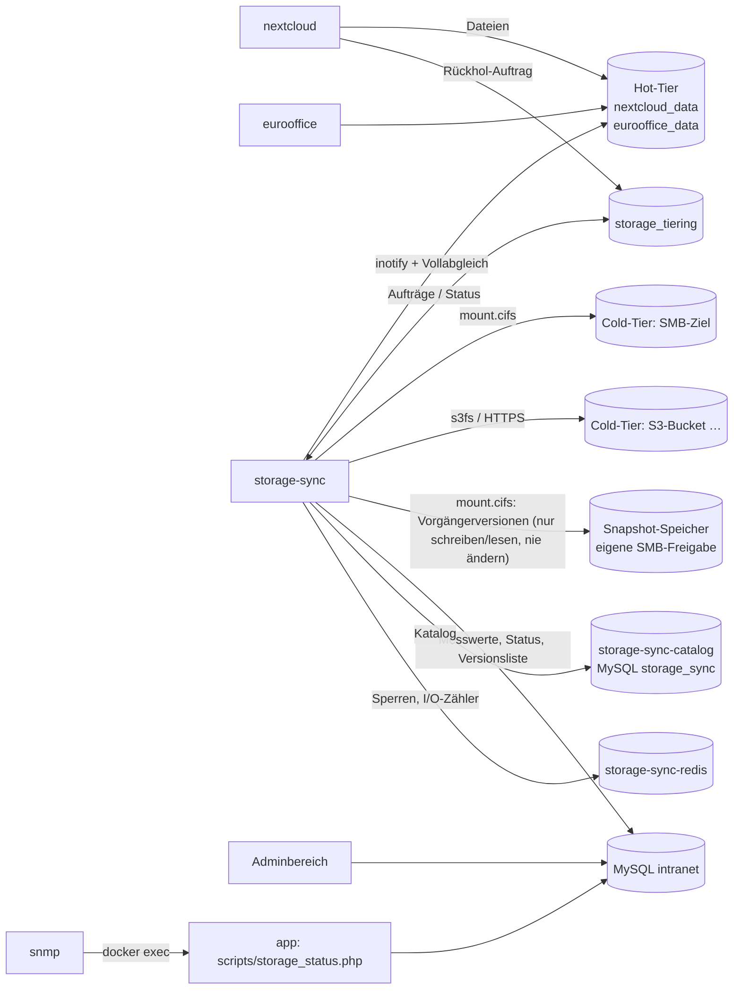
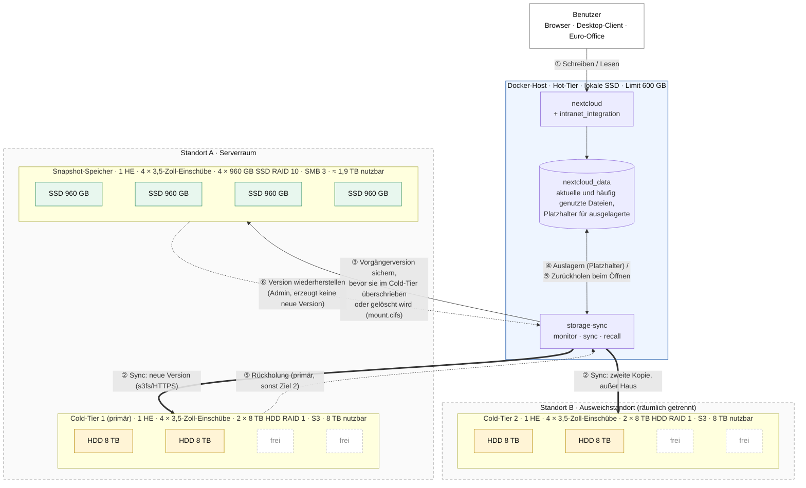

# Speicher-Tiering und HA-Synchronisation (Nextcloud + Euro-Office)

Die Daten von Nextcloud und Euro-Office liegen nicht mehr nur im Volume des
jeweiligen Containers. Im Adminbereich unter **Speicher (HA)**
(`/admin/speicher-ha`) werden SMB-Freigaben per UNC-Pfad und/oder Buckets
S3-kompatibler Objektspeicher (MinIO, Ceph RGW, NetApp StorageGRID, AWS S3,
Wasabi …) als Speicherziele eingebunden. Jedes
Speicherziel enthält eine vollständige Kopie aller Daten. Der Container
`storage-sync` übernimmt Einbindung, Synchronisation, Auslagerung und
Rückholung.

| Begriff | Bedeutung |
| --- | --- |
| **Hot-Tier (lokales Storage)** | Volumes `nextcloud_data` und `eurooffice_data` auf dem Docker-Host. Cache für häufig und kürzlich genutzte Dateien. |
| **Cold-Tier (SMB-/S3-Tier)** | Alle eingetragenen Speicherziele, SMB-Freigaben und S3-Buckets beliebig gemischt. Jeder Cold-Tier (eine Kachel, z. B. „Cold-Tier 1“) hält den **vollständigen** Datenbestand und kann bei Platzmangel um weitere Ziele derselben Art erweitert werden ([Abschnitt 4a](#4a-cold-tiers-erweitern-mehr-kapazität)). |
| **Snapshot-Speicher (Dateiversionen)** | Eine eigene, von den Speicherzielen getrennte SMB-Freigabe. Vor jeder inhaltlichen Änderung oder Löschung einer Benutzerdatei wird die **bisherige Version unveränderlich** dort abgelegt ([Abschnitt 5a](#5a-snapshot-speicher-dateiversionen-auf-eigener-smb-freigabe)). |

Dieses Dokument beschreibt Einrichtung und Betrieb. Welche Container
beteiligt sind, wie sie zusammenspielen (Netze, Volumes, Katalog-Datenbank
`storage-sync-catalog`, Redis-Helfer `storage-sync-redis`), was bei einem
Ausfall passiert und wie Störungen gefunden werden, beschreibt
[docs/storage-stack.md](storage-stack.md). Die technische Referenz
für Entwickler und Coding-Agenten (Code-Landkarte, Prozesse, Datenformate,
Algorithmen, Invarianten, Tests, Änderungsrezepte, Fehlersuche) steht in
[docs/storage-referenz.md](storage-referenz.md).

---

## 1. Einrichtung

Voraussetzung ist das Profil `office` ([docs/office.md](office.md)).

```bash
docker compose --profile office up -d --build storage-sync
```

1. Adminbereich → **Speicher (HA)** → **Speicherziel hinzufügen**.
2. Bezeichnung und **Art** des Ziels wählen:
   - **SMB-Freigabe:** UNC-Pfad (`\\server\freigabe\pfad`), Benutzername,
     Domäne, Kennwort und SMB-Version (automatisch, 3.1.1, 3.0, 2.1).
   - **S3-kompatibler Objektspeicher:** siehe [Abschnitt 1a](#1a-s3-kompatible-objektspeicher).

   Ein Ziel kann als **primär** markiert werden. Von dort holt der Dienst
   Dateien bevorzugt zurück.
3. Weitere Ziele (zweites NAS, anderer Standort …) genauso hinzufügen. Jedes
   aktive Ziel erhält eine vollständige Kopie.
4. Unter **Einstellungen** „Daten im Cold-Tier (SMB-/S3-Tier) ablegen“ und
   „Speicher-Tiering: selten genutzte Dateien aus dem Hot-Tier auslagern“
   setzen.

Beim ersten Einbinden legt `storage-sync` im Ziel die Datei
`.lanpa-storage.json` mit der Instanz-ID dieser Installation an. Enthält eine
Freigabe bereits Daten einer anderen Installation, wird sie nicht beschrieben.
So überschreiben sich zwei Installationen nicht gegenseitig.

Aufbau eines Speicherziels:

```
\\server\freigabe\pfad\
  .lanpa-storage.json
  nextcloud-data\      Benutzerdateien, Versionen, Papierkorb, appdata
  nextcloud-config\    config.php u. a.
  nextcloud-db\        PostgreSQL-Abzug (pg_dump -Fc), Intervall einstellbar
  eurooffice-data\     Daten des DocumentServers
```

Bei S3-Zielen liegt derselbe Aufbau als Objektschlüssel unter
`<bucket>/<präfix>/`, z. B. `lanpa-cold/intranet/nextcloud-data/…`.

### 1a. S3-kompatible Objektspeicher

`storage-sync` bindet einen Bucket per [s3fs](https://github.com/s3fs-fuse/s3fs-fuse)
(FUSE) unter `/mnt/targets/<id>` ein. Synchronisation, Rückholung,
Vorfallschutz (schreibgeschütztes Einbinden) und Wiederherstellung arbeiten
dadurch genau wie bei SMB-Zielen.

| Feld | Bedeutung |
| --- | --- |
| Endpunkt | `https://host[:port]`, z. B. `https://s3.eu-central-1.amazonaws.com` oder `https://minio.firma.local:9000`. Nur Schema, Host und Port. |
| Region | Signaturregion, z. B. `eu-central-1`. Bei MinIO/Ceph meist `us-east-1` oder leer. |
| Bucket | Bestehender Bucket (wird nicht angelegt). |
| Präfix | Optionaler Unterordner im Bucket, z. B. `intranet/prod`. So können mehrere Installationen einen Bucket teilen. |
| Kapazität (GB) | Optionales Kontingent für Füllstand, Hochrechnung und SNMP. `0` = ohne Grenze. |
| Access Key ID / Secret Access Key | Zugangsdaten. Das Secret wird verschlüsselt gespeichert und beim Bearbeiten nur bei Eingabe ersetzt. |
| Pfad-Adressierung | `https://host/bucket` statt `https://bucket.host` – für MinIO, Ceph und die meisten lokalen Objektspeicher aktiv lassen. |
| TLS-Zertifikat prüfen | Nur für Tests mit selbstsignierten Zertifikaten abschalten. |

Hinweise:

- Ein Objektspeicher meldet keine Größe. Der Füllstand ergibt sich aus der
  synchronisierten Datenmenge und der eingetragenen Kapazität. Ohne Kapazität
  zeigt der Adminbereich „Objektspeicher ohne Kapazitätsgrenze“ und
  `storage_cold_fill` wertet das Ziel nicht als „voll“.
- Die Erreichbarkeit prüft `monitor` per Verzeichnisauflistung (ein
  `ListObjects` je Prüfzyklus). MB/s und IOPS stammen aus den Zählern des
  Agenten statt aus der CIFS-Statistik.
- Der Container benötigt `/dev/fuse`. Der Entrypoint legt das Gerät an; die
  Freigabe erfolgt in `docker-compose.yml` über
  `device_cgroup_rules: ["c 10:229 rwm"]`. Ohne FUSE-Modul auf dem Host
  starten SMB-Ziele weiterhin, nur S3-Ziele melden einen Fehler.
- Uploads werden in `/var/lib/storage-sync/s3-tmp` (Volume
  `storage_sync_state`) zwischengespeichert. Dort muss Platz für die größte
  Einzeldatei sein.
- Mindestrechte des Schlüssels auf den Bucket bzw. das Präfix:
  `s3:ListBucket`, `s3:GetObject`, `s3:PutObject`, `s3:DeleteObject`.

---

## 2. Architektur



`storage-sync` startet drei Prozesse. Endet einer davon, startet Docker den
Container neu, und der Healthcheck schlägt fehl.

| Prozess | Aufgabe |
| --- | --- |
| `monitor` | Bindet die Ziele ein bzw. neu ein und misst Füllstand, MB/s und IOPS (Hot-Tier über `/proc/diskstats`, Cold-Tier über die CIFS-Statistik, bei S3 über die Zähler des Agenten). Ermittelt den HA-Status und schreibt Messwerte und Verlauf in die Datenbank. |
| `sync` | Erkennt Änderungen sofort (inotify) und gleicht zusätzlich in festem Abstand vollständig ab. Kopiert neue oder geänderte Dateien auf **alle** aktiven Ziele (temporäre Datei, danach Umbenennen, SHA-256-Prüfung) und übernimmt Umbenennungen und Löschungen. Sichert vorher die bisherige Version auf dem Snapshot-Speicher, führt Wiederherstellungen aus und räumt Versionen nach Aufbewahrungsregel auf. Erstellt den Datenbank-Abzug und lagert Dateien aus. |
| `recall` | Holt ausgelagerte Dateien auf Anforderung von Nextcloud zurück, mehrere parallel, mit Fortschritt. |

Der **Katalog** (Datei-Bestand, Versionen je Ziel, Aufträge, Zugriffe,
Vorgängerversionen) liegt in einer eigenen MySQL-Instanz
**`storage-sync-catalog`** (Volume `storage_sync_catalog_data`, Zugangsdaten
wie die Anwendungsdatenbank: `DB_USER`/`DB_PASSWORD`/`DB_ROOT_PASSWORD`).
**`storage-sync-redis`** verhindert mit kurzen Sperren Deadlocks zwischen
großen Katalog-Transaktionen und hält die I/O-Zähler; er speichert nichts
dauerhaft. Beide sind nur über das interne Netz `storage_catalog` von
`storage-sync` aus erreichbar und starten mit dem Profil `office`
automatisch. Ein alter SQLite-Katalog wird beim ersten Start übernommen.
Einzelheiten: [docs/storage-stack.md](storage-stack.md).

Zielkarte, DB-Abzug und S3-Zwischenspeicher liegen im Volume
`storage_sync_state`. Auslagerungsmarker, Rückhol-Warteschlange und die veröffentlichte
Versionsliste je Datei liegen im Volume `storage_tiering`, das auch in
`nextcloud` und `nextcloud-ai-worker` unter `/var/lib/lanpa-tiering`
eingebunden ist.

### Beispielarchitektur

Ein typischer Aufbau für einen Standort mit Ausweichstandort: ein kleiner,
schneller Hot-Tier auf dem Docker-Host, zwei räumlich getrennte Cold-Tier-
Ziele als S3-Objektspeicher und ein eigener Snapshot-Speicher für die
Dateiversionen. Cold-Tier-Ziele und Snapshot-Speicher sind hier jeweils
1-HE-Geräte mit vier 3,5"-Einschüben (z. B. TrueNAS/MinIO-Appliance oder
Synology/QNAP-Rackmodell).

| Rolle | Gerät | Datenträger | Nutzkapazität | Anbindung |
| --- | --- | --- | --- | --- |
| Hot-Tier | Docker-Host (VM oder Server) | lokale SSD, Volume `nextcloud_data` | **Limit 600 GB** („Limit des Hot-Tiers gesamt“) | lokal |
| Cold-Tier 1 (primär) | 1 HE, 4 × 3,5" – Standort A, Serverraum | 2 × 8 TB HDD im **RAID 1** (2 Einschübe frei) | 8 TB | S3 (HTTPS) |
| Cold-Tier 2 | 1 HE, 4 × 3,5" – Standort B, Ausweichstandort | 2 × 8 TB HDD im **RAID 1** (2 Einschübe frei) | 8 TB | S3 (HTTPS) |
| Snapshot-Speicher | 1 HE, 4 × 3,5" – Standort A, getrennt von den Cold-Tier-Zielen | 4 × 960 GB SSD im **RAID 10** | ≈ 1,9 TB | SMB 3 |



Datenfluss im Beispiel:

| Schritt | Was passiert | Beteiligte |
| --- | --- | --- |
| ① | Benutzer legen Dateien an oder ändern sie; Nextcloud schreibt in den Hot-Tier. | Benutzer → nextcloud → `nextcloud_data` |
| ② | `storage-sync` erkennt die Änderung (inotify) und kopiert die neue Version auf **beide** Cold-Tier-Ziele (temporäre Datei, Umbenennen, SHA-256). Erst wenn alle aktiven Ziele die Version haben, gilt sie als synchron. | `sync` → Cold-Tier 1 und 2 |
| ③ | Bevor die alte Fassung im Cold-Tier überschrieben oder gelöscht wird, kopiert `sync` sie **einmal** aus dem Cold-Tier auf den Snapshot-Speicher (`versions/<quelle>/<uid>/data` + `meta.json`). Ist der Snapshot-Speicher nicht erreichbar, wird nur diese eine Datei zurückgehalten; alle anderen laufen weiter. Der Benutzer merkt davon nichts. | `sync` → Snapshot-Speicher |
| ④ | Liegt eine Datei älter als X Tage und auf allen Zielen, wird sie lokal zum Platzhalter. Der Hot-Tier bleibt unter 600 GB. | `sync` → `nextcloud_data` |
| ⑤ | Öffnet jemand einen Platzhalter, holt `recall` die Datei vom primären Ziel (sonst von Ziel 2) zurück; der Benutzer sieht einen Fortschrittsbalken. | Cold-Tier → `recall` → `nextcloud_data` |
| ⑥ | Ein Admin stellt über den Adminbereich (oder per Rechtsklick in Nextcloud) eine Vorgängerversion wieder her. Die Version wird vom Snapshot-Speicher in den Hot-Tier kopiert und wie eine normale Änderung auf die Cold-Tier-Ziele übertragen – **ohne** dass dabei eine neue Vorgängerversion entsteht. Gelöschte Dateien werden neu angelegt. | Snapshot-Speicher → `sync` → Hot-/Cold-Tier |

Auslegung: Der Snapshot-Speicher braucht nur Platz für die **geänderten**
Fassungen (Standard: 90 Tage, höchstens 20 Versionen je Datei) und ist mit
SSDs schnell genug, damit das Sichern vor dem Überschreiben die
Synchronisation nicht aufhält. Die Cold-Tier-Ziele halten je eine
vollständige Kopie (8 TB), die beiden freien Einschübe erlauben eine spätere
Erweiterung. Der Ausfall eines beliebigen Geräts – Docker-Host, ein
Cold-Tier-Ziel oder der Snapshot-Speicher – führt nicht zu Datenverlust.

---

## 3. Einstellungen und Regeln des Tierings

| Einstellung | Standard | Wirkung |
| --- | --- | --- |
| Dateien der letzten X Tage im Hot-Tier vorhalten | 30 Tage | Dateien, die in diesem Zeitraum geändert oder geöffnet wurden, bleiben lokal. |
| Häufig genutzt ab | 3 Zugriffstage | Dateien, die innerhalb von 30 Tagen an so vielen Tagen geöffnet wurden, bleiben lokal, auch wenn sie älter sind. |
| Maximale Dateigröße im Hot-Tier | 0 (aus) | Größere Dateien liegen nach der Synchronisation nur im Cold-Tier. |
| Limit des Hot-Tiers gesamt | 0 (automatisch) | Obergrenze für lokal vorgehaltene Daten. `0` = nach freiem Platz des Datenträgers (Auslagerung unter 10 % frei). |
| Speicher-Tiering: selten genutzte Dateien auslagern | ein | Aus = reiner Spiegel, alles bleibt zusätzlich lokal. |
| Vollständiger Abgleich alle | 60 min | Absicherung zusätzlich zu inotify. |
| Datenbank-Abzug von Nextcloud alle | 60 min | `pg_dump` in den Cold-Tier. |
| Warnung bei Rückstand ab | 15 min | Ab hier ist der Status „Rückstand“ (SNMP: WARNING). |
| Füllstand Warnung / kritisch ab | 85 % / 95 % | Gilt für den Hot-Tier und jedes Ziel des Cold-Tiers. |
| Maximale Wartezeit beim Zurückholen | 600 s | So lange wartet Nextcloud auf eine ausgelagerte Datei. |

Ausgelagert werden nur Dateien unter `<benutzer>/files`, `files_versions` und
`files_trashbin`. Konfiguration, `appdata` und die Euro-Office-Daten werden
synchronisiert, bleiben aber immer lokal.

Eine Datei wird nur ausgelagert, wenn

- sie seit mindestens 10 Minuten unverändert ist (laufende Bearbeitungen sind
  geschützt),
- sie mindestens 64 KiB groß ist (kleinere Dateien bleiben immer lokal),
- ihre aktuelle Version auf **allen** aktiven Zielen liegt (im Regelbetrieb),
- und eine Regel greift: älter als X Tage und nicht häufig genutzt, oder
  größer als die maximale Dateigröße.

Die Datei bleibt lokal als „Sparse“-Platzhalter mit gleicher Größe und
gleichem Änderungsdatum erhalten. Sie belegt keinen Platz, und Nextcloud sieht
sie unverändert (Größe, ETag, Freigaben, Suche). Ein Marker in
`storage_tiering/stubs` hält Größe, SHA-256, Version und die Ziele fest, die
sie enthalten.

### Hot-Tier voll: Modus „nur Cold-Tier“

Überschreitet der Hot-Tier das Limit (oder liegt der freie Platz unter 10 %,
mit Limit unter 5 %), wechselt `storage-sync` in den Modus **nur Cold-Tier**:

- Selten genutzte Dateien werden sofort ausgelagert, bis die untere Schwelle
  erreicht ist. Dafür genügt ausnahmsweise **ein** erreichbares Ziel mit
  aktueller Version.
- Neu geschriebene Dateien werden nach der Synchronisation (und der
  Wartezeit von 10 Minuten) ebenfalls ausgelagert.
- Der Adminbereich und das Dashboard zeigen eine Warnung.

Liegt die Belegung wieder unter der unteren Schwelle (mit Limit unter 90 %
des Limits und mindestens 10 % frei, ohne Limit mindestens 15 % frei), kehrt
der Dienst **automatisch** in den Normalbetrieb zurück. Dateien, die nach den
Regeln in den Hot-Tier gehören, werden dann schrittweise zurückgeholt, solange
Platz ist. Die Hysterese verhindert ein ständiges Hin- und Herschalten.

---

## 4. Anzeige im Adminbereich

Die Seite **Speicher (HA)** aktualisiert sich alle 5 Sekunden selbst
(`/admin/speicher-ha/status`, pausiert im Hintergrund-Tab). Sie zeigt:

- **HA-Status:** `ok` (alle Ziele erreichbar und synchron), `degraded`
  (ein Ziel fehlt, Abgleich noch nicht vollständig, Rückstand oder nur ein Ziel), `critical` (kein Ziel
  erreichbar oder `storage-sync` meldet sich nicht), `disabled`.
- **Synchronisation:** `in_sync`, `syncing`, `lagging`, `paused`, `error`,
  `blocked`, mit Anzahl und Größe ausstehender Dateien und Rückstand.
- **Hot-Tier:** Füllstand als Balken, Limit, Modus, MB/s und IOPS (Lesen/Schreiben).
- **Datenbestand:** Dateien gesamt, davon ausgelagert, laufende und
  fehlgeschlagene Rückholungen.
- **Cold-Tier:** je Ziel Zustand, Füllstand, MB/s, IOPS, Synchronität,
  ausstehende Dateien, letzter Fehler sowie Aktionen (Bearbeiten,
  Neu einbinden, Löschen).
- **Ereignisse** von `storage-sync`.

Die Statusübersicht steht über der grafisch verbundenen Hot-/Cold-Tier-Ansicht.
Jedes Speicherziel hat eine eigene Karte mit Füllstandsbalken und Aktionen;
auf schmalen Bildschirmen stehen die Karten untereinander. Die Anzeige
unterstützt das helle und dunkle Design. Einstellungen und Zugangsdaten sind
in beschriftete Gruppen gegliedert.

Auch Zielanzahl, letzter Abgleich, Datenbestand, freie Kapazität,
Fehlermeldungen, Rückstand und Hochrechnung werden live aktualisiert.
Ausfallhinweise und die Freigabe von blockierten Löschungen erscheinen bzw.
verschwinden beim nächsten Statusabruf. Ereignisse zeigen ausdrücklich den
Stand beim Laden und können über **Ereignisse neu laden** aktualisiert werden.
Bei unterbrochener Live-Verbindung bleiben die letzten Werte sichtbar; ein
Hinweis kennzeichnet die Unterbrechung. Ohne JavaScript ist ein Neuladen
für aktuelle Werte erforderlich.

Aktionen: **Jetzt synchronisieren**, **Vollständigen Abgleich starten**,
**Neu einbinden**, **Löschungen übernehmen**.

### Hochrechnung bei Ausfall des Cold-Tiers

Sind keine Ziele erreichbar, kann nichts ausgelagert werden. Neue Daten
bleiben im Hot-Tier. Aus dem Wachstum des gesamten Datenbestands (Hot- und
Cold-Tier, bis 7 Tage) rechnet
der Dienst hoch, wie lange der freie Platz noch reicht, z. B.
„Zuwachs ca. 3,2 GB/Tag – freier Platz reicht noch ca. 4,5 Tage
(bis ca. 12.03.2026 14:00)“. Ist ein Limit gesetzt und wird es früher
erreicht, wird das zusätzlich genannt. Die Meldung erscheint auf der Seite
**Speicher (HA)** und als Hinweis im Dashboard des Adminbereichs. Per SNMP
steht der Wert als `forecast_days` zur Verfügung.

### Schutz vor Massenlöschung

Verschwinden in einem Durchlauf mindestens 1 000 Dateien oder 25 % des
Bestands einer Quelle, etwa durch ein fehlerhaftes Volume oder ein
versehentliches `rm -rf`, übernimmt `storage-sync` diese Löschungen **nicht**.
Der Synchronisationsstatus wechselt auf `blocked` (SNMP: CRITICAL). Erst nach
Prüfung und Klick auf **Löschungen übernehmen** werden sie beim nächsten
vollständigen Abgleich auf die Ziele übertragen. Bis dahin bleiben die Kopien
im Cold-Tier vollständig erhalten.

### Schutz vor Ransomware und verdächtigem Überschreiben (Vorfälle)

`storage-sync` prüft bei jedem Abgleich, ob Dateien auffällig verändert
werden. Ein **Vorfall** entsteht, sobald innerhalb des Zeitfensters
(Standard 10 Minuten) eine der folgenden Regeln je Benutzer greift:

| Regel | Auslöser (Standard) |
| --- | --- |
| Ransomware-Dateiendung | ≥ 1 Datei mit bekannter Endung (`*.makop`, `*.crypt`, `*.locky`, …) |
| Verschlüsselter Inhalt | ≥ 20 überschriebene Dateien, deren Inhalt nicht mehr zum Typ passt (z. B. DOCX ohne ZIP-Kennung) oder sehr hohe Entropie (≥ 7,2 Bit/Byte) hat |
| Massenhaftes Überschreiben | ≥ 200 überschriebene Dateien |

Schwellwerte, Zeitfenster und die Liste der Dateiendungen (Platzhalter `*`,
`?`, z. B. `*.id-*.[*@*].*`) sind unter **Adminbereich → Vorfälle →
Einstellungen** änderbar; „Standardliste wiederherstellen“ setzt die Liste
zurück. Der Verursacher wird über das Schreibprotokoll der Nextcloud-App
`intranet_integration` ermittelt (Kennung, IP-Adresse, Client); fehlt es,
gilt der Eigentümer des Ordners.

**Maßnahmen bei einem Vorfall:**

1. **Benutzer schreibgeschützt:** Der betroffene Benutzer kann Dateien weiter
   öffnen und herunterladen, aber nicht mehr hochladen, ändern, umbenennen
   oder löschen (auch nicht per Desktop-Client/WebDAV). In Nextcloud erscheint
   ein roter Hinweis: „Der Zugriff auf Ihre Dateien wurde aus
   Sicherheitsgründen vorübergehend eingeschränkt. Bitte melden Sie sich beim
   Support.“ (optional mit Support-Kontakt aus den Einstellungen).
2. **Cold-Ziel geschützt** (abschaltbar, siehe unten): Ein Speicherziel des Cold-Tiers wird aus der
   Synchronisation genommen und **nur lesend** eingebunden. So bleibt ein
   unveränderter Stand der Daten erhalten. Gewählt wird das in den
   Einstellungen festgelegte Ziel, sonst ein synchrones, nicht primäres Ziel.
   Der HA-Status zeigt in dieser Zeit „eingeschränkt“.
3. **Meldung im Adminbereich:** Dashboard, Speicher (HA) und der Menüpunkt
   **Vorfälle** (mit Zähler) weisen auf den offenen Vorfall hin.

Unter **Einstellungen → Maßnahmen bei einem Vorfall** ist wählbar, ob
**nur der Benutzer** (auslösender Benutzer bzw. Eigentümer des Ordners)
eingeschränkt wird oder **zusätzlich ein Cold-Ziel** aus dem Sync genommen
wird (Standard, empfohlen; Einstellung `incident_freeze_target`). Bei „nur
Benutzer“ werden alle Speicherziele weiter synchronisiert; ein bei einem
offenen Vorfall bereits geschütztes Ziel wird beim nächsten Durchlauf wieder
freigegeben und synchronisiert.

**Vorfälle-Seite:** Tabelle aller Vorfälle mit Zeitpunkt, Status, Benutzer
(Wer), Regeln und Beispieldateien (Was), Anzahl Dateien/Datenmenge (Wie viel),
Quelle (IP-Adresse, Client), Maßnahmen und Details. Nach Prüfung und
Bereinigung wird ein Vorfall über **Erledigt** und die Rückfrage „Event
wirklich als erledigt markieren?“ → **Ja** abgeschlossen. Danach:

- wird die Einschränkung des Benutzers innerhalb weniger Sekunden aufgehoben
  (sofern kein weiterer offener Vorfall für ihn besteht),
- wird das geschützte Cold-Ziel wieder beschreibbar eingebunden und die
  Synchronisation fortgesetzt, sobald kein Vorfall mehr offen ist. Dabei wird
  der aktuelle Stand übertragen – Daten, die vom geschützten Ziel
  wiederhergestellt werden sollen, vorher sichern (siehe Abschnitt 7).

Aktivität vor dem Zeitpunkt der Erledigung löst keinen neuen Vorfall aus.
Die Erkennung arbeitet nur bei eingeschaltetem Speicher-Tiering.

Technik: Die Nextcloud-App schreibt Schreibzugriffe nach
`access/writes.log` (JSON-Zeilen, max. 64 MB); `storage-sync` veröffentlicht
eingeschränkte Kennungen in `config.json` (`restricted`,
`restriction_message`). Vorfälle liegen in der Tabelle `storage_incidents`.

---

## 4a. Cold-Tiers erweitern (mehr Kapazität)

Wird der Platz auf den Speicherzielen knapp, lässt sich jeder Cold-Tier um
ein **weiteres Ziel** erweitern, statt ihn zu ersetzen. Regeln:

- **Alle Cold-Tiers werden gleichzeitig erweitert.** Jeder Cold-Tier hält
  eine vollständige Kopie; würde nur einer wachsen, könnten die anderen die
  Kopie bald nicht mehr aufnehmen. Das Formular verlangt deshalb für jeden
  Cold-Tier ein neues Ziel und legt alle gemeinsam an (alles oder nichts).
- **Gleiche Art:** Eine SMB-Freigabe wird nur um eine SMB-Freigabe, ein
  S3-Bucket nur um einen S3-Bucket bzw. -Präfix erweitert. Die Art eines
  erweiterten Cold-Tiers ist danach nicht mehr änderbar.
- **Eine Kachel je Cold-Tier:** Cold-Tier 1 und Cold-Tier 2 bleiben je eine
  Kachel. Darin erscheinen Basisziel und Erweiterungen als Liste mit eigener
  Füllanzeige sowie eine gestapelte Kapazitätsleiste über alle Ziele.
- **Volles Ziel bleibt voll:** Ein volles Basisziel wird weiterhin als voll
  angezeigt (Badge „voll“, roter Füllbalken, SNMP-Zeile je Ziel). Die
  Meldung „Speicherplatz im Cold-Tier unzureichend“ bewertet dagegen den
  ganzen Cold-Tier und entfällt, sobald die Erweiterung genug Platz bietet.

**Ausgangslage:** Die Basisziele sind fast voll, das Dashboard warnt.


**Erweitern:** In der Karte „Cold-Tier (SMB-/S3-Tier)“ auf **Cold-Tiers
erweitern** klicken. Oben zeigt der Plan je Cold-Tier die vorhandenen Ziele
mit Füllstand und die neue Erweiterungsstufe (die Bezeichnung wird beim
Tippen übernommen).


Darunter steht je Cold-Tier ein Block mit den Feldern seiner Art. Mit
„Zugangsdaten des Basisziels übernehmen“ werden Benutzer/Kennwort bzw.
Access Key/Secret des bestehenden Ziels verwendet (bei S3 sind Endpoint und
Region vorbelegt). Eine Schaltfläche legt alle Erweiterungen an.


**Ergebnis:** `storage-sync` bindet die neuen Ziele innerhalb weniger
Sekunden ein (bis dahin „Unbekannt“). Die Kachel zeigt die Gesamtkapazität
des Cold-Tiers, das Basisziel bleibt als „voll“ markiert, die Warnung im
Dashboard ist verschwunden. Ein Hinweis bestätigt, dass alle Cold-Tiers
gleichmäßig erweitert sind.


**So werden die Daten verteilt:** Ein Cold-Tier bleibt **eine** Kopie – jede
Datei liegt auf genau einem seiner Ziele. Vorhandene Dateien bleiben, wo sie
sind (keine Umverteilung). Neue und geänderte Dateien werden auf das erste
Ziel mit genug Platz geschrieben; jedes Ziel behält dabei eine kleine
Reserve (1 % der Größe, mindestens 64 MiB, höchstens 1 GiB). Passt eine
geänderte Datei nicht mehr auf ihr bisheriges Ziel, wird sie auf eine
Erweiterung verschoben. Zurückholen, Auslagern und Wiederherstellen finden
die Datei auf jedem Ziel des Cold-Tiers.

**Wichtig:** Ein erweiterter Cold-Tier ist nur verfügbar, wenn **alle** seine
Ziele erreichbar sind – fällt eine Erweiterung aus, gilt der ganze Cold-Tier
als nicht erreichbar (die übrigen Cold-Tiers übernehmen wie gewohnt).

**Bearbeiten und Entfernen:** Erweiterungen werden über ihren Eintrag in der
Kachel bearbeitet (Ort, Zugangsdaten, Kapazität); Art, „aktiv“ und „primär“
richten sich nach dem Basisziel.


Entfernt werden kann nur die **letzte** Erweiterungsstufe, gemeinsam in allen
Cold-Tiers und nur, solange sie noch keine Dateien enthält. Das Entfernen
eines Basisziels entfernt den ganzen Cold-Tier samt Erweiterungen (die Daten
auf den Freigaben/Buckets bleiben erhalten).

Technische Details: [storage-referenz.md, Abschnitt 14](storage-referenz.md#14-cold-tier-erweiterungen-mehrere-ziele-je-tier).

---

## 5. Zurückholen in Nextcloud (Fortschrittsbalken)

Die Nextcloud-App `intranet_integration` hängt einen Storage-Wrapper vor den
lokalen Datenspeicher:

- **Öffnen, Herunterladen, Kopieren** einer ausgelagerten Datei legt einen
  Rückhol-Auftrag an und wartet (höchstens „Maximale Wartezeit beim
  Zurückholen“). `storage-sync` kopiert die Datei vom primären bzw. einem
  erreichbaren Ziel zurück, prüft den SHA-256 und ersetzt den Platzhalter
  atomar.
- **Fortschritt:** In der Nextcloud-Oberfläche erscheint unten rechts ein
  Hinweis mit Fortschrittsbalken je Datei (wartend, läuft mit Prozent,
  abgeschlossen, fehlgeschlagen). Quelle ist `GET
  /office/apps/intranet_integration/api/recall` (nur eigene Rückholungen).
- **Überschreiben** einer ausgelagerten Datei (Upload, Bearbeitung in
  Euro-Office) braucht keine Rückholung. Der Marker entfällt, die neue
  Version wird normal synchronisiert.
- **Umbenennen, Verschieben, Löschen, Papierkorb** arbeiten direkt auf dem
  Platzhalter und verschieben bzw. entfernen den Marker mit.
- **Vorschaubilder** lösen keine Rückholung aus. Nextcloud zeigt für
  ausgelagerte Dateien das Standardsymbol, bis die Datei einmal geöffnet
  wurde.
- Ist kein Ziel erreichbar, `storage-sync` gestoppt oder die Wartezeit
  überschritten, antwortet Nextcloud mit „Speicher nicht verfügbar“
  (WebDAV 503). Desktop- und Mobil-Clients versuchen es später erneut. Es
  werden nie leere oder unvollständige Dateien ausgeliefert.

---

## 5a. Snapshot-Speicher: Dateiversionen auf eigener SMB-Freigabe

Der Snapshot-Speicher bewahrt die **bisherige Fassung** jeder Benutzerdatei
auf, bevor sie durch eine inhaltliche Änderung oder eine Löschung im Cold-Tier
ersetzt bzw. entfernt wird. Er ist unabhängig von Nextcloud-Versionen und
Papierkorb (die vom Benutzer selbst geleert werden können) und von den
Speicherzielen (die immer nur den aktuellen Stand spiegeln). Eine einmal
abgelegte Version wird nie mehr verändert, nur nach der Aufbewahrungsregel
entfernt.

### Einrichtung

Adminbereich → **Speicher (HA)** → Karte **Snapshot-Speicher (Dateiversionen)**
→ **Einstellungen**:

| Feld | Bedeutung |
| --- | --- |
| Snapshot-Speicher aktivieren | Ein/Aus. Aus = keine Versionen, keine Verzögerung, keine Überwachung. |
| UNC-Pfad | `\\server\freigabe[\ordner]`. Muss eine **eigene** Freigabe sein; der UNC-Pfad eines Cold-Tier-Ziels wird abgelehnt (und umgekehrt). |
| Benutzername, Domäne, Kennwort | Dienstkonto mit Schreibrecht auf die Freigabe. Das Kennwort wird verschlüsselt gespeichert; leer lassen = beibehalten, „Kennwort entfernen“ löscht es. |
| SMB-Version | automatisch, 3.1.1, 3.0, 2.1 |
| Aufbewahrung in Tagen | Standard 90, `0` = unbegrenzt. Ältere Versionen werden entfernt. |
| Höchstens Versionen je Datei | Standard 20, `0` = unbegrenzt. Die ältesten darüber hinaus werden entfernt. |

Beim ersten Einbinden legt `storage-sync` die Datei `.lanpa-snapshots.json`
mit der Instanz-ID an. Eine Freigabe, die bereits Daten einer anderen
Installation oder ein Cold-Tier-Layout (`nextcloud-data`, `eurooffice-data`)
enthält, wird als „ungültig“ gemeldet und nicht beschrieben.

Aufbau der Freigabe:

```
\\server\freigabe\
  .lanpa-snapshots.json
  versions\nextcloud-data\ab\ab12…cd\   (ab = erste zwei Zeichen der Kennung)
    data        unveränderte Kopie der bisherigen Fassung
    meta.json   Pfad, Benutzer, Version, Größe, mtime, SHA-256, Zeitpunkt
```

Empfohlen ist eine Freigabe, auf der das Dienstkonto Dateien anlegen, aber
nicht überschreiben darf (z. B. NTFS: „Ordner auflisten“, „Dateien
erstellen“, „Lesen“, kein „Ändern“/„Löschen“ – das Aufräumen übernimmt dann
ein Administrator oder ein Snapshot/Retention-Mechanismus des NAS), oder ein
NAS mit eigenen Snapshots/WORM.

### Was wird gesichert

- Nur Dateien unter `nextcloud-data/<benutzer>/files/**` (die eigentlichen
  Benutzerdateien, auch in Gruppenordnern unterhalb von `files`).
- **Nicht:** `files_versions`, `files_trashbin`, `appdata`, Vorschaubilder,
  Konfiguration, Datenbank-Abzüge, Euro-Office-Daten.
- Nur bei **inhaltlicher** Änderung (anderer SHA-256) oder **Löschung**.
  Keine Version entsteht bei: Umbenennen/Verschieben (die Historie folgt der
  Datei), reiner Änderung des Zeitstempels, Auslagern/Zurückholen, erneutem
  Abgleich, Wiederherstellung einer Version (siehe unten) und beim Anlegen
  einer neuen Datei.
- Leere Dateien (0 Byte) werden nicht versioniert.

### Ablauf

1. `sync` erkennt im Hot-Tier eine geänderte oder gelöschte Datei und
   **merkt die bisherige Version vor** (Kennung = SHA-1 aus Quelle, Pfad,
   Version, Größe, mtime; dadurch keine Duplikate).
2. Bevor die Kopie dieser Version auf einem Speicherziel überschrieben oder
   gelöscht wird, kopiert `sync` sie **vom Speicherziel** (nicht vom Hot-Tier,
   dort ist sie schon ersetzt) auf den Snapshot-Speicher: zuerst in eine
   temporäre Datei, dann `meta.json`, dann atomar umbenennen. Der SHA-256 wird
   geprüft. Erst danach wird die Datei auf dem Ziel ersetzt.
3. Ist der Snapshot-Speicher **nicht erreichbar** oder schlägt das Kopieren
   fehl, wird **nur diese Datei auf diesem Ziel zurückgehalten** und nach
   60 Sekunden erneut versucht. Alle anderen Dateien werden weiter
   synchronisiert. Der Sync-Status zeigt „N Datei(en) warten auf den
   Snapshot-Speicher“. Nach 24 Stunden gibt der Dienst die Version auf
   (Ereignis „Dateiversion verloren“, Status `failed`) und synchronisiert die
   Datei, damit der Cold-Tier nicht dauerhaft veraltet.
4. Nach erfolgreicher Sicherung wird die Versionsliste der Datei im Volume
   `storage_tiering` veröffentlicht (für Nextcloud) und in die Tabelle
   `storage_snapshots` gespiegelt (für den Adminbereich).

Benutzer merken davon nichts: Hochladen, Bearbeiten und Löschen in Nextcloud
und Euro-Office laufen unverändert; alles passiert nachgelagert in
`storage-sync`.

### Anzeige im Adminbereich

Die Karte **Snapshot-Speicher (Dateiversionen)** auf **Speicher (HA)** zeigt
Zustand (erreichbar / nicht erreichbar / ungültig / deaktiviert), Füllstand,
MB/s und IOPS, Anzahl und Umfang der Versionen, vorgemerkte und
fehlgeschlagene Sicherungen, den Zeitpunkt der letzten Sicherung und die
Aktion **Neu einbinden**. Sie aktualisiert sich live mit der Seite. Ist der
Speicher aktiviert, aber nicht erreichbar, erscheint zusätzlich ein Hinweis
im Dashboard des Adminbereichs.

**Dateiversionen anzeigen** (`/admin/speicher-ha/dateiversionen`) listet alle
gesicherten Versionen: Zeitpunkt der Sicherung, Benutzer (letzter Schreiber
laut Schreibprotokoll, sonst Eigentümer), Pfad, Version, Größe, Änderungsdatum
der Fassung, Status, Kennzeichen **Datei gelöscht** und Hinweis auf eine
frühere Wiederherstellung. Filter: Zeitraum, Benutzer, Pfad (Teiltext),
Status, „nur gelöschte Dateien“, Anzahl je Seite. Alle Filter werden gebunden
(kein SQL aus Eingaben).

**Wiederherstellen:** Schaltfläche je Version → Dialog „Version X vom … von
`<pfad>` wiederherstellen? Dabei entsteht keine neue Dateiversion.“ → **Ja**
/ **Nein**. Mit **Ja** entsteht ein Auftrag für `storage-sync`; die Liste
zeigt „Wiederherstellung läuft“ und anschließend das Ergebnis. Der Auftrag
wird protokolliert (Ereignis, Kategorie `snapshot`, mit Admin-Kennung).

### Wiederherstellung – Regeln

- Die gesicherte Fassung wird in den Hot-Tier kopiert (temporär, SHA-256,
  atomar) und ersetzt die aktuelle Datei. **Gelöschte Dateien werden am
  ursprünglichen Pfad neu angelegt** (inkl. Ordner). Nextcloud wird zum
  erneuten Einlesen des Pfads aufgefordert.
- Die wiederhergestellte Datei wird anschließend wie jede Änderung auf alle
  Speicherziele übertragen. Dabei entsteht **keine** neue Vorgängerversion
  (weder vom überschriebenen aktuellen Stand noch von der wiederhergestellten
  Fassung); die bestehende Version bleibt erhalten und ist als
  „wiederhergestellt am … durch …“ markiert.
- Gelöschte Dateien lassen sich nur über den Adminbereich wiederherstellen
  (in Nextcloud existiert kein Eintrag mehr).
- Nur Versionen mit Status `complete` sind wiederherstellbar.

### Rechtsklick in Nextcloud: „Vorgängerversionen“

Nextcloud-Administratoren sehen im Kontextmenü (⋯) einer Datei den Eintrag
**Vorgängerversionen**. Ein Fenster listet die gesicherten Fassungen (Zeit,
Größe, Benutzer, Version). **Wiederherstellen** fragt „Version X vom …
wiederherstellen? Dabei entsteht keine neue Dateiversion.“ → **Ja** / **Nein**,
beauftragt `storage-sync`, wartet bis zu 20 Sekunden und aktualisiert die
Ansicht. Für andere Benutzer ist der Eintrag unsichtbar; die Endpunkte
`GET /office/apps/intranet_integration/api/snapshots` und
`POST …/api/snapshots/restore` prüfen die Admin-Gruppe serverseitig.

### Aufbewahrung und Pflege

`sync` prüft alle 10 Minuten die Aufbewahrung (Tage, Versionen je Datei),
gibt zu lange zurückgehaltene Vormerkungen auf und räumt stündlich verwaiste
temporäre Dateien auf. Entfernte Versionen verschwinden aus Liste und
Nextcloud-Fenster.

Befehle im Container `storage-sync` (`php scripts/storage_sync.php …`):

| Befehl | Wirkung |
| --- | --- |
| `snapshot-status` | Zustand der Freigabe und Zähler |
| `snapshots [--path=<teiltext>] [--limit=50]` | Versionen auflisten |
| `snapshot-restore --id=<kennung>` | Version wiederherstellen (wie im Adminbereich) |
| `snapshot-retry` | fehlgeschlagene Sicherungen erneut einplanen |
| `snapshot-prune` | Aufbewahrung sofort anwenden |
| `snapshot-rebuild` | Katalog aus den `meta.json` der Freigabe ergänzen (nach Verlust des Katalogs) |

### Störungen

| Situation | Verhalten |
| --- | --- |
| Freigabe nicht erreichbar | Karte rot, SNMP `storage_snapshot` CRITICAL, Dashboard-Hinweis. Betroffene Dateien werden zurückgehalten (siehe Ablauf), alle anderen laufen weiter. |
| Freigabe voll | Sicherungen schlagen fehl → wie „nicht erreichbar“ für die betroffenen Dateien; Füllstand ab 85 %/95 % WARNING/CRITICAL. |
| Abbruch beim Schreiben (Netz, Neustart) | Es bleiben nur temporäre Dateien (`.*.lanpa-tmp`) zurück, die automatisch entfernt werden. Eine Version zählt erst mit vollständiger `data` + `meta.json`. |
| Katalog von `storage-sync` verloren | `snapshot-rebuild` liest alle `meta.json` ein; die Versionen sind weiterhin wiederherstellbar. |
| Snapshot-Speicher deaktiviert | Keine Versionen, keine Verzögerung; bestehende Versionen bleiben auf der Freigabe und werden nach erneutem Aktivieren wieder angezeigt. |

---

## 6. Überwachung per SNMP

Die Werte stammen aus derselben Logik wie der Adminbereich. Der
`snmp`-Container ruft `scripts/storage_status.php` im `app`-Container auf.

| Index | Prüfung | Inhalt |
| --- | --- | --- |
| 13 | `storage_ha` | HA-Status, Exit 0/1/2/3 |
| 14 | `storage_sync` | Sync-Status mit ausstehenden Dateien und Rückstand |
| 15 | `storage_hot_fill` | Füllstand Hot-Tier (lokales Storage) in % (Volume oder Limit, der höhere Wert) und Modus |
| 16 | `storage_cold_fill` | Füllstand Cold-Tier (SMB-/S3-Tier): höchster Füllstand der erreichbaren Cold-Tiers (bei erweiterten Cold-Tiers Gesamtfüllstand aller Ziele, Zusatz „(n Ziele)“), Anzahl nicht erreichbarer Ziele |
| 17 | `storage_snapshot` | Snapshot-Speicher: UNKNOWN (3) wenn deaktiviert, CRITICAL (2) wenn nicht erreichbar/ungültig, sonst Füllstand in % mit Anzahl Versionen, vorgemerkten und fehlgeschlagenen Sicherungen (WARNING ab 85 % oder bei Fehlschlägen) |

OIDs: `extResult` `.1.3.6.1.4.1.2021.8.1.100.<Index>`, `extOutput`
`.1.3.6.1.4.1.2021.8.1.101.<Index>`.

Zusätzlich gibt es zwei Einträge in `NET-SNMP-EXTEND-MIB::nsExtendOutLine`
mit mehreren Zeilen:

- **`storage_metrics`** liefert eine Zeile `schlüssel=wert` je Messwert:
  `ha_state`, `sync_state`, `mode`, `targets_active`, `targets_online`,
  `hot_fill_percent`, `hot_total_bytes`, `hot_used_bytes`, `hot_free_bytes`,
  `hot_limit_bytes`, `hot_data_bytes`, `hot_read_bps`, `hot_write_bps`,
  `hot_read_mbps`, `hot_write_mbps`, `hot_read_iops`, `hot_write_iops`,
  `cold_fill_percent`, `cold_total_bytes`, `cold_free_bytes`,
  `cold_read_bps`, `cold_write_bps`, `cold_read_mbps`, `cold_write_mbps`,
  `cold_read_iops`, `cold_write_iops`, `files_total`, `bytes_total`,
  `files_evicted`, `bytes_evicted`, `pending_files`, `pending_bytes`,
  `lag_seconds`, `recalls_active`, `recalls_total`, `recalls_failed`,
  `forecast_days` (`-1` = keine Hochrechnung).
- **`storage_targets`** liefert eine Zeile je Ziel: `id`, `label`, `state`,
  `active`, `primary`, `fill_percent`, `total_bytes`, `free_bytes`,
  `read_mbps`, `write_mbps`, `read_iops`, `write_iops`, `in_sync`,
  `pending_files`, `lag_seconds`, `kind` (`smb` oder `s3`), `tier`
  (Kennung des Basisziels des Cold-Tiers) und `role` (`root` = Basisziel,
  `extension` = Erweiterung). Erweiterungen erscheinen als eigene Zeilen mit
  eigenem Füllstand; `in_sync`, `pending_files` und `lag_seconds` gelten für
  den ganzen Cold-Tier.

```bash
snmpget  -v2c -c public localhost .1.3.6.1.4.1.2021.8.1.100.13 .1.3.6.1.4.1.2021.8.1.101.13
snmpget  -v2c -c public localhost .1.3.6.1.4.1.2021.8.1.100.17 .1.3.6.1.4.1.2021.8.1.101.17
snmpwalk -v2c -c public localhost 'NET-SNMP-EXTEND-MIB::nsExtendOutLine."storage_metrics"'
snmpwalk -v2c -c public localhost 'NET-SNMP-EXTEND-MIB::nsExtendOutLine."storage_targets"'
```

Ist das Tiering nicht aktiviert oder Office nicht bereitgestellt, liefern die
Einträge `UNKNOWN` (3).

---

## 7. Sicherung und Wiederherstellung

### Sicherung (office-backup)

`office-backup` sichert das Nextcloud-Datenverzeichnis als „Sparse“-Archiv.
Ausgelagerte Platzhalter belegen darin keinen Platz. Die Marker
(`storage-tiering.tar`) werden mitgesichert. Nach einer Wiederherstellung aus
dem Archiv holt `storage-sync` ausgelagerte Dateien daher wie gewohnt aus dem
Cold-Tier. Die vollständigen Daten liegen ausschließlich im Cold-Tier. Die
Ziele sind die eigentliche Datensicherung und sollten selbst gesichert bzw.
mit Snapshots versehen werden. Frühere Fassungen einzelner Dateien liegen
auf dem Snapshot-Speicher ([Abschnitt 5a](#5a-snapshot-speicher-dateiversionen-auf-eigener-smb-freigabe));
er ist nicht Teil des `office-backup`-Archivs und wird nicht von
`storage-restore.sh` benötigt.

Die Katalog-Datenbank `storage-sync-catalog` wird bewusst nicht gesichert:
Sie lässt sich jederzeit aus Hot-Tier, Markern und Zielen neu aufbauen
(Vollabgleich bzw. `restore`, Versionsliste per `snapshot-rebuild`), siehe
[docs/storage-stack.md, Abschnitt 13](storage-stack.md#13-sicherung-des-storage-stacks).

### Wiederherstellung aus einem Speicherziel

Fällt der Docker-Host aus, lässt sich eine neue Installation vollständig aus
einem Ziel wiederherstellen:

```bash
./scripts/storage-restore.sh            # Ziele anzeigen
./scripts/storage-restore.sh 2          # aus Ziel 2 wiederherstellen (Platzhalter, nur Konfiguration lokal)
./scripts/storage-restore.sh 2 --full   # alle Dateien vollständig lokal zurückholen
```

Ablauf:

1. Nextcloud, Cron, KI-Worker und Euro-Office werden gestoppt, die
   Synchronisation bleibt angehalten.
2. Dateien und Konfiguration werden vom Ziel übernommen.
3. Der PostgreSQL-Abzug wird eingespielt.
4. Die Synchronisation wird fortgesetzt (`storage_sync.php resume`) und der
   Stack gestartet.

Ohne `--full` legt der Dienst Platzhalter an, die bei Bedarf zurückgeholt
werden. So ist die Installation schnell wieder nutzbar. Danach empfiehlt sich
`docker compose exec -u www-data nextcloud php occ files:scan --all`.
Auf einer neu aufgesetzten Installation das Speicherziel zuerst im
Adminbereich mit Zugangsdaten eintragen. Es wird dort als „ungültig“ (andere
Installation) angezeigt. Die Wiederherstellung bindet es trotzdem ein und
übernimmt die Instanz-ID aus `.lanpa-storage.json`. Danach gehören alle Ziele
wieder zu dieser Installation.

Bei einem erweiterten Cold-Tier müssen Basisziel und alle Erweiterungen
eingetragen und erreichbar sein; die Nummer darf die eines beliebigen Ziels
des Cold-Tiers sein – wiederhergestellt wird immer aus allen seinen Zielen.

---

## 8. Sicherheit

- Nur `storage-sync` erhält `CAP_SYS_ADMIN` und `CAP_DAC_READ_SEARCH` (für
  `mount.cifs`) sowie Zugriff auf `/dev/fuse` (für `s3fs`). Nextcloud,
  Euro-Office und `app` bleiben unverändert.
- Kennwörter der Ziele werden verschlüsselt (Schlüssel `storage/keys/secrets.key`,
  wie die AD-Kennwörter) in `storage_targets` gespeichert und nie an den
  Browser zurückgegeben. Für
  `mount.cifs` bzw. `s3fs` entsteht eine Zugangsdatei mit Rechten `0600` unter
  `/run/storage-sync` (tmpfs, nur im Arbeitsspeicher des Containers), die beim
  Aushängen gelöscht wird.
- Der Rückhol-Status in Nextcloud zeigt jedem Benutzer nur seine eigenen
  Aufträge.
- Für die Freigaben ein eigenes Dienstkonto mit Schreibrechten nur auf den
  Zielpfad verwenden. SMB 3 mit Verschlüsselung wird empfohlen.
- Der Snapshot-Speicher nutzt ein **eigenes** Dienstkonto und eine eigene
  Zugangsdatei (`/run/storage-sync/snapshot`). Einmal geschriebene Versionen
  werden vom Dienst nie geändert; auf dem NAS kann das Überschreiben daher
  verboten werden. Wiederherstellungen sind nur für Administratoren möglich
  (Intranet-Admin, Nextcloud-Admin-Gruppe) und werden protokolliert.
- Für S3 je Bucket einen eigenen Schlüssel mit den Mindestrechten aus
  Abschnitt 1a verwenden und den Endpunkt per HTTPS ansprechen. Versionierung
  bzw. Object Lock im Bucket schützt zusätzlich vor Ransomware, weil auch ein
  kompromittierter Schlüssel ältere Versionen nicht endgültig löschen kann.

---

## 9. Grenzen und Hinweise

- Der Hot-Tier benötigt ein Dateisystem mit Sparse-Dateien (ext4, xfs, btrfs
  …). Ohne diese Unterstützung wird nur gespiegelt, nicht ausgelagert.
- Ausgelagert werden nur **Nextcloud-Daten**. Euro-Office-Daten,
  Konfiguration und Datenbank bleiben lokal; Euro-Office-Daten und
  Konfiguration zählen aber zum Füllstand des Hot-Tiers (Limit).
- Änderungen direkt im Cold-Tier (am NAS bzw. im Bucket) werden nicht
  zurücksynchronisiert. Der Hot-Tier ist führend.
- S3 kennt kein Umbenennen: Umbenennungen und Verschiebungen werden im Bucket
  als Kopieren und Löschen ausgeführt und dauern bei großen Ordnern länger.
  Jeder Zugriff ist eine Anfrage; bei Cloud-Anbietern fallen ggf.
  Anfrage- und Egress-Kosten an (insbesondere beim Zurückholen).
- Mit Versionierung im Bucket bleiben gelöschte und überschriebene Objekte
  als ältere Versionen erhalten. Eine Lebenszyklusregel sollte diese nach
  einer Frist entfernen, sonst wächst der Speicherverbrauch stetig.
- Die erste Synchronisation eines großen Bestands dauert entsprechend der
  Bandbreite. Der Fortschritt ist unter „Synchronisation“ sichtbar.
- Der Snapshot-Speicher sichert eine Version erst, wenn `sync` die Änderung
  überträgt. Mehrere Speicherungen derselben Datei innerhalb weniger Sekunden
  (z. B. automatisches Speichern in Euro-Office) ergeben daher nicht
  zwingend eine Version je Speichervorgang, sondern eine je übertragener
  Fassung. Eine Fassung, die nie auf einem Speicherziel lag (Datei direkt
  wieder gelöscht), kann nicht gesichert werden (Status `unavailable`).
- Erweiterte Cold-Tiers verteilen vorhandene Daten nicht um; ein volles
  Basisziel bleibt voll. Erweiterungen lassen sich nur entfernen, solange sie
  leer sind (letzte Stufe, alle Cold-Tiers gemeinsam).
- Der Snapshot-Speicher ist bewusst nur als SMB-Freigabe möglich (kein S3),
  damit er ein eigenes, einfach abzusicherndes System bleibt.

---

## Vorteile des Storage-Tierings

- **Daten außerhalb der VM:** Nextcloud- und Euro-Office-Daten liegen
  vollständig im Cold-Tier (SMB-/S3-Tier) und überstehen den Ausfall des
  Docker-Hosts oder seiner Volumes.
- **Hochverfügbarkeit durch mehrere Ziele:** Jedes Speicherziel enthält eine
  vollständige Kopie. Fällt ein NAS aus, bleiben alle Daten verfügbar und
  werden später automatisch nachgezogen.
- **Kleiner, schneller Hot-Tier:** Nur häufig und kürzlich genutzte Dateien
  belegen lokalen (SSD-)Speicher. Der Datenbestand kann weit über die Größe
  der VM hinauswachsen.
- **Kein Datenverlust bei vollem lokalen Speicher:** Statt mit „Datenträger
  voll“ abzubrechen, schaltet der Dienst in den Modus „nur Cold-Tier“ und
  kehrt automatisch zurück, sobald wieder Platz ist.
- **Transparent für Benutzer:** Ordner, Freigaben, Suche und Versionen
  bleiben unverändert. Ausgelagerte Dateien öffnen sich mit sichtbarem
  Fortschrittsbalken.
- **Frühwarnung:** Füllstand, MB/s, IOPS, HA- und Sync-Status sowie die
  Hochrechnung der Restlaufzeit stehen im Adminbereich und per SNMP für das
  bestehende Monitoring bereit.
- **Schutz vor Fehlbedienung:** Massenlöschungen werden erst nach Bestätigung
  übertragen. Jede Kopie wird per SHA-256 geprüft.
- **Schnelle Wiederherstellung:** Eine neue Installation ist aus einem
  einzigen Speicherziel mit einem Befehl wiederhergestellt, auf Wunsch zuerst
  nur mit Platzhaltern.
- **Freie Wahl des Speichers:** SMB-Freigaben und S3-Buckets lassen sich
  beliebig kombinieren, z. B. ein NAS im Haus als schnelles primäres Ziel und
  ein Objektspeicher an einem zweiten Standort oder in der Cloud.
- **Kleinere Sicherungen:** Ausgelagerte Dateien belegen im
  `office-backup`-Archiv keinen Platz. Die vollständigen Daten liegen ohnehin
  redundant im Cold-Tier.
- **Unveränderliche Dateiversionen:** Jede überschriebene oder gelöschte
  Fassung liegt auf einem getrennten Snapshot-Speicher, den Benutzer weder
  sehen noch leeren können – auch nach Ransomware, Fehlbedienung oder
  geleertem Papierkorb lässt sich jeder frühere Stand per Klick
  wiederherstellen, ohne dass dabei neue Versionen entstehen.

### Vorteile S3-kompatibler Objektspeicher als Speicherziel

- **Externe Kopie ohne VPN-Freigaben:** S3 läuft über HTTPS (Port 443). Ein
  Ziel an einem zweiten Standort, beim Rechenzentrumsdienstleister oder in
  der Cloud ist ohne SMB-Ports durch Firewalls erreichbar und erfüllt die
  3-2-1-Regel (eine Kopie außer Haus).
- **Praktisch unbegrenzt skalierbar:** Kein Volume, das voll laufen kann;
  der Bucket wächst mit dem Datenbestand. Eine optionale Kapazität dient nur
  der Überwachung bzw. dem Kostenrahmen.
- **Schutz vor Ransomware und Fehlbedienung:** Versionierung und Object Lock
  (WORM) halten frühere Stände unveränderlich vor – zusätzlich zum
  Vorfallschutz von `storage-sync`, der das Ziel bei Verdacht schreibgeschützt
  einbindet.
- **Hohe Haltbarkeit:** Objektspeicher verteilen Daten per Erasure Coding oder
  Replikation über mehrere Platten, Knoten oder Rechenzentren.
- **Günstige Speicherklassen:** Selten genutzte Daten – genau die, die der
  Cold-Tier hält – lassen sich kostengünstig ablegen.
- **Herstellerunabhängig:** Die S3-API wird von MinIO, Ceph RGW, NetApp
  StorageGRID, Dell ECS, TrueNAS, Synology/QNAP, AWS, Wasabi, Hetzner, IONOS
  u. v. m. angeboten. Ein Mix aus SMB und S3 verteilt das Risiko auf
  unterschiedliche Systeme und Medien.
- **Kein Domänenkonto nötig:** Zugriff über einen eng berechtigten
  Schlüssel je Bucket statt über ein Windows-/AD-Dienstkonto.
